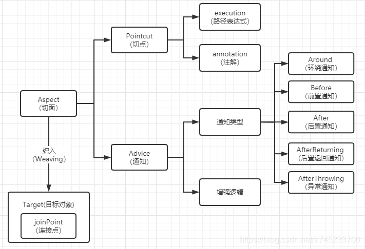
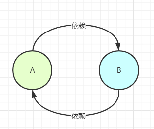

# 一、Java

## <font color=red>基础</font>

## <font color=red>Java集合框架</font>

## <font color=red>JUC并发编程</font>


## <font color=red>JVM虚拟机</font>


---

## <font color=red>1.8新特性</font>

### <font color=green>1、Open JDK和Oracle JDK的区别</font>

Open JDK是Sun把Java开源而形成的项目。也就是说Open JDK是Java SE派台版的开源和免费实现，它由SUN和Java社区提供支持，2009年Oracle收购了Sun公司，自此Java的维护方之一的Sun也变成了Oracle。

大多数JDK都是在Open JDK的基础上进一步编写实现的。Oracle JDK是由Oracle公司开发，Oracle JDK是基于Open JDK源代码的商业版本。需要在商业许可的情况下才能使用。

### <font color=green>2、JDK1.8新特性</font>

#### <font color=blue>1）Lambda表达式</font>

**1.标准格式**

```java
(参数类型 参数名称) ->{
    代码体;
}
```


**2.案例**

```java
interface TestLambda{
    void test();
}

public class Solution {
    public static void hello(TestLambda lambda){
        lambda.test();
    }


    public static void main(String[] args) {
        hello(()->{
            System.out.println("这是一个Lambda表达式");
        });
    }
}
```


**3.总结：**

Lambda表达式就是对**接口**中**抽象**方法的重写。

**4.原理**

匿名内部类在编译的时候会生成一个class文件（新的类$）

Lambda在程序过程运行时会形成一个类在类中新增一个方法，这个方法的方法体就是Lambda表岛是中的代码；还会形成一个匿名内部类，实现接口，重写抽象方法；在接口的重写方法中会调用新生成的方法。

**5.省略格式**

规则：

1. 小括号内参数的类型可以省略；
2. 如果小括号内有且仅有一个参数，则小括号可以省略；
3. 如果大括号内有且仅有一个语句，可以**<u>同时</u>**省略大括号、return关键字及语句分号；

**6.前提条件**

1. 方法的参数或变量的类型是接口；

```java
interface TestLambda{
    void test();
}

public class Solution {
    public static void main(String[] args) {
        //变量类型：
        TestLambda t = ()->{
            System.out.println("hello");
        };
    }
}
```

2. 这个接口中只能有一个抽象方法；

**7.方法引用**

- 对象名引用成员方法

```java
public static void main(String[] args){
    Date date = new Date();
    
    Supplier<Long> supplier = ()->date.getTime();
    System.out.println(supplier.get());
    
    Supplier<Long> supplier2 = date::getTime;
    System.out.println(supplier2.get());
}
```


- 类名引用静态方法

```java
public static void main(String[] args){
    Supplier<Long> supplier = ()->System.currentTimeMillis();
    System.out.println(supplier.get());

    Supplier<Long> supplier2 = System::currentTimeMillis;
    System.out.println(supplier2.get());
}
```


- 类名引用实例方法（Java面向对象中，类名只能调用静态方法，类名引用实例方法是有前提的，实际上是拿第一个参数作为方法的调用者）

```java
public static void main(String[] args){
    Function<String,Integer> f1 = (s)->{
        return s.length();
    };
    System.out.println("f1:"+f1.apply("abc"));

    Function<String,Integer> f2 = String::length;
    System.out.println("f2:"+f2.apply("abc"));
}
```


- 引用类的构造器

```java
class Person{
    private String name;
    private int age;

    public Person(){}

    public Person(String name,int age){
        this.name = name;
        this.age = age;
    }

    @Override
    public String toString() {
        return "Person{" +
                "name='" + name + '\'' +
                ", age=" + age +
                '}';
    }
}

public class Solution {

    public static void main(String[] args){
        //无参：
        Supplier<Person> supplier = ()->{ return new Person(); };
        System.out.println(supplier.get());


        Supplier<Person> supplier1 = Person::new;
        System.out.println(supplier1.get());


        //有参
        BiFunction<String,Integer,Person> biFunction = (String name,Integer age)->{return new Person(name,age);};
        Person person = biFunction.apply("小明", 14);
        System.out.println(person);

        BiFunction<String,Integer,Person> biFunction2 = Person::new;
        Person person2 = biFunction2.apply("小明", 14);
        System.out.println(person2);
    }
}
```


#### <font color=blue>2）接口增强</font>

**1.默认方法（default）**

```java
interface TestLambda{
    public default void hello(){
        System.out.println("Hello");
    }
}
```


**2.静态方法（static）**

```java
interface TestLambda{
    public static void hello(){
        System.out.println("Hello");
    }
}
```


#### <font color=blue>3）集合之Stream()流式操作</font>

**1.含义：**

Stream流式思想类似与工厂车间的“生产流水线”，Stream不是一种数据结构，二十对数据进行加工处理。Stream()流可以看作式流水线的一个工序。在流水线上，通过多个工序让一个原材料加工成一个商品。

**2.获取流常见的两种方式**

1. 通过Collection接口中的默认方法Stream.stream()；
2. 通过Stream接口中的静态方法。

**3.注意事项**

1. Stream只能操作一次；

```java
public static void main(String[] args){
    Stream<String> stream = Stream.of("aa","bb","cc");
    long count = stream.count();
    //将抛出异常：java.lang.IllegalStateException: stream has already been operated upon or closed
    long count2 = stream.count();
}
```


2. Stream方法返回的是新的流；

```java
public static void main(String[] args){
    Stream<String> stream = Stream.of("aa","bb","cc");
    Stream<String> limit = stream.limit(1);
    System.out.println(limit == stream);    //返回false
}
```


3. Stream不调用终结方法，中间的操作不会执行。

```java
public static void main(String[] args){
    Stream<String> stream = Stream.of("aa","bb","cc");
    //程序不会有任何输出
    stream.filter((s)->{
        System.out.println(s);
        return true;
    });
}
```


**4.常用操作**

1. foreach

```java
public static void main(String[] args){
    List<String> list = new ArrayList<>();
    Collections.addAll(list,"aa","bb","cc");
    Stream<String> stream = list.stream();
    stream.forEach(System.out::println);//等同于(s)-> System.out.println(s)
}
```


2. count

```java
public static void main(String[] args){
    List<String> list = new ArrayList<>();
    Collections.addAll(list,"aa","bb","cc");
    long count = list.stream().count();
}
```


3. filter

```java
public static void main(String[] args){
    List<String> list = new ArrayList<>();
    Collections.addAll(list,"aa","bb","cc");
    Stream<String> stream = list.stream();
    stream.filter((s)->s.length() == 2).forEach(System.out::println);//等同于(s)-> System.out.println(s)
}
```


4. limit

5. skip

6. map

```java
@Test
public void testMap() {
    Stream<String> original = Stream.of("11", "22", "33");

    // Map可以将一种类型的流转换成另一种类型的流
    // 将Stream流中的字符串转成Integer

    // original.map(s -> Integer.parseInt(s)).forEach(System.out::println);
    original.map(Integer::parseInt).forEach(System.out::println);
}
```

7. sorted

8. distinct

9. match

10. max和min

11. redure

```java
@Test
public void testReduce() {
    // T reduce(T identity, BinaryOperator<T> accumulator);
    // T identity: 默认值
    // BinaryOperator<T> accumulator: 对数据进行处理的方式
    // reduce如何执行?
    // 第一次, 将默认值赋值给x, 取出集合第一元素赋值给y
    // 第二次, 将上一次返回的结果赋值x, 取出集合第二元素赋值给y
    // 第三次, 将上一次返回的结果赋值x, 取出集合第三元素赋值给y
    // 第四次, 将上一次返回的结果赋值x, 取出集合第四元素赋值给y
    int reduce = Stream.of(4, 5, 3, 9).reduce(0, (x, y) -> {
        System.out.println("x = " + x + ", y = " + y);
        return x + y;
    });
    System.out.println("reduce = " + reduce); // 21

    // 获取最大值
    Integer max = Stream.of(4, 5, 3, 9).reduce(0, (x, y) -> {
        return x > y ? x : y;
    });
    System.out.println("max = " + max);
}
```


12. mapToInt

```java
 @Test
public void testNumericStream() {
    // Integer占用的内存比int多,在Stream流操作中会自动装箱和拆箱
    Stream<Integer> stream = Stream.of(1, 2, 3, 4, 5);
    // 把大于3的打印出来
    // stream.filter(n -> n > 3).forEach(System.out::println);

    // IntStream mapToInt(ToIntFunction<? super T> mapper);
    // IntStream: 内部操作的是int类型的数据,就可以节省内存,减少自动装箱和拆箱
    /*IntStream intStream = Stream.of(1, 2, 3, 4, 5).mapToInt((Integer n) -> {
            return n.intValue();
        });*/

    IntStream intStream = Stream.of(1, 2, 3, 4, 5).mapToInt(Integer::intValue);
    intStream.filter(n -> n > 3).forEach(System.out::println);
}
```


13. concat

```java
@Test
public void testContact() {
    Stream<String> streamA = Stream.of("张三");
    Stream<String> streamB = Stream.of("李四");

    // 合并成一个流
    Stream<String> newStream = Stream.concat(streamA, streamB);
    // 注意:合并流之后,不能操作之前的流啦.
    // streamA.forEach(System.out::println);

    newStream.forEach(System.out::println);
}
```


14. 收集Stream流中的结果到集合中

```java
@Test
public void testStreamToCollection() {
    Stream<String> stream = Stream.of("aa", "bb", "cc", "bb");

    // 将流中数据收集到集合中
    // collect收集流中的数据到集合中
    // List<String> list = stream.collect(Collectors.toList());
    // System.out.println("list = " + list);

    // Set<String> set = stream.collect(Collectors.toSet());
    // System.out.println("set = " + set);

    // 收集到指定的集合中ArrayList
    // ArrayList<String> arrayList = stream.collect(Collectors.toCollection(ArrayList::new));
    // System.out.println("arrayList = " + arrayList);
    HashSet<String> hashSet = stream.collect(Collectors.toCollection(HashSet::new));
    System.out.println("hashSet = " + hashSet);
}
```

15. 收集Stream流中的结果到数组中

```java
// 将流中数据收集到数组中
@Test
public void testStreamToArray() {
    Stream<String> stream = Stream.of("aa", "bb", "cc");

    // 转成Object数组不方便
    // Object[] objects = stream.toArray();
    // for (Object o : objects) {
    //     System.out.println("o = " + o);
    // }
    // String[]
    String[] strings = stream.toArray(String[]::new);
    for (String string : strings) {
        System.out.println("string = " + string + ", 长度: " + string.length());
    }
}
```

#### <font color=blue>4）并行数组排序</font>

#### <font color=blue>5）Optional中避免NULL检查</font>

#### <font color=blue>6）新的时间和日期API</font>

#### <font color=blue>7）可重复注解</font>


## <font color=red>反射机制</font>

## <font color=red>设计模式</font>


---

# 二、计算机基础

## <font color=red>操作系统</font>

## <font color=red>计算机网络</font>

## <font color=red>Linux</font>

## <font color=red>数据结构</font>

## <font color=red>算法</font>


---

# 三、数据库

## <font color=red>MySQL</font>

## <font color=red>Redis</font>


---

# 四、常用框架

## <font color=red>Spring</font>

### <font color=green>1、Spring概述：</font>

#### <font color=blue>1）Spring是什么</font>

Spring是一个轻量级的IOC和AOP容器框架。是为Java应用程序提供基础性服务的一套框架，木的是用于简化企业应用程序的开发，它使得开发者只需要关心业务需求。

#### <font color=blue>2）Spring包含了哪些模块组成</font>


1. **Spring Context：**提供框架式的Bean访问方式，以及企业级功能（JNDI、定时任务等）；
2. **Spring Core：**核心类库，所有功能都依赖于该类库，提供IOC和DI服务；
3. **Spring AOP：**AOP服务；
4. **Spring Web：**提供了基本的面向Web的综合特性，提供对常见框架如Struts2的支持，Spring能够管理这些框架，将Spring的资源注入给框架，也能在这些框架的前后插入拦截器；
5. **Spring MVC：**提供面向Web应用的Model-View-Controller，即MVC实现。
6. **Spring DAO：**对JDBC的抽象封装，简化了数据访问异常的处理，并能统一管理JDBC事务；
7. **Spring ORM：**对现有的ORM框架的支持；

#### <font color=blue>3）Spring的优点</font>

1. 属于底侵入式设计，代码的污染度极低；
2. spring的DI机制将对象之间的依赖关系交由框架处理，降低组件的耦合性；
3. Spring提供了AOP技术，支持将一些通用的事务，如安全、事务、日志、权限等进行集中式管理，从而提供更好的复用；
4. spring对于主流的框架提供了支持。

#### <font color=blue>4）Spring使用到了哪些设计模式</font>

1. 工厂模式：BeanFactory就是简单工厂模式的体现，用来创建对象的实例；
2. 单例模式：Bean默认为单例模式；
3. 代理模式：Spring的AOP功能用到了JDK的动态代理和CGLIB字节码生成技术；
4. 模板方法模式：用来解决代码重复的问题。比如. RestTemplate, JmsTemplate, JpaTemplate。
5. 观察者模式：定义对象键一种一对多的依赖关系，当一个对象的状态发生改变时，所有依赖于它的对象都会得到通知被制动更新，如Spring中listener的实现–ApplicationListener。

> 软件工程理论中的其他五大设计原则：
>
> **1.单一职责原则**
>
> 不存在多于一个的因素导致类的状态发生变更，即一个类只负责一项单一的职责。
>
> **2.里氏替换原则**
>
> 基类出现的地方都可以用其子类进行替换，而不会引起任何不适应的问题。
>
> **3.接口隔离原则**
>
> 客户端不应该依赖于其不需要的接口，类间的依赖关系应该建立在最小的接口之上。
>
> **4.迪米特法则**
>
> 一个对象对其他对象有最少的了解。
>
> **5.开闭原则**
>
> 软件设计对于扩展是开放的，即模块的行为是可以扩展的。
>
> 软件设计对于修改是关闭的，即模块的行为是不可修改的。

### <font color = green>2、Spring常见面试题</font>

#### <font color=blue>1）谈谈你对Spring Ioc的理解</font>

（1）IOC就是控制反转，它不是一种技术，而是一种设计思想，指创建对象的控制权转移给Spring框架进行管理，并由Spring根据配置文件去创建实例和管理各个实例之间的依赖关系，对象与对象之间松散耦合，也利于功能的复用。DI依赖注入，和控制反转是同一个概念的不同角度的描述，即应用程序在运行时依赖IoC容器来动态注入对象需要的外部依赖。

（2）最直观的表达就是，以前创建对象的主动权和时机都是由自己把控的，IOC让对象的创建不用去new了，可以由spring自动生产，使用java的反射机制，根据配置文件在运行时动态的去创建对象以及管理对象，并调用对象的方法的。

（3）Spring的IOC有三种注入方式 ：构造器注入、setter方法注入、根据注解注入。

> **问题一：**
>
> 控制：由谁控制，控制了什么？
>
> 由IoC容器来控制，控制了对象。
>
> **问题二：**
>
> 反转：什么是反转，反转了哪些方面？
>
> 把对象依赖的过程颠倒，即开发人员不再控制其依赖对象，而是由容器来帮助开发人员创建依赖对象，对象只是被动地接受依赖对象，对象的控制权是容器；
>
> 开发人员需要依赖的对象被反转。

#### <font color=blue>2）谈谈你对Spring AOP的理解</font>

OOP面向对象，允许开发者定义纵向的关系，但并不适用于定义横向的关系，会导致大量代码的重复，而不利于各个模块的重用。

AOP，一般称为面向切面，作为面向对象的一种补充，用于将那些与业务无关，但却对多个对象产生影响的公共行为和逻辑，抽取并封装为一个可重用的模块，这个模块被命名为“切面”（Aspect），减少系统中的重复代码，降低了模块间的耦合度，提高系统的可维护性。可用于权限认证、日志、事务处理。

AOP实现的关键在于 代理模式，AOP代理主要分为静态代理和动态代理。静态代理的代表为AspectJ；动态代理则以Spring AOP为代表。

#### <font color=blue>3）Spring AOP名词解释</font>

（1）连接点（Join point）：指程序运行过程中所执行的方法。在Spring AOP中，一个连接点总代表一个方法的执行。 

（2）切面（Aspect）：被抽取出来的公共模块，可以用来会横切多个对象。Aspect切面可以看成 Pointcut切点 和 Advice通知 的结合，一个切面可以由多个切点和通知组成。

> 在Spring AOP中，切面可以在类上使用 @AspectJ 注解来实现。

（3）切点（Pointcut）：切点用于定义 要对哪些Join point进行拦截。

> 切点分为execution方式和annotation方式。execution方式可以用路径表达式指定对哪些方法拦截，比如指定拦截add*、search*。annotation方式可以指定被哪些注解修饰的代码进行拦截。

（4）通知（Advice）：指要在连接点（Join Point）上执行的动作，即增强的逻辑，比如权限校验和、日志记录等。通知有各种类型，包括Around、Before、After、After returning、After throwing。

（5）目标对象（Target）：包含连接点的对象，也称作被通知（Advice）的对象。 由于Spring AOP是通过动态代理实现的，所以这个对象永远是一个代理对象。

（6）织入（Weaving）：通过动态代理，在目标对象（Target）的方法（即连接点Join point）中执行增强逻辑（Advice）的过程。

（7）引入（Introduction）：添加额外的方法或者字段到被通知的类。Spring允许引入新的接口（以及对应的实现）到任何被代理的对象。例如，你可以使用一个引入来使bean实现 IsModified 接口，以便简化缓存机制。



#### <font color=blue>4）Spring通知有哪些类型</font>

1. 前置通知：在连接点（Join point）之前执行的通知。
2. 后置通知：当连接点退出的时候执行的通知（不论是正常返回还是异常退出）。 
3. 环绕通知：包围一个连接点的通知，这是最强大的一种通知类型。 环绕通知可以在方法调用前后完成自定义的行为。它也可以选择是否继续执行连接点或直接返回它们自己的返回值或抛出异常来结束执行。
4. 返回后通知：在连接点正常完成后执行的通知（如果连接点抛出异常，则不执行）
5. 抛出异常后通知：在方法抛出异常退出时执行的通知

#### <font color=blue>5）Spring中的配置详解</font>

##### I. name和id之间的一些注意点

- 配置两个相同的Id或name都会报错；
- 如果既配置了 id ，也配置了 name ，则两个都生效。如果id和name都没有指定，则用类全名作为name，如:\<bean class="com.stamen.BeanLifeCycleImpl">,则你可以通过getBean("com.stamen.BeanLifeCycleImpl")返回该实例。
- 如果配置基本类的时候，注解和配置文件都使用的时候，注解和配置文件中 name 相同的时候， 则两个冲突，配置文件生效；如果配置基本类的时候，注解和配置文件都使用的时候，注解和配置文件中 name 不相同的时候， 则两个不冲突，都能够生效。

##### II. Spring中bean的作用域

- **singleton**：默认作用域，单例bean，每个容器中只有一个bean的实例。
- **prototype**：为每一个bean请求创建一个实例。
- **request**：为每一个request请求创建一个实例，在请求完成以后，bean会失效并被垃圾回收器回收。
- **session**：与request范围类似，同一个session会话共享一个实例，不同会话使用不同的实例。

##### III. spring三种对象的创建方式

1. 空参构造

   ```xml
   <bean name="hello" class="com.lin.HelloWorld">
   ```

2. 静态工厂构造

   ```xml
   <bean name="user" class="com.lin.UserFactory" factory-method="createUser"></bean>
   ```

3. 实例工厂构造

   ```xml
   <bean name="user2" factory-bean="userFactory" factory-method="createUser"></bean>
    
   <bean name="userFactory" class="com.lin.UserFactory"></bean>
   ```

   （需要配置两个bean，因为无法通过类名调用非静态方法）

##### IV. 基于xml的spring注入方式

1. set方法注入（值类型用value，引用类型用ref）

   ```xml
   <bean name="teacher" class="com.lin.Tearcher">
   	<property name="name" value="林老师"></property>
       <property name='className' value="软工2班"></property>
   </bean>
   
   <bean name="student" class="com.lin.Student">
   	<property name="name" value="小明"></property>
       <property name="grade" value="90"></property>
       <property name="tearcher" ref="teacher"></property>
   </bean>
   ```

2. 构造函数注入（必须用相应的构造函数）

   ```xml
   <bean class="com.lin.Teacher" name="teacher2">
           <constructor-arg name="name" value="老师2"></constructor-arg>
           <constructor-arg name="className" value="火箭2班"></constructor-arg>
   </bean>
   <bean class="com.lin.Student" name="student2">
           <constructor-arg name="name" value="学生2"></constructor-arg>
           <constructor-arg name="score" value="99"></constructor-arg>
           <constructor-arg name="teacher" ref="teacher2"></constructor-arg>
   </bean>
   ```

3. 静态工厂注入

   ```java
   public class StaticFactory {
       public static Teacher getTeacher() {
           return new Teacher("大明", "计算机3班");
       }
   }
   ```

   ```xml
   <bean class="com.lin.StaticFactory" id="staticFactory" factory-method="getTeacher"></bean>
   ```

4. 实例工厂注入

   ```java
   public class InstanceFactory {
       public Teacher getTeacher(){
           return new Teacher("大鹏","火箭x班");
       }
   }
   ```

   ```xml
   <!--    实例工厂的注入-->
   <bean class="com.lin.InstanceFactory" id="instanceFactory"></bean>
   <bean factory-bean="instanceFactory" factory-method="getTeacher" id="instanceteacher"></bean>
   ```

##### V.什么是自动装配？xml有哪些自动装配的方式？

（1）在Spring框架中，在配置文件中设定bean的依赖关系是一个很好的机制，Spring 容器能够自动装配相互合作的bean，这意味着容器不需要配置，能通过Bean工厂自动处理bean之间的协作。这意味着 Spring可以通过向Bean Factory中注入的方式自动搞定bean之间的依赖关系。自动装配可以设置在每个bean上，也可以设定在特定的bean上。
（2）xml配置中共有5种自动装配：

1. no：默认的方式是不进行自动装配，需手动设置属性来进行bean的装配；
2. byName：通过bean的名称进行自动装配，如果一个bean的 property 与另一bean 的name 相同，就进行自动装配；
3. byType：通过参数的数据类型进行自动装配；
4. constructor：利用构造函数进行装配，并且构造函数的参数通过byType进行装配；
5. autodetect：自动探测，如果有构造方法，通过 construct的方式自动装配，否则使用 byType的方式自动装配。

##### VI. 使用注解方式代替配置文件

1. 在applicationContext.xml中书写指定扫描注解及开启注解装配

   ```xml
   <!--  指定扫描com.lin包下所有类的注解 -->
   <context:component-scan bese-package="com.lin"></context:component-scan>
   
   <context:annotation-config/>
   ```

2. 在类上添加注解@Component即可

> 其它配置：
>
> - 指定对象的作用范围：@Scope(scopeName="prototype")；
>
> - 值类型的注入：@Value("小明")；
> - 引用类型的注入：@AutoWired和@Resource；
>
> ==**面试题：**==
>
> (1) @Autowired默认是按照类型装配注入的，默认情况下它要求依赖对象必须存在（可以设置它required属性为false）。
>
> (2) @Resource默认是按照名称来装配注入的，只有当找不到与名称匹配的bean才会按照类型来装配注入。
>
> @AutoWired(required=false)   +  @Qualifier("user")   ==  @Resource(name="user")
>
> - 在类上添加@ContextConfiguration("classpath:applicationContext.xml")  ，指定创建容器时使用哪个配置文件；
> - 在方法上添加@PostConstruct，在对象创建后会执行该方法；
> - 在方法上添加@PreDestroy，在对象销毁后会执行该方法；


### <font color= green>3*、Spring如何解决循环依赖的问题</font>

#### <font color=blue>I. 什么是循环依赖</font>

类与类之间的依赖关系形成了闭环，就会导致循环依赖问题的产生。

比如A类依赖了B类，B类依赖了C类，而最后C类又依赖了A类，这样就形成了循环依赖问题。



#### <font color=blue>II. 循环依赖问题有哪些类型</font>

循环依赖问题在Spring中主要有三种情况：

1. 通过构造方法进行依赖注入时产生的循环依赖问题；
2. 通过setter方法进行依赖注入且是在多例（原型）模式下产生的循环依赖问题；
3. 通过setter方法进行依赖注入且是在单例模式下产生的循环依赖问题。

在Spring中，只有第（3）种方式的循环依赖问题被解决了，其他两种方式在遇到循环依赖问题时都会产生异常。其实也很好解释：

- 第（1）种构造方法注入的情况下，在new对象的时候就会堵塞住了，其实也就是”先有鸡还是先有蛋“的历史难题。

  > 很多博客上说，只能解决setter方法的循环依赖，这是错误的：
  >
  > 我们通过代码测试可以发现：
  >
  > | **依赖情况**           | **依赖注入方式**                                   | 循环依赖是否被解决 |
  > | ---------------------- | -------------------------------------------------- | ------------------ |
  > | AB相互依赖（循环依赖） | 均采用setter方法注入                               | 是                 |
  > | AB相互依赖（循环依赖） | 均采用构造器注入                                   | 否                 |
  > | AB相互依赖（循环依赖） | A中注入B的方式为setter方法，B中注入A的方式为构造器 | 是                 |
  > | AB相互依赖（循环依赖） | B中注入A的方式为setter方法，A中注入B的方式为构造器 | 否                 |

- 第（2）种setter方法（多例）的情况下，每一次getBean()时，都会产生一个新的Bean，如此反复下去就会有无穷无尽的Bean产生了，最终就会导致OOM问题的出现。

#### <font color=blue>III. 如何检测是否有循环依赖</font>

 可以 Bean在创建的时候给其打个标记，如果递归调用回来发现正在创建中的话--->即可说明循环依赖。

#### <font color=blue>IV. 循环依赖的解决方案</font>

> 首先先了解Spring的三大缓存
>
> Spring中有三个缓存，用于存储**单例的Bean实例**，这三个缓存是彼此互斥的，不会针对同一个Bean的实例同时存储。如果调用getBean，则需要从三个缓存中依次获取指定的Bean实例。 读取顺序依次是一级缓存 ==> 二级缓存 ==> 三级缓存。
>
> 

### <font color= green>4、Spring容器的启动流程</font>

1. 初始化Spring容器，注册内置的BeanPostProcessor的BeanDefinition到容器中；

   > ① 实例化BeanFactory【DefaultListableBeanFactory】工厂，用于生成Bean对象；
   > ② 实例化BeanDefinitionReader注解配置读取器，用于对特定注解（如@Service、@Repository）的类进行读取转化成  BeanDefinition 对象，（BeanDefinition 是 Spring 中极其重要的一个概念，它存储了 bean 对象的所有特征信息，如是否单例，是否懒加载，factoryBeanName 等）；
   > ③ 实例化ClassPathBeanDefinitionScanner路径扫描器，用于对指定的包目录进行扫描查找 bean 对象

2. 将配置类的BeanDefinition注册到容器中；

3. 调用refresh()方法刷新容器：

   > ① prepareRefresh()刷新前的预处理：
   > ② obtainFreshBeanFactory()：获取在容器初始化时创建的BeanFactory：
   > ③ prepareBeanFactory(beanFactory)：BeanFactory的预处理工作，向容器中添加一些组件：
   > ④ postProcessBeanFactory(beanFactory)：子类重写该方法，可以实现在BeanFactory创建并预处理完成以后做进一步的设置
   > ⑤ invokeBeanFactoryPostProcessors(beanFactory)：在BeanFactory标准初始化之后执行BeanFactoryPostProcessor的方法，即BeanFactory的后置处理器：
   > ⑥ registerBeanPostProcessors(beanFactory)：向容器中注册Bean的后置处理器BeanPostProcessor，它的主要作用是干预Spring初始化bean的流程，从而完成代理、自动注入、循环依赖等功能
   > ⑦ initMessageSource()：初始化MessageSource组件，主要用于做国际化功能，消息绑定与消息解析：
   > ⑧ initApplicationEventMulticaster()：初始化事件派发器，在注册监听器时会用到：
   > ⑨ onRefresh()：留给子容器、子类重写这个方法，在容器刷新的时候可以自定义逻辑
   > ⑩ registerListeners()：注册监听器：将容器中所有的ApplicationListener注册到事件派发器中，并派发之前步骤产生的事件：
   > ⑪  finishBeanFactoryInitialization(beanFactory)：初始化所有剩下的单实例bean，核心方法是preInstantiateSingletons()，会调用getBean()方法创建对象；
   > ⑫ finishRefresh()：发布BeanFactory容器刷新完成事件。


### <font color= green>5、Spring Bean的生命周期</font>

> **为什么Spring需要使用beanDefinition来创建Bean？**
>
> Spring是根据beanDefinition来创建bean的，为什么不直接使用对象的class对象来创建bean呢？这是因为class对象仅仅只能描述一个对象的创建，它不足以用来描述一个Spring bean，而对于是否为懒加载、是否是首要的、初始化方法是哪个、销毁方法是哪个，这个Spring中特有的属性在class对象中并没有，所有Spring就定义了beanDefinition来完成bean的创建。

简单来说，Spring Bean的生命周期只有四个阶段：

实例化 Instantiation --> 属性赋值 Populate --> 初始化 Initialization --> 销毁 Destruction

但具体来说，Spring Bean的生命周期包含下图的流程：


1. **实例化Bean：**

   对于BeanFactory容器，当客户向容器请求一个尚未初始化的bean时，或初始化bean的时候需要注入另一个尚未初始化的依赖时，容器就会调用createBean进行实例化。

   对于ApplicationContext容器，当容器启动结束后，通过获取BeanDefinition对象中的信息，实例化所有的bean。

2. **设置对象属性（依赖注入）：**

   实例化后的对象被封装在BeanWrapper对象中，紧接着，Spring根据BeanDefinition中的信息 以及 通过BeanWrapper提供的设置属性的接口完成属性设置与依赖注入。

3. **处理Aware接口：**

   Spring会检测该对象是否实现了xxxAware接口，通过Aware类型的接口，可以让我们拿到Spring容器的一些资源：

   ①如果这个Bean实现了BeanNameAware接口，会调用它实现的setBeanName(String beanId)方法，传入Bean的名字；
   ②如果这个Bean实现了BeanClassLoaderAware接口，调用setBeanClassLoader()方法，传入ClassLoader对象的实例。
   ②如果这个Bean实现了BeanFactoryAware接口，会调用它实现的setBeanFactory()方法，传递的是Spring工厂自身。
   ③如果这个Bean实现了ApplicationContextAware接口，会调用setApplicationContext(ApplicationContext)方法，传入Spring上下文；

4. **BeanPostProcessor前置处理：**

   如果想对Bean进行一些自定义的前置处理，那么可以让Bean实现了BeanPostProcessor接口，那将会调用postProcessBeforeInitialization(Object obj, String s)方法。

5. **InitializingBean：**

   如果Bean实现了InitializingBean接口，执行afeterPropertiesSet()方法。

6. **init-method：**

   如果Bean在Spring配置文件中配置了 init-method 属性，则会自动调用其配置的初始化方法。

7. **BeanPostProcessor后置处理：**

   如果这个Bean实现了BeanPostProcessor接口，将会调用postProcessAfterInitialization(Object obj, String s)方法；由于这个方法是在Bean初始化结束时调用的，所以可以被应用于内存或缓存技术；

   （以上几个步骤完成后，Bean就已经被正确创建了，之后就可以使用这个Bean了。）

8. **DisposableBean：**

   当Bean不再需要时，会经过清理阶段，如果Bean实现了DisposableBean这个接口，会调用其实现的destroy()方法；

9. **destroy-method：**

   最后，如果这个Bean的Spring配置中配置了destroy-method属性，会自动调用其配置的销毁方法。

### <font color= green>6、BeanFactory 和 ApplicationContext的区别</font>

BeanFactory和ApplicationContext是Spring的两大核心接口，都可以当做Spring的容器。

（1）BeanFactory是Spring里面最底层的接口，是IoC的核心，定义了IoC的基本功能，包含了各种Bean的定义、加载、实例化，依赖注入和生命周期管理。ApplicationContext接口作为BeanFactory的子类，除了提供BeanFactory所具有的功能外，还提供了更完整的框架功能：

- 继承MessageSource，因此支持国际化。
- 资源文件访问，如URL和文件（ResourceLoader）。
- 载入多个（有继承关系）上下文（即同时加载多个配置文件） ，使得每一个上下文都专注于一个特定的层次，比如应用的web层。
- 提供在监听器中注册bean的事件。

（2）①BeanFactroy采用的是**延迟加载形式**来注入Bean的，只有在使用到某个Bean时(调用getBean())，才对该Bean进行加载实例化。这样，我们就不能提前发现一些存在的Spring的配置问题。如果Bean的某一个属性没有注入，BeanFacotry加载后，直至第一次使用调用getBean方法才会抛出异常。

 ②ApplicationContext，它是在容器启动时，**一次性创建了所有的Bean**。这样，在容器启动时，我们就可以发现Spring中存在的配置错误，这样有利于检查所依赖属性是否注入。 

③ApplicationContext启动后预载入所有的单实例Bean，所以在**运行的时候速度比较快**，因为它们已经创建好了。相对于BeanFactory，ApplicationContext 唯一的不足是占用内存空间，当应用程序配置Bean较多时，**程序启动较慢**。

（3）BeanFactory和ApplicationContext都支持BeanPostProcessor、BeanFactoryPostProcessor的使用，但两者之间的区别是：BeanFactory需要手动注册，而ApplicationContext则是自动注册。

（4）BeanFactory通常以编程的方式被创建，ApplicationContext还能以声明的方式创建，如使用ContextLoader。

> **ApplicationContext通常的实现是什么？**
>
> 1. FileSystemXmlApplicationContext ：
>
>    此容器从一个XML文件中加载beans的定义，XML Bean 配置文件的全路径名必须提供给它的构造函数。
>
> 2. ClassPathXmlApplicationContext：
>
>    此容器也从一个XML文件中加载beans的定义，这里，你需要正确设置classpath因为这个容器将在classpath里找bean配置。
>
> 3. WebXmlApplicationContext：
>
>    此容器加载一个XML文件，此文件定义了一个WEB应用的所有bean。

### <font color= green>7、Spring框架中的Bean是线程安全的吗？如果不安全，如何处理？</font>

Spring容器本身并没有提供Bean的线程安全策略，因此可以说Spring容器中的Bean本身不具备线程安全的特性，但是具体情况还是要结合Bean的作用域来讨论。

（1）对于prototype作用域的Bean，每次都创建一个新对象，也就是线程之间不存在Bean共享，因此不会有线程安全问题。

（2）对于singleton作用域的Bean，所有的线程都共享一个单例实例的Bean，因此是存在线程安全问题的。但是如果单例Bean是一个无状态Bean，也就是线程中的操作不会对Bean的成员执行查询以外的操作，那么这个单例Bean是线程安全的。比如Controller类、Service类和Dao等，这些Bean大多是无状态的，只关注于方法本身。

> 有状态Bean(Stateful Bean) ：就是有实例变量的对象，可以保存数据，是非线程安全的。
>
> 无状态Bean(Stateless Bean)：就是没有实例变量的对象，不能保存数据，是不变类，是线程安全的。

对于有状态的bean（比如Model和View），就需要自行保证线程安全，最浅显的解决办法就是将有状态的bean的作用域由“singleton”改为“prototype”。

也可以采用ThreadLocal解决线程安全问题，为每个线程提供一个独立的变量副本，不同线程只操作自己线程的副本变量。

### <font color= green>8、Spring事务</font>

#### <font color=blue>1）Spring事务的实现方式和实现原理</font>

Spring事务的本质其实就是数据库对事务的支持，没有数据库的事务支持，spring是无法提供事务功能的。Spring只提供统一事务管理接口，具体实现都是由各数据库自己实现，数据库事务的提交和回滚是通过binlog或者undo log实现的。Spring会在事务开始时，根据当前环境中设置的隔离级别，调整数据库隔离级别，由此保持一致。

#### <font color=blue>2）Spring事务的种类</font>

spring支持编程式事务管理和声明式事务管理两种方式：

1. 编程式事务管理使用TransactionTemplate；
2. 声明式事务管理建立在AOP之上的。其本质是通过AOP功能，对方法前后进行拦截，将事务处理的功能编织到拦截的方法中，也就是在目标方法开始之前启动一个事务，在执行完目标方法之后根据执行情况提交或者回滚事务。

> 声明式事务最大的优点就是不需要在业务逻辑代码中掺杂事务管理的代码，只需在配置文件中做相关的事务规则声明或通过@Transactional注解的方式，便可以将事务规则应用到业务逻辑中，减少业务代码的污染。唯一不足地方是，最细粒度只能作用到方法级别，无法做到像编程式事务那样可以作用到代码块级别。

#### <font color=blue>3）Spring事务传播机制</font>

spring事务的传播机制说的是，当多个事务同时存在的时候，spring如何处理这些事务的行为。事务传播机制实际上是使用简单的ThreadLocal实现的，所以，如果调用的方法是在新线程调用的，事务传播实际上是会失效的。

更通俗的来说：

事务传播行为是指一个事务方法A被另一个事务方法B调用时，这个事务A应该如何处理。事务A应该在事务B中运行还是另起一个事务，这个有事务A的传播行为决定。事务传播属性定义：`@Transactional(propagation = xxx)`，还需要导入依赖包：

```xml
<dependency>
    <groupId>org.springframework</groupId>
    <artifactId>spring-tx</artifactId>
    <version>5.3.9</version>
</dependency>
```


> ① PROPAGATION_REQUIRED：
>
> 支持当前事务，如果当前没有事务，就新建一个事务。这是Spring 默认的事务的传播。
>
> 
>
> ② PROPAGATION_REQUIRES_NEW：
>
> 新建事务，如果当前存在事务，把当前事务挂起。新建的事务将和被挂起的事务没有任何关系，是两个独立的事务，外层事务失败回滚之后， 不能回滚内层事务执行的结果，内层事务失败抛出异常，外层事务捕获， 也可以不处理回滚操作。 使用JtaTransactionManager作为事务管理器
>
> 
>
> ③ PROPAGATION_SUPPORTS：
>
> 支持当前事务，如果当前没有事务，就以非事务方式执行。
>
> 
>
> ④ PROPAGATION_NOT_SUPPORTED：
>
> 以非事务方式执行操作，如果当前存在事务，就把当前事务挂起。使用JtaTransactionManager作为事务管理器。
>
> 
>
> ⑤ PROPAGATION_NESTED：
>
> 如果一个活动的事务存在，则运行在一个嵌套的事务中。如果没有活动事务，则按REQUIRED属性执行。它使用了一个单独的事务，这个事务拥有多个可以回滚的保存点。内部事务的回滚不会对外部事务造成影响。它只对DataSourceTransactionManager事务管理器起效。
>
> 
>
> ⑥ PROPAGATION_MANDATORY：
>
> 如果当前存在事务，就加入该事务；如果当前不存在事务，就抛出异常。
>
> 
>
> ⑦ PROPAGATION_NEVER：
>
> 以非事务方式执行，如果当前存在事务，则抛出异常。

#### <font color=blue>4）Spring事务的隔离级别</font>

> ① ISOLATION_DEFAULT：
>
> 这是个 PlatfromTransactionManager 默认的隔离级别，使用数据库默认的事务隔离级别。
>
> ② ISOLATION_READ_UNCOMMITTED：
>
> 读未提交，允许事务在执行过程中，读取其他事务未提交的数据。
>
> ③ ISOLATION_READ_COMMITTED：
>
> 读已提交，允许事务在执行过程中，读取其他事务已经提交的数据。
>
> ④ ISOLATION_REPEATABLE_READ：
>
> 可重复读，在同一个事务内，任意时刻的查询结果都是一致的。
>
> ⑤ ISOLATION_SERIALIZABLE：
>
> 所有事务逐个依次执行。

### <font color= green>9、Spring框架中有哪些不同类型的事件？</font>

Spring 提供了以下5种标准的事件：

（1）上下文更新事件（ContextRefreshedEvent）：在调用ConfigurableApplicationContext 接口中的refresh()方法时被触发。

（2）上下文开始事件（ContextStartedEvent）：当容器调用ConfigurableApplicationContext的Start()方法开始/重新开始容器时触发该事件。

（3）上下文停止事件（ContextStoppedEvent）：当容器调用ConfigurableApplicationContext的Stop()方法停止容器时触发该事件。

（4）上下文关闭事件（ContextClosedEvent）：当ApplicationContext被关闭时触发该事件。容器被关闭时，其管理的所有单例Bean都被销毁。

（5）请求处理事件（RequestHandledEvent）：在Web应用中，当一个http请求（request）结束触发该事件。

如果一个bean实现了ApplicationListener接口，当一个ApplicationEvent 被发布以后，bean会自动被通知。

### <font color= green>10、AOP有哪些实现方式</font>

AOP实现的关键在于 代理模式，AOP代理主要分为静态代理和动态代理。静态代理的代表为AspectJ；动态代理则以Spring AOP为代表。

（1）AspectJ是静态代理的增强，所谓静态代理，就是AOP框架会在编译阶段生成AOP代理类，因此也称为编译时增强，他会在编译阶段将AspectJ(切面)织入到Java字节码中，运行的时候就是增强之后的AOP对象；

（2）Spring AOP使用的动态代理，所谓的动态代理就是说AOP框架不会去修改字节码，而是每次运行时在内存中临时为方法生成一个AOP对象，这个AOP对象包含了目标对象的全部方法，并且在特定的切点做了增强处理，并回调原对象的方法。

> Spring AOP中的动态代理主要有两种方式，JDK动态代理和CGLIB动态代理：
>
> - JDK动态代理只提供接口的代理，不支持类的代理。核心InvocationHandler接口和Proxy类，InvocationHandler 通过invoke()方法反射来调用目标类中的代码，动态地将横切逻辑和业务编织在一起；接着，Proxy利用 InvocationHandler动态创建一个符合某一接口的的实例, 生成目标类的代理对象。
> - 持类的代理。核心InvocationHandler接口和Proxy类，InvocationHandler 通过invoke()方法反射来调用目标类中的代码，动态地将横切逻辑和业务编织在一起；接着，Proxy利用 InvocationHandler动态创建一个符合某一接口的的实例, 生成目标类的代理对象。

静态代理与动态代理区别在于生成AOP代理对象的时机不同，相对来说AspectJ的静态代理方式具有更好的性能，但是AspectJ需要特定的编译器进行处理，而Spring AOP则无需特定的编译器处理。

> **JDK和CGLIB动态代理总结**
>
> - JDK动态代理只能对实现了接口的类生成代理，而不能针对类 ，使用的是 Java反射技术实现，生成类的过程比较高效；
> - CGLIB是针对类实现代理，主要是对指定的类生成一个子类，覆盖其中的方法 ，使用asm字节码框架实现，相关执行的过程比较高效，生成类的过程可以利用缓存弥补，因为是继承，所以该类或方法最好不要声明成final；
> - JDK代理是不需要第三方库支持，只需要JDK环境就可以进行代理，使用条件:实现InvocationHandler + 使用Proxy.newProxyInstance产生代理对象 + 被代理的对象必须要实现接口；
> - CGLib必须依赖于CGLib的类库，但是它需要类来实现任何接口代理的是指定的类生成一个子类，覆盖其中的方法，是一种继承。但是针对接口编程的环境下，推荐使用JDK的代理。

---


## <font color=red>Spring MVC</font>

### <font color=green>1、概述</font>

#### <font color=blue>1）MVC是什么？有什么好处？</font>

mvc是一种设计模式（设计模式就是日常开发中编写代码的一种好的方法和经验的总结）。模型（model）-视图（view）-控制器（controller），三层架构的设计模式。用于实现前端页面的展现与后端业务数据处理的分离。

mvc设计模式的好处

1. 分层设计，实现了业务系统各个组件之间的解耦，有利于业务系统的可扩展性，可维护性。
2. 有利于系统的并行开发，提升开发效率。

#### <font color=blue>2）什么是Spring MVC？</font>

（简单介绍下你对Spring MVC的理解）

Spring MVC是一个基于Java的实现了MVC设计模式的请求驱动类型的轻量级Web框架，通过把模型-视图-控制器分离，将web层进行职责解耦，把复杂的web应用分成逻辑清晰的几部分，简化开发，减少出错，方便组内开发人员之间的配合。

#### <font color=blue>3）Spring MVC的优点</font>

1. 可以支持各种视图技术,而不仅仅局限于JSP；
2. 与Spring框架集成（如IoC容器、AOP等）；
3. 清晰的角色分配：前端控制器(dispatcherServlet) , 请求到处理器映射（handlerMapping), 处理器适配器（HandlerAdapter), 视图解析器（ViewResolver）；
4. 支持各种请求资源的映射策略。

#### <font color=blue>4）SpringMVC的主要组件</font>

（1）前端控制器 DispatcherServlet（不需要程序员开发）

作用：接收请求、响应结果，相当于转发器，有了DispatcherServlet 就减少了其它组件之间的耦合度。

（2）处理器映射器HandlerMapping（不需要程序员开发）

作用：根据请求的URL来查找Handler

（3）处理器适配器HandlerAdapter

注意：在编写Handler的时候要按照HandlerAdapter要求的规则去编写，这样适配器HandlerAdapter才可以正确的去执行Handler。

（4）处理器Handler（需要程序员开发）

（5）视图解析器 ViewResolver（不需要程序员开发）

作用：进行视图的解析，根据视图逻辑名解析成真正的视图（view）

（6）视图View（需要程序员开发jsp）

View是一个接口， 它的实现类支持不同的视图类型（jsp，freemarker，pdf等等）

> **什么是DispatcherServlet**
> Spring的MVC框架是围绕DispatcherServlet来设计的，它用来处理所有的HTTP请求和响应。
>
> **什么是Spring MVC框架的控制器？**
> 控制器提供一个访问应用程序的行为，此行为通常通过服务接口实现。控制器解析用户输入并将其转换为一个由视图呈现给用户的模型。Spring用一个非常抽象的方式实现了一个控制层，允许用户创建多种用途的控制器。
>
> **Spring MVC的控制器是不是单例模式,如果是,有什么问题,怎么解决？**
> 答：是单例模式,所以在多线程访问的时候有线程安全问题,不要用同步,会影响性能的,解决方案是在控制器里面不能写字段。

#### <font color=blue>5）请描述Spring MVC的工作流程？</font>

（请描述Spring MVC的工作原理/描述一下 DispatcherServlet 的工作流程？）


1. 用户发送请求至前端控制器DispatcherServlet；
2. DispatcherServlet收到请求后，调用HandlerMapping处理器映射器，请求获取Handle；
3. 处理器映射器根据请求url找到具体的处理器，生成处理器对象及处理器拦截器(如果有则生成)一并返回给DispatcherServlet；
4. DispatcherServlet 调用 HandlerAdapter处理器适配器；
5. HandlerAdapter 经过适配调用 具体处理器(Handler，也叫后端控制器)；
6. Handler执行完成返回ModelAndView；
7. HandlerAdapter将Handler执行结果ModelAndView返回给DispatcherServlet；
8. DispatcherServlet将ModelAndView传给ViewResolver视图解析器进行解析；
9. ViewResolver解析后返回具体View；
10. DispatcherServlet对View进行渲染视图（即将模型数据填充至视图中）
11. DispatcherServlet响应用户。

### <font color=green>2、注解</font>

#### <font color=blue>1）注解原理是什么？</font>

注解本质是一个继承了Annotation的特殊接口，其具体实现类是Java运行时生成的动态代理类。我们通过反射获取注解时，返回的是Java运行时生成的动态代理对象。通过代理对象调用自定义注解的方法，会最终调用AnnotationInvocationHandler的invoke方法。该方法会从memberValues这个Map中索引出对应的值。而memberValues的来源是Java常量池。

#### <font color=blue>2）Spring MVC常用的注解有哪些？</font>

- @RequestMapping：用于处理请求 url 映射的注解，可用于类或方法上。用于类上，则表示类中的所有响应请求的方法都是以该地址作为父路径；

- @RequestBody：注解实现接收http请求的json数据，将json转换为java对象；

- @ResponseBody：注解实现将conreoller方法返回对象转化为json对象响应给客户。

- @Controller：@Controller 用于标记在一个类上，使用它标记的类就是一个Spring MVC Controller 对象。分发处理器将会扫描使用了该注解的类的方法，并检测该方法是否使用了@RequestMapping 注解。@Controller 只是定义了一个控制器类，而使用@RequestMapping 注解的方法才是真正处理请求的处理器。

  > 单单使用@Controller 标记在一个类上还不能真正意义上的说它就是Spring MVC 的一个控制器类，因为这个时候Spring 还不认识它。那么要如何做Spring 才能认识它呢？这个时候就需要我们把这个控制器类交给Spring 来管理。有两种方式：
  >
  > 1. 在Spring MVC 的配置文件中定义MyController 的bean 对象;
  >
  > 2. 在Spring MVC 的配置文件中告诉Spring 该到哪里去找标记为@Controller 的Controller 控制器。

- @PathVariable和@RequestParam的区别：

  请求路径上有个id的变量值，可以通过@PathVariable来获取 @RequestMapping(value = “/page/{id}”, method = RequestMethod.GET)，@RequestParam用来获得静态的URL请求入参 spring注解时action里用到。

### <font color=green>3、其它常见面试题</font>

#### <font color=blue>1）Spring MVC和Struts2区别</font>

相同点：

都是基于mvc的表现层框架，都用于web项目的开发。

不同点：

1. 前端控制器不一样。Spring MVC的前端控制器是servlet：DispatcherServlet。struts2的前端控制器是filter：StrutsPreparedAndExcutorFilter。

2. 请求参数的接收方式不一样。Spring MVC是使用方法的形参接收请求的参数，基于方法的开发，线程安全，可以设计为单例或者多例的开发，推荐使用单例模式的开发（执行效率更高），默认就是单例开发模式。struts2是通过类的成员变量接收请求的参数，是基于类的开发，线程不安全，只能设计为多例的开发。

3. Struts采用值栈存储请求和响应的数据，通过OGNL存取数据，Spring MVC通过参数解析器是将request请求内容解析，并给方法形参赋值，将数据和视图封装成ModelAndView对象，最后又将ModelAndView中的模型数据通过reques域传输到页面。Jsp视图解析器默认使用jstl。

4. 与spring整合不一样。Spring MVC是spring框架的一部分，不需要整合。在企业项目中，Spring MVC使用更多一些。

#### <font color=blue>2）Spring MVC怎么样设定重定向和转发的？</font>

（1）转发：在返回值前面加"forward:"，譬如"forward:user.do?name=method4"

（2）重定向：在返回值前面加"redirect:"，譬如"redirect:http://www.baidu.com"

> **转发和重定向的区别：**
>
> 1. 转发：浏览器URL的地址栏不变。重定向：浏览器URL的地址栏改变；
> 2. 转发是服务器行为，重定向是客户端行为；
> 3. 转发是浏览器只做了一次访问请求。重定向是浏览器做了至少两次的访问请求；
> 4. 转发2次跳转之间传输的信息不会丢失，重定向2次跳转之间传输的信息会丢失（request范围）。
>
> **转发和重定向的选择**
>
> 1. 重定向的速度比转发慢，因为浏览器还得发出一个新的请求，如果在使用转发和重定向都无所谓的时候建议使用转发。
>
> 2. 因为转发只能访问当前WEB的应用程序，所以不同WEB应用程序之间的访问，特别是要访问到另外一个WEB站点上的资源的情况，这个时候就只能使用重定向了。


---

## <font color=red>MyBatis</font>

### <font color=green>1、Mybatis简介</font>

#### <font color=blue>1）Mybatis是什么</font>

MyBatis 是一款优秀的持久层框架，一个半 ORM（对象关系映射）框架，它支持定制化 SQL、存储过程以及高级映射。MyBatis 避免了几乎所有的 JDBC 代码和手动设置参数以及获取结果集。MyBatis 可以使用简单的 XML 或注解来配置和映射原生类型、接口和 Java 的 POJO（Plain Old Java Objects，普通老式 Java 对象）为数据库中的记录。

#### <font color=blue>2）ORM是什么</font>

ORM（Object Relational Mapping），对象关系映射，是一种为了解决关系型数据库数据与简单Java对象（POJO）的映射关系的技术。简单的说，ORM是通过使用描述对象和数据库之间映射的元数据，将程序中的对象自动持久化到关系型数据库中。

#### <font color=blue>3）为什么说Mybatis是半自动ORM映射工具？它与全自动的区别在哪里？</font>

Hibernate属于全自动ORM映射工具，使用Hibernate查询关联对象或者关联集合对象时，可以根据对象关系模型直接获取，所以它是全自动的。

而Mybatis在查询关联对象或关联集合对象时，需要手动编写sql来完成，所以，称之为半自动ORM映射工具。

#### <font color=blue>4）JDBC编程有哪些不足之处，MyBatis是如何解决这些问题的？</font>

1、数据库链接创建、释放频繁造成系统资源浪费从而影响系统性能，如果使用数据库连接池可解决此问题。

**解决：**在mybatis-config.xml中配置数据链接池，使用连接池管理数据库连接。

2、Sql语句写在代码中造成代码不易维护，实际应用sql变化的可能较大，sql变动需要改变java代码。

**解决：**将Sql语句配置在XXXXmapper.xml文件中与java代码分离。

3、向sql语句传参数麻烦，因为sql语句的where条件不一定，可能多也可能少，占位符需要和参数一一对应。

**解决：** Mybatis自动将java对象映射至sql语句。

4、对结果集解析麻烦，sql变化导致解析代码变化，且解析前需要遍历，如果能将数据库记录封装成pojo对象解析比较方便。

**解决：**Mybatis自动将sql执行结果映射至java对象。

#### <font color=blue>5）mybatis的优缺点</font>

**优点**

与传统的数据库访问技术相比，ORM有以下优点：

- 基于SQL语句编程，相当灵活，不会对应用程序或者数据库的现有设计造成任何影响，SQL写在XML里，解除sql与程序代码的耦合，便于统一管理；提供XML标签，支持编写动态SQL语句，并可重用
- 与JDBC相比，减少了50%以上的代码量，消除了JDBC大量冗余的代码，不需要手动开关连接
- 很好的与各种数据库兼容（因为MyBatis使用JDBC来连接数据库，所以只要JDBC支持的数据库MyBatis都支持）
- 提供映射标签，支持对象与数据库的ORM字段关系映射；提供对象关系映射标签，支持对象关系组件维护
- 能够与Spring很好的集成

**缺点**

- SQL语句的编写工作量较大，尤其当字段多、关联表多时，对开发人员编写SQL语句的功底有一定要求
- SQL语句依赖于数据库，导致数据库移植性差，不能随意更换数据库

#### <font color=blue>6）Hibernate 和 MyBatis 的区别</font>

**相同点**

都是对jdbc的封装，都是持久层的框架，都用于dao层的开发。

**不同点**

- 映射关系
  - MyBatis 是一个半自动映射的框架，配置Java对象与sql语句执行结果的对应关系，多表关联关系配置简单
    Hibernate 是一个全表映射的框架，配置Java对象与数据库表的对应关系，多表关联关系配置复杂
- SQL优化和移植性
  - Hibernate 对SQL语句封装，提供了日志、缓存、级联（级联比 MyBatis 强大）等特性，此外还提供 HQL（Hibernate Query Language）操作数据库，数据库无关性支持好，但会多消耗性能。如果项目需要支持多种数据库，代码开发量少，但SQL语句优化困难。
  - MyBatis 需要手动编写 SQL，支持动态 SQL、处理列表、动态生成表名、支持存储过程。开发工作量相对大些。直接使用SQL语句操作数据库，不支持数据库无关性，但sql语句优化容易。
- 开发难易程度和学习成本
  - Hibernate 是重量级框架，学习使用门槛高，适合于需求相对稳定，中小型的项目，比如：办公自动化系统
  - MyBatis 是轻量级框架，学习使用门槛低，适合于需求变化频繁，大型的项目，比如：互联网电子商务系统

**总结**

MyBatis 是一个小巧、方便、高效、简单、直接、半自动化的持久层框架，

Hibernate 是一个强大、方便、高效、复杂、间接、全自动化的持久层框架。

### <font color=green>2、MyBatis的解析和运行原理</font>

#### <font color=blue>1）MyBatis编程步骤是什么样的？</font>

1、 创建SqlSessionFactory

2、 通过SqlSessionFactory创建SqlSession

3、 通过sqlsession执行数据库操作

4、 调用session.commit()提交事务

5、 调用session.close()关闭会话

#### <font color=blue>2）Mybatis的工作原理</font>


1）读取 MyBatis 配置文件：mybatis-config.xml 为 MyBatis 的全局配置文件，配置了 MyBatis 的运行环境等信息，例如数据库连接信息。

2）加载映射文件。映射文件即 SQL 映射文件，该文件中配置了操作数据库的 SQL 语句，需要在 MyBatis 配置文件 mybatis-config.xml 中加载。mybatis-config.xml 文件可以加载多个映射文件，每个文件对应数据库中的一张表。

3）构造会话工厂：通过 MyBatis 的环境等配置信息构建会话工厂 SqlSessionFactory。

4）创建会话对象：由会话工厂创建 SqlSession 对象，该对象中包含了执行 SQL 语句的所有方法。

5）Executor 执行器：MyBatis 底层定义了一个 Executor 接口来操作数据库，它将根据 SqlSession 传递的参数动态地生成需要执行的 SQL 语句，同时负责查询缓存的维护。

6）MappedStatement 对象：在 Executor 接口的执行方法中有一个 MappedStatement 类型的参数，该参数是对映射信息的封装，用于存储要映射的 SQL 语句的 id、参数等信息。

7）输入参数映射：输入参数类型可以是 Map、List 等集合类型，也可以是基本数据类型和 POJO 类型。输入参数映射过程类似于 JDBC 对 preparedStatement 对象设置参数的过程。

8）输出结果映射：输出结果类型可以是 Map、 List 等集合类型，也可以是基本数据类型和 POJO 类型。输出结果映射过程类似于 JDBC 对结果集的解析过程。

> **预编译**
>
> 1. 定义：
>
>    SQL 预编译指的是数据库驱动在发送 SQL 语句和参数给 DBMS 之前对 SQL 语句进行编译，这样 DBMS 执行 SQL 时，就不需要重新编译。
>
> 2. 为什么需要预编译
>
>    JDBC 中使用对象 PreparedStatement 来抽象预编译语句，使用预编译。预编译阶段可以优化 SQL 的执行。预编译之后的 SQL 多数情况下可以直接执行，DBMS 不需要再次编译，越复杂的SQL，编译的复杂度将越大，预编译阶段可以合并多次操作为一个操作。同时预编译语句对象可以重复利用。把一个 SQL 预编译后产生的 PreparedStatement 对象缓存下来，下次对于同一个SQL，可以直接使用这个缓存的 PreparedState 对象。Mybatis默认情况下，将对所有的 SQL 进行预编译。

#### <font color=blue>3）Mybatis都有哪些Executor执行器？它们之间的区别是什么？</font>

Mybatis有三种基本的Executor执行器，SimpleExecutor、ReuseExecutor、BatchExecutor。

**SimpleExecutor**：每执行一次update或select，就开启一个Statement对象，用完立刻关闭Statement对象。

**ReuseExecutor**：执行update或select，以sql作为key查找Statement对象，存在就使用，不存在就创建，用完后，不关闭Statement对象，而是放置于Map<String, Statement>内，供下一次使用。简言之，就是重复使用Statement对象。

**BatchExecutor**：执行update（没有select，JDBC批处理不支持select），将所有sql都添加到批处理中（addBatch()），等待统一执行（executeBatch()），它缓存了多个Statement对象，每个Statement对象都是addBatch()完毕后，等待逐一执行executeBatch()批处理。与JDBC批处理相同。

作用范围：Executor的这些特点，都严格限制在SqlSession生命周期范围内。

### <font color=green>3、映射器</font>

#### <font color=blue>1）#{}和${}的区别</font>

1. **#{}是占位符**，预编译处理；**${}是拼接符**，字符串替换，没有预编译处理；
2. #{}对应的变量会自动加上单引号，${}对应的变量不会加上单引号；
3. #{}能防止sql 注入，${}不能防止sql 注入；

> #{} 和 ${} 在使用中的技巧和建议
>
> （1）不论是单个参数，还是多个参数，一律都建议使用注解@Param("")
>
> （2）能用 #{} 的地方就用 #{}，不用或少用 ${}
>
> （3）表名作参数时，必须用 ${}。如：select * from ${tableName}
>
> （4）order by 时，必须用 ${}。如：select * from t_user order by ${columnName}
>
> （5）使用 ${} 时，要注意何时加或不加单引号，即 ${} 和 '${}'

#### <font color=blue>2）模糊查询like语句该怎么写</font>

（1）’%${question}%’ 可能引起SQL注入，不推荐

（2）"%"#{question}"%" 注意：因为#{…}解析成sql语句时候，会在变量外侧自动加单引号’ '，所以这里 % 需要使用双引号" "，不能使用单引号 ’ '，不然会查不到任何结果。

（3）CONCAT(’%’,#{question},’%’) 使用CONCAT()函数，推荐

（4）使用bind标签

```xml
<select id="listUserLikeUsername" resultType="com.jourwon.pojo.User">
　　<bind name="pattern" value="'%' + username + '%'" />
　　select id,sex,age,username,password from person where username LIKE #{pattern}
</select>
```

#### <font color=blue>3）Mybatis如何执行批量操作</font>

- **使用foreach标签**

> foreach主要用在构建in条件中，它可以在SQL语句中进行迭代一个集合。foreach标签的属性主要有item，index，collection，open，separator，close。
>
> - item　　   表示集合中每一个元素进行迭代时的别名，随便起的变量名；
> - index　　 指定一个名字，用于表示在迭代过程中，每次迭代到的位置，不常用；
> - open　　 表示该语句以什么开始，常用“(”；
> - separator 表示在每次进行迭代之间以什么符号作为分隔符，常用“,”；
> - close　　 表示以什么结束，常用“)”。
>
> 具体用法：
>
> ```xml
> <!-- 批量保存(foreach插入多条数据两种方法)
>        int addEmpsBatch(@Param("emps") List<Employee> emps); -->
> <!-- MySQL下批量保存，可以foreach遍历 mysql支持values(),(),()语法 --> //推荐使用
> <insert id="addEmpsBatch">
>     INSERT INTO emp(ename,gender,email,did)
>     VALUES
>     <foreach collection="emps" item="emp" separator=",">
>         (#{emp.eName},#{emp.gender},#{emp.email},#{emp.dept.id})
>     </foreach>
> </insert>
> ```
>
> ```xml
> <!-- 这种方式需要数据库连接属性allowMutiQueries=true的支持
>  如jdbc.url=jdbc:mysql://localhost:3306/mybatis?allowMultiQueries=true -->  
> <insert id="addEmpsBatch">
>     <foreach collection="emps" item="emp" separator=";">                                 
>         INSERT INTO emp(ename,gender,email,did)
>         VALUES(#{emp.eName},#{emp.gender},#{emp.email},#{emp.dept.id})
>     </foreach>
> </insert>
> ```

- **使用ExecutorType.BATCH**

> Mybatis内置的ExecutorType有3种，默认为simple,该模式下它为每个语句的执行创建一个新的预处理语句，单条提交sql；而batch模式重复使用已经预处理的语句，并且批量执行所有更新语句，显然batch性能将更优； 但batch模式也有自己的问题，比如在Insert操作时，在事务没有提交之前，是没有办法获取到自增的id，这在某型情形下是不符合业务要求的
>
> 具体用法如下：
>
> ```java
> //批量保存方法测试
> @Test  
> public void testBatch() throws IOException{
> SqlSessionFactory sqlSessionFactory = getSqlSessionFactory();
> //可以执行批量操作的sqlSession
> SqlSession openSession = sqlSessionFactory.openSession(ExecutorType.BATCH);
> 
> //批量保存执行前时间
> long start = System.currentTimeMillis();
> try {
>   EmployeeMapper mapper = openSession.getMapper(EmployeeMapper.class);
>   for (int i = 0; i < 1000; i++) {
>       mapper.addEmp(new Employee(UUID.randomUUID().toString().substring(0, 5), "b", "1"));
>   }
> 
>   openSession.commit();
>   long end = System.currentTimeMillis();
>   //批量保存执行后的时间
>   System.out.println("执行时长" + (end - start));
>   //批量 预编译sql一次==》设置参数==》10000次==》执行1次   677
>   //非批量  （预编译=设置参数=执行 ）==》10000次   1121
> 
> } finally {
>   openSession.close();
> }
> }
> ```
>
> mapper和mapper.xml如下
>
> ```java
> public interface EmployeeMapper {   
> //批量保存员工
> Long addEmp(Employee employee);
> }
> ```
>
> ```xml
> <mapper namespace="com.jourwon.mapper.EmployeeMapper"
> <!--批量保存员工 -->
> <insert id="addEmp">
>   insert into employee(lastName,email,gender)
>   values(#{lastName},#{email},#{gender})
> </insert>
> </mapper>
> 
> ```

#### <font color=blue>4）简述Mybatis的Xml映射文件和Mybatis内部数据结构之间的映射关系？</font>

Mybatis将所有Xml配置信息都封装到All-In-One重量级对象Configuration内部。在Xml映射文件中，\<parameterMap>标签会被解析为ParameterMap对象，其每个子元素会被解析为ParameterMapping对象。\<resultMap>标签会被解析为ResultMap对象，其每个子元素会被解析为ResultMapping对象。每一个\<select>、\<insert>、\<update>、\<delete>标签均会被解析为MappedStatement对象，标签内的sql会被解析为BoundSql对象。

### <font color=green>4、高级查询</font>

#### <font color=blue>1）MyBatis实现一对一，一对多有几种方式，怎么操作的？</font>

有联合查询和嵌套查询。

- 联合查询是几个表联合查询，只查询一次，通过在resultMap里面的association，collection节点配置一对一，一对多的类就可以完成
- 嵌套查询是先查一个表，根据这个表里面的结果的外键id，去再另外一个表里面查询数据，也是通过配置association，collection，但另外一个表的查询通过select节点配置。

#### <font color=blue>2）Mybatis是否可以映射Enum枚举类？</font>

Mybatis可以映射枚举类，不单可以映射枚举类，Mybatis可以映射任何对象到表的一列上。映射方式为自定义一个TypeHandler，实现TypeHandler的setParameter()和getResult()接口方法。

TypeHandler有两个作用，一是完成从javaType至jdbcType的转换，二是完成jdbcType至javaType的转换，体现为setParameter()和getResult()两个方法，分别代表设置sql问号占位符参数和获取列查询结果。

### <font color=green>5、插件模块</font>

#### <font color=blue>Mybatis是如何进行分页的？分页插件的原理是什么？</font>

Mybatis使用RowBounds对象进行分页，它是针对ResultSet结果集执行的内存分页，而非物理分页，可以在sql内直接书写带有物理分页的参数来完成物理分页功能，也可以使用分页插件来完成物理分页。

### <font color=green>6、缓存</font>

#### <font color=blue>1）Mybatis的一级、二级缓存</font>

1）一级缓存: 基于 PerpetualCache 的 HashMap 本地缓存，其存储作用域为 Session，当 Session flush 或 close 之后，该 Session 中的所有 Cache 就将清空，默认打开一级缓存。

2）二级缓存与一级缓存其机制相同，默认也是采用 PerpetualCache，HashMap 存储，不同在于其存储作用域为 Mapper(Namespace)，并且可自定义存储源，如 Ehcache。默认不打开二级缓存，要开启二级缓存，使用二级缓存属性类需要实现Serializable序列化接口(可用来保存对象的状态),可在它的映射文件中配置<cache/> ；

3）对于缓存数据更新机制，当某一个作用域(一级缓存 Session/二级缓存Namespaces)的进行了C/U/D 操作后，默认该作用域下所有 select 中的缓存将被 clear。

#### <font color=blue>2）为什么MyBatis有二级缓存，还要用redis？</font>

1. Mybatis一级缓存作用域是session，session commit之后缓存就失效了；
2. Mybatis二级缓存作用域是sessionfactory，该缓存是以namespace为单位的（也就是一个xxxmapper.xml文件），不同namespace下的操作互不影响；
3. 所有对数据表的改变操作都会刷新缓存，但是一般不要用二级缓存，因为：如果在UserMapper.xml中有大多数针对user单表的操作，但是另一个xxxMapper.xml也有对user单表的操作的话，这会导致user在两个命名空间不一致。
4. 而Redis是中央缓存数据库，不仅不会出现以上问题，还可以保证微服务架构下所有服务使用统一的缓存数据。


---

## <font color=red>Spring Boot</font>

### <font color=green>1、概述</font>

#### <font color=blue>1）什么是SpringBoot？</font>

Spring Boot 是 Spring 开源组织下的子项目，是 Spring 组件一站式解决方案，主要是简化了使用 Spring 的难度，简省了繁重的配置，提供了各种启动器，开发者能快速上手。

#### <font color=blue>2）SpringBoot有哪些优点？</font>

1. 容易上手，提升开发效率，为 Spring 开发提供一个更快、更广泛的入门体验。
2. 开箱即用，远离繁琐的配置。
3. 提供了一系列大型项目通用的非业务性功能，例如：内嵌服务器、安全管理、运行数据监控、运行状况检查和外部化配置等。
4. 没有代码生成，也不需要XML配置。
5. 避免大量的 Maven 导入和各种版本冲突。

#### <font color=blue>3）Spring Boot 的核心注解是哪个？它主要由哪几个注解组成的？</font>

启动类上面的注解是@SpringBootApplication，它也是 Spring Boot 的核心注解，主要组合包含了以下 3 个注解：

- @SpringBootConfiguration：组合了 @Configuration 注解，实现配置文件的功能。

- @EnableAutoConfiguration：打开自动配置的功能，也可以关闭某个自动配置的选项，如关闭数据源自动配置功能： @SpringBootApplication(exclude = { DataSourceAutoConfiguration.class })。

- @ComponentScan：Spring组件扫描。

### <font color=green>2、配置</font>

#### <font color=blue>1）什么是JavaConfig</font>

Spring JavaConfig 是 Spring 社区的产品，它提供了配置 Spring IoC 容器的纯Java 方法。因此它有助于避免使用 XML 配置。使用 JavaConfig 的优点在于：

（1）面向对象的配置。由于配置被定义为 JavaConfig 中的类，因此用户可以充分利用 Java 中的面向对象功能。一个配置类可以继承另一个，重写它的@Bean 方法等。

（2）减少或消除 XML 配置。基于依赖注入原则的外化配置的好处已被证明。但是，许多开发人员不希望在 XML 和 Java 之间来回切换。JavaConfig 为开发人员提供了一种纯 Java 方法来配置与 XML 配置概念相似的 Spring 容器。从技术角度来讲，只使用 JavaConfig 配置类来配置容器是可行的，但实际上很多人认为将JavaConfig 与 XML 混合匹配是理想的。

（3）类型安全和重构友好。JavaConfig 提供了一种类型安全的方法来配置 Spring容器。由于 Java 5.0 对泛型的支持，现在可以按类型而不是按名称检索 bean，不需要任何强制转换或基于字符串的查找。

#### <font color=blue>2）Spring自动配置原理是什么？</font>

注解 @EnableAutoConfiguration, @Configuration, @ConditionalOnClass 就是自动配置的核心，@EnableAutoConfiguration 给容器导入META-INF/spring.factories 里定义的自动配置类。

筛选有效的自动配置类。

每一个自动配置类结合对应的 xxxProperties.java 读取配置文件进行自动配置功能

#### <font color=blue>3）你如何理解 Spring Boot 配置加载顺序？</font>

在 Spring Boot 里面，可以使用以下几种方式来加载配置。

1）properties文件；

2）YAML文件；

> **什么是YAML**
>
> YAML 是一种人类可读的数据序列化语言。它通常用于配置文件。与属性文件相比，如果我们想要在配置文件中添加复杂的属性，YAML 文件就更加结构化，而且更少混淆。可以看出 YAML 具有分层配置数据。
>
> **YAML的优势在哪**
>
> 1. 配置有序，在一些特殊的场景下，配置有序很关键；
> 2. 支持数组，数组中的元素可以是基本数据类型也可以是对象；
> 3. 简洁；
>
> 相比 properties 配置文件，YAML 有一个缺点，就是不支持 @PropertySource 注解导入自定义的 YAML 配置。

3）系统环境变量；

4）命令行参数；

等等……

#### <font color=blue>4）bootstrap.properties 和 application.properties 有何区别 ?</font>

spring boot 核心的两个配置文件：

- bootstrap (. yml 或者 . properties)：boostrap 由父 ApplicationContext 加载的，比 applicaton 优先加载，配置在应用程序上下文的引导阶段生效。一般来说我们在 Spring Cloud Config 或者 Nacos 中会用到它。且 boostrap 里面的属性不能被覆盖；
- application (. yml 或者 . properties)： 由ApplicatonContext 加载，用于 spring boot 项目的自动化配置。

#### <font color=blue>5）什么是 Spring Profiles？</font>

Spring Profiles 允许用户根据配置文件（dev，test，prod 等）来注册 bean。因此，当应用程序在开发中运行时，只有某些 bean 可以加载，而在 PRODUCTION中，某些其他 bean 可以加载。假设我们的要求是 Swagger 文档仅适用于 QA 环境，并且禁用所有其他文档。这可以使用配置文件来完成。Spring Boot 使得使用配置文件非常简单。

### <font color=green>3、安全</font>

#### <font color=blue>1）如何实现 Spring Boot 应用程序的安全性？</font>

为了实现 Spring Boot 的安全性，我们使用 spring-boot-starter-security 依赖项，并且必须添加安全配置。它只需要很少的代码。配置类将必须扩展WebSecurityConfigurerAdapter 并覆盖其方法。

#### <font color=blue>2）比较一下 Spring Security 和 Shiro 各自的优缺点 ?</font>

1. Spring Security 是一个重量级的安全管理框架；Shiro 则是一个轻量级的安全管理框架
2. Spring Security 概念复杂，配置繁琐；Shiro 概念简单、配置简单
3. Spring Security 功能强大；Shiro 功能简单

#### <font color=blue>3）Spring Boot中如何解决跨域问题</font>

一般会通过后端来解决跨域问题。

1. **方案一：使用`@CrossOrigin`注解**

```java
@RequestMapping("/demo2")
@RestController
//@CrossOrigin //所有域名均可访问该类下所有接口
@CrossOrigin("https://blog.csdn.net") // 只有指定域名可以访问该类下所有接口
public class CorsTestController {

    @GetMapping("/sayHello")
    public String sayHello() {
        return "hello world2";
    }
}
```

2. **方案二：`CORS`全局配置-实现`WebMvcConfigurer`**

```java
/**
 * 新建跨域配置类：CorsConfig.java:
 * 跨域配置
 */
@Configuration
public class CorsConfig implements WebMvcConfigurer {

    @Bean
    public WebMvcConfigurer corsConfigurer()
    {
        return new WebMvcConfigurer() {
            @Override
            public void addCorsMappings(CorsRegistry registry) {
                registry.addMapping("/**").
                        allowedOrigins("https://www.dustyblog.cn"). //允许跨域的域名，可以用*表示允许任何域名使用
                        allowedMethods("*"). //允许任何方法（post、get等）
		                allowedHeaders("*"). //允许任何请求头
                        allowCredentials(true). //带上cookie信息
                        exposedHeaders(HttpHeaders.SET_COOKIE).maxAge(3600L); //maxAge(3600)表明在3600秒内，不需要再发送预检验请求，可以缓存该结果
            }
        };
    }
}
```

3. **方案三：拦截器实现**

通过实现`Fiter`接口在请求中添加一些`Header`来解决跨域的问题：

```java
@Component
public class CorsFilter implements Filter {

    @Override
    public void doFilter(ServletRequest request, ServletResponse response, FilterChain chain)
            throws IOException, ServletException {
        HttpServletResponse res = (HttpServletResponse) response;
        res.addHeader("Access-Control-Allow-Credentials", "true");
        res.addHeader("Access-Control-Allow-Origin", "*");
        res.addHeader("Access-Control-Allow-Methods", "GET, POST, DELETE, PUT");
        res.addHeader("Access-Control-Allow-Headers", "Content-Type,X-CAF-Authorization-Token,sessionToken,X-TOKEN");
        if (((HttpServletRequest) request).getMethod().equals("OPTIONS")) {
            response.getWriter().println("ok");
            return;
        }
        chain.doFilter(request, response);
    }
    @Override
    public void destroy() {
    }
    @Override
    public void init(FilterConfig filterConfig) throws ServletException {
    }
}
```

### <font color=green>4、其它</font>

#### <font color=blue>1）Spring Boot 打成的 jar 和普通的 jar 有什么区别 ?</font>

Spring Boot 项目最终打包成的 jar 是可执行 jar ，这种 jar 可以直接通过 java -jar xxx.jar 命令来运行，这种 jar 不可以作为普通的 jar 被其他项目依赖，即使依赖了也无法使用其中的类。

Spring Boot 的 jar 无法被其他项目依赖，主要还是他和普通 jar 的结构不同。普通的 jar 包，解压后直接就是包名，包里就是我们的代码，而 Spring Boot 打包成的可执行 jar 解压后，在 \BOOT-INF\classes 目录下才是我们的代码，因此无法被直接引用。如果非要引用，可以在 pom.xml 文件中增加配置，将 Spring Boot 项目打包成两个 jar ，一个可执行，一个可引用。

#### <font color=blue>2）微服务中如何实现 session 共享 ?</font>

在微服务中，一个完整的项目被拆分成多个不相同的独立的服务，各个服务独立部署在不同的服务器上，各自的 session 被从物理空间上隔离开了，但是经常，我们需要在不同微服务之间共享 session ，常见的方案就是 Spring Session + Redis 来实现 session 共享。将所有微服务的 session 统一保存在 Redis 上，当各个微服务对 session 有相关的读写操作时，都去操作 Redis 上的 session 。这样就实现了 session 共享，Spring Session 基于 Spring 中的代理过滤器实现，使得 session 的同步操作对开发人员而言是透明的，非常简便。

---

# 五、分布式理论


---

# 六、开发工具


# 七、项目实战

---


# 八、其它

## <font color = red>1、本网站是如何搭建的？</font>

1、下载 NodeJs，安装教程：[NodeJs](https://www.cnblogs.com/liuqiyun/p/8133904.html )

2、在cmd命令下执行

```shell
npm install -g docsify-cli	# 安装Docsify
docsify -v 					# 查看版本

### 在指定目录下创建文件夹
docsify init				# 进行初始化
run docsify serve			# 启动服务
```

3、在浏览器地址栏下输入`localhost:3000`即可访问

4、在本地文件git到github中


5、设置


