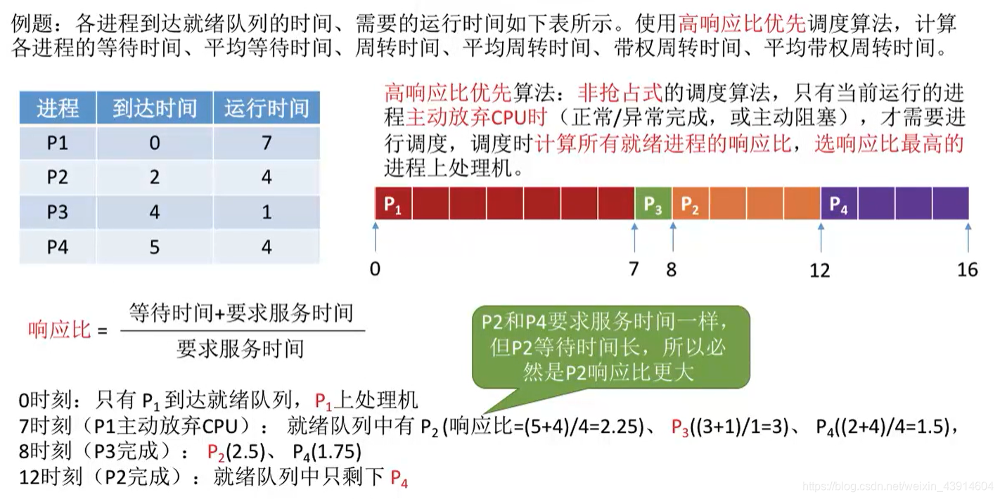
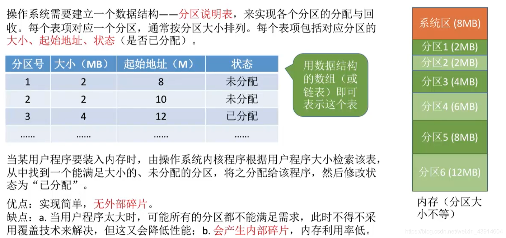
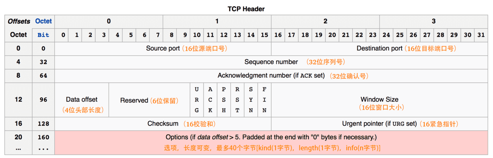

计算机基础总目录

（1）[操作系统](/computer/computer?id=一、操作系统)

（2）[计算机网络](/computer/computer?id=二、计算机网络)

（3）[Linux](/computer/computer?id=三、Linux)

（4）[数据结构](/computer/computer?id=四、数据结构)

（5）[算法](/computer/computer?id=五、算法)

（6）[设计模式](/computer/computer?id=六、设计模式)

---

# <font color=red>一、操作系统</font>

## <font color=green>计算机系统概述</font>

### <font color=blue>1、什么是操作系统</font>

是系统最基本最核心的软件，属于系统软件；

控制和管理整个计算机的硬件和软件资源；

合理的组织、调度计算机的工作与资源分配；

为用户和其他软件提供方便的接口和环境。

### <font color=blue>2、简述一下操作系统的特征</font>

#### 1)   并发

- 并发：两个或多个事件在同一`时间间隔内`发生，这些事件在宏观上是同时发生的，在微观上是交替发生的， 操作系统的并发性指系统中同时存在着多个运行的程序
- 并行：两个或多个事件在同一`时刻`发生

#### 2)   共享

- 资源共享即共享，是指系统中的资源可以`供内存中多个并发执行的进程`共同使用
- 共享分为两类：互斥共享和同时共享
- 并发性和共享性互为存在条件：


#### 3)   虚拟

空间复用技术；

时分复用技术。

#### 4)   异步

异步：多道程序环境允许多个程序并发执行，但由于资源有限，如cpu只有一个，进程的执行并不是一贯到底的，而是走走停停的，它以不可预知的速度向前推进。

### <font color=blue>3、什么是系统调用？有何作用</font>

#### 1)   含义

系统调用是操作系统提供给应用程序的接口，会使处理器从用户态切换为核心态。

用户态：只能执行非特权指令

核心态：特权指令和非特权指令都能执行

#### 2)   作用

应用程序可以通过系统调用（程序接口）请求获得操作系统的服务。

#### 3)   按功能分类

- 设备管理：完成设备的请求或释放，以及设备启动等功能。

- 文件管理：完成文件的读、写、创建及删除等功能。

- 进程控制：完成进程的创建、撤销、阻塞及唤醒等功能。

- 进程通信：完成进程之间的消息传递或信号传递等功能。

- 内存管理：完成内存的分配、回收以及获取作业占用内存区大小及地址等功能。


## <font color=green>进程管理</font>

### <font color=blue>1、进程</font>

#### 1）进程的组成


#### 2)   进程和程序的关系

区别

进程是动态的。程序是静态的

程序是一个包含了所有指令和数据的静态实体。本身除占用磁盘的存储空间外，并不占用系统如CPU、内存等运行资源。

进程由程序段、数据段和PCB构成,会占用系统如CPU、内存等运行资源。

一个程序可以启动多个进程来共同完成。

联系

进程不能脱离具体程序而虚设，程序规定了相应进程所要完成的动作。

#### 3)   进程和线程的区别

进程是对运行时程序的封装，是系统进行资源调度和分配的的基本单位，实现了操作系统的并发；

线程是进程的子任务，是CPU调度和分配的基本单位，用于保证程序的实时性，实现进程内部的并发；

一个程序至少有一个进程，一个进程至少有一个线程，线程依赖于进程而存在；

进程在执行过程中拥有独立的内存单元，而多个线程共享进程的内存。

#### 4)   进程的状态

- 创建态：进程正在被创建，操作系统为进程分配资源、初始化PCB；

- 就绪态：进程已处于准备运行状态，即进程获得了除了处理器之外的一切所需资源，一旦得到处理器资源(处理器分配的时间片)即可运行；

- 运行态：占有CPU，并在CPU上运行；

- 阻塞态：进程正在等待某一事件而暂停运行如等待某资源为可用或等待IO操作完成。即使处理器空闲，该进程也不能运行；

- 终止态：进程正在从系统中消失。可能是进程正常结束或其他原因中断退出运行。


#### 5)   进程间的通信方式

无名管道：

简答：管道是一种半双工的通信方式，数据只能单向流动，而且只能在具有亲缘关系的进程间使用。进程的亲缘关系通常是指父子进程关系。

详解：匿名管道顾名思义，它没有名字标识，匿名管道是特殊文件只存在于内存，没有存在于文件系统中，shell命令中的「|」竖线就是匿名管道，通信的数据是无格式的流并且大小受限，通信的方式是单向的，数据只能在一个方向上流动，如果要双向通信，需要创建两个管道，再来匿名管道是只能用于存在父子关系的进程间通信，匿名管道的生命周期随着进程创建而建立，随着进程终止而消失。

有名管道：

简答：有名管道也是半双工的通信方式，但是它允许无亲缘关系进程间的通信。

详解：命名管道突破了匿名管道只能在亲缘关系进程间的通信限制，因为使用命名管道的前提，需要在文件系统创建一个类型为p的设备文件（mkfifo【管道名】），那么毫无关系的进程就可以通过这个设备文件进行通信。另外，不管是匿名管道还是命名管道，进程写入的数据都是缓存在内核中，另一个进程读取数据时候自然也是从内核中获取，同时通信数据都遵循先进先出原则，不支持lseek之类的文件定位操作。

消息队列：

简答：消息队列是由消息的链表，存放在内核中并由消息队列标识符标识。消息队列克服了信号传递信息少、管道只能承载无格式字节流以及缓冲区大小受限等缺点。

详解：消息队列克服了管道通信的数据是无格式的字节流的问题，消息队列实际上是保存在内核的「消息链表」，消息队列的消息体是可以用户自定义的数据类型，发送数据时，会被分成一个一个独立的消息体，当然接收数据时，也要与发送方发送的消息体的数据类型保持一致，这样才能保证读取的数据是正确的。消息队列通信的速度不是最及时的，毕竟每次数据的写入和读取都需要经过用户态与内核态之间的拷贝过程。

共享内存：

简答：共享内存就是映射一段能被其他进程所访问的内存，这段共享内存由一个进程创建，但多个进程都可以访问。共享内存是最快的IPC方式，它是针对其他进程间通信方式运行效率低而专门设计的。它往往与其他通信机制，如信号量，配合使用，来实现进程间的同步和通信。

详解：共享内存可以解决消息队列通信中用户态与内核态之间数据拷贝过程带来的开销，它直接分配一个共享空间，每个进程都可以直接访问，就像访问进程自己的空间一样快捷方便，不需要陷入内核态或者系统调用，大大提高了通信的速度，享有最快的进程间通信方式之名。但是便捷高效的共享内存通信，带来新的问题，多进程竞争同个共享资源会造成数据的错乱。那么，就需要信号量来保护共享资源，以确保任何时刻只能有一个进程访问共享资源，这种方式就是互斥访问。

信号量：

（书接上文）信号量不仅可以实现访问的互斥性，还可以实现进程间的同步，信号量其实是一个计数器，表示的是资源个数，其值可以通过两个原子操作来控制，分别是P操作和V操作。

信号量是一个计数器，可以用来控制多个进程对共享资源的访问。它常作为一种锁机制，防止某进程正在访问共享资源时，其他进程也访问该资源。因此，主要作为进程间以及同一进程内不同线程之间的同步手段。

信号：

简答：信号是一种比较复杂的通信方式，用于通知接收进程某个事件已经发生。

详解：与信号量名字很相似的叫信号，它俩名字虽然相似，但功能一点儿都不一样。信号是进程间通信机制中唯一的异步通信机制，信号可以在应用进程和内核之间直接交互，内核也可以利用信号来通知用户空间的进程发生了哪些系统事件，信号事件的来源主要有硬件来源（如键盘Cltr+C）和软件来源（如kill命令），一旦有信号发生，进程有三种方式响应信号1.执行默认操作、2.捕捉信号、3.忽略信号。有两个信号是应用进程无法捕捉和忽略的，即SIGKILL和SEGSTOP，这是为了方便我们能在任何时候结束或停止某个进程。

套接字：

简答：套接字也是一种进程间通信机制，与其他通信机制不同的是，它可用于不同机器间的进程通信。

详解：Socket实际上不仅用于不同的主机进程间通信，还可以用于本地主机进程间通信，可根据创建Socket的类型不同，分为三种常见的通信方式，一个是基于TCP协议的通信方式，一个是基于UDP协议的通信方式，一个是本地进程间通信方式。

#### 6)   进程的调度算法

##### <font color=#37BFF9>1.      先来先服务FCFS</font>

算法原则：按照作业/进程到达的先后顺序进行服务，是一种非抢占式的算法；

用于作业/进程调度：用于作业调度时，考虑的是哪个作业先到达后备队列；用于进程调度时，考虑的是哪个进程先到达就绪队列；

优点：公平、算法实现简单，不会产生“饥饿”现象

缺点：对长作业有利，对短作业不利；非抢占式算法

例题：


##### <font color=#37BFF9>2.      短作业优先SJF</font>

算法思想：追求最少的平均等待时间、最少的平均周转时间、最少的平均带权周转时间；

算法规则：最短的作业/进程优先得到服务（“最短”指服务的时间最短）；

优点：“最短的”平均等待时间、平均周转时间

缺点：不公平。对短作业有利，对长作业不利。可能产生饥饿现象。另外，作业/进程的运行时间是由用户提供的，并不一定真实，不一定能做到真正的短作业优先

抢占式、非抢占式算法；

例题：（非抢占式）


例题：（抢占式）


##### <font color=#37BFF9>3.      高相应比优先HRRN</font>

算法思想：要综合考虑作业/进程的等待时间和要求服务的时间；

算法原则：在每次调度时先计算各个进程的响应比，选择相应比最高的进程为其服务

相应比=（等待时间+要求服务时间）/要求服务时间

优点：综合考虑了等待时间和运行时间（要求服务时间）等待时间相同时，要求服务时间短的优先（SJF的优点），要求服务时间相同时，等待长的优先（FCFS的优点），对于长作业来说，随着等待时间越来越大，从而避免了长作业饥饿的问题。

非抢占式算法；

例题：



##### <font color=#37BFF9>4.      时间片轮转-RR</font>

- 算法思想：公平地、轮流地为各个进程服务，让每个进程在一定时间间隔

- 算法原则：按照各进程到达就绪队列的顺序，轮流让各个进程执行一个时间片。若进程未在一个时间片执行完，则剥夺处理机，将进程重新放到就绪队尾重新排队。


- 优点：公平；响应快，适用于分时操作系统，不会产生饥饿现象


- 缺点：
  - 由于高频率的进程切换，因此有一定开销
  - 不区分任务的紧急程度

- 时间片长度的选择：
  - 太小：进程切换过于频繁，系统花费大量的时间来处理进程切换
  - 太大：时间片轮转调度算法退化为先来先服务调度算法

- 抢占式算法；

- 例题：


##### <font color=#37BFF9>5.      优先级调度算法</font>

- 算法思想：随着计算机的发展，特别是实时操作系统的出现，越来越多的应用场景需要根据任务的紧急程度来决定处理顺序；
- 算法原则：调度时选择优先级最高的进程
- 优点：
  - 用优先级区分紧急程度、重要程度，适用于实时操作系统
  - 可灵活地调整对各种进程的偏好程度
- 缺点：若源源不断地有高优先级的进程到来，则可能导致饥饿现象

- 抢占式、非抢占式；
- 例题（非抢占式）


- 例题（抢占式）


##### <font color=#37BFF9>6.      多级反馈队列</font>

- 算法思想：对其它调度算法的折中平衡；
- 算法原则
  - 设置多级就绪队列，各级队列优先级从高到低，时间片从小到大
  - 新进程到达时先进入第1级队列，按FCFS原则排队等待被分配时间片，若用完时间片进程还未结束，则进程进入下一级队列队尾。若果此时已经是在最下级的队列，则重新放回到该队列队尾
  - 只有第k级队列为空时，才会为k+1级对头的进程分配时间片

- 优点：综合了FCFS、RR、SPF等算法的优点


- 缺点：可能产生饥饿；
- 例题：


### <font color=blue>2.  线程</font>

#### 1）什么是线程

线程是一个基本的CPU执行单元，也是程序执行流的最小单位。引入线程后，不仅是进程之间可以并发，进程内的各线程之间也可以并发，从而进一步提升了系统的并发度，使得一个进程内也可以并发处理各种任务（如QQ视频、文字聊天、传文件）。

#### 2）线程间的同步方式

##### 1.互斥量

采用互斥对象机制，只有拥有互斥对象的线程才有访问公共资源的权限。因为互斥对象只有一个，所以可以保证公共资源不会被多个线程同时访问。比如Java中的synchronized关键词和各种Lock都是这种机制。

##### 2.信号量

它允许同一时刻多个线程访问同一资源，但是需要控制同一时刻访问此资源的最大线程数量。类似CountDownLatch;

##### 3.事件

Wait/Notify：通过通知操作的方式来保持多线程同步，还可以方便的实现多线程优先级的比较操作

#### 3）死锁

##### 1.死锁、死循环、饥饿的区别？

##### 2.产生的条件

- 互斥：只有对必须互斥使用的资源的争抢才会导致死锁

- 不可剥夺：进程所获得的资源在为使用前，不能有其他进程强行夺走，只能主动释放

- 占有并等待：进程已经保持了至少一个资源，但又提出了新的资源请求，而该资源又被其他进程所占有；

- 循环等待：存在一种进程资源的循环等待链，链中的每一个进程已获得的资源同时被下一个进程所请求。


##### 3.死锁的处理策略

- 预防死锁：破坏死锁产生的四个必要条件中的一个或几个

- 避免死锁：通过某种方法防止系统进入不安全状态，从而避免死锁（银行家算法）

- 死锁的检测和解除：允许死锁的发生，不过操作系统会负责检测出死锁的发生，然后采取某种措施解除死锁。


## <font color=green>内存管理</font>

### <font color=blue>1、 负责内存空间的分配与回收</font>

#### 1)   分配

##### 1.  连续分配管理方式

- 单一连续分配（内碎片）（只能有一道用户程序）


- 固定分区分配（内碎片）（最早的、最简单的一种可运行多道程序的内存管理方式）
  - 区大小相等
  - 分区大小不等




- 动态分区分配（外碎片）
  - 首次适应

  

  - 最佳适应

  

  - 最坏适应

  

  - 临近适应

  

四种算法归纳比较：


##### 2.  非连续分配管理方式

1. **基本分页存储管理**

主存分为大小相等且固定的一页一页的形式，页较小，相对相比于块式管理的划分力度更大，提高了内存利用率，减少了碎片。页式管理通过页表对应逻辑地址和物理地址。

> 两种技术：
>
> 多级页表：引入多级页表的主要目的是为了避免把全部页表一直放在内存中占用过多空间，特别是那些根本就不需要的页表就不需要保留在内存中。多级页表属于时间换空间的典型场景（章目录->节目录->具体页）；
>
> 快表（TLB）：引入了快表来加速虚拟地址到物理地址的转换。我们可以把快表理解为一种特殊的高速缓冲存储器（Cache）。
>
> 转换流程：
>
> 1、根据虚拟地址中的页号查快表；
>
> 2、如果该页在快表中，直接从快表中读取相应的物理地址；
>
> 3、如果该页不在快表中，就访问内存中的页表，再从页表中得到物理地址，同时将页表中的该映射表项添加到快表中；
>
> 4、当快表填满后，又要登记新页时，就按照一定的淘汰策略淘汰掉快表中的一个页

2. **基本分段存储管理**

段式管理把主存分为一段段的，每一段的空间又要比一页的空间小很多。但是，最重要的是段是有实际意义的，每个段定义了一组逻辑信息，例如,有主程序段MAIN、子程序段X、数据段D及栈段S等。段式管理通过段表对应逻辑地址和物理地址。

3. **段页式存储管理**

段页式管理机制结合了段式管理和页式管理的优点。简单来说段页式管理机制就是把主存先分成若干段，每个段又分成若干页，也就是说段页式管理机制中段与段之间以及段的内部的都是离散的。

> **基本分页存储管理和基本分段存储管理区别和相同点：**
>
> 区别
>
> 页的大小是固定的，由操作系统决定；而段的大小不固定，取决于我们当前运行的程序。
>
> 分页仅仅是为了满足操作系统内存管理的需求，对用户是不可见的，而段是逻辑信息的单位，在程序中可以体现为代码段，数据段，能够更好满足用户的需要。
>
> 相同点
>
> 分页机制和分段机制都是为了提高内存利用率，减少内存碎片。
>
> 页和段都是离散存储的，所以两者都是离散分配内存的方式。但是，每个页和段中的内存是连续的。

#### 2)   回收

1. **内碎片&外碎片：**
   - 内碎片：分配给某进程的内存区域中，有些部分没用上
   - 外碎片：内存中的某些空闲分区由于太小难以利用
2. **回收方式：**
   1. 情况一：回收区的后面有一个相邻的空闲分区——两个相邻的分区合并为一个
   2. 情况二：回收区的前面有一个相邻的空闲分区——两个相邻的分区合并为一个

   3. 情况三：回收区的前、后各有一个相邻的空闲分区——三个相邻的分区合并为一个

   4. 情况四：回收区的前、后都没有相邻的空闲分区——新增一个表项

### <font color=blue>2、提供某种技术从逻辑上对内存空间进行扩充</font>

#### 1)   覆盖技术

- 思想：将程序分为多个段（多个模块）。常用的段常驻内存，不常用的段在需要时调入内存。内存中分为一个“固定区”和若干个‘’覆盖区“；
- 缺点：必须由程序员声明覆盖结构，操作系统完成自动覆盖。对用户不透明，增加了用户编程的负担。覆盖技术只用于早期的操作系统。

#### 2)   交换技术

内存空间紧张时，系统将内存中某些进程暂时换出外存，把外存中某些已具备运行条件的进程换入内存（进程在磁盘和内存间动态调度），磁盘分为文件去和交换区，换出的进程放在交换区中。

#### 3)   虚拟存储技术

##### <font color=#37BFF9>1.      局部性原理</font>

表现：

**空间局部性：**一旦程序访问了某个存储单元，在不久之后，其附近的存储单元也将被访问，即程序在一段时间内所访问的地址，可能集中在一定的范围之内，这是因为指令通常是顺序存放、顺序执行的，数据也一般是以向量、数组、表等形式簇聚存储的。

**时间局部性：**如果程序中的某条指令一旦执行，不久以后该指令可能再次执行；如果某数据被访问过，不久以后该数据可能再次被访问。产生时间局部性的典型原因，是由于在程序中存在着大量的循环操作。

时间局部性是通过将近来使用的指令和数据保存到高速缓存存储器中，并使用高速缓存的层次结构实现。空间局部性通常是使用较大的高速缓存，并将预取机制集成到高速缓存控制逻辑中实现。虚拟内存技术实际上就是建立了“内存一外存”的两级存储器的结构，利用局部性原理实现髙速缓存。

##### <font color=#37BFF9>2.虚拟内存</font>

- **概念：**程序不需要全部装入即可运行，运行时根据需要动态调入数据，若内存不够，还需换出一些数据。
- **表现：**
  - 多次性
  - 兑换性
  - 虚拟性

- **实现方法：**

  - 请求分页管理

    建立在分页管理之上，为了支持虚拟存储器功能而增加了请求调页功能和页面置换功能。请求分页是目前最常用的一种实现虚拟存储器的方法。请求分页存储管理系统中，在作业开始运行之前，仅装入当前要执行的部分段即可运行。假如在作业运行的过程中发现要访问的页面不在内存，则由处理器通知操作系统按照对应的页面置换算法将相应的页面调入到主存，同时操作系统也可以将暂时不用的页面置换到外存中。

    > 页面分配策略
    >
    > a) 驻留集
    >
    > 指请求分页式存储管理中给进程分配的内存块的集合
    >
    > b) 页面分配、置换策略
    >
    > 固定分配vs可变分配：区别在于进程运行期间驻留集大小是否可变
    >
    > 局部置换vs全局置换：区别在于发生缺页时是否只能从进程自己的页面中选择一个换出
    >
    > 固定分配局部置换：进程运行前分配一定数量的物理块，缺页时只能换出进程自己的某一个页
    >
    > 可变分配全局置换：只要缺页就分配新的物理块，可能来自空闲物理块，也可能需要换出别的进程页面
    >
    > 可变分配局部置换：频繁缺页的进程，多分配一些物理块；缺页率很低的进程，回收一些物理块，直到缺页率合适。
    >
    > c) 何时调入页面
    >
    > 预调页策略：运行于进程运行前
    >
    > 请求调页策略：进程运行时，发现缺页再调入
    >
    > d) 抖动现象（颠簸）
    >
    > 页面频繁换入换出的现象。主要原因是分配给进程的物理块太少。
    >
    > e) 工作集
    >
    > 在某段时间间隔里，进程实际访问页面的集合。驻留集大小一般不能小于工作集，否则，进程在运行过程中将频繁缺页。

  - 请求分段管理

    建立在分段存储管理之上，增加了请求调段功能、分段置换功能。请求分段储存管理方式就如同请求分页储存管理方式一样，在作业开始运行之前，仅装入当前要执行的部分段即可运行；在执行过程中，可使用请求调入中断动态装入要访问但又不在内存的程序段；当内存空间已满，而又需要装入新的段时，根据置换功能适当调出某个段，以便腾出空间而装入新的段。

  - 请求段页式存储管理

**页面置换算法**

最佳置换算法（OPT）


先进先出置换算法（FIFO）（BeLady现象）


BeLady现象：


最近最久未使用算法（LRU）


最近最少使用（LFU）Least Frequently Used

时钟置换算法（CLOCK）

改进的时钟置换算法

### <font color=blue>3、提供地址转换功能，负责程序的逻辑地址与物理地址的转换</font>

#### 1)   绝对装入

在编译时，如果知道程序放到内存的哪个位置，编译程序将产生绝对地址的目标代码。

（只适用于单道程序环境）

#### 2)   可重定位装入（静态重定位）

根据内存的当前情况，将装入模块装入到内存的适当位置。装入时对地址进行“重定位”，将逻辑地址变换为物理地址（地址变换实在装入前完成的）

（用于早期的多道批处理系统）

#### 3)   动态运行时装入

装入程序把装入模块装入内存后，并不会立即把逻辑地址装换位物理地址，而是把地址转换推迟到程序真正要执行时才执行。因此装入内存后的所有地址依然是逻辑地址。这种方式需要一个重定位寄存器。

（现代操作系统）

### <font color=blue>4、保证各进程在各自存储空间的运行，互不干扰</font>

在CPU中设置一对上、下限寄存器，存放寄存器的上、下限地址。进程的指令要访问某个地址时，CPU检查是否越界；

采用重定位寄存器（又称基址寄存器）和界地址寄存器（又称限长寄存器）进行越界检查。重定位寄存器中存放的是进程的起始物理地址。界地址寄存器中存放的是最大逻辑地址。


---
# <font color=red>二、计算机网络</font>

## <font color=green>网络协议</font>

### <font color=blue>1.  网络协议的含义</font>

在计算机网络要做到有条不紊地交换数据，就必须遵守一些事先约定好的规则，比如交换数据的格式、是否需要发送一个应答信息。这些规则被称为网络协议。

### <font color=blue>2.  为什么要对网络协议分层</font>

**1)   优点**

- 简化问题难度和复杂度。由于各层之间独立，我们可以分割大问题为小问题。
- 灵活性好。当其中一层的技术变化时，只要层间接口关系保持不变，其他层不受影响。
- 易于实现和维护。
- 促进标准化工作。分开后，每层功能可以相对简单地被描述。

**2)   缺点**

功能可能出现在多个层里，产生了额外开销。

### <font color=blue>3.  体系结构</font>


#### 1)   OSI的体系结构

应用层（Application）、表示层（Presentation）、会话层（Session）、运输层（Transport）、网络层（Network）、数据链路层（DataLink）、物理层（Physical）。

#### 2)   TCP/IP的体系结构

应用层、运输层、网际层和网络接口层。

#### 3)   五层协议的体系机构

应用层、运输层、网络层，数据链路层和物理层。

## <font color = green>五层协议体系结构</font>

### <font color = blue>1.  应用层</font>

通过应用进程间的交互来完成特定网络应用。

常见的协议：如域名系统DNS，支持万维网应用的HTTP协议，支持电子邮件的SMTP协议等

### <font color = blue>2.  运输层</font>

负责向两台主机<u>**进程**</u>之间的通信提供通用的数据传输服务。

#### 1)   传输控制协议-TCP

提供面向连接的，可靠的数据传输服务。

##### <font color =#871F78>1.TCP协议如何来保证传输的可靠性？</font>

首先，采用三次握手来建立TCP连接，四次握手来释放TCP连接，从而保证建立的传输信道是可靠的。

其次，TCP采用了连续ARQ协议（回退N，Go-back-N；超时自动重传）(自动重传请求（AutomaticRepeat-reQuest，ARQ）)来保证数据传输的正确性，使用滑动窗口协议来保证接方能够及时处理所接收到的数据，进行流量控制。

最后，TCP使用慢开始、拥塞避免、快重传和快恢复来进行拥塞控制，避免网络拥塞。

> 数据包校验：目的是检测数据在传输过程中的任何变化，若校验出包有错，则丢弃报文段并且不给出响应，这时TCP发送数据端超时后会重发数据；
>
> 对失序数据包重排序：既然TCP报文段作为IP数据报来传输，而IP数据报的到达可能会失序，因此TCP报文段的到达也可能会失序。TCP将对失序数据进行重新排序，然后才交给应用层；
>
> 丢弃重复数据：对于重复数据，能够丢弃重复数据；
>
> 应答机制：当TCP收到发自TCP连接另一端的数据，它将发送一个确认。这个确认不是立即发送，通常将推迟几分之一秒；
>
> 超时重发：当TCP发出一个段后，它启动一个定时器，等待目的端确认收到这个报文段。如果不能及时收到一个确认，将重发这个报文段；
>
> 流量控制：TCP连接的每一方都有固定大小的缓冲空间。TCP的接收端只允许另一端发送接收端缓冲区所能接纳的数据，这可以防止较快主机致使较慢主机的缓冲区溢出，这就是流量控制。TCP使用的流量控制协议是可变大小的滑动窗口协议。
>
> 拥塞控制：拥塞控制就是防止过多的数据注入网络中，这样可以使网络中的路由器或链路不致过载。注意，拥塞控制和流量控制不同，前者是一个全局性的过程，而后者指点对点通信量的控制。
>
> 慢启动：不要一开始就发送大量的数据，先探测一下网络的拥塞程度，也就是说由小到大逐渐增加拥塞窗口的大小;
>
> 拥塞避免：拥塞避免算法让拥塞窗口缓慢增长，即每经过一个往返时间RTT就把发送方的拥塞窗口cwnd加1，而不是加倍，这样拥塞窗口按线性规律缓慢增长。
>
> 快重传：快重传要求接收方在收到一个失序的报文段后就立即发出重复确认（为的是使发送方及早知道有报文段没有到达对方）而不要等到自己发送数据时捎带确认。快重传算法规定，发送方只要一连收到三个重复确认就应当立即重传对方尚未收到的报文段，而不必继续等待设置的重传计时器时间到期。
>
> 快恢复：快重传配合使用的还有快恢复算法，当发送方连续收到三个重复确认时，就执行“乘法减小”算法，把ssthresh门限减半，但是接下去并不执行慢开始算法：因为如果网络出现拥塞的话就不会收到好几个重复的确认，所以发送方现在认为网络可能没有出现拥塞。所以此时不执行慢开始算法，而是将cwnd设置为ssthresh的大小，然后执行拥塞避免算法。

##### <font color =#871F78>2.      运行在TCP协议上的协议</font>

HTTP（HypertextTransferProtocol，超文本传输协议），主要用于普通浏览。

HTTPS（HTTPoverSSL，安全超文本传输协议）,HTTP协议的安全版本。

FTP（FileTransferProtocol，文件传输协议），用于文件传输。

POP3（PostOfficeProtocol,version3，邮局协议），收邮件用。

SMTP（SimpleMailTransferProtocol，简单邮件传输协议），用来发送电子邮件。

TELNET（TeletypeovertheNetwork，网络电传），通过一个终端（terminal）登陆到网络。

SSH（SecureShell，用于替代安全性差的TELNET），用于加密安全登陆用。

#### 2)   用户数据协议-UDP

提供无连接的，尽最大努力的数据传输服务（不保证数据传输的可靠性）。

##### <font color =#871F78>运行在UDP协议上的协议：</font>

BOOTP（BootProtocol，启动协议），应用于无盘设备。

NTP（NetworkTimeProtocol，网络时间协议），用于网络同步。

DNS（DomainNameService，域名服务），用于完成地址查找，邮件转发等工作。

DHCP（DynamicHostConfigurationProtocol，动态主机配置协议），动态配置IP地址。

#### 3)   TCP和UDP的区别

|              | UDP                                        | TCP                                    |
| ------------ | ------------------------------------------ | -------------------------------------- |
| 是否连接     | 无连接                                     | 面向连接                               |
| 是否可靠     | 不可靠，不使用流量控制和拥塞控制           | 可靠，使用流量控制和拥塞控制           |
| 连接对象个数 | 支持一对一，一对多，多对一和多对多交互通信 | 只能是一对一通信                       |
| 传输方式     | 面向报文                                   | 面向字节流                             |
| 首部开销     | 首部开销小，仅8字节                        | 首部最小20字节，最大60字节             |
| 场景         | 适用于实时应用（IP电话、视频会议、直播等） | 适用于要求可靠传输的应用，例如文件传输 |

### <font color = blue>3.  网络层</font>

选择合适的网间路由和交换结点，确保计算机通信的数据<u>及时</u>传送。

### <font color = blue>4.  数据链路层</font>

两台主机之间的数据传输，总是在一段一段的链路上传送的，这就需要使用专门的链路层的协议。

- 封装成帧
- 透明传输
- 差错检测

### <font color = blue>5.  物理层</font>

实现相邻计算机节点之间比特流的透明传送，尽可能屏蔽掉具体传输介质和物理设备的差异。

## <font color = green>常见面试题</font>

### <font color = blue>1.  Http和Https的区别</font>

Http协议运行在TCP之上，明文传输，客户端与服务器端都无法验证对方的身份；Https是身披SSL(SecureSocketLayer)外壳的Http，运行于SSL上，SSL运行于TCP之上，是添加了加密和认证机制的HTTP。二者之间存在如下不同：

- 端口不同：Http与Https使用不同的连接方式，用的端口也不一样，前者是80，后者是443；
- 资源消耗：和HTTP通信相比，Https通信会由于加减密处理消耗更多的CPU和内存资源；
- 开销：Https通信需要证书，而证书一般需要向认证机构购买；
- 加密机制：HTTP没有任何加密机制，而Https采用共享密钥加密和公开密钥加密并用的混合加密机制

### <font color = blue>2.  http2.0有哪些新特性</font>

- 增加二进制分帧

HTTP2.0在应用层跟传送层之间增加了一个二进制分帧层，从而能够达到在不改动HTTP的语义，HTTP方法，状态码，URI以及首部字段的情况下，突破HTTP1.1的性能限制，改进传输性能，实现低延迟和高吞吐量

- 压缩头部

HTTP2.0在客户端和服务端使用首部表来跟踪和存储之间发送的键-值对，对相同请求而言不需要再次发送请求和相应发送，通信期间几乎不会改变的通用键值

- 多路复用

对HTTP1.1而言，浏览器通常有并行连接的限制，即最多几个并行链接。而多路复用允许通过单一的HTTP2.0连接发起多重的请求-相应消息，这意味着HTTP2.0的通信都在一个连接上完成了，这个连接可以承载任意数量的双向数据流。

- 请求优先级

在每个HTTP2.0的流里面有个优先值，这个优先值确定着客户端跟服务器处理不同的流采取不同的优先级策略，高优先级优先发送，但这不是绝对的(绝对等待会导致首队阻塞问题)

- 服务器提示

HTTP2.0新增加服务器提示，可以先于客户端检测到将要请求的资源，提前通知客户端，服务器不发送所有资源的实体，只发送资源的URL，客户端接到提示后会进行验证缓存，如果真需要这些资源，则正式发起请求（服务器主动更新静态资源）

### <font color = blue>3.  加密</font>

#### 1)   对称加密

**概念**

对称加密指的就是加密和解密使用同一个秘钥，所以叫做对称加密。对称加密只有一个秘钥，作为私钥。

**常见算法**

DES，AES，3DES等等。

#### 2)   非对称加密

**概念**

非对称加密指的是：加密和解密使用不同的秘钥，一把作为公开的公钥，另一把作为私钥。公钥加密的信息，只有私钥才能解密。私钥加密的信息，只有公钥才能解密。

**常见算法**

常见的非对称加密算法：RSA，ECC

### <font color = blue>4.  三次握手</font>



#### 1)   标志位含义

- **序号：**seq序号，占32位，用来标识从TCP源端向目的端发送的字节流，发起方发送数据时对此进行标记。
- **确认序号：**ack序号，占32位，只有ACK标志位为1时，确认序号字段才有效，ack=seq+1。
- **标志位：**
  - ACK：确认序号有效
  - FIN：释放一个连接。
  - PSH：接收方应该尽快将这个报文交给应用层。
  - RST：重置连接。
  - SYN：发起一个新连接。
  - URG：紧急指针（urgentpointer）有效。

#### 2)   本质

确认通信双方收发数据的能力。

#### 3)   过程


1. 第一次握手

客户端要向服务端发起连接请求，首先客户端随机生成一个起始序列号ISN(比如是100)，那客户端向服务端发送的报文段包含SYN标志位(也就是SYN=1)，序列号seq=100。

2. 第二次握手

服务端收到客户端发过来的报文后，发现SYN=1，知道这是一个连接请求，于是将客户端的起始序列号100存起来，并且随机生成一个服务端的起始序列号(比如是300)。然后给客户端回复一段报文，回复报文包含SYN和ACK标志(也就是SYN=1,ACK=1)、序列号seq=300、确认号ack=101(客户端发过来的序列号+1)。

3. 第三次握手

客户端收到服务端的回复后发现ACK=1并且ack=101,于是知道服务端已经收到了序列号为100的那段报文；同时发现SYN=1，知道了服务端同意了这次连接，于是就将服务端的序列号300给存下来。然后客户端再回复一段报文给服务端，报文包含ACK标志位(ACK=1)、ack=301(服务端序列号+1)、seq=101(第一次握手时发送报文是占据一个序列号的，所以这次seq就从101开始，需要注意的是不携带数据的ACK报文是不占据序列号的，所以后面第一次正式发送数据时seq还是101)。当服务端收到报文后发现ACK=1并且ack=301，就知道客户端收到序列号为300的报文了，就这样客户端和服务端通过TCP建立了连接。

#### 4)   为什么要有三次握手，两次不可以吗

在某个TCP连接中，A向B发送的连接请求SYN报文段滞留在网络中的某处。于是A超时重传，与B建立了TCP连接，交换了数据，最后也释放了TCP连接。

但滞留在网络中某处的陈旧的SYB报文段，现在突然传送到B了。如果不使用三次握手，那么B就以为A现在请求建立TCP连接，于是就分配资源，等待A传送数据。但A并没有想要建立TCP连接，也不会向B传送数据。B就白白等待A发送数据。

如果使用三次握手，那么B在收到A发送的陈旧的SYN报文段后，就向A发送SYN报文段，选择自己的序号seq=y，并确认收到A的SYN报文段，其确认号ack=x+1。当A收到B的SYN报文段时，从确认好就可得知不应当理睬这个SYB报文段（因为A现在并没有发送seq=x的SYN报文段）。这时，A发送复位报文段。在这个报文段中，RST=1，ACK=1，其确认号ack=y+1。我们注意到，虽然A拒绝了TCP连接的建立（发送了复位报文段），但对B发送的SYN报文段还是确认收到了。

B收到A的RST报文段后，就知道不能建立TCP连接，不会等待A发送数据了。

### <font color = blue>5.  四次挥手</font>

#### 1)   过程


前文：比如客户端初始化的序列号ISA=100，服务端初始化的序列号ISA=300。TCP连接成功后客户端总共发送了1000个字节的数据，服务端在客户端发FIN报文前总共回复了2000个字节的数据。

1. 第一次挥手

当客户端的数据都传输完成后，客户端向服务端发出连接释放报文(当然数据没发完时也可以发送连接释放报文并停止发送数据)，释放连接报文包含FIN标志位(FIN=1)、序列号seq=1101(100+1+1000，其中的1是建立连接时占的一个序列号)。需要注意的是客户端发出FIN报文段后只是不能发数据了，但是还可以正常收数据；另外FIN报文段即使不携带数据也要占据一个序列号。

2. 第二次挥手

服务端收到客户端发的FIN报文后给客户端回复确认报文，确认报文包含ACK标志位(ACK=1)、确认号ack=1102(客户端FIN报文序列号1101+1)、序列号seq=2300(300+2000)。此时服务端处于关闭等待状态，而不是立马给客户端发FIN报文，这个状态还要持续一段时间，因为服务端可能还有数据没发完。

3. 第三次挥手

服务端将最后数据(比如50个字节)发送完毕后就向客户端发出连接释放报文，报文包含FIN和ACK标志位(FIN=1,ACK=1)、确认号和第二次挥手一样ack=1102、序列号seq=2350(2300+50)。

4. 第四次挥手

客户端收到服务端发的FIN报文后，向服务端发出确认报文，确认报文包含ACK标志位(ACK=1)、确认号ack=2351、序列号seq=1102。注意客户端发出确认报文后不是立马释放TCP连接，而是要经过2MSL(最长报文段寿命的2倍时长)后才释放TCP连接。而服务端一旦收到客户端发出的确认报文就会立马释放TCP连接，所以服务端结束TCP连接的时间要比客户端早一些。

#### 2)   为什么TCP连接的时候是3次，关闭的时候却是4次？

因为只有在客户端和服务端都没有数据要发送的时候才能断开TCP。而客户端发出FIN报文时只能保证客户端没有数据发了，服务端还有没有数据发客户端是不知道的。而服务端收到客户端的FIN报文后只能先回复客户端一个确认报文来告诉客户端我服务端已经收到你的FIN报文了，但我服务端还有一些数据没发完，等这些数据发完了服务端才能给客户端发FIN报文(所以不能一次性将确认报文和FIN报文发给客户端，就是这里多出来了一次)。

#### 3)  为什么客户端发出第四次挥手的确认报文后要等2MSL的时间才能释放TCP连接？

这里同样是要考虑丢包的问题，如果第四次挥手的报文丢失，服务端没收到确认ack报文就会重发第三次挥手的报文，这样报文一去一回最长时间就是2MSL，所以需要等这么长时间来确认服务端确实已经收到了。

#### 4)   如果已经建立了连接，但是客户端突然出现故障了怎么办？

TCP设有一个保活计时器，客户端如果出现故障，服务器不能一直等下去，白白浪费资源。服务器每收到一次客户端的请求后都会重新复位这个计时器，时间通常是设置为2小时，若两小时还没有收到客户端的任何数据，服务器就会发送一个探测报文段，以后每隔75秒钟发送一次。若一连发送10个探测报文仍然没反应，服务器就认为客户端出了故障，接着就关闭连接。

### <font color = blue>6.  常用HTTP状态码</font>

| **类别**    | **原因短语**                                                 |
| ----------- | ------------------------------------------------------------ |
| **【1XX】** | **Informational（信息性状态码）接受的请求正在处理**          |
| **【2XX】** | **Success（成功状态码）请求正常处理完毕**                    |
| 【200】     | 表示从客户端发来的请求在服务器端被正确处理                   |
| 【204】     | No content，表示请求成功，但响应报文不含实体的主体部分       |
| 【206】     | Partial Content，进行范围请求成功                            |
| **【3XX】** | **Redirection（重定向状态码）需要进行附加操作以完成请求**    |
| 【301】     | moved permanently，永久性重定向，表示资源已被分配了新的URL   |
| 【302】     | found，临时性重定向，表示资源临时被分配了新的URL             |
| 【303】     | see other，表示资源存在着另一个URL，应使用GET方法获取资源（对于301/302/303响应，几乎所有浏览器都会删除报文主体并自动用GET重新请求） |
| 【304】     | not modified，表示服务器允许访问资源，但请求未满足条件的情况（与重定向无关） |
| 【307】     | temporary redirect，临时重定向，和302含义类似，但是期望客户端保持请求方法不变向新的地址发出请求 |
| **【4XX】** | **Client Error（客户端错误状态码）服务器无法处理请求**       |
| 【400】     | bad request，请求报文存在语法错误                            |
| 【401】     | unauthorized，表示发送的请求需要有通过HTTP认证的认证信息     |
| 【403】     | forbidden，表示对请求资源的访问被服务器拒绝，可在实体主体部分返回原因描述 |
| 【404】     | not found，表示在服务器上没有找到请求的资源                  |
| **【5XX】** | **Server Error（服务器错误状态码）服务器处理请求出错**       |
| 【500】     | internal sever error，表示服务器端在执行请求时发生了错误     |
| 【501】     | Not Implemented，表示服务器不支持当前请求所需要的某个功能    |
| 【503】     | service unavailable，表明服务器暂时处于超负载或正在停机维护，无法处理请求 |

### <font color = blue>7.  GET与POST区别</font>

Get是不安全的，因为在传输过程，数据被放在请求的URL中；Post的所有操作对用户来说都是不可见的。但是这种做法也不时绝对的，大部分人的做法也是按照上面的说法来的，但是也可以在get请求加上requestbody，给post请求带上URL参数。

Get请求提交的url中的数据最多只能是2048字节，这个限制是浏览器或者服务器给添加的，http协议并没有对url长度进行限制，目的是为了保证服务器和浏览器能够正常运行，防止有人恶意发送请求。Post请求则没有大小限制。

Get限制Form表单的数据集的值必须为ASCII字符；而Post支持整个ISO10646字符集

Get执行效率却比Post方法好。Get是form提交的默认方法。

GET产生一个TCP数据包；POST产生两个TCP数据包。

对于GET方式的请求，浏览器会把httpheader和data一并发送出去，服务器响应200（返回数据）

而对于POST，浏览器先发送header，服务器响应100continue，浏览器再发送data，服务器响应200ok（返回数据）。

### <font color = blue>8.  Session、Cookie和Token的主要区别</font>

#### 1)   什么是cookie

cookie是由Web服务器保存在用户浏览器上的小文件（key-value格式），包含用户相关的信息。客户端向服务器发起请求，如果服务器需要记录该用户状态，就使用response向客户端浏览器颁发一个Cookie。客户端浏览器会把Cookie保存起来。当浏览器再请求该网站时，浏览器把请求的网址连同该Cookie一同提交给服务器。服务器检查该Cookie，以此来辨认用户身份。

#### 2)   什么是session

session是依赖Cookie实现的。session是服务器端对象。

session是浏览器和服务器会话过程中，服务器分配的一块储存空间。服务器默认为浏览器在cookie中设置sessionid，浏览器在向服务器请求过程中传输cookie包含sessionid，服务器根据sessionid获取出会话中存储的信息，然后确定会话的身份信息。

#### 3)   什么是Token

Token的引入：Token是在客户端频繁向服务端请求数据，服务端频繁的去数据库查询用户名和密码并进行对比，判断用户名和密码正确与否，并作出相应提示，在这样的背景下，Token便应运而生。

Token的定义：Token是服务端生成的一串字符串，以作客户端进行请求的一个令牌，当第一次登录后，服务器生成一个Token便将此Token返回给客户端，以后客户端只需带上这个Token前来请求数据即可，无需再次带上用户名和密码。

使用Token的目的：Token的目的是为了减轻服务器的压力，减少频繁的查询数据库，使服务器更加健壮。

Token是在服务端产生的。如果前端使用用户名/密码向服务端请求认证，服务端认证成功，那么在服务端会返回Token给前端。前端可以在每次请求的时候带上Token证明自己的合法地位

#### 4)   cookie与session区别

存储位置与安全性

cookie数据存放在客户端上，安全性较差，session数据放在服务器上，安全性相对更高；

存储空间

单个cookie保存的数据不能超过4K，很多浏览器都限制一个站点最多保存20个cookie，session无此限制

占用服务器资源

session一定时间内保存在服务器上，当访问增多，占用服务器性能，考虑到服务器性能方面，应当使用cookie。

#### 5)   session与token区别

session机制存在服务器压力增大，CSRF跨站伪造请求攻击，扩展性不强等问题；

session存储在服务器端，token存储在客户端

token提供认证和授权功能，作为身份认证，token安全性比session好；

session这种会话存储方式方式只适用于客户端代码和服务端代码运行在同一台服务器上，token适用于项目级的前后端分离（前后端代码运行在不同的服务器下）

### <font color = blue>9.  从输入网址到获得页面的过程</font>

（1）域名解析，其实就是根据用户输入的网址去寻找它对应的IP地址，比如输入www.baidu.com的网址就会经历以下过程：

1. 先从浏览器缓存里找IP,因为浏览器会缓存DNS记录一段时间
2. 如没找到,再从Hosts文件查找是否有该域名和对应IP
3. 如没找到,再从路由器缓存找
4. 如没好到,再从DNS缓存查找
5. 如果都没找到,浏览器域名服务器向根域名服务器(baidu.com)查找域名对应IP,还没找到就把请求转发到下一级,直到找到IP

（2）浏览器获得域名对应的IP地址以后，浏览器向服务器请求建立链接，发起三次握手；

（3）TCP/IP链接建立起来后，浏览器向服务器发送HTTP请求；

（4）服务器接收到这个请求，并根据路径参数映射到特定的请求处理器进行处理，并将处理结果及相应的视图返回给浏览器；

（5）浏览器解析并渲染视图，若遇到对js文件、css文件及图片等静态资源的引用，则重复上述步骤并向服务器请求这些资源；

（6）浏览器根据其请求到的资源、数据渲染页面，最终向用户呈现一个完整的页面。

### <font color = blue>10、常见的WEB攻击手段</font>

#### 1）XSS攻击

**概念**

XSS（Cross Site Scripting）跨站脚本攻击，为了不与层叠样式表（CSS）混淆，故将跨站脚本攻击缩写为XSS。原理即在网页中嵌入恶意脚本，当用户打开网页时，恶意脚本便开始在用户浏览器上执行，以盗取客户端cookie、用户名、密码，甚至下载木马程式，危害可想而知。

**含义**

之所以会发生XSS攻击，是因为用户输入的数据变成了代码， 因此需要对用户输入的数据进行HTML转义处理，将输出的“尖括号”、“单引号”、“引号”之类的特色符号进行转义。

| HTML | HTML转义后的字符 |
| ---- | ---------------- |
| <    | \&lt;            |
| >    | \&gt;            |
| ‘    | \&amp;           |
| “    | \&quot;          |

#### 2）CSRF攻击

**概念**

CSRF攻击的全称跨站请求伪造（Cross Site Request Forgery），通过盗用用户的身份信息，以你的名义向第三方网站发起恶意请求，若转账、盗取账号、发信息、邮件。流程框图如下：


所以CSRF攻击一般场景是：

1、用户登录受信站点A，生成本地cookie；
2、用户没有退出站点A，访问了恶意站点B。

**防御**

1、将cookie设置为HttpOnly

CSRF攻击很大程度是利用了浏览器的cookie，为了防止站内XSS漏洞，cookie设置HttpOnly属性，JS脚本就无法读取到cookie中的信息，避免攻击者伪造cookie的情况出现。

2、增加token

CSRF攻击之所以成功，主要是攻击中伪造了用户请求，而用户请求的验证信息都在cookie中，攻击者就可以利用cookie伪造请求通过安全验证。因此抵御CSRF攻击的关键就是，在请求中放入攻击者不能伪造的信息，并且信息不在cookie中。

鉴于此，开发人员可以在http请求中以参数的形式加一个token，此token在服务端生成，也在服务端校验，服务端的每次会话都可以用同一个token。如果验证token不一致，则认为至CSRF攻击，拒绝请求。

#### 3）SQL注入攻击

**含义**

SQL注入攻击就是把SQL命令伪装成正常的http请求参数，传递到服务端，欺骗服务器最终执行恶意的SQL命令，达到入侵目的。

**防御**

使用ORM框架如：mybatis。

#### 4）文件上传漏洞

倘若web网站没有对文件类型进行严格的校验，导致可执行文件上传到了服务器，恶意程序就会执行。

为了避免恶意文件上传，需要对上传文件类型进行白名单校验，并限制文件大小，上传文件进行重命名。

#### 5）DDoS

**含义**

DDoS（Distributed Denial Of Service）攻击即分布式服务攻击，借助公共网络，将数量庞大的计算器设备（肉鸡）联合起来，对一个或多个目标发动攻击，从而达到瘫痪目标主机的目的。

1、SYN flood

攻击者伪造大量无效IP，不断与目标主机建立TCP链接，导致服务器维护了一个非常大的链接等待列表，占用大量系统资源，直至新链接无法建立。

这种攻击是利用了TCP三次握手的异常处理机制，即第三次握手，服务端在没有收到客户端ACK报文时，服务端会进行多次SYN+ACK重试，然后维护一个等待列表，而系统会为即将建立的TCP连接分配一部分资源。资源耗尽，系统也就无法再建立TCP连接。

2、DNS query flood

攻击者伪造大量无效域名，发送给目标服务器解析，这些域名均为无效域名，导致DNS服务器耗用大量资源去处理这些无效域名，造成DNS解析域名超时，达到攻击目的。

---
# <font color=red>三、Linux</font>

---
# <font color=red>四、数据结构</font>

---
# <font color=red>五、算法</font>

## <font color=green>1、排序算法</font>

## <font color=green>2、并查集</font>

[参考博客:【算法与数据结构】—— 并查集](https://blog.csdn.net/the_ZED/article/details/105126583)

### <font color=blue>1）概论</font>

**定义：**
并查集是一种树型的数据结构，用于处理一些不相交集合的合并及查询问题（即所谓的并、查）。比如说，我们可以用并查集来判断一个森林中有几棵树、某个节点是否属于某棵树等。

**主要构成：**
并查集主要由一个整型数组pre[ ]和两个函数find( )、join( )构成。
数组 pre[ ] 记录了每个点的前驱节点是谁，函数 find(x) 用于查找指定节点 x 属于哪个集合，函数 join(x,y) 用于合并两个节点 x 和 y 。

**作用：**
并查集的主要作用是求连通分支数（如果一个图中所有点都存在可达关系（直接或间接相连），则此图的连通分支数为1；如果此图有两大子图各自全部可达，则此图的连通分支数为2……）

### <font color=blue>2）实现</font>

**find( )函数的定义与实现：**

```java
int find(int x)					//查找x的教主
{
	while(pre[x] != x)			//如果x的上级不是自己（则说明找到的人不是教主）
		x = pre[x];				//x继续找他的上级，直到找到教主为止
	return x;					//教主驾到~~~
}
```


**join( )函数的定义与实现：**

```java
void join(int x,int y)                     //我想让虚竹和周芷若做朋友
{
    int fx=find(x), fy=find(y);            //虚竹的老大是玄慈，芷若MM的老大是灭绝
    if(fx != fy)                           //玄慈和灭绝显然不是同一个人
        pre[fx]=fy;                        //方丈只好委委屈屈地当了师太的手下啦
}

```


**优化find( )函数：**

```java
int find(int x)     				//查找结点 x的根结点 
{
    if(pre[x] == x) return x;		//递归出口：x的上级为 x本身，即 x为根结点        
    return pre[x] = find(pre[x]);	//此代码相当于先找到根结点 rootx，然后pre[x]=rootx 
}

```


### <font color=blue>3）算法练习</font>

1.[小团的配送团队](https://blog.csdn.net/weixin_44957145/article/details/122649292)

2.[合根植物](https://blog.csdn.net/weixin_44957145/article/details/122650989)


## <font color=green>3、回溯算法</font>

### <font color=blue>1）组合问题</font>

[力扣题目链接](https://leetcode-cn.com/problems/combinations/)

**问题：**

给定两个整数 n 和 k，返回范围 [1, n] 中所有可能的 k 个数的组合。

你可以按 任何顺序 返回答案。

**示例 1：**

> 输入：n = 4, k = 2
> 输出：
> [
>   [2,4],
>   [3,4],
>   [2,3],
>   [1,2],
>   [1,3],
>   [1,4],
> ]

**示例 2：**

> 输入：n = 1, k = 1
> 输出：[[1]]
>
>
> 提示：
>
> 1 <= n <= 20
> 1 <= k <= n

**代码：**

```java
class Solution {
    private List<List<Integer>> res = new ArrayList();
    private List<Integer> list = new ArrayList();

    public List<List<Integer>> combine(int n, int k) {
        dfs(1,n,k);
        return res;
    }

    private void dfs(int start,int n,int k){
        if(list.size() == k){
            res.add(new ArrayList(list));
            return;
        }
        for(int i = start; i <= n; i++){
            list.add(i);
            dfs(i+1,n,k);
            list.remove(list.get(list.size()-1));
        }
    }
}
```

回溯法的搜索过程就是一个树型结构的遍历过程，在如下图中，可以看出for循环用来横向遍历，递归的过程是纵向遍历。


**剪枝优化：**

我们说过，回溯法虽然是暴力搜索，但也有时候可以有点剪枝优化一下的。

在遍历的过程中有如下代码：

```cpp
for (int i = startIndex; i <= n; i++) {
    path.push_back(i);
    backtracking(n, k, i + 1);
    path.pop_back();
}
```

这个遍历的范围是可以剪枝优化的，怎么优化呢？

来举一个例子，n = 4，k = 4的话，那么第一层for循环的时候，从元素2开始的遍历都没有意义了。 在第二层for循环，从元素3开始的遍历都没有意义了。

这么说有点抽象，如图所示：


图中每一个节点（图中为矩形），就代表本层的一个for循环，那么每一层的for循环从第二个数开始遍历的话，都没有意义，都是无效遍历。

**所以，可以剪枝的地方就在递归中每一层的for循环所选择的起始位置**。

**如果for循环选择的起始位置之后的元素个数 已经不足 我们需要的元素个数了，那么就没有必要搜索了**。

优化后的代码：

```java
class Solution {
    private List<List<Integer>> res = new ArrayList();
    private List<Integer> list = new ArrayList();

    public List<List<Integer>> combine(int n, int k) {
        dfs(1,n,k);
        return res;
    }

    private void dfs(int start,int n,int k){
        if(list.size() == k){
            res.add(new ArrayList(list));
            return;
        }
        for(int i = start; i <= n - (k-list.size()) + 1; i++){
            list.add(i);
            dfs(i+1,n,k);
            list.remove(list.get(list.size()-1));
        }
    }
}
```

相关练习：

- [组合总和](https://leetcode-cn.com/problems/combination-sum/)

- [组合总和II](https://leetcode-cn.com/problems/combination-sum-ii/)

- [组合总和III](https://leetcode-cn.com/problems/combination-sum-iii/)
- [电话号码的字母组合](https://leetcode-cn.com/problems/letter-combinations-of-a-phone-number/)

- [分割回文串](https://leetcode-cn.com/problems/palindrome-partitioning/)
- [复原IP地址](https://leetcode-cn.com/problems/restore-ip-addresses/)

### <font color=blue>2）子集问题</font>

#### 1.子集

[力扣题目链接](https://leetcode-cn.com/problems/subsets/)

**问题**

给你一个整数数组 `nums` ，数组中的元素 **互不相同** 。返回该数组所有可能的子集（幂集）。

解集 **不能** 包含重复的子集。你可以按 **任意顺序** 返回解集。

**示例 1**

> 输入：nums = [1,2,3]
> 输出：[[],[1],[2],[1,2],[3],[1,3],[2,3],[1,2,3]]

**示例 2**

> 输入：nums = [0]
> 输出：[[],[0]]

**提示**

1 <= nums.length <= 10
-10 <= nums[i] <= 10
nums 中的所有元素 互不相同

**代码**

```java
class Solution {
    private List<List<Integer>> res = new ArrayList();
    private List<Integer> list = new ArrayList();

    public List<List<Integer>> subsets(int[] nums) {
        // Arrays.sort(nums);
        dfs(nums,0);
        return res;
    }

    private void dfs(int nums[],int index){
        res.add(new ArrayList(list));
        for(int i = index ; i < nums.length; i ++){
            list.add(nums[i]);
            dfs(nums,i+1);
            list.remove(list.size()-1);
        }
    }
}
```

#### 2.子集II

[力扣题目链接](https://leetcode-cn.com/problems/subsets-ii/)

**题目**

给你一个整数数组 nums ，其中可能包含重复元素，请你返回该数组所有可能的子集（幂集）。

解集 不能 包含重复的子集。返回的解集中，子集可以按 任意顺序 排列。

**示例 1**

> 输入：nums = [1,2,2]
> 输出：[[],[1],[1,2],[1,2,2],[2],[2,2]]

**示例 2**

> 输入：nums = [0]
> 输出：[[],[0]]

**提示**

> 1 <= nums.length <= 10
> -10 <= nums[i] <= 10

**代码**

```java
class Solution {
    private List<List<Integer>> res = new ArrayList();
    private List<Integer> list = new ArrayList();
    private boolean[] used;

    private void dfs(int[] nums,boolean used[],int index){
        res.add(new ArrayList(list));
        if(index == nums.length){
            return;
        }
        for(int i = index; i < nums.length; i ++){
            if(i > 0 && nums[i] == nums[i-1] && !used[i-1]){
                continue;
            }
            list.add(nums[i]);
            used[i] = true;
            dfs(nums,used,i+1);
            used[i] = false;
            list.remove(list.size()-1);
        }
    }

    public List<List<Integer>> subsetsWithDup(int[] nums) {
        used = new boolean[nums.length];
        Arrays.sort(nums);
        dfs(nums,used,0);
        return res;
    }
}
```


**相关题目**

[递增子序列](https://leetcode-cn.com/problems/increasing-subsequences/)

### <font color=blue>3）全排列</font>

#### 1.全排列

[力扣题目链接](https://leetcode-cn.com/problems/permutations/)

**题目**

给定一个不含重复数字的数组 nums ，返回其 所有可能的全排列 。你可以 按任意顺序 返回答案。

**示例 1**

> 输入：nums = [1,2,3]
> 输出：[[1,2,3],[1,3,2],[2,1,3],[2,3,1],[3,1,2],[3,2,1]]

**示例 2**

> 输入：nums = [0,1]
> 输出：[[0,1],[1,0]]

**示例 3**

> 输入：nums = [1]
> 输出：[[1]]

**代码**

```java
class Solution {
    private List<List<Integer>> res = new ArrayList();
    private List<Integer> list = new LinkedList();
    private boolean[] used;

    private void dfs(int[] nums,boolean used[]){
        if(list.size() == nums.length){
            res.add(new ArrayList(list));
            return;
        }
        for(int i = 0 ; i < nums.length; i ++){
            if(!used[i]){
                list.add(nums[i]);
                used[i] = true;
                dfs(nums,used);
                used[i] = false;
                list.remove(list.size()-1);
            }
        }
    }

    public List<List<Integer>> permute(int[] nums) {
        int n = nums.length;
        used = new boolean[n];
        Arrays.sort(nums);
        dfs(nums,used);
        return res;
    }
}
```


#### 2.全排列II

[力扣题目链接](https://leetcode-cn.com/problems/permutations-ii/)

**题目**

给定一个可包含重复数字的序列 nums ，按任意顺序 返回所有不重复的全排列。

**示例 1**

> 输入：nums = [1,1,2]
>
> 输出：
> [[1,1,2],
>  [1,2,1],
>  [2,1,1]]

**示例 2**

> 输入：nums = [1,2,3]
> 输出：[[1,2,3],[1,3,2],[2,1,3],[2,3,1],[3,1,2],[3,2,1]]

**提示**

> 1 <= nums.length <= 8
> -10 <= nums[i] <= 10

**代码**

```java
class Solution {
    private List<List<Integer>> res = new ArrayList();
    private List<Integer> list = new LinkedList();
    private boolean[] used;

    private void dfs(int[] nums,boolean[] used){
        if(list.size() == nums.length){
            res.add(new ArrayList(list));
            return;
        }
        for(int i = 0 ; i < nums.length; i ++){
            if(i > 0 && nums[i] == nums[i-1] && used[i-1]){
                continue;
            }
            if(!used[i]){
                list.add(nums[i]);
                used[i] = true;
                dfs(nums,used);
                list.remove(list.size()-1);
                used[i] = false;
            }
        }
    }

    public List<List<Integer>> permuteUnique(int[] nums) {
        used = new boolean[nums.length];
        Arrays.sort(nums);
        dfs(nums,used);
        return res;
    }
}
```


---
# <font color=red>六、设计模式</font>

> 设计模式（Design pattern）是一套被反复使用、多数人知晓的、经过分类编目的、代码设计经验的总结，是可复用面向对象软件的基础。**使用设计模式是为了可重用代码、让代码更容易被他人理解、保证代码可靠性。**
>

## <font color=green>1、设计模式的分类</font>

总体来说23种设计模式分为三大类：

**创建型模式（共五种）：**工厂方法模式、抽象工厂模式、单例模式、建造者模式、原型模式。

**结构型模式（共七种）：**适配器模式、装饰器模式、代理模式、外观模式、桥接模式、组合模式、享元模式。

**行为型模式（共十一种）：**策略模式、模板方法模式、观察者模式、迭代子模式、责任链模式、命令模式、备忘录模式、状态模式、访问者模式、中介者模式、解释器模式。


## <font color=green>2、设计模式的六大原则</font>

> 总原则－开闭原则（对扩展开放，对修改封闭。）
>
> 在程序需要进行拓展的时候，不能去修改原有的代码，而是要扩展原有代码，实现一个热插拔的效果。所以一句话概括就是：为了使程序的扩展性好，易于维护和升级。想要达到这样的效果，我们需要使用接口和抽象类等，后面的具体设计中我们会提到这点。

### <font color=blue>1）单一职责原则</font>

每个类应该实现单一的职责，否则就应该把类拆分。

### <font color=blue>2）里氏替换原则</font>

任何基类可以出现的地方，子类一定可以出现。里氏替换原则是继承复用的基石，只有当衍生类可以替换基类，软件单位的功能不受到影响时，基类才能真正被复用，而衍生类也能够在基类的基础上增加新的行为。

### <font color=blue>3）依赖倒转原则</font>

面向接口编程，依赖于抽象而不依赖于具体。写代码时用到具体类时，不与具体类交互，而与具体类的上层接口交互。

### <font color=blue>4）接口隔离原则</font>

每个接口中不存在子类用不到却必须实现的方法，如果不然，就要将接口拆分。使用多个隔离的接口，比使用单个接口（多个接口方法集合到一个的接口）要好。

### <font color=blue>5）迪米特法则（最少知道原则）</font>

一个类对自己依赖的类知道的越少越好。无论被依赖的类多么复杂，都应该将逻辑封装在方法的内部，通过public方法提供给外部。这样当被依赖的类变化时，才能最小的影响该类。

### <font color=blue>6）合成复用原则</font>

尽量首先使用合成/聚合的方式，而不是使用继承。


## <font color=green>3、常用设计模式</font>

### <font color=blue>1）工厂方法模式</font>

#### a）普通工厂模式

尽量首先使用**合成/聚合**的方式，而不是使用继承。

举例如下：

```java
public interface Sender {  
    public void Send();  
}  
public class MailSender implements Sender {  
    @Override  
    public void Send() {  
        System.out.println("this is mailsender!");  
    }  
}  
public class SmsSender implements Sender {  
    @Override  
    public void Send() {  
        System.out.println("this is sms sender!");  
    }  
}  
public class SendFactory {  
    public Sender produce(String type) {  
        if ("mail".equals(type)) {  
            return new MailSender();  
        } else if ("sms".equals(type)) {  
            return new SmsSender();  
        } else {  
            System.out.println("请输入正确的类型!");  
            return null;  
        }  
    }  
}  
public class FactoryTest {  
  
    public static void main(String[] args) {  
        SendFactory factory = new SendFactory();  
        Sender sender = factory.produce("sms");  
        sender.Send();  
    }  
}  

//输出：this is sms sender!
```

#### b）多个工厂方法模式

对普通工厂方法模式的改进，在普通工厂方法模式中，如果传递的字符串出错，则不能正确创建对象，而多个工厂方法模式是提供多个工厂方法，分别创建对象。

将上面的代码做下修改，改动下SendFactory类就行，如下：

```java
public class SendFactory {  
      
    public Sender produceMail(){  
        return new MailSender();  
    }  
      
    public Sender produceSms(){  
        return new SmsSender();  
    }  
}  
public class FactoryTest {  
  
    public static void main(String[] args) {  
        SendFactory factory = new SendFactory();  
        Sender sender = factory.produceMail();  
        sender.Send();  
    }  
}  

//this is mailsender!
```

#### c）静态工厂方法模式

将上面的多个工厂方法模式里的方法置为静态的，不需要创建实例，直接调用即可。

```java
public class SendFactory {  
      
    public static Sender produceMail(){  
        return new MailSender();  
    }  
      
    public static Sender produceSms(){  
        return new SmsSender();  
    }  
}  
public class FactoryTest {  
  
    public static void main(String[] args) {      
        Sender sender = SendFactory.produceMail();  
        sender.Send();  
    }  
}  
//this is mailsender!
```

> 总结：
>
> 凡是出现了大量的产品需要创建，并且具有共同的接口时，可以通过工厂方法模式进行创建。在以上的三种模式中，第一种如果传入的字符串有误，不能正确创建对象，第三种相对于第二种，不需要实例化工厂类，所以，大多数情况下，我们会选用第三种——静态工厂方法模式。

### <font color=blue>2）抽象工厂模式</font>

工厂方法模式有一个问题就是，类的创建依赖工厂类，也就是说，如果想要拓展程序，必须对工厂类进行修改，这违背了闭包原则，所以，从设计角度考虑，有一定的问题，如何解决？就用到抽象工厂模式，创建多个工厂类，这样一旦需要增加新的功能，直接增加新的工厂类就可以了，不需要修改之前的代码。

```java
public interface Sender {  
    public void Send();  
}  
public class MailSender implements Sender {  
    @Override  
    public void Send() {  
        System.out.println("this is mailsender!");  
    }  
}  
public class SmsSender implements Sender {  
  
    @Override  
    public void Send() {  
        System.out.println("this is sms sender!");  
    }  
}  
public interface Provider {  
    public Sender produce();  
}  
public class SendMailFactory implements Provider {  
      
    @Override  
    public Sender produce(){  
        return new MailSender();  
    }  
}  
public class SendSmsFactory implements Provider{  
  
    @Override  
    public Sender produce() {  
        return new SmsSender();  
    }  
}  
public class Test {  
  
    public static void main(String[] args) {  
        Provider provider = new SendMailFactory();  
        Sender sender = provider.produce();  
        sender.Send();  
    }  
}  

```

> 总结：
>
> 其实这个模式的好处就是，如果你现在想增加一个功能：发及时信息，则只需做一个实现类，实现Sender接口，同时做一个工厂类，实现Provider接口，就OK了，无需去改动现成的代码。这样做，拓展性较好！

### <font color=blue>3）单例模式</font>

单例模式确保某个类只有一个实例，而且自行实例化并向整个系统提供这个实例。在计算机系统中，线程池、缓存、日志对象、对话框、打印机、显卡的驱动程序对象常被设计成单例。比如每台计算机可以有若干个打印机，但只能有一个Printer Spooler，以避免两个打印作业同时输出到打印机中。

#### a）懒汉式单例

```java
//懒汉式单例类.在第一次调用的时候实例化自己 
public class Singleton {
    private Singleton() {}
    private static Singleton single=null;
    //静态工厂方法 
    public static Singleton getInstance() {
         if (single == null) {  
             single = new Singleton();
         }  
        return single;
    }
} 
```

Singleton通过将构造方法限定为private避免了类在外部被实例化，在同一个虚拟机范围内，Singleton的唯一实例只能通过getInstance()方法访问。

(事实上，通过Java反射机制是能够实例化构造方法为private的类的，那基本上会使所有的Java单例实现失效。)

但是以上懒汉式单例的实现没有考虑**线程安全问题**，它是线程不安全的，并发环境下很可能出现多个Singleton实例，要实现线程安全，有以下三种方式，都是对getInstance这个方法改造，保证了懒汉式单例的线程安全。

**1、在getInstance方法上加同步**

```java
public static synchronized Singleton getInstance() {
         if (single == null) {  
             single = new Singleton();
         }  
        return single;
}

```

**2、双重检查锁定**

```java
public static Singleton getInstance() {
        if (singleton == null) {  
            synchronized (Singleton.class) {  
               if (singleton == null) {  
                  singleton = new Singleton(); 
               }  
            }  
        }  
        return singleton; 
}

```

**3、静态内部类**（推荐）

```java
public class Singleton {  
    private static class LazyHolder {  
       private static final Singleton INSTANCE = new Singleton();  
    }  
    private Singleton (){}  
    public static final Singleton getInstance() {  
       return LazyHolder.INSTANCE;  
    }  
}  

```

这种方式是当被调用getInstance()时才去加载静态内部类LazyHolder，LazyHolder在加载过程中会实例化一个静态的Singleton，因为利用了classloader的机制来保证初始化instance时只有一个线程，所以Singleton肯定只有一个，是线程安全的，这种比上面1、2都好一些，既实现了线程安全，又避免了同步带来的性能影响。

#### b）饿汉式单例

```java
//饿汉式单例类.在类初始化时，已经自行实例化 
public class Singleton1 {
    private Singleton1() {}
    private static final Singleton1 single = new Singleton1();
    //静态工厂方法 
    public static Singleton1 getInstance() {
        return single;
    }
}

```

饿汉式在类创建的同时就已经创建好一个静态的对象供系统使用，以后不再改变，所以天生是线程安全的。

> **饿汉式和懒汉式区别:**
>
> 饿汉就是类一旦加载，就把单例初始化完成，保证getInstance的时候，单例是已经存在的了，
> 而懒汉比较懒，只有当调用getInstance的时候，才回去初始化这个单例。
> 另外从以下两点再区分以下这两种方式：
>
> 1. 线程安全：
>    - 饿汉式天生就是线程安全的，可以直接用于多线程而不会出现问题；
>    - 懒汉式本身是非线程安全的，为了实现线程安全有几种写法，分别是上面的1、2、3，这三种实现在资源加载和性能方面有些区别。
> 2. 资源加载和性能：
>    - 饿汉式在类创建的同时就实例化一个静态对象出来，不管之后会不会使用这个单例，都会占据一定的内存，但是相应的，在第一次调用时速度也会更快，因为其资源已经初始化完成；
>    - 而懒汉式顾名思义，会延迟加载，在第一次使用该单例的时候才会实例化对象出来，第一次调用时要做初始化，如果要做的工作比较多，性能上会有些延迟，之后就和饿汉式一样了。


### <font color=blue>4）建造者模式</font>

#### a）概念：

​		将一个复杂的构建与其表示相分离，使得同样的构建过程可以创建不同的表示。

​		与抽象工厂的区别：在建造者模式里，有个指导者，由指导者来管理建造者，用户是与指导者联系的，指导者联系建造者最后得到产品。即建造模式可以强制实行一种分步骤进行的建造过程。
　　建造模式是将复杂的内部创建封装在内部，对于外部调用的人来说，只需要传入建造者和建造工具，对于内部是如何建造成成品的，调用者无需关心。

#### b）建造者模式结构组成

**Product**: 表示被构造的复杂对象,其中包含需要构建的部件属性。

**Builder**: 创建一个产品对象的各个部件指定抽象接口。

**ConcreteBuilder**： 实现Builder的接口以构造和装配该产品的各个部件，定义并明确它所创建的表示。

**Director**： 调用具体建造者角色以创建产品对象。

#### c）下面以构建一辆汽车为例，写示例代码：

1.Product角色:组装一辆汽车首先的有各种配件，如发动机、轮胎、座椅等。

```java
public class Car{
    public String engine;
    public String tyre;
    public String seat;
    public Car(){

    }

    public String getEngine() {
        return engine;
    }
    public void setEngine(String engine) {
        this.engine = engine;
    }
    public String getTyre() {
        return tyre;
    }
    public void setTyre(String tyre) {
        this.tyre = tyre;
    }
    public String getSeat() {
        return seat;
    }
    public void setSeat(String seat) {
        this.seat = seat;
    }

}

```

2.Builder角色:知道了所需配件后，就需要生产配件了，定义一个生产配件的抽象建造者接口。

```java
public interface Builder {
    String buildEngine();
    String buildTyre();
    String buildSeat();
}  

```

3.ConcreteBuilder角色:实现抽象的 建造者接口生成具体的建造者，并开始生产具体的配件。

```java
public class CarBuilder implements Builder{

    @Override
    public String buildEngine() {
        // 生产发动机
        return "发动机";
    }

    @Override
    public String buildTyre() {
        // 生产轮胎
        return "轮胎";
    }

    @Override
    public String buildSeat() {
        // 生产座椅
        return "座椅";
    }
}

```

4.Director角色:在生产出配件后，由指导者指导组装配件生成汽车。

```java
public class CarDirector {
    CarBuilder cb;
    public CarDirector(CarBuilder cb){
        this.cb=cb;
    }
    public Car constructCar(){
        Car car=new Car();
        car.setEngine(cb.buildEngine());
        car.setTyre(cb.buildTyre());
        car.setSeat(cb.buildSeat());
        return car;
    }
}

```

5.最终得到一辆汽车:

```java
public class Client {
    public static void main(String[] args) {
        CarDirector carDirector=new CarDirector(new CarBuilder());
        Car car=carDirector.constructCar();
        System.out.println(car.getEngine()+car.getTyre()+car.getSeat());
    }
}

```


### <font color=blue>5）适配器模式</font>

适配器模式，把一个类接口变化成客户端所期待的另一个类的接口，使原来因接口不匹配而无法一起工作的类能够一起工作。

Java源码中的例子：如Java IO中的java.io.InputStreamReader(InputStream) 和java.io.OutputStreamWriter(OutputStream)就是典型的适配器模式，通过InputStreamReader、OutputStreamWriter适配器将字节流转换为字符流。

#### a）类适配器

Target(目标角色)：客户所期待的接口。目标可以是具体的或抽象的类，也可以是接口。
Adaptee(源角色)：现在需要适配的类。
Adapter(适配器)：适配器类是本模式的核心。适配器把源接口转换成目标接口。显然，这一角色不可以是接口，而必须是具体类。

```java
/**
 * 目标角色，如举例中需要转换成的三相插头
 *  @author  14501_000
 */
public interface Target {
     void handleReq();
}   

/**
 * 源角色，需要被适配的类，如举例中的两脚插头
 */
public class Adaptee {
     public void request(){
        System.out.println( "可以完成客户请求的需要的功能!" );
    }
}   

/**
 * 适配器，把源接口转换成目标接口，即将两脚插头转换为三脚插头
 *
 */
public class Adapter extends Adaptee implements Target{
     public void handleReq() {
         super.request();
    }
}   

/**
 * 客户端类，通过三脚插座进行工作
 *
 */
public class Client {
     public void work(Target t){
         t.handleReq();
    }
     public static void main(String[] args){
        Client c = new Client();
        Target t = new Adapter();
        c.work(t);
    }
}

```

#### b）对象适配器

```java
/**
 * 适配器，把源接口转换成目标接口，即将两脚插头转换为三脚插头
 *
 */
public class Adapter implements Target{
    Adaptee adaptee ;
     public Adapter(Adaptee adaptee){
         this.adaptee = adaptee ;
    }
     public void handleReq() {
         adaptee.request();
    }

}

public class Client {
     public void work(Target  t){
         t.handleReq();
    }
     public static void main(String[]  args ) {
        Client c =new Client();
        Adaptee adaptee =new Adaptee();
        Target t = new Adapter(adaptee);
         c.work( t );
    }
}

```

上面这种实现的适配器称为类适配器，因为 Adapter 类既继承了 Adaptee （被适配类），也实现了 Target 接口（因为 Java 不支持多继承，所以这样来实现），在 Client 类中我们可以根据需要选择并创建任一种符合需求的子类，来实现具体功能。另外一种适配器模式是对象适配器，它不是使用多继承或继承再实现的方式，而是使用直接关联，或者称为委托的方式，通过组合的方式跟适配对象组合。

测试结果与上面的一致。 使用对象适配器模式，可以使得 Adapter 类（适配类）根据传入的 Adaptee 对象达到适配多个不同被适配类的功能，当然，此时我们可以为多个被适配类提取出一个接口或抽象类。这样看起来的话，似乎对象适配器模式更加灵活一点。

#### c）适配器的使用场景

- 系统需要使用现有的类，而这些类的接口不符合系统的接口。
- 想要建立一个可以重用的类，用于与一些彼此之间没有太大关联的一些类，包括一些可能在将来引进的类一起工作。
- 两个类所做的事情相同或相似，但是具有不同接口的时候。
- 旧的系统开发的类已经实现了一些功能，但是客户端却只能以另外接口的形式访问，但我们不希望手动更改原有类的时候。

### <font color=blue>6）装饰模式</font>

装饰(Decorate)模式又称为包装(Wrapper)模式。可以动态的为一个对象增加新的功能。

装饰模式是一种用于代替继承的技术，无须通过继承增加子类就能扩展对象的新功能。

使用对象的关联关系代替继承关系，更加灵活，同时避免类型体系的快速膨胀。

#### a）示例

抽象构件

```java
public interface AbstractCar {
    void move();
}  

```

具体构建

```java
public class Car implements AbstractCar{

    public void move() {
        System.out.println("路上行驶");
    }
}

```

装饰角色

```java
public class SuperCar implements AbstractCar{
    protected AbstractCar car;
    public SuperCar(AbstractCar car){
        this.car=car;
    }

    public void move() {
        car.move();
    }
}
```

具体装饰角色

```java
/**
 * 飞行汽车  
*/   

public class FlyCar extends SuperCar{

    public FlyCar(AbstractCar car) {
        super(car);
    }

    public void fly() {
        System.out.println("空中行驶汽车");
    }


    @Override
    public void move() {
        super.move();
         fly();
    }

}


/**
 * 水上汽车
 */
public class WaterCar extends SuperCar{

    public WaterCar(AbstractCar car) {
        super(car);
    }

    public void swim() {
        System.out.println("水上行驶汽车");
    }
    @Override
    public void move() {
        super.move();
        swim();
    }
}
```

客户端

```java
public class Client {

    public static void main(String[] args) {
        Car car=new Car();
        car.move();

        System.out.println("------增加新功能,飞行------");
        FlyCar flyCar=new FlyCar(car);
        flyCar.move();

        System.out.println("------新增加功能，水上行驶-----");
        WaterCar waterCar=new WaterCar(car);
        waterCar.move();

        System.out.println("-----新增加两个功能，飞行与水上行驶-----");
        WaterCar waterCar2=new WaterCar(flyCar);
        waterCar2.move();

    }

}
//输出结果
路上行驶
------增加新功能,飞行------
路上行驶
空中行驶汽车
------新增加功能，水上行驶-----
路上行驶
水上行驶汽车
-----新增加两个功能，飞行与水上行驶-----
路上行驶
空中行驶汽车
水上行驶汽车
```

#### b）装饰模式在Java I/O库中的应用

IO流实现细节：

- **Component抽象构件角色：**io流中的InputStream,OutputStream,Reader,Writer

- **ConcreteComponent具体构件角色：**io流中的FileInputStream,FileOutputStream

- **Decorate装饰角色：**持有抽象构件的引用，FilterInputStream,FilterOutputStream

- **ConcreteDecorate具体装饰角色：**负责给构件对象添加新的责任BufferedInputStream,BufferedOutputStream等


### <font color=blue>7）代理模式</font>

为某个对象提供一个代理，从而控制这个代理的访问。代理类和委托类具有共同的父类或父接口，这样在任何使用委托类对象的地方都可以使用代理类对象替代。代理类负责请求的预处理、过滤、将请求分配给委托类处理、以及委托类处理完请求的后续处理。

#### a）静态代理

由程序员创建或工具生成代理类的源码，再编译代理类。所谓静态也就是在程序运行前就已经存在代理类的字节码文件，代理类和委托类的关系在运行前就确定了。

示例代码：

1. 抽象角色

   ```java
   public interface AbstractSubject {
        void doSomething();
   }   
   ```

2. 真实角色

   ```java
   public class RealSubject implements AbstractSubject{
        @Override
        public void doSomething() {
           System.out.println( "真实角色被使用" );
       }
   }
   ```

3. 代理角色

   ```java
   public class ProxySubject implements AbstractSubject{
        private AbstractSubject  real ;
        public ProxySubject(AbstractSubject  real) {
            this.real=real ;
       }
        @Override
        public void doSomething() {
            real.doSomething();
       }
   
        public void doOtherthing() {
   
       }
   }   
   ```

4. 客户端

   ```java
   public class Client {
        public static void main(String[]  args ) {
           RealSubject real = new  RealSubject();
           ProxySubject proxy = new  ProxySubject( real );
           proxy.doSomething();
       }
   }   
   ```

5. 静态代理的优缺点

   - **优点：**业务类只需要关注业务逻辑本身，保证了业务类的重用性。这是代理的共有优点。
   - **缺点：**代理对象的一个接口只服务于一种类型的对象，如果要代理的方法很多，势必要为每一种方法都进行代理，静态代理在程序规模稍大时就无法胜任了。如果接口增加一个方法，除了所有实现类需要实现这个方法外，所有代理类也需要实现此方法。增加了代码维护的复杂度。

#### b）动态代理

动态代理类的源码是程序在运行期间由JVM根据反射等机制动态生成的，所以不存在代理类的字节码文件。代理角色和真实角色的联系在程序运行时确定。

1. 首先看看和动态代理相关JavaAPI

   **① java.lang.reflect.Proxy**

   这是Java动态代理机制生成的所有代理类的父类，它提供了一组静态的方法来为一组接口动态的生成代理类及其对象。

   Proxy类的静态方法：

   ```java
   //方法 1: 该方法用于获取指定代理对象所关联的调用处理器  
   static InvocationHandler getInvocationHandler(Object proxy )  
   //方法 2：该方法用于获取关联于指定类装载器和一组接口的动态代理类的类对象  
   static Class getProxyClass(ClassLoader loader,Class[] interfaces)  
   //方法 3：该方法用于判断指定类对象是否是一个动态代理类  
   static boolean isProxyClass(Class cl )    
   //方法 4：该方法用于为指定类装载器、一组接口及调用处理器生成动态代理类实例
   static Object newProxyInstance(ClassLoader loader,  Class[] interfaces, InvocationHandler  h )   
   ```

   **②java.lang.reflect.InvocationHandler**

   这是调用处理器接口，它自定义了一个 invoke 方法，用于集中处理在动态代理类对象上的方法调用，通常在该方法中实现对委托类的代理访问。每次生成动态代理类对象时都要指定一个对应的调用处理器对象。

   InvocationHandler核心方法

   ```java
   //该方法负责集中处理动态代理类上的所有方法调用。第一个参数既是代理类实例，第二个参数是被调用的方法对象 //第三个方法是调用参数。调用处理器根据这三个参数进行预处理或分派到委托类实例上反射执行   
   Object invoke(Object proxy, Method  method,Object[] args )     
   
   ```

   **③java.lang.reflect.ClassLoader**

   这是类装载器类，负责将类的字节码装载到 Java 虚拟机（JVM）中并为其定义类对象，然后该类才能被使用。Proxy 静态方法生成动态代理类同样需要通过类装载器来进行装载才能使用，它与普通类的唯一区别就是其字节码是由 JVM 在运行时动态生成的而非预存在于任何一个 .class 文件中。每次生成动态代理类对象时都需要指定一个类装载器对象 。

   

2. 动态代理实现步骤

   - 实现InvocationHandler接口创建自己的调用处理器 。
   - 给Proxy类提供ClassLoader和代理接口类型数组创建动态代理类 。
   - 执行真实角色具体任务。

3. 示例代码

   1. 抽象角色和真实角色代码与上述相同。

   2. 创建自己的调用处理器：

      ```java
      public class SubjectHandler implements InvocationHandler{
          AbstractSubject real;
          public SubjectHandler(AbstractSubject real){
              this.real=real;
          }
      
          @Override
          public Object invoke(Object obj, Method method, Object[] args)throws Throwable {
              System.out.println("代理类预处理任务");
              //利用反射机制将请求分派给委托类处理。Method的invoke返回Object对象作为方法执行结果。  
        //因为示例程序没有返回值，所以这里忽略了返回值处理
              method.invoke(real, args);
              System.out.println("代理类后续处理任务");
              return null;
          }
      
      }
      ```

   3. 客户端 :

      ```java
      public class Client {
      
          public static void main(String[] args) {
              RealSubject real=new RealSubject();
              SubjectHandler handler=new SubjectHandler(real);
              //生成代理类对象
              AbstractSubject proxy=(AbstractSubject) Proxy.newProxyInstance(ClassLoader.getSystemClassLoader(), new Class[]{AbstractSubject.class},handler);
              proxy.doSomething();
          }
      }
      
      ```

4. 动态代理的优缺点

   - 优点：动态代理与静态代理相比较，最大的好处是接口中声明的所有方法都被转移到调用处理器一个集中的方法中处理（InvocationHandler.invoke）。这样，在接口方法数量比较多的时候，我们可以进行灵活处理，而不需要像静态代理那样每一个方法进行中转。
   - 缺点：Proxy 已经设计得非常优美，但是还是有一点点小小的遗憾之处，那就是它始终无法摆脱仅支持 interface 代理的桎梏，因为它的设计注定了这个遗憾。回想一下那些动态生成的代理类的继承关系图，它们已经注定有一个共同的父类叫 Proxy。Java 的继承机制注定了这些动态代理类们无法实现对 class 的动态代理，原因是多继承在 Java 中本质上就行不通。

### <font color=blue>8）策略模式</font>

1. 示例：

   下面是某个市场人员接到单后的报价策略，报价策略很复杂，可以简单作如下分类：
   普通客户小批量，不打折
   普通客户大批量，打9折
   老客户小批量，打8.5折
   老客户大批量，打8折
   我们通常可以适用条件语句进行处理，代码如下：

   ```java
   public class Test {
       public double getPrice(String type ,double price ){
           if(type.equals("普通客户小批量")){
               System.out.println("不打折");
               return price;
           }else if(type.equals("普通客户大批量")){
               System.out.println("打9折");
               return price*0.9;
   
           }else if(type.equals("老客户小批量")){
               System.out.println("打8.5折");
               return price*0.85;
   
           }else if(type.equals("老客户大批量")){
               System.out.println("打8折");
               return price*0.8;
           }
           return price;
       }
   }
   
   ```

   这样实现起来比较简单，符合一般开人员的思路，但是当类型特别多，算法比较复杂时，整个条件控制代码会变得很长，难于维护。这时我们可以采用策略模式，将不同的策略分开，委派给不同的对象管理。
   使用策略模式实现：

   ```java
   public interface Strategy {
       /**
        * 
        * @param price 商品原价
        * @return 打折后价格
        */
       public double getPrice(double price);
   }
   
   
   public class NewCustomerFewStrategy implements Strategy{
   
       public double getPrice(double price) {
           System.out.println("普通客户小批量，不打折");
           return price;
       }
   }
   
   public class NewCustomerManyStrategy implements Strategy{
   
       public double getPrice(double price) {
           System.out.println("普通客户大批量，打9折");
           return price*0.9;
       }
   }
   
   public class OldCustomerFewStrategy implements Strategy{
   
       public double getPrice(double price) {
           System.out.println("老客户小批量，打8.5折");
           return price*0.85;
       }
   }
   
   public class OldCustomerManyStrategy implements Strategy{
   
       public double getPrice(double price) {
           System.out.println("老客户大批量，打8折");
           return price;
       }
   } 
   
   
   public class Context {
       private Strategy strategy;//持有策略引用
   
       public Context(Strategy strategy) {
           super();
           this.strategy = strategy;
       }
       public void printPrice(double price ){
           System.out.println("价格为："+strategy.getPrice(price));
       }
   }
   
   
   
   public class Client {
        public static void main(String[] args) {
           Strategy strategy= new NewCustomerFewStrategy();
           Context context= new Context(strategy);
           context.printPrice(100);
       }
   
   }  
   
   //输出结果
   //普通客户小批量，不打折
   //价格为：100.0  
   
   
   ```

   从上面的示例可以看出，策略模式仅仅封装算法，提供新的算法插入到已有系统中，以及老算法从系统中“退休”的方法，策略模式并不决定在何时使用何种算法。在什么情况下使用什么算法是由客户端决定的。

2. 优缺点：

   - 优点：策略模式提供了管理相关的算法族的办法。策略类的等级结构定义了一个算法或行为族。恰当使用继承可以把公共的代码移到父类里面，从而避免代码重复。
     使用策略模式可以避免使用多重条件(if-else)语句。多重条件语句不易维护，它把采取哪一种算法或采取哪一种行为的逻辑与算法或行为的逻辑混合在一起，统统列在一个多重条件语句里面，比使用继承的办法还要原始和落后。
   - **缺点：**客户端必须知道所有的策略类，并自行决定使用哪一个策略类。这就意味着客户端必须理解这些算法的区别，以便适时选择恰当的算法类。换言之，策略模式只适用于客户端知道算法或行为的情况。
     由于策略模式把每个具体的策略实现都单独封装成为类，如果备选的策略很多的话，那么对象的数目就会很可观。

### <font color=blue>9）模板方法模式</font>

模板方法模式是类的行为模式。准备一个抽象类，将部分逻辑以具体方法以及具体构造函数的形式实现，然后声明一些抽象方法来迫使子类实现剩余的逻辑。不同的子类可以以不同的方式实现这些抽象方法，从而对剩余的逻辑有不同的实现。这就是模板方法模式的用意。
比如定义一个操作中的算法的骨架，将步骤延迟到子类中。模板方法使得子类能够不去改变一个算法的结构即可重定义算法的某些特定步骤。

1. 示例：

   以准备去学校所要做的工作（prepareGotoSchool）为例，假设需要分三步：穿衣服（dressUp），吃早饭（eatBreakfast），带上东西（takeThings）。学生和老师要做得具体事情肯定有所区别。

   抽象类AbstractClass

   ```java
   public abstract class AbstractPerson{   
        //以下是不同子类根据自身特性完成的具体步骤  
        protected abstract void dressUp();  
        protected abstract void eatBreakfast();  
        protected abstract void takeThings(); 
       //抽象类定义整个流程骨架  
        public void prepareGotoSchool(){  
             dressUp();  
             eatBreakfast();  
             takeThings();  
        } 
   } 
   
   ```

   具体类ConcreteClass

   ```java
   public class Student extends AbstractPerson{  
        @Override  
        protected void dressUp() {  
             System.out.println(“穿校服");  
        }  
        @Override  
        protected void eatBreakfast() {  
             System.out.println(“吃妈妈做好的早饭");  
        }  
     
        @Override  
        protected void takeThings() {  
             System.out.println(“背书包，带上家庭作业和红领巾");  
        }  
   }  
   
   ```

   ```java
   public class Teacher extends AbstractPerson{  
        @Override  
        protected void dressUp() {  
             System.out.println(“穿工作服");  
        }  
        @Override  
        protected void eatBreakfast() {  
             System.out.println(“做早饭，照顾孩子吃早饭");  
        }  
     
        @Override  
        protected void takeThings() {  
             System.out.println(“带上昨晚准备的考卷");  
        }  
   }  
   
   ```

   ```java
   public class Client {  
        public static void main(String[] args) {  
        Student student = new Student()  
        student.prepareGotoSchool();  
     
        Teacher teacher  = new Teacher()  
        teacher.prepareGotoSchool();  
        }  
   }  
   ```

   

2. 优缺点：

   - 优点：

     模板方法模式通过把不变的行为搬移到超类，去除了子类中的重复代码。
     子类实现算法的某些细节，有助于算法的扩展。
     通过一个父类调用子类实现的操作，通过子类扩展增加新的行为，符合“开放-封闭原则”。

   - 缺点：每个不同的实现都需要定义一个子类，这会导致类的个数的增加，设计更加抽象。

### <font color=blue>10）观察者模式</font>

观察者模式定义了一个一对多的依赖关系，让多个观察者对象同时监听同一个主题对象。当这个主题状态发生改变时，会通知所有观察者对象，让它们自动更新自己。

#### a）模型结构


- 抽象主题角色(Subject)：把所有对观察者对象的引用保存在一个集合中，每个抽象主题角色都可以有任意数量的观察者。抽象主题提供一个接口，可以增加和删除观察者角色。一般用一个抽象类和接口来实现。
- 具体主题角色(ConcreteSubject)：在具体主题内部状态改变时，给所有登记过的观察者发出通知。具体主题角色通常用一个子类实现。
- 抽象观察者角色(Observer)：为所有具体的观察者定义一个接口，在得到主题的通知时更新自己。
- 具体观察者角色(ConcreteObserver)：该角色实现抽象观察者角色所要求的更新接口，以便使本身的状态与主题的状态相协调。通常用一个子类实现。如果需要，具体观察者角色可以保存一个指向具体主题角色的引用。

#### b）代码示例

抽象观察者角色:

```java
public interface Observer {
    void update(Subject sub);
}

```

具体观察者角色:

```java
public class ConcreteObserver implements Observer{
    private int myState;//与目标对象state值保持一致

    public void update(Subject sub) {
        myState=((ConcreteSubject)sub).getState();
        System.out.println("观察者得到的值："+myState);
    }
}  

```

抽象主题角色:

```java
public class Subject {
    protected List<Observer> list=new ArrayList<Observer>();

    public void registerObserve(Observer obs){
        list.add(obs);
    }

    public void removeObserve(Observer obs){
        list.remove(obs);
    }

    //通知所有的观察者更新状态
    public void notifyAllObserve(){
        for(Observer obs:list){
            obs.update(this);
        }
    }
}

```

具体主题角色:

```java
public class ConcreteSubject extends Subject{
    private int state;

    public int getState() {
        return state;
    }

    //主题对象发生变化，通知所有观察者
    public void setState(int state) {
        this.state = state;
        this.notifyAllObserve();
    }
}

```

客户端 :

```java
public class Client {

    public static void main(String[] args) {
        //目标对象
        ConcreteSubject cs=new ConcreteSubject();

        //创建多个具体观察者
        ConcreteObserver observe1=new ConcreteObserver();
        ConcreteObserver observe2=new ConcreteObserver();
        ConcreteObserver observe3=new ConcreteObserver();

        //注册观察者
        cs.registerObserve(observe1);
        cs.registerObserve(observe2);
        cs.registerObserve(observe3);

        //改变被观察者状态
        cs.setState(2);

    }
}
//输出结果
//观察者得到的值：2
//观察者得到的值：2
//观察者得到的值：2
```


#### c）推模式与拉模式

推模式：每次都会把通知以广播的方式发送给所有观察者，所有观察者只能被动接收，推送的信息通常是主题对象的全部或部分数据 。

拉模式： 主题对象在通知观察者的时候，只传递少量信息。如果观察者需要更具体的信息，由观察者主动到主题对象中获取，相当于是观察者从主题对象中拉数据。一般这种模型的实现中，会把主题对象自身通过update()方法传递给观察者，这样在观察者需要获取数据的时候，就可以通过这个引用来获取了 。

比较： 推模式是假定主题对象知道观察者需要的数据；而拉模式是主题对象不知道观察者具体需要什么数据，没有办法的情况下，干脆把自身传递给观察者，让观察者自己去按需要取值。

#### d）Java自带对观察者模式的支持

JavaSE中提供了java.util.Observable和java.util.Observer来实现观察者模式。

代码示例：

1. 具体目标对象：

   ```java
   public class ConcreteSubject extends Observable{
       private int state;
   
       public int getState() {
           return state;
       }
       public void setState(int state) {
           this.state = state;//目标对象状态发生改变
   
           setChanged();//表示目标对象已经做了更改
           notifyObservers(state);//通知所有观察者
       }
   }
   ```

   

2. 具体观察者：

   ```java
   public class ConcreteObserver implements Observer{
       private int mystate;
       public void update(Observable o, Object arg) {
           mystate=((ConcreteSubject)o).getState();
           System.out.println("观察者接收到的状态:"+mystate);
       }
   }
   ```

   

3. 客户端：

   ```java
   public class Client {
       public static void main(String[] args) {
           //创建具体主题
           ConcreteSubject cs=new ConcreteSubject();
   
           //创建观察者
           ConcreteObserver observer1=new ConcreteObserver();
           ConcreteObserver observer2=new ConcreteObserver();
           ConcreteObserver observer3=new ConcreteObserver();
   
           //将观察者加入到目标对象观察者集合
           cs.addObserver(observer1);
           cs.addObserver(observer2);
           cs.addObserver(observer3);
   
           //目标对象改变
           cs.setState(100);
       }
   }
   //输出结果：
   //观察者接收到的状态:100
   //观察者接收到的状态:100
   //观察者接收到的状态:100
   ```

   


---