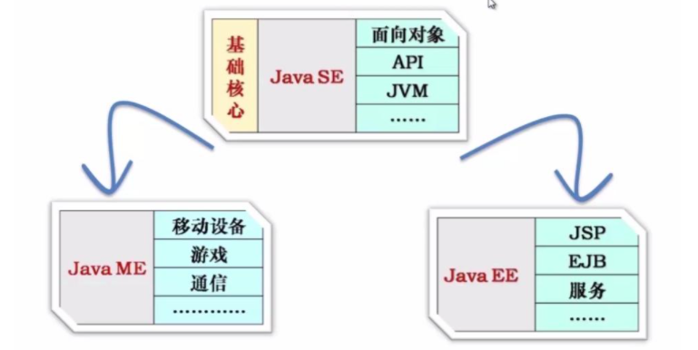
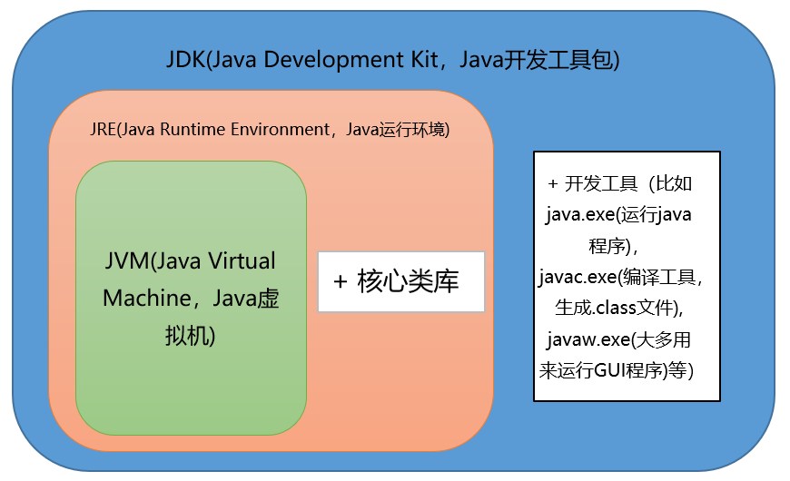
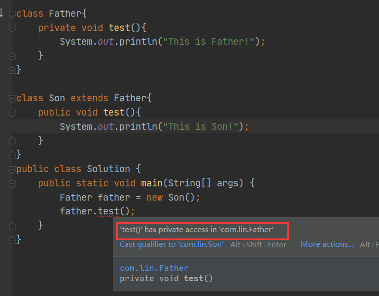
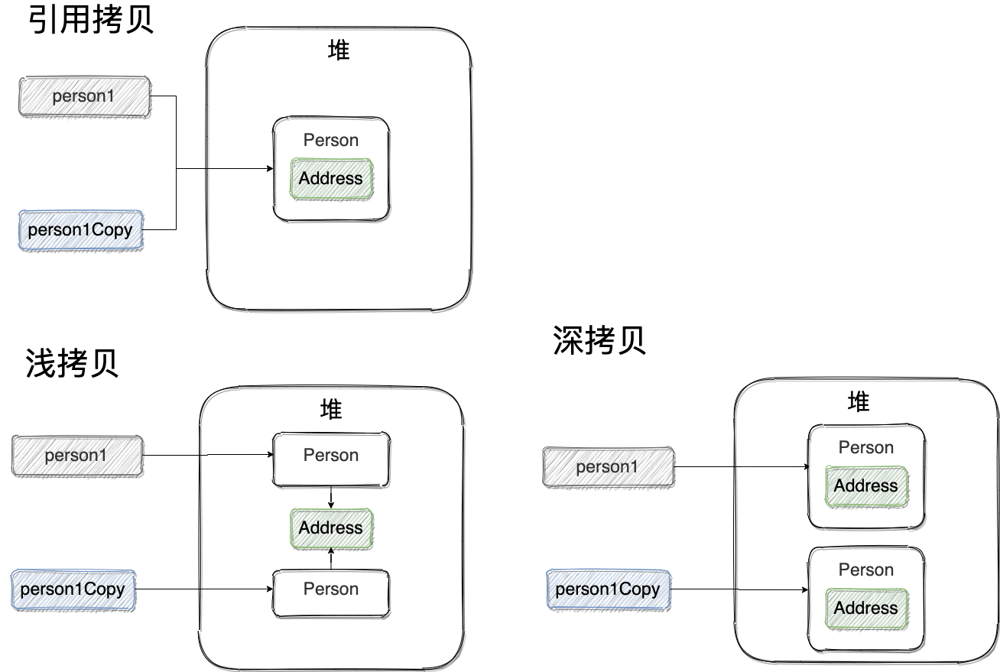
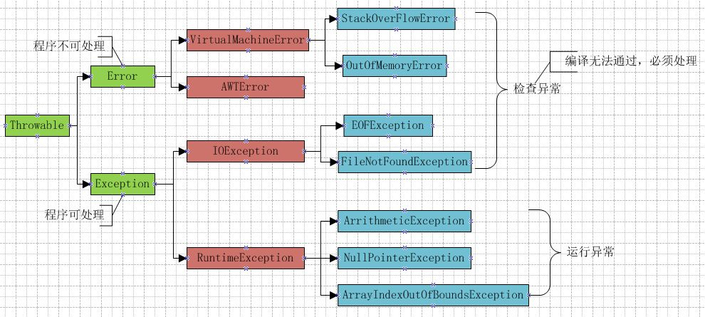

Java总目录：

（1）[JAVA基础](/java/java?id=一、java基础)

（2）[Java集合框架](/java/java?id=二、Java集合框架)

（3）[JUC并发编程](/java/java?id=三、JUC并发编程)

（4）[jvm虚拟机](/java/java?id=四、jvm虚拟机)

（5）[1.8新特性](/java/java?id=五、18新特性)

（6）[反射机制](/java/java?id=六、反射机制)

---


# <font color=red>一、Java基础</font>

## <font color=green>1.Java的3种开发方向</font>



- JavaSE，标准版，主要用于开发和部署桌面、服务器以及嵌入设备和实时环境中的Java应用程序。例如，Java应用程序开发平台Eclipse。

- JavaEE，企业版，主要针对企业应用的开发。例如，电子商务网站、ERP系统。

- JavaME，微型版，主要针对消费类电子设备的。例如，蜂窝电话和可视电话、数字机顶盒、汽车导航系统等等。


## <font color=green>2、Java语言有哪些特点</font>

1. **简单易学；**

2. **面向对象（封装，继承，多态）；**

   面向对象是指以对象为基本粒度，其下包含属性和方法。对象的说明用属性表达，而通过使用方法来操作这个对象。

3. **平台无关性（ Java 虚拟机实现平台无关性）；**

   所谓的跨平台性，是指软件可以不受计算机硬件和操作系统的约束而在任意计算机环境下正常运行。

   （ Java自带的虚拟机很好地实现了跨平台性。 Java源程序代码经过编译后生成二进制的字节码是与平台无关的，但是可被Java虚拟机识别的一种机器码指令。 Java虚拟机提供了一个字节码到底层硬件平台及操作系统的屏障，使得Java语言具备跨平台性。）

4. **支持多线程；**

5. **可靠性；**

6. **安全性；**

   安全性可以分为四个层面，即语言级安全性、编译时安全性、运行时安全性、可执行代码安全性。

   语言级安全性指Java的数据结构是完整的对象，这些封装过的数据类型具有安全性。

   编译时要进行Java语言和语义的检查，保证每个变量对应一个相应的值，编译后生成Java类。

   运行时Java类需要类加载器载入www jxzxmr net，并经由字节码校验器校验之后才可以运行。

    Java类在网络上使用时，对它的权限进行了设置，保证了被访问用户的安全性。

7. **支持网络编程**并且很方便（ Java 语言诞生本身就是为简化网络编程设计的，因此 Java 语言不仅支持网络编程而且很方便）；

8. **编译与解释并存；**


## <font color=green>3、JDK和JRE和JVM的区别</font>

**1）JDK：**Java Development Kit的简称，java开发工具包，提供了java的开发环境和运行环境；

**2）JRE：**Java Runtime Environment的简称，java运行环境，为Java的运行提供了所需环境。

**3）JVM：**Java 虚拟机（JVM）是运行 Java 字节码的虚拟机。JVM 有针对不同系统的特定实现（Windows，Linux，macOS），目的是使用相同的字节码，它们都会给出相同的结果。



## <font color=green>4、什么是字节码?采用字节码的好处是什么?</font>

在 Java 中，JVM 可以理解的代码就叫做字节码（即扩展名为 `.class` 的文件），它不面向任何特定的处理器，只面向虚拟机。Java 语言通过字节码的方式，在一定程度上解决了传统解释型语言执行效率低的问题，同时又保留了解释型语言可移植的特点。所以， Java 程序运行时相对来说还是高效的（不过，和 C++，Rust，Go 等语言还是有一定差距的），而且，由于字节码并不针对一种特定的机器，因此，Java 程序无须重新编译便可在多种不同操作系统的计算机上运行。

**Java 程序从源代码到运行的过程如下图所示：**


我们需要格外注意的是 `.class->机器码` 这一步。在这一步 JVM 类加载器首先加载字节码文件，然后通过解释器逐行解释执行，这种方式的执行速度会相对比较慢。而且，有些方法和代码块是经常需要被调用的(也就是所谓的热点代码)，所以后面引进了 JIT（just-in-time compilation） 编译器，而 JIT 属于运行时编译。当 JIT 编译器完成第一次编译后，其会将字节码对应的机器码保存下来，下次可以直接使用。而我们知道，机器码的运行效率肯定是高于 Java 解释器的。这也解释了我们为什么经常会说 **Java 是编译与解释共存的语言** 。


## <font color=green>5、为什么说 Java 语言“编译与解释并存”？</font>

我们可以将高级编程语言按照程序的执行方式分为两种：

- **编译型** ：编译型语言 会通过编译器将源代码一次性翻译成可被该平台执行的机器码。一般情况下，编译语言的执行速度比较快，开发效率比较低。常见的编译性语言有 C、C++、Go、Rust 等等。
- **解释型** ：解释型语言会通过解释器一句一句的将代码解释（interpret）为机器代码后再执行。解释型语言开发效率比较快，执行速度比较慢。常见的解释性语言有 Python、JavaScript、PHP 等等。


Java 语言既具有编译型语言的特征，也具有解释型语言的特征。因为 Java 程序要经过先编译，后解释两个步骤，由 Java 编写的程序需要先经过编译步骤，生成字节码（`.class` 文件），这种字节码必须由 Java 解释器来解释执行。


## <font color=green>6、Oracle JDK和Open JDK的区别</font>

1. Oracle JDK版本将每三年发布一次，而OpenJDK版本每三个月发布一次；

2. OpenJDK 是一个参考模型并且是完全开源的，而Oracle JDK是OpenJDK的一个实现，并不是完全开源的；

3. Oracle JDK 比 OpenJDK 更稳定。OpenJDK和Oracle JDK的代码几乎相同，但Oracle JDK有更多的类和一些错误修复。因此，如果您想开发企业/商业软件，我建议您选择Oracle JDK，因为它经过了彻底的测试和稳定。某些情况下，有些人提到在使用OpenJDK 可能会遇到了许多应用程序崩溃的问题，但是，只需切换到Oracle JDK就可以解决问题；

4. 在响应性和JVM性能方面，Oracle JDK与OpenJDK相比提供了更好的性能；

5. Oracle JDK不会为即将发布的版本提供长期支持，用户每次都必须通过更新到最新版本获得支持来获取最新版本；

6. Oracle JDK根据二进制代码许可协议获得许可，而OpenJDK根据GPL v2许可获得许可。


## <font color=green>7、Java和C++的区别</font>

- 都是面向对象的语言，都支持封装、继承和多态；
- Java不提供指针来直接访问内存，程序内存更加安全；
- Java的类是单继承的，C++支持多重继承；虽然Java的类不可以多继承，但是接口可以多继承；
- Java有自动内存管理机制，不需要程序员手动释放无用内存。


## <font color=green>8、面向对象和面向过程的区别</font>

### <font color=blue>1） 面向过程</font>

- 优点：性能比面向对象高，因为类调用时需要实例化，开销比较大，比较消耗资源;比如单片机、嵌入式开发、 Linux/Unix等一般采用面向过程开发，性能是最重要的因素；
- 缺点：没有面向对象易维护、易复用、易扩展。

### <font color=blue>2）面向对象</font>

- 优点：易维护、易复用、易扩展，由于面向对象有封装、继承、多态性的特性，可以设计出低耦合的系统，使系统 更加灵活、更加易于维护；
- 缺点：性能比面向过程低。


## <font color=green>9、面向对象的三大特征</font>

### <font color=blue>1）封装</font>

**概念**

封装就是把同一类事物的共性（包括属性和方法）归到同一类中，方便使用。

**优点**

1. 将变化隔离
2. 便于使用
3. 提高重用性
4. 提高安全性

 **缺点**

将变量等使用private修饰，或者封装进方法内，使其不能直接被访问，增加了访问步骤与难度！

### <font color=blue>2）继承</font>

**概念**

多个类具有共同的属性（成员变量）与行为（成员方法）的时候，将这些共同的部分抽取出来定义到一个公共的类中，其他及各类可以与这个公共的类形成继承关系，从而在多个类中不需要重复定义公共部分!这个公共的类就是父类，也称为超类或者基类，其他的类就是子类。子类可以直接访问父类的非私有化成员变量，访问父类的私有化成员变量可以使用super.get()方法。

**优点**

1. 减少代码量，能很好的提高复用率。
2. 使类与类之间存在继承关系，是实现多态操作的前提。

**缺点**

继承使得多个类之间具有了子父类关系，当一个类存在多个子类的时候，如果父类发生变化，那么这些子类会跟着一同变化，造成类与类之间的“强耦合”关系！

### <font color=blue>3）多态</font>

**概念**

多态（重载和覆盖）指的是对象的多种形态。

引用多态和方法多态。**继承是多态的实现基础**。

**多态的前提**

A.必须有子类和父类，具有继承或实现（继承）   

B.子类必须重写父类的方法（重写）   

C.父类的引用变量指向子类的对象（向上转型）

**多态的优点**

  A. 可替换性，多态对一存在的代码具有可替代性

  B. 可扩充性：增加的子类不影响已存在的类的特性的运行和操作

  C. 接口性：多态时超类通过方法签名想子类提供了一个公共的接口，由子类来完善或者覆盖它而实现的

  D. 灵活性：在应用中体现了灵活多样的操作，提高了使用的效率

  E. 简化性： 多态简化对应用软件的代码的编写和修改过程，尤其在处理大量的对象的运算和操作时，这个特点尤为突出和重要

**多态的缺点**

只能使用父类的引用访问父类的成员。


## <font color=green>10、8种基本数据类型所占位数</font>

| 数据类型 | 类型名称     | 所占位数                                         | 初始值 |
| -------- | ------------ | ------------------------------------------------ | ------ |
| byte     | 字节型       | 1字节                                            | 0      |
| char     | 字符型       | 2字节                                            | 空格   |
| short    | 短整型       | 2字节                                            | 0      |
| int      | 整型         | 4字节                                            | 0      |
| long     | 长整型       | 8字节                                            | 0L     |
| float    | 单精度浮点型 | 4字节                                            | 0.0f   |
| double   | 双精度浮点型 | 8字节                                            | 0.0d   |
| boolean  | 布尔型       | java未明确指出的大小<br>(可能1bit、1byte、4byte) | false  |


## <font color=green>11、Java 中有哪些常见的关键字？</font>

| 分类                 | 关键字   |            |          |              |            |           |        |
| -------------------- | -------- | ---------- | -------- | ------------ | ---------- | --------- | ------ |
| 访问控制             | private  | protected  | public   |              |            |           |        |
| 类，方法和变量修饰符 | abstract | class      | extends  | final        | implements | interface | native |
|                      | new      | static     | strictfp | synchronized | transient  | volatile  |        |
| 程序控制             | break    | continue   | return   | do           | while      | if        | else   |
|                      | for      | instanceof | switch   | case         | default    |           |        |
| 错误处理             | try      | catch      | throw    | throws       | finally    |           |        |
| 包相关               | import   | package    |          |              |            |           |        |
| 基本类型             | boolean  | byte       | char     | double       | float      | int       | long   |
|                      | short    | null       | true     | false        |            |           |        |
| 变量引用             | super    | this       | void     |              |            |           |        |
| 保留字               | goto     | const      |          |              |            |           |        |


## <font color=green>12、continue、break 和 return 的区别是什么？</font>

在循环结构中，当循环条件不满足或者循环次数达到要求时，循环会正常结束。但是，有时候可能需要在循环的过程中，当发生了某种条件之后 ，提前终止循环，这就需要用到下面几个关键词：

1. `continue` ：指跳出当前的这一次循环，继续下一次循环。
2. `break` ：指跳出整个循环体，继续执行循环下面的语句。

`return` 用于跳出所在方法，结束该方法的运行。return 一般有两种用法：

1. `return;` ：直接使用 return 结束方法执行，用于没有返回值函数的方法
2. `return value;` ：return 一个特定值，用于有返回值函数的方法


## <font color=green>13、静态方法为什么不能调用非静态成员?</font>

这个需要结合 JVM 的相关知识，主要原因如下：

1. 静态方法是属于类的，在类加载的时候就会分配内存，可以通过类名直接访问。而非静态成员属于实例对象，只有在对象实例化之后才存在，需要通过类的实例对象去访问。
2. 在类的非静态成员不存在的时候静态成员就已经存在了，此时调用在内存中还不存在的非静态成员，属于非法操作。


## <font color=green>14、重载（Overload）和重写（Override）的区别。</font>

方法的重载和重写都是实现多态的方式，区别在于前者实现的是编译时的多态性，而后者实现的是运行时的多态性。

重载：发生在同一个类中，方法名相同参数列表不同（参数类型不同、个数不同、顺序不同），与方法返回值和访问修饰符无关，即重载的方法不能根据返回类型进行区分；

重写：发生在父子类中，方法名、参数列表必须相同，返回值小于等于父类，抛出的异常小于等于父类，访问修饰符大于等于父类（里氏代换原则）；如果父类方法访问修饰符为private则子类中就不是重写。




## <font color=green>15、泛型</font>

### <font color=blue>1）Java 泛型了解么？什么是类型擦除？</font>

**Java 泛型（generics）** 是 JDK 5 中引入的一个新特性, 泛型提供了**编译时类型安全检测机制**，该机制允许程序员在编译时检测到非法的类型。泛型的本质是参数化类型，也就是说所操作的数据类型被指定为一个参数。

Java 的泛型是伪泛型，这是因为 Java 在运行期间，所有的泛型信息都会被擦掉，这也就是通常所说类型擦除 。

泛型一般有三种使用方式: 泛型类、泛型接口、泛型方法。

### <font color=blue>2）介绍一下常用的通配符？</font>

- ？ 表示不确定的 Java 类型
- T (type) 表示具体的一个 Java 类型
- K V (key value) 分别代表 Java 键值中的 Key Value
- E (element) 代表 Element

### <font color=blue>3）你的项目中哪里用到了泛型？</font>

- 可用于定义通用返回结果 `CommonResult<T>` 通过参数 `T` 可根据具体的返回类型动态指定结果的数据类型
- 定义 `Excel` 处理类 `ExcelUtil<T>` 用于动态指定 `Excel` 导出的数据类型
- 用于构建集合工具类。参考 `Collections` 中的 `sort`, `binarySearch` 方法
- ......


## <font color=green>16、== 和 equals() 的区别</font>

**`==`** 对于基本类型和引用类型的作用效果是不同的：

- 对于基本数据类型来说，`==` 比较的是值。
- 对于引用数据类型来说，`==` 比较的是对象的内存地址。

> 因为 Java 只有值传递，所以，对于 == 来说，不管是比较基本数据类型，还是引用数据类型的变量，其本质比较的都是值，只是引用类型变量存的值是对象的地址。

**`equals()`** 作用不能用于判断基本数据类型的变量，只能用来判断两个对象是否相等。`equals()`方法存在于`Object`类中，而`Object`类是所有类的直接或间接父类。

`Object` 类 `equals()` 方法：

```java
public boolean equals(Object obj) {
     return (this == obj);
}Copy to clipboardErrorCopied
```

`equals()` 方法存在两种使用情况：

- **类没有覆盖 `equals()`方法** ：通过`equals()`比较该类的两个对象时，等价于通过“==”比较这两个对象，使用的默认是 `Object`类`equals()`方法。
- **类覆盖了 `equals()`方法** ：一般我们都覆盖 `equals()`方法来比较两个对象中的属性是否相等；若它们的属性相等，则返回 true(即，认为这两个对象相等)。


## <font color=green>17、为什么重写 equals() 时必须重写 hashCode() 方法？</font>

重写hashCode()和equals()方法；

重写hashCode()是因为需要计算存储数据的存储位置，需要注意不要试图从散列码计算中排除掉一个对象的关键部分来提高性能，这样虽然能更快但可能会导致更多的Hash碰撞；

重写equals()方法，需要遵守自反性、对称性、传递性、一致性以及对于任何非null的引用值x，x.equals(null)必须返回false的这几个特性，目的是为了保证key在哈希表中的唯一性。

> 详解
>
> 当你使用Object类作为map的key时，如果你不从写hashcode方法，那么他会继承父类，对整个类进行hashcode计算，如果碰到两个对象中的属性都是一样的，实际生活场景我们希望比较的是它的内容是否相同，而不是它存储的地址是否相同，并且两个不同对象的地址也不可能相同，而要比较他们是否相同，得先让他们放到同一个map中的bucket位置。重写hashcode方法后，如果我们不重写它的equals方法，那么当发生两个相同对象（指的是属性相同，但是两个不同对象）hash碰撞时（此时两个对象的hashcode相同），当使用equals方法判断时，还是会去比较两个key的地址是否相同，如果不重写equals方法，map将以链表（或二叉树）的形式将这两个对象存储在一个bucker的位置。


## <font color=green>18、为什么HashMap中String、Integer这样的包装类适合作为Key</font>

- String、Integer等包装类的特性能够保证Hash值的不可更改性和计算准确性，能够有效的减少Hash碰撞的几率；
- 都是final类型，即不可变性，保证key的不可更改性，不会存在获取hash值不同的情况；
- 内部已重写了equals()、hashCode()等方法，遵守了HashMap内部的规范，不容易出现Hash值计算错误的情况。


## <font color=green>19、为什么String是不可变类</font>

简单的来说：`String` 类中使用 `final` 关键字修饰字符数组来保存字符串，~~所以`String` 对象是不可变的。~~

```java
public final class String implements java.io.Serializable, Comparable<String>, CharSequence {
    private final char value[];
    //...
}
```

**这个说法是错误的。**

我们知道被 `final` 关键字修饰的类不能被继承，修饰的方法不能被重写，修饰的变量是基本数据类型则值不能改变，修饰的变量是引用类型则不能再指向其他对象。因此，`final` 关键字修饰的数组保存字符串并不是 `String` 不可变的根本原因，因为这个数组保存的字符串是可变的（`final` 修饰引用类型变量的情况）。

`String` 真正不可变有下面几点原因：

1. 保存字符串的数组被 `final` 修饰且为私有的，并且`String` 类没有提供/暴露修改这个字符串的方法。
2. `String` 类被 `final` 修饰导致其不能被继承，进而避免了子类破坏 `String` 不可变。


## <font color=green>20、自动装箱与拆箱</font>

### 1）什么是自动拆装箱？

- **装箱**：将基本类型用它们对应的引用类型包装起来；
- **拆箱**：将包装类型转换为基本数据类型；

### 2）它的原理是什么？

```java
Integer i = 10;  //装箱
int n = i;   //拆箱
```

上面这两行代码对应的字节码为：

```shell
L1

    LINENUMBER 8 L1

    ALOAD 0

    BIPUSH 10

    INVOKESTATIC java/lang/Integer.valueOf (I)Ljava/lang/Integer;

    PUTFIELD AutoBoxTest.i : Ljava/lang/Integer;

   L2

    LINENUMBER 9 L2

    ALOAD 0

    ALOAD 0

    GETFIELD AutoBoxTest.i : Ljava/lang/Integer;

    INVOKEVIRTUAL java/lang/Integer.intValue ()I

    PUTFIELD AutoBoxTest.n : I

    RETURN
```

从字节码中，我们发现装箱其实就是调用了 包装类的`valueOf()`方法，拆箱其实就是调用了 `xxxValue()`方法。

因此，

- `Integer i = 10` 等价于 `Integer i = Integer.valueOf(10)`
- `int n = i` 等价于 `int n = i.intValue()`;

注意：**如果频繁拆装箱的话，也会严重影响系统的性能。我们应该尽量避免不必要的拆装箱操作。**

```java
private static long sum() {
    // 应该使用 long 而不是 Long
    Long sum = 0L;
    for (long i = 0; i <= Integer.MAX_VALUE; i++)
        sum += i;
    return sum;
}
```


## <font color=green>21、Integer和int的区别？在什么时候用Integer和什么时候用int</font>

int是java提供的8种原始数据类型之一。

Java为每个原始类型提供了封装类，Integer是java为int提供的封装类。

int的默认值为0，而Integer的默认值为null。Integer可以区分出未赋值和值为0的区别，int则无法表达出未赋值的情况，例如，要想表达出没有参加考试和考试成绩为0的区别，则只能使用Integer。


## <font color=green>22、成员变量与局部变量的区别</font>

1. 从语法形式上看，成员变量是属于类的，而局部变量是在代码块或方法中定义的变量或是方法的参数；成员变量可以被 `public`,`private`,`static` 等修饰符所修饰，而局部变量不能被访问控制修饰符及 `static` 所修饰；但是，成员变量和局部变量都能被 `final` 所修饰。
2. 从变量在内存中的存储方式来看,如果成员变量是使用 `static` 修饰的，那么这个成员变量是属于类的，如果没有使用 `static` 修饰，这个成员变量是属于实例的。而对象存在于堆内存，局部变量则存在于栈内存。
3. 从变量在内存中的生存时间上看，成员变量是对象的一部分，它随着对象的创建而存在，而局部变量随着方法的调用而自动消失。
4. 从变量是否有默认值来看，成员变量如果没有被赋初，则会自动以类型的默认值而赋值（一种情况例外:被 `final` 修饰的成员变量也必须显式地赋值），而局部变量则不会自动赋值。


## <font color=green>23、深拷贝和浅拷贝区别？</font>

关于深拷贝和浅拷贝区别，我这里先给结论：

- **浅拷贝**：浅拷贝会在堆上创建一个新的对象（区别于引用拷贝的一点），不过，如果原对象内部的属性是引用类型的话，浅拷贝会直接复制内部对象的引用地址，也就是说拷贝对象和原对象共用同一个内部对象。
- **深拷贝** ：深拷贝会完全复制整个对象，包括这个对象所包含的内部对象。

下面我们来看一个具体的案例：

**浅拷贝**

浅拷贝的示例代码如下，我们这里实现了 `Cloneable` 接口，并重写了 `clone()` 方法。

`clone()` 方法的实现很简单，直接调用的是父类 `Object` 的 `clone()` 方法。

```java
public class Address implements Cloneable{
    private final String name;
    // 省略构造函数、Getter&Setter方法
    @Override
    public Address clone() {
        try {
            return (Address) super.clone();
        } catch (CloneNotSupportedException e) {
            throw new AssertionError();
        }
    }
}

public class Person implements Cloneable {
    private Address address;
    // 省略构造函数、Getter&Setter方法
    @Override
    public Person clone() {
        try {
            Person person = (Person) super.clone();
            return person;
        } catch (CloneNotSupportedException e) {
            throw new AssertionError();
        }
    }
}
```

测试

```java
Person person1 = new Person(new Address("武汉"));
Person person1Copy = person1.clone();
// true
System.out.println(person1.getAddress() == person1Copy.getAddress());
```

从输出结构就可以看出， `person1` 的克隆对象和 `person1` 使用的仍然是同一个 `Address` 对象。

**深拷贝**

这里我们简单对 `Person` 类的 `clone()` 方法进行修改，连带着要把 `Person` 对象内部的 `Address` 对象一起复制。

```java
@Override
public Person clone() {
    try {
        Person person = (Person) super.clone();
        person.setAddress(person.getAddress().clone());
        return person;
    } catch (CloneNotSupportedException e) {
        throw new AssertionError();
    }
}Copy to clipboardErrorCopied
```

测试 ：

```java
Person person1 = new Person(new Address("武汉"));
Person person1Copy = person1.clone();
// false
System.out.println(person1.getAddress() == person1Copy.getAddress());Copy to clipboardErrorCopied
```

从输出结构就可以看出，虽然 `person1` 的克隆对象和 `person1` 包含的 `Address` 对象已经是不同的了。


## <font color=green>24、什么是引用拷贝？</font>

简单来说，引用拷贝就是两个不同的引用指向同一个对象。




## <font color=green>25、异常</font>

### <font color=blue>1）Java异常架构</font>




### <font color=blue>2）受检异常与非受检异常</font>

Java 的所有异常可以分为受检异常（checked exception）和非受检异常（unchecked exception）。

**1）受检异常**

编译器要求必须处理的异常。正确的程序在运行过程中，经常容易出现的、符合预期的异常情况。一旦发生此类异常，就必须采用某种方式进行处理。除 RuntimeException 及其子类外，其他的 Exception 异常都属于受检异常。编译器会检查此类异常，也就是说当编译器检查到应用中的某处可能会此类异常时，将会提示你处理本异常——要么使用try-catch捕获，要么使用方法签名中用 throws 关键字抛出，否则编译不通过。

**2）非受检异常**

编译器不会进行检查并且不要求必须处理的异常，也就说当程序中出现此类异常时，即使我们没有try-catch捕获它，也没有使用throws抛出该异常，编译也会正常通过。该类异常包括运行时异常**（RuntimeException极其子类）和错误（Error）。**


### <font color=blue>3）异常关键字</font>

**• try** – 用于监听。将要被监听的代码(可能抛出异常的代码)放在try语句块之内，当try语句块内发生异常时，异常就被抛出。

**• catch** – 用于捕获异常。catch用来捕获try语句块中发生的异常。

**• finally** – finally语句块总是会被执行。它主要用于回收在try块里打开的物力资源(如数据库连接、网络连接和磁盘文件)。只有finally块，执行完成之后，才会回来执行try或者catch块中的return或者throw语句，如果finally中使用了return或者throw等终止方法的语句，则就不会跳回执行，直接停止。

**• throw** – 用于抛出异常。

**• throws** – 用在方法签名中，用于声明该方法可能抛出的异常。


### <font color=blue>4）Error 和 Exception 区别是什么</font>

- Error 类型的错误通常为虚拟机相关错误，如系统崩溃，内存不足，堆栈溢出等，编译器不会对这类错误进行检测，JAVA 应用程序也不应对这类错误进行捕获，一旦这类错误发生，通常应用程序会被终止，仅靠应用程序本身无法恢复；

- Exception 类的错误是可以在应用程序中进行捕获并处理的，通常遇到这种错误，应对其进行处理，使应用程序可以继续正常运行。


### <font color=blue>5）使用 try-with-resources 来代替try-catch-finally</font>

1. **适用范围（资源的定义）：** 任何实现 `java.lang.AutoCloseable`或者 `java.io.Closeable` 的对象
2. **关闭资源和 finally 块的执行顺序：** 在 `try-with-resources` 语句中，任何 catch 或 finally 块在声明的资源关闭后运行

> 《Effecitve Java》中明确指出：
>
> 面对必须要关闭的资源，我们总是应该优先使用 `try-with-resources` 而不是`try-finally`。随之产生的代码更简短，更清晰，产生的异常对我们也更有用。`try-with-resources`语句让我们更容易编写必须要关闭的资源的代码，若采用`try-finally`则几乎做不到这点。

Java 中类似于`InputStream`、`OutputStream` 、`Scanner` 、`PrintWriter`等的资源都需要我们调用`close()`方法来手动关闭，一般情况下我们都是通过`try-catch-finally`语句来实现这个需求，如下：

```java
//读取文本文件的内容
Scanner scanner = null;
try {
    scanner = new Scanner(new File("D://read.txt"));
    while (scanner.hasNext()) {
        System.out.println(scanner.nextLine());
    }
} catch (FileNotFoundException e) {
    e.printStackTrace();
} finally {
    if (scanner != null) {
        scanner.close();
    }
}Copy to clipboardErrorCopied
```

使用 Java 7 之后的 `try-with-resources` 语句改造上面的代码:

```java
try (Scanner scanner = new Scanner(new File("test.txt"))) {
    while (scanner.hasNext()) {
        System.out.println(scanner.nextLine());
    }
} catch (FileNotFoundException fnfe) {
    fnfe.printStackTrace();
}Copy to clipboardErrorCopied
```

当然多个资源需要关闭的时候，使用 `try-with-resources` 实现起来也非常简单，如果你还是用`try-catch-finally`可能会带来很多问题。

通过使用**分号分隔**，可以在`try-with-resources`块中声明多个资源。

```java
try (BufferedInputStream bin = new BufferedInputStream(new FileInputStream(new File("test.txt")));
     BufferedOutputStream bout = new BufferedOutputStream(new FileOutputStream(new File("out.txt")))) {
    int b;
    while ((b = bin.read()) != -1) {
        bout.write(b);
    }
}
catch (IOException e) {
    e.printStackTrace();
}
```


## <font color=green>26、I/O流</font>

### <font color=blue>1）什么是序列化？什么是反序列化？</font>

如果我们需要持久化 Java 对象比如将 Java 对象保存在文件中，或者在网络传输 Java 对象，这些场景都需要用到序列化。

简单来说：

- **序列化**： 将数据结构或对象转换成二进制字节流的过程
- **反序列化**：将在序列化过程中所生成的二进制字节流转换成数据结构或者对象的过程

序列化的主要目的是通过网络传输对象或者说是将对象存储到文件系统、数据库、内存中。

### <font color=blue>2）Java 序列化中如果有些字段不想进行序列化，怎么办？</font>

对于不想进行序列化的变量，使用 `transient` 关键字修饰。

`transient` 关键字的作用是：阻止实例中那些用此关键字修饰的的变量序列化；当对象被反序列化时，被 `transient` 修饰的变量值不会被持久化和恢复。

> 关于 `transient` 还有几点注意：
>
> - `transient` 只能修饰变量，不能修饰类和方法。
> - `transient` 修饰的变量，在反序列化后变量值将会被置成类型的默认值。例如，如果是修饰 `int` 类型，那么反序列后结果就是 `0`。
> - `static` 变量因为不属于任何对象(Object)，所以无论有没有 `transient` 关键字修饰，均不会被序列化。

### <font color=blue>3）获取用键盘输入常用的两种方法</font>

方法 1：通过 `Scanner`

```java
Scanner input = new Scanner(System.in);
String s  = input.nextLine();
input.close();Copy to clipboardErrorCopied
```

方法 2：通过 `BufferedReader`

```java
BufferedReader input = new BufferedReader(new InputStreamReader(System.in));
String s = input.readLine();
```

### <font color=blue>4）Java 中 IO 流分为几种?</font>

- 按照流的流向分，可以分为输入流和输出流；
- 按照操作单元划分，可以划分为字节流和字符流；
- 按照流的角色划分为节点流和处理流。

Java IO 流共涉及 40 多个类，这些类看上去很杂乱，但实际上很有规则，而且彼此之间存在非常紧密的联系， Java IO 流的 40 多个类都是从如下 4 个抽象类基类中派生出来的。

- InputStream/Reader: 所有的输入流的基类，前者是字节输入流，后者是字符输入流。
- OutputStream/Writer: 所有输出流的基类，前者是字节输出流，后者是字符输出流。

按操作方式分类结构图：


按操作对象分类结构图：


### <font color=blue>5）既然有了字节流,为什么还要有字符流？</font>

（问题本质：不管是文件读写还是网络发送接收，信息的最小存储单元都是字节，那为什么 I/O 流操作要分为字节流操作和字符流操作呢？）

字符流是由 Java 虚拟机将字节转换得到的，问题就出在这个过程还算是非常耗时，并且，如果我们不知道编码类型就很容易出现乱码问题。所以， I/O 流就干脆提供了一个直接操作字符的接口，方便我们平时对字符进行流操作。如果音频文件、图片等媒体文件用字节流比较好，如果涉及到字符的话使用字符流比较好。


---

# <font color=red>二、Java集合框架</font>

## <font color=green>1、基础知识</font>

### <font color=blue>1）集合和数组的区别</font>

数组是固定长度的；集合可变长度的。

数组可以存储基本数据类型，也可以存储引用数据类型；集合只能存储引用数据类型。

数组存储的元素必须是同一个数据类型；集合存储的对象可以是不同数据类型。

### <font color=blue>2）集合框架的优点</font>

容量自增长；

提供了高性能的数据结构和算法，使编码更轻松，提高了程序速度和质量；

可以方便地扩展或改写集合，提高代码复用性和可操作性。

通过使用JDK自带的集合类，可以降低代码维护和学习新API成本。

### <font color=blue>3）无序性的含义</font>

无序性不等于随机性，无序性是指存储的数据在底层数组中并非按照数组索引的顺序添加，而是根据数据的哈希值决定的。

### <font color=blue>4）不可重复性的含义</font>

不可重复性是指添加的元素按照equals()判断时，返回false，需要同时重写equals()方法和HashCode()方法。

### <font color=blue>5）集合框架底层的数据结构</font>

#### a) Collection

**List**

Arraylist：Object[]数组

Vector：Object[]数组

LinkedList：双向链表(JDK1.6之前为循环链表，JDK1.7取消了循环)

 **Set**

HashSet（无序唯一）：基于HashMap实现的，底层采用HashMap来保存元素

LinkedHashSet：LinkedHashSet是HashSet的子类，并且其内部是通过LinkedHashMap来实现的。有点类似于我们之前说的LinkedHashMap其内部是基于HashMap实现一样，不过还是有一点点区别的

TreeSet（有序唯一）：红黑树(自平衡的排序二叉树)

**Queue**

PriorityQueue：Object[]数组来实现二叉堆

ArrayQueue：Object[]数组+双指针

#### b)   Map

 HashMap：JDK1.8之前HashMap由数组+链表组成的，数组是HashMap的主体，链表则是主要为了解决哈希冲突而存在的（“拉链法”解决冲突）。JDK1.8以后在解决哈希冲突时有了较大的变化，当链表长度大于阈值（默认为8）（将链表转换成红黑树前会判断，如果当前数组的长度小于64，那么会选择先进行数组扩容，而不是转换为红黑树）时，将链表转化为红黑树，以减少搜索时间

 LinkedHashMap：LinkedHashMap其实是对HashMap进行了拓展，使用了双向链表来保证了顺序性。

 Hashtable：数组+链表组成的，数组是Hashtable的主体，链表则是主要为了解决哈希冲突而存在的

 TreeMap：红黑树（自平衡的排序二叉树）

### <font color=blue>6）为什么HashMap中String、Integer这样的包装类适合作为Key</font>

String、Integer等包装类的特性能够保证Hash值的不可更改性和计算准确性，能够有效的减少Hash碰撞的几率

都是final类型，即不可变性，保证key的不可更改性，不会存在获取hash值不同的情况

内部已重写了equals()、hashCode()等方法，遵守了HashMap内部的规范，不容易出现Hash值计算错误的情况

### <font color=blue>7）Object作为HashMap的Key，应该注意什么</font>

重写hashCode()和equals()方法

重写hashCode()是因为需要计算存储数据的存储位置，需要注意不要试图从散列码计算中排除掉一个对象的关键部分来提高性能，这样虽然能更快但可能会导致更多的Hash碰撞

重写equals()方法，需要遵守自反性、对称性、传递性、一致性以及对于任何非null的引用值x，x.equals(null)必须返回false的这几个特性，目的是为了保证key在哈希表中的唯一性

详解

当你使用Object类作为map的key时，如果你不从写hashcode方法，那么他会继承父类，对整个类进行hashcode计算，如果碰到两个对象中的属性都是一样的，实际生活场景我们希望比较的是它的内容是否相同，而不是它存储的地址是否相同，并且两个不同对象的地址也不可能相同，而要比较他们是否相同，得先让他们放到同一个map中的bucket位置。重写hashcode方法后，如果我们不重写它的equals方法，那么当发生两个相同对象（指的是属性相同，但是两个不同对象）hash碰撞时（此时两个对象的hashcode相同），当使用equals方法判断时，还是会去比较两个key的地址是否相同，如果不重写equals方法，map将以链表（或二叉树）的形式将这两个对象存储在一个bucker的位置。

## <font color=green>2、区别</font>

### <font color=blue>1）comparable和comparator的区别</font>

comparable接口出自java.lang包，它有一个compareTo(Objectobj)方法用来排序

comparator接口出自java.util包，它有一个compare(Objectobj1,Objectobj2)方法用来排序

一般我们需要对一个集合使用自定义排序时，我们就要重写compareTo()方法或compare()方法

### <font color=blue>2）Collection和Collections有什么区别？</font>

java.util.Collection是一个集合接口（集合类的一个顶级接口）。它提供了对集合对象进行基本操作的通用接口方法。Collection接口在Java类库中有很多具体的实现。Collection接口的意义是为各种具体的集合提供了最大化的统一操作方式，其直接继承接口有List与Set。

Collections则是集合类的一个工具类，其中提供了一系列静态方法，用于对集合中元素进行排序、搜索以及线程安全等各种操作。

### <font color=blue>3）Iterator和ListIterator有什么区别？</font>

Iterator可以遍历Set和List集合，而ListIterator只能遍历List。

Iterator只能单向遍历，而ListIterator可以双向遍历（向前/后遍历）。

ListIterator实现Iterator接口，然后添加了一些额外的功能，比如添加一个元素、替换一个元素、获取前面或后面元素的索引位置。

### <font color=blue>4）List</font>

#### a) ArrayList和Vector的区别

线程安全

Vector使用了Synchronized来实现线程同步，是线程安全的，而ArrayList是非线程安全的。

性能

ArrayList在性能方面要优于Vector。

扩容机制

ArrayList和Vector都会根据实际的需要动态的调整容量，只不过在Vector扩容每次会增加1倍，而ArrayList只会增加50%。

#### b) ArrayList和LinkedList的区别

数据结构实现：

ArrayList是动态数组的数据结构实现，而LinkedList是双向链表的数据结构实现。

随机访问效率：

ArrayList比LinkedList在随机访问的时候效率要高，因为LinkedList是线性的数据存储方式，所以需要移动指针从前往后依次查找。

增加和删除效率：

在非首尾的增加和删除操作，LinkedList要比ArrayList效率要高，因为ArrayList增删操作要影响数组内的其他数据的下标。

内存空间占用：

LinkedList比ArrayList更占内存，因为LinkedList的节点除了存储数据，还存储了两个引用，一个指向前一个元素，一个指向后一个元素。

线程安全：

ArrayList和LinkedList都是不同步的，也就是不保证线程安全。

### <font color=blue>5）Set</font>

#### hashset、linkedhashset和treeset三者的异同

HashSet是Set接口的主要实现类，HashSet的底层是HashMap，线程不安全的，可以存储null值；

LinkedHashSet是HashSet的子类，能够按照添加的顺序遍历；

TreeSet底层使用红黑树，能够按照添加元素的顺序进行遍历，排序的方式有自然排序和定制排序。

### <font color=blue>6）Queue</font>

#### a) Queue与Deque的区别

Queue是单端队列，只能从一端插入元素，另一端删除元素，实现上一般遵循先进先出（FIFO）规则。

Queue扩展了Collection的接口，根据因为容量问题而导致操作失败后处理方式的不同可以分为两类方法:一种在操作失败后会抛出异常（add、remove、element），另一种则会返回特殊值（offer、poll、peek）。

Deque是双端队列，在队列的两端均可以插入或删除元素。

Deque扩展了Queue的接口,增加了在队首和队尾进行插入和删除的方法，同样根据失败后处理方式的不同分为两类：

抛出异常

addFirst(Ee)、addLast(Ee)、removeFirst()、removeLast()、getFirst()、getLast()

返回特殊值

offerFirst(Ee)、offerLast(Ee)、pollFirst()、pollLast()、peekFirst()、peekLast()

#### b) ArrayDeque与LinkedList的区别

ArrayDeque和LinkedList都实现了Deque接口，两者都具有队列的功能

ArrayDeque是基于可变长的数组和双指针来实现，而LinkedList则通过链表来实现。

ArrayDeque不支持存储NULL数据，但LinkedList支持。

ArrayDeque是在JDK1.6才被引入的，而LinkedList早在JDK1.2时就已经存在。

ArrayDeque插入时可能存在扩容过程,不过均摊后的插入操作依然为O(1)。虽然LinkedList不需要扩容，但是每次插入数据时均需要申请新的堆空间，均摊性能相比更慢。

从性能的角度上，选用ArrayDeque来实现队列要比LinkedList更好。

#### c) PriorityQueue

PriorityQueue是在JDK1.5中被引入的,其与Queue的区别在于元素出队顺序是与优先级相关的，即总是优先级最高的元素先出队。

PriorityQueue利用了二叉堆的数据结构来实现的，底层使用可变长的数组来存储数据

PriorityQueue通过堆元素的上浮和下沉，实现了在O(logn)的时间复杂度内插入元素和删除堆顶元素

PriorityQueue是非线程安全的，且不支持存储NULL和non-comparable的对象。

PriorityQueue默认是小顶堆，但可以接收一个Comparator作为构造参数，从而来自定义元素优先级的先后。

### <font color=blue>7）Map</font>

#### a) HashMap和Hashtable的区别

线程安全：

HashMap是非线程安全的，HashTable是线程安全的,因为HashTable内部的方法基本都经过synchronized修饰。（如果你要保证线程安全的话就使用ConcurrentHashMap吧！）

效率：

因为线程安全的问题，HashMap要比HashTable效率高一点。另外，HashTable基本被淘汰，不要在代码中使用它；

对Nullkey和Nullvalue的支持：

HashMap可以存储null的key和value，但null作为键只能有一个，null作为值可以有多个；HashTable不允许有null键和null值，否则会抛出NullPointerException

初始容量大小和每次扩充容量大小的不同：

创建时如果不指定容量初始值，Hashtable默认的初始大小为11，之后每次扩充，容量变为原来的2n+1。HashMap默认的初始化大小为16。之后每次扩充，容量变为原来的2倍。

创建时如果给定了容量初始值，那么Hashtable会直接使用你给定的大小，而HashMap会将其扩充为2的幂次方大小（HashMap中的tableSizeFor()方法保证

底层数据结构：

JDK1.8以后的HashMap在解决哈希冲突时有了较大的变化，当链表长度大于阈值（默认为8）（将链表转换成红黑树前会判断，如果当前数组的长度小于64，那么会选择先进行数组扩容，而不是转换为红黑树）时，将链表转化为红黑树，以减少搜索时间。Hashtable没有这样的机制。

#### b) HashMap和HashSet的区别

HashSet底层就是基于HashMap实现的

HashMap实现了Map接口，HashSet实现Set接口

HashMap用来存储键值对，HashSet仅存储对象

HashMap调用put()向map中添加元素，HashSet调用add()方法向Set中添加元素

HashMap使用键（Key）计算hashcode，HashSet使用成员对象来计算hashcode值，对于两个对象来说hashcode可能相同，所以equals()方法用来判断对象的相等性

#### c) HashMap和TreeMap的区别

TreeMap和HashMap都继承自AbstractMap，但是需要注意的是TreeMap它还实现了NavigableMap接口和SortedMap接口。

实现NavigableMap接口让TreeMap有了对集合内元素的搜索的能力。

实现SortMap接口让TreeMap有了对集合中的元素根据键排序的能力。默认是按key的升序排序，不过我们也可以指定排序的比较器。

综上，相比于HashMap来说TreeMap主要多了对集合中的元素根据键排序的能力以及对集合内元素的搜索的能力。

#### d) ConcurrentHashMap和Hashtable的区别

ConcurrentHashMap和Hashtable的区别主要体现在实现线程安全的方式上不同。

底层数据结构

JDK1.7的ConcurrentHashMap底层采用分段的数组+链表实现；

JDK1.8采用的数据结构跟HashMap1.8的结构一样，数组+链表/红黑二叉树。

Hashtable和JDK1.8之前的HashMap的底层数据结构类似都是采用数组+链表的形式，数组是HashMap的主体，链表则是主要为了解决哈希冲突而存在的。

实现线程安全的方式

在JDK1.7的时候，ConcurrentHashMap（分段锁）对整个桶数组进行了分割分段(Segment)，每一把锁只锁容器其中一部分数据，多线程访问容器里不同数据段的数据，就不会存在锁竞争，提高并发访问率。到了JDK1.8的时候已经摒弃了Segment的概念，而是直接用Node数组+链表+红黑树的数据结构来实现，并发控制使用synchronized和CAS来操作。（JDK1.6以后对synchronized锁做了很多优化）整个看起来就像是优化过且线程安全的HashMap，虽然在JDK1.8中还能看到Segment的数据结构，但是已经简化了属性，只是为了兼容旧版本；

Hashtable(同一把锁):使用synchronized来保证线程安全，效率非常低下。当一个线程访问同步方法时，其他线程也访问同步方法，可能会进入阻塞或轮询状态，如使用put添加元素，另一个线程不能使用put添加元素，也不能使用get，竞争会越来越激烈效率越低。

## <font color=green>3、源码分析</font>

### <font color=blue>1）ArrayList</font>

#### a)  基础知识

 优缺点

优点

ArrayList底层以数组实现，是一种随机访问模式。ArrayList实现了RandomAccess接口，因此查找的时候非常快。

ArrayList在顺序添加一个元素的时候非常方便。

缺点

删除元素的时候，需要做一次元素复制操作。如果要复制的元素很多，那么就会比较耗费性能。

插入元素的时候，也需要做一次元素复制操作，缺点同上。

 适用场景

顺序添加、随机访问的场景。

#### b)   为什么ArrayList的elementData加上transient修饰？

ArrayList 实现了 Serializable 接口，这意味着 ArrayList 支持序列化。transient 的作用是说不希望 elementData 数组被序列化，重写了 writeObject 实现。每次序列化时，先调用 defaultWriteObject() 方法序列化 ArrayList 中的非 transient 元素，然后遍历 elementData，只序列化已存入的元素，这样既加快了序列化的速度，又减小了序列化之后的文件大小。

### <font color=blue>2）HashMap</font>

#### a)  数据结构

1.8：数组+链表/红黑树

1.7：数组+链表

#### b)   HashMap的插入原理

   i.  判断数组是否为空，为空进行初始化;

  ii.  不为空，计算k的hash值，通过(n-1)&hash计算应当存放在数组中的下标index;

  iii.  查看table[index]是否存在数据，没有数据就构造一个Node节点存放在table[index]中；

  iv.  存在数据，说明发生了hash冲突(存在二个节点key的hash值一样),继续判断key是否相等，相等，用新的value替换原数据(onlyIfAbsent为false)；

  v.  如果不相等，判断当前节点类型是不是树型节点，如果是树型节点，创造树型节点插入红黑树中；(如果当前节点是树型节点证明当前已经是红黑树了)

  vi.  如果不是树型节点，创建普通Node加入链表中；判断链表长度是否大于8并且数组长度大于64，大于的话链表转换为红黑树；

 vii.  插入完成之后判断当前节点数是否大于阈值，如果大于开始扩容为原数组的二倍。

#### c)   说说Hashmap的初始值

一般如果newHashMap()不传值，默认大小是16，负载因子是0.75，如果自己传入初始大小k，初始化大小为大于k的2的整数次方，例如如果传10，大小为16。

#### d)   HashMap的工作原理

HashMap基于hashing原理，我们通过put()和get()方法储存和获取对象。当我们将键值对传递给put()方法时，它调用键对象的hashCode()方法来计算hashcode，然后找到bucket位置来储存值对象。当获取对象时，通过键对象的equals()方法找到正确的键值对，然后返回值对象。HashMap使用链表来解决碰撞问题，当发生碰撞了，对象将会储存在链表的下一个节点中。HashMap在每个链表节点中储存键值对对象。

当两个不同的键对象的hashcode相同时会发生什么？它们会储存在同一个bucket位置的链表中。键对象的equals()方法用来找到键值对。

#### e)   Hashmap是如何扩容的

扩容：创建一个新的Entry空数组，长度是原数组的2倍。

ReHash：遍历原Entry数组，把所有的Entry重新Hash到新数组。

#### f)   为什么1.7使用的是尾插法，而1.8改用头插法？

在多线程下可能出现环形链表

#### g)   Hashmap初始长度为什么是2的幂？

因为在使用不是2的幂的数字的时候，Length-1的值是所有二进制位全为1，这种情况下，index的结果等同于HashCode后几位的值。

#### h)   一般在多线程的场景，如何使用map集合

 Hashtable

 ConcurrentHashMap

 使用Collections.synchronizedMap(Map)创建线程安全的map集合；

#### i)   你知道HashMap的哈希函数怎么设计的吗？为什么怎么设计？

hash函数是先拿到key的hashcode，是一个32位的int值，然后让hashcode的高16位和低16位进行异或操作。

这个也叫扰动函数，这么设计有二点原因

一定要尽可能降低hash碰撞，越分散越好；

算法一定要尽可能高效，因为这是高频操作,因此采用位运算；

#### j) 为什么采用hashcode的高16位和低16位异或能降低hash碰撞？hash函数能不能直接用key的hashcode？

因为key.hashCode()函数调用的是key键值类型自带的哈希函数，返回int型散列值。int值范围为-2147483648~2147483647，前后加起来大概40亿的映射空间。只要哈希函数映射得比较均匀松散，一般应用是很难出现碰撞的。但问题是一个40亿长度的数组，内存是放不下的。你想，如果HashMap数组的初始大小才16，用之前需要对数组的长度取模运算，得到的余数才能用来访问数组下标。

#### k) 1.8除了对hash函数做了优化，1.8还有别的优化吗？

数组+链表改成了数组+链表或红黑树；

链表的插入方式从头插法改成了尾插法，简单说就是插入时，如果数组位置上已经有元素，1.7将新元素放到数组中，原始节点作为新节点的后继节点，1.8遍历链表，将元素放置到链表的最后；

扩容的时候1.7需要对原数组中的元素进行重新hash定位在新数组的位置，1.8采用更简单的判断逻辑，位置不变或索引+旧容量大小；

在插入时，1.7先判断是否需要扩容，再插入，1.8先进行插入，插入完成再判断是否需要扩容

#### l) 你分别跟我讲讲为什么要做这几点优化？

1)    防止发生hash冲突，链表长度过长，将时间复杂度由O(n)降为O(logn);

2)    因为1.7头插法扩容时，头插法会使链表发生反转，多线程环境下会产生环；

3)    这是由于扩容是扩大为原数组大小的2倍，用于计算数组位置的掩码仅仅只是高位多了一个1

#### m) 链表转红黑树和红黑树转链表的阈值？为什么？

阈值是8，红黑树转链表阈值为6。

因为根据泊松分布，，在hash函数设计合理的情况下，发生hash碰撞8次的几率为百万分之6，概率说话。因为8够用了，至于为什么转回来是6，因为如果hash碰撞次数在8附近徘徊，会一直发生链表和红黑树的互相转化，为了预防这种情况的发生。

#### n) 为什么HashMap使用红黑树而不使用AVL树

 AVL以及红黑树是高度平衡的树数据结构。它们非常相似，真正的区别在于在任何添加/删除操作时完成的旋转操作次数。

 两种实现都缩放为a O(lg N)，其中N是叶子的数量，但实际上AVL树在查找密集型任务上更快：利用更好的平衡，树遍历平均更短。另一方面，插入和删除方面，AVL树速度较慢：需要更多的旋转次数才能在修改时正确地重新平衡数据结构。

 在AVL树中，从根到任何叶子的最短路径和最长路径之间的差异最多为1。在红黑树中，差异可以是2倍。

 两个都是O（log n）查找，但平衡AVL树可能需要O（log n）旋转，而红黑树将需要最多两次旋转使其达到平衡（尽管可能需要检查O（log n）节点以确定旋转的位置）。旋转本身是O（1）操作，因为你只是移动指针。

### <font color=blue>3）Hashtable</font>

#### a)  Hashmap和Hashtable的区别

Hashtable是不允许键或值为null的，HashMap的键值则都可以为null

 实现方式不同

Hashtable继承了Dictionary类，而HashMap继承的是AbstractMap类。Dictionary是JDK1.0添加的

 初始化容量不同

HashMap的初始容量为：16，Hashtable初始容量为：11，两者的负载因子默认都是：0.75

 扩容机制不同

当现有容量大于总容量负载因子时，HashMap扩容规则为当前容量翻倍，Hashtable扩容规则为当前容量翻倍+1

 迭代器不同

HashMap中的Iterator迭代器是fail-fast的，Hashtable的Iterator迭代器也是fail-fast，但它的Enumerator是fail-safe的

#### b) 什么是fail-fast？它的原理

 含义

快速失败（fail—fast）是java集合中的一种机制，在用迭代器遍历一个集合对象时，如果遍历过程中对集合对象的内容进行了修改（增加、删除），则会抛出ConcurrentModificationException。

 原理

迭代器在遍历时直接访问集合中的内容，并且在遍历过程中使用一个modCount变量。

集合在被遍历期间如果内容发生变化，就会改变modCount的值。

每当迭代器使用hashNext()/next()遍历下一个元素之前，都会检测modCount变量是否为expectedmodCount值，是的话就返回遍历；否则抛出异常，终止遍历。

#### c)  什么是fail-safe？它的原理

 含义

fail-safe:这种遍历*基于容器的一个克隆*。因此，对容器内容的修改不影响遍历。java.util.concurrent包下的容器都是安全失败的,可以在多线程下并发使用,并发修改。常见的的使用fail-safe方式遍历的容器有ConcerrentHashMap和CopyOnWriteArrayList等。

 原理

采用安全失败机制的集合容器，在遍历时不是直接在集合内容上访问的，而是先复制原有集合内容，在拷贝的集合上进行遍历。由于迭代时是对原集合的拷贝进行遍历，所以在遍历过程中对原集合所作的修改并不能被迭代器检测到，所以不会触发ConcurrentModificationException。

 缺点

1)    基于拷贝内容的优点是避免了ConcurrentModificationException，但同样地，迭代器并不能访问到修改后的内容，即：迭代器遍历的是开始遍历那一刻拿到的集合拷贝，在遍历期间原集合发生的修改迭代器是不知道的。

2)    需要复制集合，产生大量的无效对象，开销大

### <font color=blue>4）  ConcurrentHashMap</font>

### <font color=blue>5）  PriorityQueue</font>


---

# <font color=red>三、JUC并发编程</font>

---

# <font color=red>四、JVM虚拟机</font>

---

# <font color=red>五、1.8新特性</font>

## <font color=green>1、Open JDK和Oracle JDK的区别</font>

Open JDK是Sun把Java开源而形成的项目。也就是说Open JDK是Java SE派台版的开源和免费实现，它由SUN和Java社区提供支持，2009年Oracle收购了Sun公司，自此Java的维护方之一的Sun也变成了Oracle。

大多数JDK都是在Open JDK的基础上进一步编写实现的。Oracle JDK是由Oracle公司开发，Oracle JDK是基于Open JDK源代码的商业版本。需要在商业许可的情况下才能使用。

## <font color=green>2、JDK1.8新特性</font>

### <font color=blue>1）Lambda表达式</font>

**1.标准格式**

```java
(参数类型 参数名称) ->{
    代码体;
}
```


**2.案例**

```java
interface TestLambda{
    void test();
}

public class Solution {
    public static void hello(TestLambda lambda){
        lambda.test();
    }


    public static void main(String[] args) {
        hello(()->{
            System.out.println("这是一个Lambda表达式");
        });
    }
}
```


**3.总结：**

Lambda表达式就是对**接口**中**抽象**方法的重写。

**4.原理**

匿名内部类在编译的时候会生成一个class文件（新的类$）

Lambda在程序过程运行时会形成一个类在类中新增一个方法，这个方法的方法体就是Lambda表岛是中的代码；还会形成一个匿名内部类，实现接口，重写抽象方法；在接口的重写方法中会调用新生成的方法。

**5.省略格式**

规则：

1. 小括号内参数的类型可以省略；
2. 如果小括号内有且仅有一个参数，则小括号可以省略；
3. 如果大括号内有且仅有一个语句，可以**<u>同时</u>**省略大括号、return关键字及语句分号；

**6.前提条件**

1. 方法的参数或变量的类型是接口；

```java
interface TestLambda{
    void test();
}

public class Solution {
    public static void main(String[] args) {
        //变量类型：
        TestLambda t = ()->{
            System.out.println("hello");
        };
    }
}
```

2. 这个接口中只能有一个抽象方法；

**7.方法引用**

- 对象名引用成员方法

```java
public static void main(String[] args){
    Date date = new Date();
    
    Supplier<Long> supplier = ()->date.getTime();
    System.out.println(supplier.get());
    
    Supplier<Long> supplier2 = date::getTime;
    System.out.println(supplier2.get());
}
```


- 类名引用静态方法

```java
public static void main(String[] args){
    Supplier<Long> supplier = ()->System.currentTimeMillis();
    System.out.println(supplier.get());

    Supplier<Long> supplier2 = System::currentTimeMillis;
    System.out.println(supplier2.get());
}
```


- 类名引用实例方法（Java面向对象中，类名只能调用静态方法，类名引用实例方法是有前提的，实际上是拿第一个参数作为方法的调用者）

```java
public static void main(String[] args){
    Function<String,Integer> f1 = (s)->{
        return s.length();
    };
    System.out.println("f1:"+f1.apply("abc"));

    Function<String,Integer> f2 = String::length;
    System.out.println("f2:"+f2.apply("abc"));
}
```


- 引用类的构造器

```java
class Person{
    private String name;
    private int age;

    public Person(){}

    public Person(String name,int age){
        this.name = name;
        this.age = age;
    }

    @Override
    public String toString() {
        return "Person{" +
                "name='" + name + '\'' +
                ", age=" + age +
                '}';
    }
}

public class Solution {

    public static void main(String[] args){
        //无参：
        Supplier<Person> supplier = ()->{ return new Person(); };
        System.out.println(supplier.get());


        Supplier<Person> supplier1 = Person::new;
        System.out.println(supplier1.get());


        //有参
        BiFunction<String,Integer,Person> biFunction = (String name,Integer age)->{return new Person(name,age);};
        Person person = biFunction.apply("小明", 14);
        System.out.println(person);

        BiFunction<String,Integer,Person> biFunction2 = Person::new;
        Person person2 = biFunction2.apply("小明", 14);
        System.out.println(person2);
    }
}
```


### <font color=blue>2）接口增强</font>

**1.默认方法（default）**

```java
interface TestLambda{
    public default void hello(){
        System.out.println("Hello");
    }
}
```


**2.静态方法（static）**

```java
interface TestLambda{
    public static void hello(){
        System.out.println("Hello");
    }
}
```


### <font color=blue>3）集合之Stream()流式操作</font>

#### **1.含义**

Stream流式思想类似与工厂车间的“生产流水线”，Stream不是一种数据结构，二十对数据进行加工处理。Stream()流可以看作式流水线的一个工序。在流水线上，通过多个工序让一个原材料加工成一个商品。

#### **2.获取流常见的两种方式**

1. 通过Collection接口中的默认方法Stream.stream()；
2. 通过Stream接口中的静态方法。

#### **3.注意事项**

1. Stream只能操作一次；

```java
public static void main(String[] args){
    Stream<String> stream = Stream.of("aa","bb","cc");
    long count = stream.count();
    //将抛出异常：java.lang.IllegalStateException: stream has already been operated upon or closed
    long count2 = stream.count();
}
```


2. Stream方法返回的是新的流；

```java
public static void main(String[] args){
    Stream<String> stream = Stream.of("aa","bb","cc");
    Stream<String> limit = stream.limit(1);
    System.out.println(limit == stream);    //返回false
}
```


3. Stream不调用终结方法，中间的操作不会执行。

```java
public static void main(String[] args){
    Stream<String> stream = Stream.of("aa","bb","cc");
    //程序不会有任何输出
    stream.filter((s)->{
        System.out.println(s);
        return true;
    });
}
```


#### **4.常用操作**

1. foreach

```java
public static void main(String[] args){
    List<String> list = new ArrayList<>();
    Collections.addAll(list,"aa","bb","cc");
    Stream<String> stream = list.stream();
    stream.forEach(System.out::println);//等同于(s)-> System.out.println(s)
}
```


2. count

```java
public static void main(String[] args){
    List<String> list = new ArrayList<>();
    Collections.addAll(list,"aa","bb","cc");
    long count = list.stream().count();
}
```


3. filter

```java
public static void main(String[] args){
    List<String> list = new ArrayList<>();
    Collections.addAll(list,"aa","bb","cc");
    Stream<String> stream = list.stream();
    stream.filter((s)->s.length() == 2).forEach(System.out::println);//等同于(s)-> System.out.println(s)
}
```


4. limit

5. skip

6. map

```java
@Test
public void testMap() {
    Stream<String> original = Stream.of("11", "22", "33");

    // Map可以将一种类型的流转换成另一种类型的流
    // 将Stream流中的字符串转成Integer

    // original.map(s -> Integer.parseInt(s)).forEach(System.out::println);
    original.map(Integer::parseInt).forEach(System.out::println);
}
```

7. sorted

8. distinct

9. match

10. max和min

11. redure

```java
@Test
public void testReduce() {
    // T reduce(T identity, BinaryOperator<T> accumulator);
    // T identity: 默认值
    // BinaryOperator<T> accumulator: 对数据进行处理的方式
    // reduce如何执行?
    // 第一次, 将默认值赋值给x, 取出集合第一元素赋值给y
    // 第二次, 将上一次返回的结果赋值x, 取出集合第二元素赋值给y
    // 第三次, 将上一次返回的结果赋值x, 取出集合第三元素赋值给y
    // 第四次, 将上一次返回的结果赋值x, 取出集合第四元素赋值给y
    int reduce = Stream.of(4, 5, 3, 9).reduce(0, (x, y) -> {
        System.out.println("x = " + x + ", y = " + y);
        return x + y;
    });
    System.out.println("reduce = " + reduce); // 21

    // 获取最大值
    Integer max = Stream.of(4, 5, 3, 9).reduce(0, (x, y) -> {
        return x > y ? x : y;
    });
    System.out.println("max = " + max);
}
```


12. mapToInt

```java
 @Test
public void testNumericStream() {
    // Integer占用的内存比int多,在Stream流操作中会自动装箱和拆箱
    Stream<Integer> stream = Stream.of(1, 2, 3, 4, 5);
    // 把大于3的打印出来
    // stream.filter(n -> n > 3).forEach(System.out::println);

    // IntStream mapToInt(ToIntFunction<? super T> mapper);
    // IntStream: 内部操作的是int类型的数据,就可以节省内存,减少自动装箱和拆箱
    /*IntStream intStream = Stream.of(1, 2, 3, 4, 5).mapToInt((Integer n) -> {
            return n.intValue();
        });*/

    IntStream intStream = Stream.of(1, 2, 3, 4, 5).mapToInt(Integer::intValue);
    intStream.filter(n -> n > 3).forEach(System.out::println);
}
```


13. concat

```java
@Test
public void testContact() {
    Stream<String> streamA = Stream.of("张三");
    Stream<String> streamB = Stream.of("李四");

    // 合并成一个流
    Stream<String> newStream = Stream.concat(streamA, streamB);
    // 注意:合并流之后,不能操作之前的流啦.
    // streamA.forEach(System.out::println);

    newStream.forEach(System.out::println);
}
```


14. 收集Stream流中的结果到集合中

```java
@Test
public void testStreamToCollection() {
    Stream<String> stream = Stream.of("aa", "bb", "cc", "bb");

    // 将流中数据收集到集合中
    // collect收集流中的数据到集合中
    // List<String> list = stream.collect(Collectors.toList());
    // System.out.println("list = " + list);

    // Set<String> set = stream.collect(Collectors.toSet());
    // System.out.println("set = " + set);

    // 收集到指定的集合中ArrayList
    // ArrayList<String> arrayList = stream.collect(Collectors.toCollection(ArrayList::new));
    // System.out.println("arrayList = " + arrayList);
    HashSet<String> hashSet = stream.collect(Collectors.toCollection(HashSet::new));
    System.out.println("hashSet = " + hashSet);
}
```

15. 收集Stream流中的结果到数组中

```java
// 将流中数据收集到数组中
@Test
public void testStreamToArray() {
    Stream<String> stream = Stream.of("aa", "bb", "cc");

    // 转成Object数组不方便
    // Object[] objects = stream.toArray();
    // for (Object o : objects) {
    //     System.out.println("o = " + o);
    // }
    // String[]
    String[] strings = stream.toArray(String[]::new);
    for (String string : strings) {
        System.out.println("string = " + string + ", 长度: " + string.length());
    }
}
```


16. 对流中数据进行聚合计算

```java
@Test
public void testStreamToOther() {
    Stream<Student> studentStream = Stream.of(
    new Student("赵丽颖", 58, 95),
    new Student("杨颖", 56, 88),
    new Student("迪丽热巴", 56, 99),
    new Student("柳岩", 52, 77));
    
    // 获取最大值
    // Optional<Student> collect = studentStream.collect(Collectors.maxBy((o1, o2) ->
    o1.getSocre() - o2.getSocre()));
    
    // 获取最小值
    // Optional<Student> collect = studentStream.collect(Collectors.minBy((o1, o2) ->
    o1.getSocre() - o2.getSocre()));
    // System.out.println(collect.get());
    
    // 求总和
    // int sumAge = studentStream.collect(Collectors.summingInt(s -> s.getAge()));
    // System.out.println("sumAge = " + sumAge);
    
    // 平均值
    // double avgScore = studentStream.collect(Collectors.averagingInt(s -> s.getSocre()));
    // System.out.println("avgScore = " + avgScore);
    
    // 统计数量
    // Long count = studentStream.collect(Collectors.counting());
    // System.out.println("count = " + count);
}
```


17. 对流中数据进行分组

```java
// 分组
    @Test
    public void testGroup() {
        Stream<Person> studentStream = Stream.of(
                new Person("赵丽颖", 52, 95),
                new Person("杨颖", 56, 88),
                new Person("迪丽热巴", 56, 55),
                new Person("柳岩", 52, 33));

        // Map<Integer, List<Student>> map =
//        studentStream.collect(Collectors.groupingBy(Person::getAge));
        
        // 将分数大于60的分为一组,小于60分成另一组
        Map<String, List<Person>> map = studentStream.collect(Collectors.groupingBy((s) ->
        {
            if (s.getScore() > 60) {
                return "及格";
            } else {
                return "不及格";
            }
        }));
        map.forEach((k, v) -> {
            System.out.println(k + "::" + v);
        });
    }
```


18. 对流中数据进行多级分组

```java
// 多级分组
    @Test
    public void testGroup() {
        Stream<Person> stream = Stream.of(
                new Person("赵丽颖", 52, 95),
                new Person("杨颖", 56, 88),
                new Person("迪丽热巴", 56, 55),
                new Person("柳岩", 52, 33));

        // 将分数大于60的分为一组,小于60分成另一组
        Map<Integer, Map<String, List<Person>>> map = stream.collect(Collectors.groupingBy(Person::getAge, Collectors.groupingBy(s -> {
            if (s.getScore() >= 60) {
                return "及格";
            } else {
                return "不及格";
            }
        })));

        map.forEach((k,v)->{
            System.out.println(k);
            v.forEach((k2,v2)->{
                System.out.println("\t"+"k2:"+k2+"，v2:"+v2);
            });
        });
    }
```

效果：


19. 对流中数据进行分区

```java
// 分区
    @Test
    public void testPartition() {
        Stream<Person> studentStream = Stream.of(
                new Person("赵丽颖", 52, 95),
                new Person("杨颖", 56, 88),
                new Person("迪丽热巴", 56, 99),
                new Person("柳岩", 52, 77));
        // partitioningBy会根据值是否为true，把集合分割为两个列表，一个true列表，一个false列表。
        Map<Boolean, List<Person>> map = studentStream.collect(Collectors.partitioningBy(s ->
                s.getScore() > 90));
        map.forEach((k, v) -> {
            System.out.println(k + " == " + v);
        });
    }
```


20. 对流中数据进行拼接

```java
// 拼接
@Test
public void testJoining() {
    Stream<Person> studentStream = Stream.of(
        new Person("赵丽颖", 52, 95),
        new Person("杨颖", 56, 88),
        new Person("迪丽热巴", 56, 99),
        new Person("柳岩", 52, 77));
    //根据字符串拼接：赵丽颖---杨颖---迪丽热巴---柳岩
    //String collect = studentStream.map(Person::getName).collect(Collectors.joining("---"));
    String collect = studentStream
        .map(Person::getName)
        .collect(Collectors.joining(">_<", "^_^", "^v^"));
    System.out.println(collect);
}
```


#### **5.并行的Stream流**

parallelStream其实就是一个并行执行的流。它通过默认的ForkJoinPool，可能提高多线程任务的速度。

1. **获取并行Stream流的两种方式；**
   1.  直接获取并行的流
   2. 将串行流转成并行流。

```java
@Test
public void testgetParallelStream() {
    ArrayList<Integer> list = new ArrayList<>();
    // 直接获取并行的流
    // Stream<Integer> stream = list.parallelStream();
    // 将串行流转成并行流
    Stream<Integer> stream = list.stream().parallel();
}
```

2. **代码：**

```java
@Test
public void test0Parallel() {
    long count = Stream.of(4, 5, 3, 9, 1, 2, 6)
        .parallel() // 将流转成并发流,Stream处理的时候将才去
        .filter(s -> {
            System.out.println(Thread.currentThread() + ", s = " + s);
            return true;
        })
        .count();
    System.out.println("count = " + count);
}

【效果】
Thread[ForkJoinPool.commonPool-worker-13,5,main], s = 3
Thread[ForkJoinPool.commonPool-worker-19,5,main], s = 6
Thread[main,5,main], s = 1
Thread[ForkJoinPool.commonPool-worker-5,5,main], s = 5
Thread[ForkJoinPool.commonPool-worker-23,5,main], s = 4
Thread[ForkJoinPool.commonPool-worker-27,5,main], s = 2
Thread[ForkJoinPool.commonPool-worker-9,5,main], s = 9
count = 7
```

3. **parallelStream线程安全问题**

```java
@Test
public void parallelStreamNotice() {
    ArrayList<Integer> list = new ArrayList<Integer>();
    for (int i = 0; i < 1000; i++) {
        list.add(i);
    }
    List<Integer> newList = new ArrayList<>();
    // 使用并行的流往集合中添加数据
    list.parallelStream()
        .forEach(s -> {
            newList.add(s);
        });
    System.out.println("newList = " + newList.size());
}
//运行结果：
//newList = 903
```

我们明明是往集合中添加1000个元素，而实际上只有903个元素。 解决方法： 加锁、使用线程安全的集合或者调用Stream的 toArray() / collect() 操作就是满足线程安全的了。

4. **parallelStream背后的技术**

parallelStream使用的是Fork/Join框架。Fork/Join框架自JDK 7引入。Fork/Join框架可以将一个大任务拆分为很多小 任务来异步执行。


### <font color=blue>5）Optional中避免NULL检查</font>

ptional是一个没有子类的工具类，Optional是一个可以为null的容器对象。它的作用主要就是为了解决避免Null检 查，防止NullPointerException。

1. **optionl类的创建方式：**

   - Optional.of(T t) : 创建一个 Optional 实例 

   - Optional.empty() : 创建一个空的 Optional 实例 

   - Optional.ofNullable(T t)：若 t 不为 null,创建 Optional 实例,否则创建空实例

2. **Optional类的常用方法：**

   - isPresent() : 判断是否包含值,包含值返回true，不包含值返回false 
   - get() : 如果Optional有值则将其返回，否则抛出NoSuchElementException 
   - orElse(T t) : 如果调用对象包含值，返回该值，否则返回参数t 
   - orElseGet(Supplier s) :如果调用对象包含值，返回该值，否则返回 s 获取的值 
   - map(Function f): 如果有值对其处理，并返回处理后的Optional，否则返回 Optional.empty()

3. **Optional类的基本使用**

```JAVA
@Test
public void test02() {
    // Optional<String> userNameO = Optional.of("凤姐");
    // Optional<String> userNameO = Optional.of(null);
    // Optional<String> userNameO = Optional.ofNullable(null);
    Optional<String> userNameO = Optional.empty();
    // isPresent() : 判断是否包含值,包含值返回true，不包含值返回false。
    if (userNameO.isPresent()) {
        // get() : 如果Optional有值则将其返回，否则抛出NoSuchElementException。
        String userName = userNameO.get();
        System.out.println("用户名为:" + userName);
    } else {
        System.out.println("用户名不存在");
    }
}
```


### <font color=blue>6）新的时间和日期API</font>

#### 1.旧版日期时间API存在的问题

- 设计很差。在java.util和java.sql的包中都有日期类，java.util.Date同时包含日期和时间，而java.sql.Date仅包 含日期。此外用于格式化和解析的类在java.text包中定义。
- 非线程安全：java.util.Date 是非线程安全的，所有的日期类都是可变的，这是Java日期类最大的问题之一。
- 时区处理麻烦：日期类并不提供国际化，没有时区支持，因此Java引入了java.util.Calendar和 java.util.TimeZone类，但他们同样存在上述所有的问题。

#### 2.新日期时间API介绍

JDK 8中增加了一套全新的日期时间API，这套API设计合理，是线程安全的。新的日期及时间API位于 java.time 包 中，下面是一些关键类。

`LocalDate` ：表示日期，包含年月日，格式为 2019-10-16 

`LocalTime` ：表示时间，包含时分秒，格式为 16:38:54.158549300 

`LocalDateTime` ：表示日期时间，包含年月日，时分秒，格式为 2018-09-06T15:33:56.750 

`DateTimeFormatter` ：日期时间格式化类。 

`Instant`：时间戳，表示一个特定的时间瞬间。 

`Duration`：用于计算2个时间(LocalTime，时分秒)的距离 

`Period`：用于计算2个日期(LocalDate，年月日)的距离 

`ZonedDateTime `：包含时区的时间

#### 3. JDK 8的日期和时间类

LocalDate、LocalTime、LocalDateTime类的实例是不可变的对象，分别表示使用 ISO-8601 日历系统的日期、时 间、日期和时间。它们提供了简单的日期或时间，并不包含当前的时间信息，也不包含与时区相关的信息。

```java
// LocalDate:获取日期时间的信息。格式为 2019-10-16
    @Test
    public void test01() {
        // 创建指定日期
        LocalDate fj = LocalDate.of(1985, 9, 23);
        System.out.println("fj = " + fj); // 1985-09-23
        // 得到当前日期
        LocalDate nowDate = LocalDate.now();
        System.out.println("nowDate = " + nowDate); // 2019-10-16
        // 获取日期信息
        System.out.println("年: " + nowDate.getYear());
        System.out.println("月: " + nowDate.getMonthValue());
        System.out.println("日: " + nowDate.getDayOfMonth());
        System.out.println("星期: " + nowDate.getDayOfWeek());
    }

    // LocalTime类: 获取时间信息。格式为 16:38:54.158549300
    @Test
    public void test02() {
        // 得到指定的时间
        LocalTime time = LocalTime.of(12, 15, 28, 129_900_000);
        System.out.println("time = " + time);
        // 得到当前时间
        LocalTime nowTime = LocalTime.now();
        System.out.println("nowTime = " + nowTime);
        // 获取时间信息
        System.out.println("小时: " + nowTime.getHour());
        System.out.println("分钟: " + nowTime.getMinute());
        System.out.println("秒: " + nowTime.getSecond());
        System.out.println("纳秒: " + nowTime.getNano());
    }

    // LocalDateTime类: 获取日期时间信息。格式为 2018-09-06T15:33:56.750
    @Test
    public void test03() {
        LocalDateTime fj = LocalDateTime.of(1985, 9, 23, 9, 10, 20);
        System.out.println("fj = " + fj); // 1985-09-23T09:10:20
        // 得到当前日期时间
        LocalDateTime now = LocalDateTime.now();
        System.out.println("now = " + now); // 2019-10-16T16:42:24.497896800
        System.out.println(now.getYear());
        System.out.println(now.getMonthValue());
        System.out.println(now.getDayOfMonth());
        System.out.println(now.getHour());
        System.out.println(now.getMinute());
        System.out.println(now.getSecond());
        System.out.println(now.getNano());
    }
```

对日期时间的修改，对已存在的LocalDate对象，创建它的修改版，最简单的方式是使用withAttribute方法。 withAttribute方法会创建对象的一个副本，并按照需要修改它的属性。以下所有的方法都返回了一个修改属性的对 象，他们不会影响原来的对象。

```java
// LocalDateTime类: 对日期时间的修改
@Test
public void test05() {
    LocalDateTime now = LocalDateTime.now();
    System.out.println("now = " + now);
    // 修改日期时间
    LocalDateTime setYear = now.withYear(2078);
    System.out.println("修改年份: " + setYear);
    System.out.println("now == setYear: " + (now == setYear));
    System.out.println("修改月份: " + now.withMonth(6));
    System.out.println("修改小时: " + now.withHour(9));
    System.out.println("修改分钟: " + now.withMinute(11));
    // 再当前对象的基础上加上或减去指定的时间
    LocalDateTime localDateTime = now.plusDays(5);
    System.out.println("5天后: " + localDateTime);
    System.out.println("now == localDateTime: " + (now == localDateTime));
    System.out.println("10年后: " + now.plusYears(10));
    System.out.println("20月后: " + now.plusMonths(20));
    System.out.println("20年前: " + now.minusYears(20));
    System.out.println("5月前: " + now.minusMonths(5));
    System.out.println("100天前: " + now.minusDays(100));
}
```

日期时间的比较

```java
// 日期时间的比较
@Test
public void test06() {
    // 在JDK8中，LocalDate类中使用isBefore()、isAfter()、equals()方法来比较两个日期，可直接进行比较。
    LocalDate now = LocalDate.now();
    LocalDate date = LocalDate.of(2018, 8, 8);
    System.out.println(now.isBefore(date)); // false
    System.out.println(now.isAfter(date)); // true
}
```


#### 4.JDK 8的时间格式化与解析

通过 java.time.format.DateTimeFormatter 类可以进行日期时间解析与格式化。

```java
// 日期格式化
@Test
public void test04() {
    // 得到当前日期时间
    LocalDateTime now = LocalDateTime.now();
    DateTimeFormatter formatter = DateTimeFormatter.ofPattern("yyyy-MM-dd HH:mm:ss");
    // 将日期时间格式化为字符串
    String format = now.format(formatter);
    System.out.println("format = " + format);
    // 将字符串解析为日期时间
    LocalDateTime parse = LocalDateTime.parse("1985-09-23 10:12:22", formatter);
    System.out.println("parse = " + parse);
}
```


#### 5.JDK 8的 Instant 类

Instant 时间戳/时间线，内部保存了从1970年1月1日 00:00:00以来的秒和纳秒。

```java
// 时间戳
@Test
public void test07() {
    Instant now = Instant.now();
    System.out.println("当前时间戳 = " + now);
    
    // 获取从1970年1月1日 00:00:00的秒
    System.out.println(now.getNano());
    System.out.println(now.getEpochSecond());
    System.out.println(now.toEpochMilli());
    System.out.println(System.currentTimeMillis());
    
    Instant instant = Instant.ofEpochSecond(5);
    System.out.println(instant);
}
```


#### 6.JDK 8的计算日期时间差类

Duration/Period类: 计算日期时间差。

1. Duration：用于计算2个时间(LocalTime，时分秒)的距离 
2. Period：用于计算2个日期(LocalDate，年月日)的距离

```java
// Duration/Period类: 计算日期时间差
@Test
public void test08() {
    // Duration计算时间的距离
    LocalTime now = LocalTime.now();
    LocalTime time = LocalTime.of(14, 15, 20);
    Duration duration = Duration.between(time, now);
    System.out.println("相差的天数:" + duration.toDays());
    System.out.println("相差的小时数:" + duration.toHours());
    System.out.println("相差的分钟数:" + duration.toMinutes());
    // Period计算日期的距离
    LocalDate nowDate = LocalDate.now();
    LocalDate date = LocalDate.of(1998, 8, 8);
    // 让后面的时间减去前面的时间
    Period period = Period.between(date, nowDate);
    System.out.println("相差的年:" + period.getYears());
    System.out.println("相差的月:" + period.getMonths());
    System.out.println("相差的天:" + period.getDays());
}
```

#### 7.JDK 8的时间校正器

有时我们可能需要获取例如：将日期调整到“下一个月的第一天”等操作。可以通过时间校正器来进行。 

- TemporalAdjuster : 时间校正器。 
- TemporalAdjusters : 该类通过静态方法提供了大量的常用TemporalAdjuster的实现。

```java
// TemporalAdjuster类:自定义调整时间
@Test
public void test09() {
    LocalDateTime now = LocalDateTime.now();
    // 得到下一个月的第一天
    TemporalAdjuster firsWeekDayOfNextMonth = temporal -> {
        LocalDateTime dateTime = (LocalDateTime) temporal;
        LocalDateTime nextMonth = dateTime.plusMonths(1).withDayOfMonth(1);
        System.out.println("nextMonth = " + nextMonth);
        return nextMonth;
    };
    LocalDateTime nextMonth = now.with(firsWeekDayOfNextMonth);
    System.out.println("nextMonth = " + nextMonth);
}
```


#### 8.JDK 8设置日期时间的时区

Java8 中加入了对时区的支持，LocalDate、LocalTime、LocalDateTime是不带时区的，带时区的日期时间类分别 为：ZonedDate、ZonedTime、ZonedDateTime。

其中每个时区都对应着 ID，ID的格式为 “区域/城市” 。例如 ：Asia/Shanghai 等。

ZoneId：该类中包含了所有的时区信息。

```java
// 设置日期时间的时区
@Test
public void test10() {
    // 1.获取所有的时区ID
    // ZoneId.getAvailableZoneIds().forEach(System.out::println);
    // 不带时间,获取计算机的当前时间
    LocalDateTime now = LocalDateTime.now(); // 中国使用的东八区的时区.比标准时间早8个小时
    System.out.println("now = " + now);
    // 2.操作带时区的类
    // now(Clock.systemUTC()): 创建世界标准时间
    ZonedDateTime bz = ZonedDateTime.now(Clock.systemUTC());
    System.out.println("bz = " + bz);
    // now(): 使用计算机的默认的时区,创建日期时间
    ZonedDateTime now1 = ZonedDateTime.now();
    System.out.println("now1 = " + now1); // 2019-10-19 T16:19:44.007153500 + 08:00[Asia / Shanghai]
    // 使用指定的时区创建日期时间
    ZonedDateTime now2 = ZonedDateTime.now(ZoneId.of("America/Vancouver"));
    System.out.println("now2 = " + now2); // 2019-10-19T01:21:44.248794200-07:00[America / Vancouver]
}
```

#### 9.JDK 8新的日期和时间 API的优势

1. 新版的日期和时间API中，日期和时间对象是不可变的。操纵的日期不会影响老值，而是新生成一个实例。
2. 新的API提供了两种不同的时间表示方式，有效地区分了人和机器的不同需求。
3. TemporalAdjuster可以更精确的操纵日期，还可以自定义日期调整器。
4. 是线程安全的。


### <font color=blue>7）可重复注解</font>

自从Java 5中引入 注解 以来，注解开始变得非常流行，并在各个框架和项目中被广泛使用。不过注解有一个很大的限 制是：在同一个地方不能多次使用同一个注解。JDK 8引入了重复注解的概念，允许在同一个地方多次使用同一个注 解。在JDK 8中使用@Repeatable注解定义重复注解。

重复注解的使用步骤：

1. 定义重复的注解容器注解

```java
@Retention(RetentionPolicy.RUNTIME)
@interface MyTests {
    MyTest[] value();
}
```

2. 定义一个可以重复的注解

```java
@Retention(RetentionPolicy.RUNTIME)
@Repeatable(MyTests.class)
@interface MyTest {
    String value();
}
```

3. 配置多个重复的注解

```java
@MyTest("tbc")
@MyTest("tba")
@MyTest("tba")
public class Demo01 {
    @MyTest("mbc")
    @MyTest("mba")
    public void test() throws NoSuchMethodException {
    }
}
```

4. 解析得到指定注解

```java
// 3.配置多个重复的注解
@MyTest("tbc")
@MyTest("tba")
@MyTest("tba")
public class Demo01 {
    @Test
    @MyTest("mbc")
    @MyTest("mba")
    public void test() throws NoSuchMethodException {
        // 4.解析得到类上的指定注解
        MyTest[] tests = Demo01.class.getAnnotationsByType(MyTest.class);
        for (MyTest test : tests) {
            System.out.println(test.value());
        }
        // 得到方法上的指定注解
        Annotation[] tests1 =
                Demo01.class.getMethod("test").getAnnotationsByType(MyTest.class);
        for (Annotation annotation : tests1) {
            System.out.println("annotation = " + annotation);
        }
    }
}
```


### <font color=blue>8）类型注解</font>

JDK 8为@Target元注解新增了两种类型： TYPE_PARAMETER ， TYPE_USE 。 

TYPE_PARAMETER ：表示该注解能写在类型参数的声明语句中。 类型参数声明如： \<T> 

TYPE_USE ：表示注解可以再任何用到类型的地方使用。 

#### 1.TYPE_PARAMETER的使用：

```java
@Target(ElementType.TYPE_PARAMETER)
@interface TyptParam {
}

public class Demo02<@TyptParam T> {
    public static void main(String[] args) {
    }

    public <@TyptParam E> void test(String a) {
    }
}
```

#### 2.TYPE_USE的使用

```java
@Target(ElementType.TYPE_USE)
@interface NotNull {
}

public class Demo02<@TyptParam T extends String> {
    private @NotNull int a = 10;

    public static void main(@NotNull String[] args) {
        @NotNull int x = 1;
        @NotNull String s = new @NotNull String();
    }

    public <@TyptParam E> void test(String a) {
    }
}
```


---

# <font color=red>六、反射机制</font>