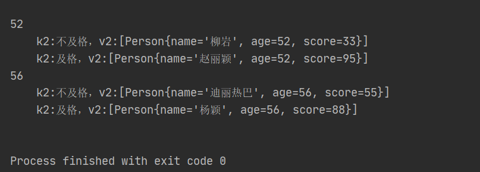

# <font color=red>一、基础</font>

---

# <font color=red>二、Java集合框架</font>

---

# <font color=red>三、JUC并发编程</font>

---

# <font color=red>四、JVM虚拟机</font>

---

# <font color=red>五、1.8新特性</font>

## <font color=green>1、Open JDK和Oracle JDK的区别</font>

Open JDK是Sun把Java开源而形成的项目。也就是说Open JDK是Java SE派台版的开源和免费实现，它由SUN和Java社区提供支持，2009年Oracle收购了Sun公司，自此Java的维护方之一的Sun也变成了Oracle。

大多数JDK都是在Open JDK的基础上进一步编写实现的。Oracle JDK是由Oracle公司开发，Oracle JDK是基于Open JDK源代码的商业版本。需要在商业许可的情况下才能使用。

## <font color=green>2、JDK1.8新特性</font>

### <font color=blue>1）Lambda表达式</font>

**1.标准格式**

```java
(参数类型 参数名称) ->{
    代码体;
}
```


**2.案例**

```java
interface TestLambda{
    void test();
}

public class Solution {
    public static void hello(TestLambda lambda){
        lambda.test();
    }


    public static void main(String[] args) {
        hello(()->{
            System.out.println("这是一个Lambda表达式");
        });
    }
}
```


**3.总结：**

Lambda表达式就是对**接口**中**抽象**方法的重写。

**4.原理**

匿名内部类在编译的时候会生成一个class文件（新的类$）

Lambda在程序过程运行时会形成一个类在类中新增一个方法，这个方法的方法体就是Lambda表岛是中的代码；还会形成一个匿名内部类，实现接口，重写抽象方法；在接口的重写方法中会调用新生成的方法。

**5.省略格式**

规则：

1. 小括号内参数的类型可以省略；
2. 如果小括号内有且仅有一个参数，则小括号可以省略；
3. 如果大括号内有且仅有一个语句，可以**<u>同时</u>**省略大括号、return关键字及语句分号；

**6.前提条件**

1. 方法的参数或变量的类型是接口；

```java
interface TestLambda{
    void test();
}

public class Solution {
    public static void main(String[] args) {
        //变量类型：
        TestLambda t = ()->{
            System.out.println("hello");
        };
    }
}
```

2. 这个接口中只能有一个抽象方法；

**7.方法引用**

- 对象名引用成员方法

```java
public static void main(String[] args){
    Date date = new Date();
    
    Supplier<Long> supplier = ()->date.getTime();
    System.out.println(supplier.get());
    
    Supplier<Long> supplier2 = date::getTime;
    System.out.println(supplier2.get());
}
```


- 类名引用静态方法

```java
public static void main(String[] args){
    Supplier<Long> supplier = ()->System.currentTimeMillis();
    System.out.println(supplier.get());

    Supplier<Long> supplier2 = System::currentTimeMillis;
    System.out.println(supplier2.get());
}
```


- 类名引用实例方法（Java面向对象中，类名只能调用静态方法，类名引用实例方法是有前提的，实际上是拿第一个参数作为方法的调用者）

```java
public static void main(String[] args){
    Function<String,Integer> f1 = (s)->{
        return s.length();
    };
    System.out.println("f1:"+f1.apply("abc"));

    Function<String,Integer> f2 = String::length;
    System.out.println("f2:"+f2.apply("abc"));
}
```


- 引用类的构造器

```java
class Person{
    private String name;
    private int age;

    public Person(){}

    public Person(String name,int age){
        this.name = name;
        this.age = age;
    }

    @Override
    public String toString() {
        return "Person{" +
                "name='" + name + '\'' +
                ", age=" + age +
                '}';
    }
}

public class Solution {

    public static void main(String[] args){
        //无参：
        Supplier<Person> supplier = ()->{ return new Person(); };
        System.out.println(supplier.get());


        Supplier<Person> supplier1 = Person::new;
        System.out.println(supplier1.get());


        //有参
        BiFunction<String,Integer,Person> biFunction = (String name,Integer age)->{return new Person(name,age);};
        Person person = biFunction.apply("小明", 14);
        System.out.println(person);

        BiFunction<String,Integer,Person> biFunction2 = Person::new;
        Person person2 = biFunction2.apply("小明", 14);
        System.out.println(person2);
    }
}
```


### <font color=blue>2）接口增强</font>

**1.默认方法（default）**

```java
interface TestLambda{
    public default void hello(){
        System.out.println("Hello");
    }
}
```


**2.静态方法（static）**

```java
interface TestLambda{
    public static void hello(){
        System.out.println("Hello");
    }
}
```


### <font color=blue>3）集合之Stream()流式操作</font>

**1.含义：**

Stream流式思想类似与工厂车间的“生产流水线”，Stream不是一种数据结构，二十对数据进行加工处理。Stream()流可以看作式流水线的一个工序。在流水线上，通过多个工序让一个原材料加工成一个商品。

**2.获取流常见的两种方式**

1. 通过Collection接口中的默认方法Stream.stream()；
2. 通过Stream接口中的静态方法。

**3.注意事项**

1. Stream只能操作一次；

```java
public static void main(String[] args){
    Stream<String> stream = Stream.of("aa","bb","cc");
    long count = stream.count();
    //将抛出异常：java.lang.IllegalStateException: stream has already been operated upon or closed
    long count2 = stream.count();
}
```


2. Stream方法返回的是新的流；

```java
public static void main(String[] args){
    Stream<String> stream = Stream.of("aa","bb","cc");
    Stream<String> limit = stream.limit(1);
    System.out.println(limit == stream);    //返回false
}
```


3. Stream不调用终结方法，中间的操作不会执行。

```java
public static void main(String[] args){
    Stream<String> stream = Stream.of("aa","bb","cc");
    //程序不会有任何输出
    stream.filter((s)->{
        System.out.println(s);
        return true;
    });
}
```


**4.常用操作**

1. foreach

```java
public static void main(String[] args){
    List<String> list = new ArrayList<>();
    Collections.addAll(list,"aa","bb","cc");
    Stream<String> stream = list.stream();
    stream.forEach(System.out::println);//等同于(s)-> System.out.println(s)
}
```


2. count

```java
public static void main(String[] args){
    List<String> list = new ArrayList<>();
    Collections.addAll(list,"aa","bb","cc");
    long count = list.stream().count();
}
```


3. filter

```java
public static void main(String[] args){
    List<String> list = new ArrayList<>();
    Collections.addAll(list,"aa","bb","cc");
    Stream<String> stream = list.stream();
    stream.filter((s)->s.length() == 2).forEach(System.out::println);//等同于(s)-> System.out.println(s)
}
```


4. limit

5. skip

6. map

```java
@Test
public void testMap() {
    Stream<String> original = Stream.of("11", "22", "33");

    // Map可以将一种类型的流转换成另一种类型的流
    // 将Stream流中的字符串转成Integer

    // original.map(s -> Integer.parseInt(s)).forEach(System.out::println);
    original.map(Integer::parseInt).forEach(System.out::println);
}
```

7. sorted

8. distinct

9. match

10. max和min

11. redure

```java
@Test
public void testReduce() {
    // T reduce(T identity, BinaryOperator<T> accumulator);
    // T identity: 默认值
    // BinaryOperator<T> accumulator: 对数据进行处理的方式
    // reduce如何执行?
    // 第一次, 将默认值赋值给x, 取出集合第一元素赋值给y
    // 第二次, 将上一次返回的结果赋值x, 取出集合第二元素赋值给y
    // 第三次, 将上一次返回的结果赋值x, 取出集合第三元素赋值给y
    // 第四次, 将上一次返回的结果赋值x, 取出集合第四元素赋值给y
    int reduce = Stream.of(4, 5, 3, 9).reduce(0, (x, y) -> {
        System.out.println("x = " + x + ", y = " + y);
        return x + y;
    });
    System.out.println("reduce = " + reduce); // 21

    // 获取最大值
    Integer max = Stream.of(4, 5, 3, 9).reduce(0, (x, y) -> {
        return x > y ? x : y;
    });
    System.out.println("max = " + max);
}
```


12. mapToInt

```java
 @Test
public void testNumericStream() {
    // Integer占用的内存比int多,在Stream流操作中会自动装箱和拆箱
    Stream<Integer> stream = Stream.of(1, 2, 3, 4, 5);
    // 把大于3的打印出来
    // stream.filter(n -> n > 3).forEach(System.out::println);

    // IntStream mapToInt(ToIntFunction<? super T> mapper);
    // IntStream: 内部操作的是int类型的数据,就可以节省内存,减少自动装箱和拆箱
    /*IntStream intStream = Stream.of(1, 2, 3, 4, 5).mapToInt((Integer n) -> {
            return n.intValue();
        });*/

    IntStream intStream = Stream.of(1, 2, 3, 4, 5).mapToInt(Integer::intValue);
    intStream.filter(n -> n > 3).forEach(System.out::println);
}
```


13. concat

```java
@Test
public void testContact() {
    Stream<String> streamA = Stream.of("张三");
    Stream<String> streamB = Stream.of("李四");

    // 合并成一个流
    Stream<String> newStream = Stream.concat(streamA, streamB);
    // 注意:合并流之后,不能操作之前的流啦.
    // streamA.forEach(System.out::println);

    newStream.forEach(System.out::println);
}
```


14. 收集Stream流中的结果到集合中

```java
@Test
public void testStreamToCollection() {
    Stream<String> stream = Stream.of("aa", "bb", "cc", "bb");

    // 将流中数据收集到集合中
    // collect收集流中的数据到集合中
    // List<String> list = stream.collect(Collectors.toList());
    // System.out.println("list = " + list);

    // Set<String> set = stream.collect(Collectors.toSet());
    // System.out.println("set = " + set);

    // 收集到指定的集合中ArrayList
    // ArrayList<String> arrayList = stream.collect(Collectors.toCollection(ArrayList::new));
    // System.out.println("arrayList = " + arrayList);
    HashSet<String> hashSet = stream.collect(Collectors.toCollection(HashSet::new));
    System.out.println("hashSet = " + hashSet);
}
```

15. 收集Stream流中的结果到数组中

```java
// 将流中数据收集到数组中
@Test
public void testStreamToArray() {
    Stream<String> stream = Stream.of("aa", "bb", "cc");

    // 转成Object数组不方便
    // Object[] objects = stream.toArray();
    // for (Object o : objects) {
    //     System.out.println("o = " + o);
    // }
    // String[]
    String[] strings = stream.toArray(String[]::new);
    for (String string : strings) {
        System.out.println("string = " + string + ", 长度: " + string.length());
    }
}
```


16. 对流中数据进行聚合计算

```java
@Test
public void testStreamToOther() {
    Stream<Student> studentStream = Stream.of(
    new Student("赵丽颖", 58, 95),
    new Student("杨颖", 56, 88),
    new Student("迪丽热巴", 56, 99),
    new Student("柳岩", 52, 77));
    
    // 获取最大值
    // Optional<Student> collect = studentStream.collect(Collectors.maxBy((o1, o2) ->
    o1.getSocre() - o2.getSocre()));
    
    // 获取最小值
    // Optional<Student> collect = studentStream.collect(Collectors.minBy((o1, o2) ->
    o1.getSocre() - o2.getSocre()));
    // System.out.println(collect.get());
    
    // 求总和
    // int sumAge = studentStream.collect(Collectors.summingInt(s -> s.getAge()));
    // System.out.println("sumAge = " + sumAge);
    
    // 平均值
    // double avgScore = studentStream.collect(Collectors.averagingInt(s -> s.getSocre()));
    // System.out.println("avgScore = " + avgScore);
    
    // 统计数量
    // Long count = studentStream.collect(Collectors.counting());
    // System.out.println("count = " + count);
}
```


17. 对流中数据进行分组

```java
// 分组
    @Test
    public void testGroup() {
        Stream<Person> studentStream = Stream.of(
                new Person("赵丽颖", 52, 95),
                new Person("杨颖", 56, 88),
                new Person("迪丽热巴", 56, 55),
                new Person("柳岩", 52, 33));

        // Map<Integer, List<Student>> map =
//        studentStream.collect(Collectors.groupingBy(Person::getAge));
        
        // 将分数大于60的分为一组,小于60分成另一组
        Map<String, List<Person>> map = studentStream.collect(Collectors.groupingBy((s) ->
        {
            if (s.getScore() > 60) {
                return "及格";
            } else {
                return "不及格";
            }
        }));
        map.forEach((k, v) -> {
            System.out.println(k + "::" + v);
        });
    }
```


18. 对流中数据进行多级分组

```java
// 多级分组
    @Test
    public void testGroup() {
        Stream<Person> stream = Stream.of(
                new Person("赵丽颖", 52, 95),
                new Person("杨颖", 56, 88),
                new Person("迪丽热巴", 56, 55),
                new Person("柳岩", 52, 33));

        // 将分数大于60的分为一组,小于60分成另一组
        Map<Integer, Map<String, List<Person>>> map = stream.collect(Collectors.groupingBy(Person::getAge, Collectors.groupingBy(s -> {
            if (s.getScore() >= 60) {
                return "及格";
            } else {
                return "不及格";
            }
        })));

        map.forEach((k,v)->{
            System.out.println(k);
            v.forEach((k2,v2)->{
                System.out.println("\t"+"k2:"+k2+"，v2:"+v2);
            });
        });
    }
```

效果：



19. 对流中数据进行分区

```java
// 分区
    @Test
    public void testPartition() {
        Stream<Person> studentStream = Stream.of(
                new Person("赵丽颖", 52, 95),
                new Person("杨颖", 56, 88),
                new Person("迪丽热巴", 56, 99),
                new Person("柳岩", 52, 77));
        // partitioningBy会根据值是否为true，把集合分割为两个列表，一个true列表，一个false列表。
        Map<Boolean, List<Person>> map = studentStream.collect(Collectors.partitioningBy(s ->
                s.getScore() > 90));
        map.forEach((k, v) -> {
            System.out.println(k + " == " + v);
        });
    }
```


20. 对流中数据进行拼接

```java
// 拼接
@Test
public void testJoining() {
    Stream<Person> studentStream = Stream.of(
        new Person("赵丽颖", 52, 95),
        new Person("杨颖", 56, 88),
        new Person("迪丽热巴", 56, 99),
        new Person("柳岩", 52, 77));
    //根据字符串拼接：赵丽颖---杨颖---迪丽热巴---柳岩
    //String collect = studentStream.map(Person::getName).collect(Collectors.joining("---"));
    String collect = studentStream
        .map(Person::getName)
        .collect(Collectors.joining(">_<", "^_^", "^v^"));
    System.out.println(collect);
}
```


### <font color=blue>4）并行数组排序</font>

### <font color=blue>5）Optional中避免NULL检查</font>

### <font color=blue>6）新的时间和日期API</font>

### <font color=blue>7）可重复注解</font>


---

# <font color=red>六、反射机制</font>