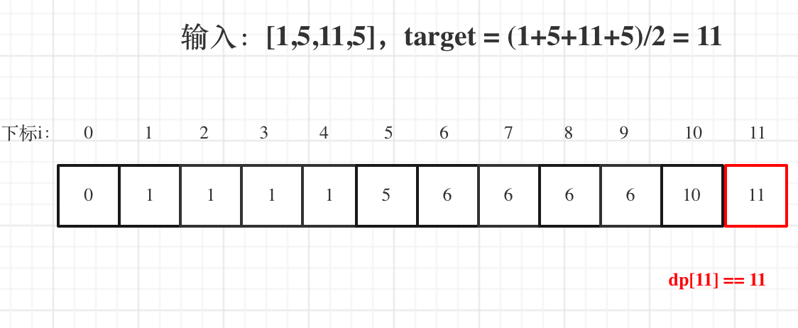
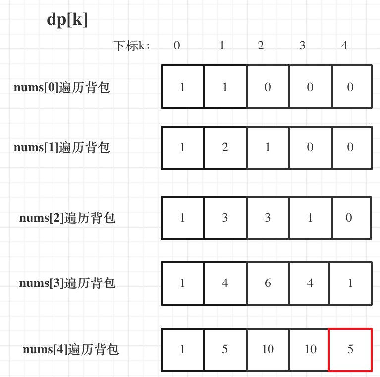

# 一、概念

动态规划，英文：Dynamic Programming，简称DP，如果某一问题有很多重叠子问题，使用动态规划是最有效的。

所以动态规划中每一个状态一定是由上一个状态推导出来的，**这一点就区分于贪心**，贪心没有状态推导，而是从局部直接选最优的。

# 二、基础题题目

## 1、[使用最小花费爬楼梯](https://leetcode-cn.com/problems/min-cost-climbing-stairs/)

### 1）题目

给你一个整数数组 cost ，其中 cost[i] 是从楼梯第 i 个台阶向上爬需要支付的费用。一旦你支付此费用，即可选择向上爬一个或者两个台阶。

你可以选择从下标为 0 或下标为 1 的台阶开始爬楼梯。

请你计算并返回达到楼梯顶部的最低花费。

示例 1：

> 输入：cost = [10,15,20]
> 输出：15
> 解释：你将从下标为 1 的台阶开始。
>
> 支付 15 ，向上爬两个台阶，到达楼梯顶部。
> 总花费为 15 。

示例 2：

> 输入：cost = [1,100,1,1,1,100,1,1,100,1]
> 输出：6
> 解释：你将从下标为 0 的台阶开始。
>
> - 支付 1 ，向上爬两个台阶，到达下标为 2 的台阶。
> - 支付 1 ，向上爬两个台阶，到达下标为 4 的台阶。
> - 支付 1 ，向上爬两个台阶，到达下标为 6 的台阶。
> - 支付 1 ，向上爬一个台阶，到达下标为 7 的台阶。
> - 支付 1 ，向上爬两个台阶，到达下标为 9 的台阶。
> - 支付 1 ，向上爬一个台阶，到达楼梯顶部。
> 总花费为 6 。
>


提示：

> 2 <= cost.length <= 1000
> 0 <= cost[i] <= 999

### 2）代码

```java
class Solution {
    public int minCostClimbingStairs(int[] cost) {
        int n = cost.length;
        int dp[] = new int[n+1];
        dp[0] = 0;
        dp[1] = 0;
        for(int i = 2; i <= n ; i ++){
            dp[i] += Math.min(dp[i-1]+cost[i-1],dp[i-2]+cost[i-2]);
        }
        return dp[n];
    }
}
```

### 3）优化

```java
class Solution {
    public int minCostClimbingStairs(int[] cost) {
        int n = cost.length;
        int pre = 0;
        int cur = 0;
        for(int i = 2; i <= n ; i ++){
            int next = Math.min(pre+cost[i-2],cur+cost[i-1]);
            pre = cur;
            cur = next;
        }
        return cur;
    }
}
```

## 2、[不同路径 II](https://leetcode-cn.com/problems/unique-paths-ii/)

### 1）题目

一个机器人位于一个 m x n 网格的左上角 （起始点在下图中标记为 “Start” ）。

机器人每次只能向下或者向右移动一步。机器人试图达到网格的右下角（在下图中标记为 “Finish”）。

现在考虑网格中有障碍物。那么从左上角到右下角将会有多少条不同的路径？

网格中的障碍物和空位置分别用 1 和 0 来表示。

示例 1：


> 输入：obstacleGrid = [[0,0,0],[0,1,0],[0,0,0]]
> 输出：2
> 解释：3x3 网格的正中间有一个障碍物。
> 从左上角到右下角一共有 2 条不同的路径：
>
> 1. 向右 -> 向右 -> 向下 -> 向下
> 2. 向下 -> 向下 -> 向右 -> 向右
>

示例 2：


> 输入：obstacleGrid = [[0,1],[0,0]]
> 输出：1


提示：

> m == obstacleGrid.length
> n == obstacleGrid[i].length
> 1 <= m, n <= 100
> obstacleGrid[i][j] 为 0 或 1

### 2）我的代码

```java
class Solution {
    public int uniquePathsWithObstacles(int[][] obstacleGrid) {
        int n = obstacleGrid.length;
        int m = obstacleGrid[0].length;
        int[][] dp = new int[n][m];
        dp[0][0] = obstacleGrid[0][0] == 1 ? 0:1;
        for(int i = 0 ; i < n ; i ++){
            for(int j = 0 ; j < m ; j ++){
                if(obstacleGrid[i][j] == 1){
                    continue;
                }
                if(i > 0 && obstacleGrid[i-1][j] != 1){
                    dp[i][j] += dp[i-1][j];
                }
                if(j > 0 && obstacleGrid[i][j-1] != 1){
                    dp[i][j] += dp[i][j-1];
                }
            }
        }
        return dp[n-1][m-1];
    }
}
```

### 3）官解

```java
class Solution {
    public int uniquePathsWithObstacles(int[][] obstacleGrid) {
        int n = obstacleGrid.length, m = obstacleGrid[0].length;
        int[] f = new int[m];

        f[0] = obstacleGrid[0][0] == 0 ? 1 : 0;
        for (int i = 0; i < n; ++i) {
            for (int j = 0; j < m; ++j) {
                if (obstacleGrid[i][j] == 1) {
                    f[j] = 0;
                    continue;
                }
                if (j - 1 >= 0 && obstacleGrid[i][j - 1] == 0) {
                    f[j] += f[j - 1];
                }
            }
        }
        
        return f[m - 1];
    }
}
```

## 3、[整数拆分](https://leetcode-cn.com/problems/integer-break/)

### 1）题目

给定一个正整数 n ，将其拆分为 k 个 正整数 的和（ k >= 2 ），并使这些整数的乘积最大化。

返回 你可以获得的最大乘积 。

示例 1:

> 输入: n = 2
> 输出: 1
> 解释: 2 = 1 + 1, 1 × 1 = 1。

示例 2:

> 输入: n = 10
> 输出: 36
> 解释: 10 = 3 + 3 + 4, 3 × 3 × 4 = 36。


提示:

> 2 <= n <= 58

### 2）解题思路

1. 确定dp数组（dp table）以及下标的含义

dp[i]：分拆数字i，可以得到的最大乘积为dp[i]。

dp[i]的定义讲贯彻整个解题过程，下面哪一步想不懂了，就想想dp[i]究竟表示的是啥！

2. 确定递推公式

可以想 dp[i]最大乘积是怎么得到的呢？

其实可以从1遍历j，然后有两种渠道得到dp[i].

- 一个是j * (i - j) 直接相乘。
- 一个是j * dp[i - j]，相当于是拆分(i - j)，对这个拆分不理解的话，可以回想dp数组的定义。

### 3）代码

```java
class Solution {
    public int integerBreak(int n) {
        int dp[] = new int[n+1];
        dp[1] = 1;
        for(int i = 2; i <= n ; i++){
            for(int j = 1; j <= i; j ++){
                dp[i] = Math.max(dp[i],Math.max(j*(i-j),j*dp[i-j]));
            }
        }
        return dp[n];
    }
}
```

# 三、背包问题

## 1、01背包问题

### 1）[01背包问题](https://www.acwing.com/problem/content/description/2/)

#### 1. 题目

有 N 件物品和一个容量是 V 的背包。每件物品只能使用一次。

第 i 件物品的体积是 vi，价值是 wi。

求解将哪些物品装入背包，可使这些物品的总体积不超过背包容量，且总价值最大。
输出最大价值。

**输入格式**

> 第一行两个整数，N，V用空格隔开，分别表示物品数量和背包容积。
>
> 接下来有 N 行，每行两个整数 vi,wi，用空格隔开，分别表示第 i 件物品的体积和价值。

**输出格式**

> 输出一个整数，表示最大价值。

**数据范围**

> 0<N,V≤1000
> 0<vi,wi≤1000

**输入样例**

> 4 5
> 1 2
> 2 4
> 3 4
> 4 5

**输出样例：**

> 8

#### 2. 代码

```java
import java.util.*;

public class Main {

    public static void main(String[] args) {
        Scanner scanner = new Scanner(System.in);
        int n = scanner.nextInt();
        int v = scanner.nextInt();
        int[] volume = new int[n + 1];
        int[] weight = new int[n + 1];
        for (int i = 1; i <= n; i++) {
            volume[i] = scanner.nextInt();
            weight[i] = scanner.nextInt();
        }
        int dp[][] = new int[n + 1][v + 1];
        for(int i = 1; i <= n; i ++){
            for(int j = 1; j <= v; j ++){
                dp[i][j] = dp[i-1][j];
                if(j >= volume[i]){
                    dp[i][j] = Math.max(dp[i-1][j],dp[i-1][j-volume[i]]+weight[i]);
                }
            }
        }
        System.out.println(dp[n][v]);
    }

}
```

#### 3. 优化(滚动数组)

```java
import java.util.*;

public class Main {

    public static void main(String[] args) {
        Scanner scanner = new Scanner(System.in);
        int n = scanner.nextInt();
        int v = scanner.nextInt();
        int[] volume = new int[n + 1];
        int[] weight = new int[n + 1];
        for (int i = 1; i <= n; i++) {
            volume[i] = scanner.nextInt();
            weight[i] = scanner.nextInt();
        }
        int dp[] = new int[v + 1];
        for(int i = 1; i <= n; i ++){
            for(int j = v; j >= volume[i]; j --){
                dp[j] = Math.max(dp[j],dp[j-volume[i]]+weight[i]);
            }
        }
        System.out.println(dp[v]);
    }

}
```

### 2）[分割等和子集](https://leetcode-cn.com/problems/partition-equal-subset-sum/)

#### 1. 题目

给你一个 只包含正整数 的 非空 数组 nums 。请你判断是否可以将这个数组分割成两个子集，使得两个子集的元素和相等。 

示例 1：

> 输入：nums = [1,5,11,5]
> 输出：true
> 解释：数组可以分割成 [1, 5, 5] 和 [11] 。

示例 2：

> 输入：nums = [1,2,3,5]
> 输出：false
> 解释：数组不能分割成两个元素和相等的子集。


提示：

> 1 <= nums.length <= 200
> 1 <= nums[i] <= 100

#### 2. 分析

1. 确定dp数组以及下标的含义

01背包中，dp[j] 表示： 容量为j的背包，所背的物品价值可以最大为dp[j]。

**套到本题，dp[j]表示 背包总容量是j，最大可以凑成j的子集总和为dp[j]**。

2. 确定递推公式

01背包的递推公式为：dp[j] = max(dp[j], dp[j - weight[i]] + value[i]);

本题，相当于背包里放入数值，那么物品i的重量是nums[i]，其价值也是nums[i]。

所以递推公式：dp[j] = max(dp[j], dp[j - nums[i]] + nums[i]);

3. dp数组如何初始化

在01背包，一维dp如何初始化，已经讲过，

从dp[j]的定义来看，首先dp[0]一定是0。

如果如果题目给的价值都是正整数那么非0下标都初始化为0就可以了，如果题目给的价值有负数，那么非0下标就要初始化为负无穷。

**这样才能让dp数组在递归公式的过程中取的最大的价值，而不是被初始值覆盖了**。



#### 3. 代码

```java
class Solution {
    public boolean canPartition(int[] nums) {
        if(nums == null || nums.length == 0) return false;
        int n = nums.length;
        int sum = 0;
        for(int num : nums){
            sum += num;
        }
        //总和为奇数，不能平分
        if(sum % 2 != 0) return false;
        int target = sum / 2;
        int[] dp = new int[target + 1];
        for(int i = 0; i < n; i++){
            for(int j = target; j >= nums[i]; j--){
                //物品 i 的重量是 nums[i]，其价值也是 nums[i]
                dp[j] = Math.max(dp[j], dp[j-nums[i]] + nums[i]);
            }
        }
        return dp[target] == target;
    }
}
```

### 3）[最后一块石头的重量 II](https://leetcode-cn.com/problems/last-stone-weight-ii/)

#### 1.题目

有一堆石头，用整数数组 stones 表示。其中 stones[i] 表示第 i 块石头的重量。

每一回合，从中选出任意两块石头，然后将它们一起粉碎。假设石头的重量分别为 x 和 y，且 x <= y。那么粉碎的可能结果如下：

如果 x == y，那么两块石头都会被完全粉碎；
如果 x != y，那么重量为 x 的石头将会完全粉碎，而重量为 y 的石头新重量为 y-x。
最后，最多只会剩下一块 石头。返回此石头 最小的可能重量 。如果没有石头剩下，就返回 0。

示例 1：

> 输入：stones = [2,7,4,1,8,1]
> 输出：1
> 解释：
> 组合 2 和 4，得到 2，所以数组转化为 [2,7,1,8,1]，
> 组合 7 和 8，得到 1，所以数组转化为 [2,1,1,1]，
> 组合 2 和 1，得到 1，所以数组转化为 [1,1,1]，
> 组合 1 和 1，得到 0，所以数组转化为 [1]，这就是最优值。

示例 2：

> 输入：stones = [31,26,33,21,40]
> 输出：5

示例 3：

> 输入：stones = [1,2]
> 输出：1


提示：

> 1 <= stones.length <= 30
> 1 <= stones[i] <= 100

#### 2.代码

```java
class Solution {
    public int lastStoneWeightII(int[] stones) {
        int n = stones.length, sum = 0;
        for(int stone : stones){
            sum += stone;
        }
        int target = sum / 2;
        int dp[] = new int[target+1];
        for(int i = 0 ; i < n; i ++){
            for(int j = target; j >= stones[i]; j--){
                dp[j] = Math.max(dp[j],dp[j-stones[i]]+stones[i]);
            }
        }
        return sum - 2 * dp[target];
    }
}
```

### 4）[目标和](https://leetcode-cn.com/problems/target-sum/)

#### 1. 题目

给你一个整数数组 nums 和一个整数 target 。

向数组中的每个整数前添加 '+' 或 '-' ，然后串联起所有整数，可以构造一个 表达式 ：

例如，nums = [2, 1] ，可以在 2 之前添加 '+' ，在 1 之前添加 '-' ，然后串联起来得到表达式 "+2-1" 。
返回可以通过上述方法构造的、运算结果等于 target 的不同 表达式 的数目。

示例 1：

> 输入：nums = [1,1,1,1,1], target = 3
> 输出：5
> 解释：一共有 5 种方法让最终目标和为 3 。
> -1 + 1 + 1 + 1 + 1 = 3
> +1 - 1 + 1 + 1 + 1 = 3
> +1 + 1 - 1 + 1 + 1 = 3
> +1 + 1 + 1 - 1 + 1 = 3
> +1 + 1 + 1 + 1 - 1 = 3

示例 2：

> 输入：nums = [1], target = 1
> 输出：1


提示：

> 1 <= nums.length <= 20
> 0 <= nums[i] <= 1000
> 0 <= sum(nums[i]) <= 1000
> -1000 <= target <= 1000

#### 2. 思路

本题要如何使表达式结果为target，

既然为target，那么就一定有 left组合 - right组合 = target。

left + right等于sum，而sum是固定的。

公式来了， left - (sum - left) = target -> left = (target + sum)/2 。

target是固定的，sum是固定的，left就可以求出来。

此时问题就是在集合nums中找出和为left的组合。

例如：dp[j]，j 为5，

- 已经有一个1（nums[i]） 的话，有 dp[4]种方法 凑成 dp[5]。
- 已经有一个2（nums[i]） 的话，有 dp[3]种方法 凑成 dp[5]。
- 已经有一个3（nums[i]） 的话，有 dp[2]中方法 凑成 dp[5]
- 已经有一个4（nums[i]） 的话，有 dp[1]中方法 凑成 dp[5]
- 已经有一个5 （nums[i]）的话，有 dp[0]中方法 凑成 dp[5]

那么凑整dp[5]有多少方法呢，也就是把 所有的 dp[j - nums[i]] 累加起来。



#### 3. 动归代码

```java
class Solution {
    public int findTargetSumWays(int[] nums, int target) {
        int sum = 0;
        for(int num : nums){
            sum += num;
        }
        if((target+sum) % 2 !=0){
            return 0;
        }
        int x = (target+sum)/2;
        if(x < 0) x = -x;
        int dp[] = new int[x+1];
        dp[0] = 1;
        for(int i = 0; i < nums.length; i ++){
            for(int j = x; j >= nums[i]; j --){
                dp[j] += dp[j-nums[i]];
            }
        }
        return dp[x];
    }
}
```

#### 4. 回溯代码

```java
class Solution {
    int count = 0;

    public int findTargetSumWays(int[] nums, int target) {
        dfs(nums,0,0,target);
        return count;
    }

    private void dfs(int[] nums,int sum , int index,int target){
        if(index == nums.length){
            if(sum == target){
                count++;
            }
        }else{
            dfs(nums,sum+nums[index],index+1,target);
            dfs(nums,sum-nums[index],index+1,target);
        }
    }
}
```

### 5）[一和零](https://leetcode-cn.com/problems/ones-and-zeroes/)

#### 1. 题目

给你一个二进制字符串数组 strs 和两个整数 m 和 n 。

请你找出并返回 strs 的最大子集的长度，该子集中 最多 有 m 个 0 和 n 个 1 。

如果 x 的所有元素也是 y 的元素，集合 x 是集合 y 的 子集 。

示例 1：

> 输入：strs = ["10", "0001", "111001", "1", "0"], m = 5, n = 3
> 输出：4
> 解释：最多有 5 个 0 和 3 个 1 的最大子集是 {"10","0001","1","0"} ，因此答案是 4 。
> 其他满足题意但较小的子集包括 {"0001","1"} 和 {"10","1","0"} 。{"111001"} 不满足题意，因为它含 4 个 1 ，大于 n 的值 3 。

示例 2：

> 输入：strs = ["10", "0", "1"], m = 1, n = 1
> 输出：2
> 解释：最大的子集是 {"0", "1"} ，所以答案是 2 。


提示：

> 1 <= strs.length <= 600
> 1 <= strs[i].length <= 100
> strs[i] 仅由 '0' 和 '1' 组成
> 1 <= m, n <= 100

#### 2. 思路

这道题和经典的背包问题非常相似，但是和经典的背包问题只有一种容量不同，这道题有两种容量，即选取的字符串子集中的 00 和 11 的数量上限。

经典的背包问题可以使用二维动态规划求解，两个维度分别是物品和容量。这道题有两种容量，因此需要使用三维动态规划求解，三个维度分别是字符串、00 的容量和 11 的容量。

定义三维数组 \textit{dp}dp，其中 \textit{dp}[i][j][k]dp[i][j][k] 表示在前 ii 个字符串中，使用 jj 个 00 和 kk 个 11 的情况下最多可以得到的字符串数量。假设数组 \textit{str}str 的长度为 ll，则最终答案为 \textit{dp}[l][m][n]dp[l][m][n]。

#### 3. 代码

```java
class Solution {
    public int findMaxForm(String[] strs, int m, int n) {
        int length = strs.length;
        int[][][] dp = new int[length + 1][m + 1][n + 1];
        for (int i = 1; i <= length; i++) {
            int[] zerosOnes = getZerosOnes(strs[i - 1]);
            int zeros = zerosOnes[0], ones = zerosOnes[1];
            for (int j = 0; j <= m; j++) {
                for (int k = 0; k <= n; k++) {
                    dp[i][j][k] = dp[i - 1][j][k];
                    if (j >= zeros && k >= ones) {
                        dp[i][j][k] = Math.max(dp[i][j][k], dp[i - 1][j - zeros][k - ones] + 1);
                    }
                }
            }
        }
        return dp[length][m][n];
    }

    public int[] getZerosOnes(String str) {
        int[] zerosOnes = new int[2];
        int length = str.length();
        for (int i = 0; i < length; i++) {
            zerosOnes[str.charAt(i) - '0']++;
        }
        return zerosOnes;
    }
}

```

#### 4. 优化

```java
class Solution {
    public int findMaxForm(String[] strs, int m, int n) {
        int[][] dp = new int[m + 1][n + 1];
        int length = strs.length;
        for (int i = 0; i < length; i++) {
            int[] zerosOnes = getZerosOnes(strs[i]);
            int zeros = zerosOnes[0], ones = zerosOnes[1];
            for (int j = m; j >= zeros; j--) {
                for (int k = n; k >= ones; k--) {
                    dp[j][k] = Math.max(dp[j][k], dp[j - zeros][k - ones] + 1);
                }
            }
        }
        return dp[m][n];
    }

    public int[] getZerosOnes(String str) {
        int[] zerosOnes = new int[2];
        int length = str.length();
        for (int i = 0; i < length; i++) {
            zerosOnes[str.charAt(i) - '0']++;
        }
        return zerosOnes;
    }
}
```


## 2、完全背包问题

# 四、打家劫舍

# 五、股票问题

# 六、子序列问题