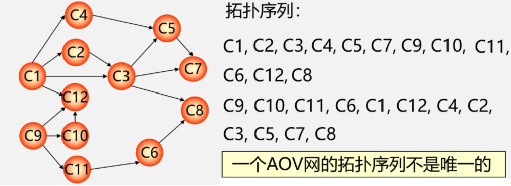

# 一、拓扑排序

## 1、基本概念

### 1） AOV是什么

在一个表示工程的有向图中，用顶点表示活动，用弧表示活动之间的优先关系，这样的有向图为顶点表示活动的网，我们称为AOV网（Activity On Vertex Network）。

### 2） 拓扑排序是什么

在AOV网没有回路的前提下，我们将全部活动排列成一个线性序列，使得若AOV网中有弧<i,j>存在，贝刂在这个序列中，i一定排在j的前面，具有这种性质的线性序列称为拓扑有序序列，相应的拓扑有序排序的算法称为拓扑排序。

### 3）过程

1. 在有向图中选一个没有前驱的顶点且输出；
2. 从图中删除该节点和所有以它为尾的弧；
3. 重复上述两步，直至全部顶点均已输出；或者当图中不存在无前驱的顶点为止。



### 4）应用

拓扑排序可以用来检测有向图中是否存在环。

（对有向图构造其顶点的拓扑有序序列，若网中所有顶点都在拓扑有序序列中，则该有向图必定不存在环）

## 2、例题

[207. 课程表](https://leetcode-cn.com/problems/course-schedule/)

### 1）题目

你这个学期必须选修 numCourses 门课程，记为 0 到 numCourses - 1 。

在选修某些课程之前需要一些先修课程。 先修课程按数组 prerequisites 给出，其中 prerequisites[i] = [ai, bi] ，表示如果要学习课程 ai 则 必须 先学习课程  bi 。

例如，先修课程对 [0, 1] 表示：想要学习课程 0 ，你需要先完成课程 1 。
请你判断是否可能完成所有课程的学习？如果可以，返回 true ；否则，返回 false 。

示例 1：

> 输入：numCourses = 2, prerequisites = [[1,0]]
> 输出：true
> 解释：总共有 2 门课程。学习课程 1 之前，你需要完成课程 0 。这是可能的。

示例 2：

> 输入：numCourses = 2, prerequisites = [[1,0],[0,1]]
> 输出：false
> 解释：总共有 2 门课程。学习课程 1 之前，你需要先完成课程 0 ；并且学习课程 0 之前，你还应先完成课程 1 。这是不可能的。


提示：

> 1 <= numCourses <= 105
> 0 <= prerequisites.length <= 5000
> prerequisites[i].length == 2
> 0 <= ai, bi < numCourses
> prerequisites[i] 中的所有课程对 互不相同

### 2）思路

我们使用一个队列来进行广度优先搜索。初始时，所有入度为 00 的节点都被放入队列中，它们就是可以作为拓扑排序最前面的节点，并且它们之间的相对顺序是无关紧要的。

在广度优先搜索的每一步中，我们取出队首的节点 u：

我们将 u 放入答案中；

我们移除 u 的所有出边，也就是将 uu 的所有相邻节点的入度减少 1。如果某个相邻节点 v 的入度变为 0，那么我们就将 v 放入队列中。

在广度优先搜索的过程结束后。如果答案中包含了这 n 个节点，那么我们就找到了一种拓扑排序，否则说明图中存在环，也就不存在拓扑排序了。

由于我们只需要判断是否存在一种拓扑排序，因此我们省去存放答案数组，而是只用一个变量记录被放入答案数组的节点个数。在广度优先搜索结束之后，我们判断该变量的值是否等于课程数，就能知道是否存在一种拓扑排序。

### 3）代码

```java
class Solution {
    public boolean canFinish(int numCourses, int[][] prerequisites) {
        //注意：因为题目说科目是 0 到 numCourses - 1，否则需要用Map<Integer,List<Integer>>
        List<List<Integer>> edges = new ArrayList();
        int in[] = new int[numCourses];
        for(int i = 0 ; i < numCourses; i ++){
            edges.add(new ArrayList());
        }
        for(int[] info : prerequisites){
            edges.get(info[1]).add(info[0]);
            in[info[0]]++;
        }
        Queue<Integer> queue = new LinkedList();
        for(int i = 0 ; i < numCourses; i ++){
            if(in[i] == 0){
                queue.offer(i);
            }
        }
        int canLearn = 0;
        while(!queue.isEmpty()){
            int learn = queue.poll();
            canLearn ++;
            for(int will : edges.get(learn)){
                in[will] --;
                if(in[will] == 0){
                    queue.offer(will);
                }
            }
        }
        return canLearn == numCourses;
    }

}
```


