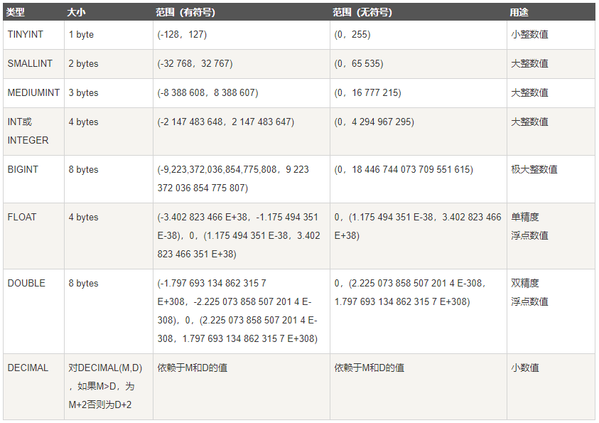
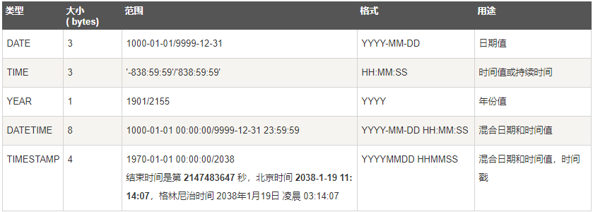
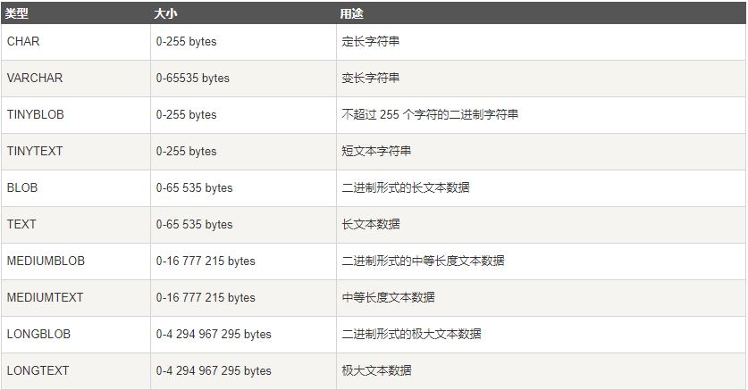
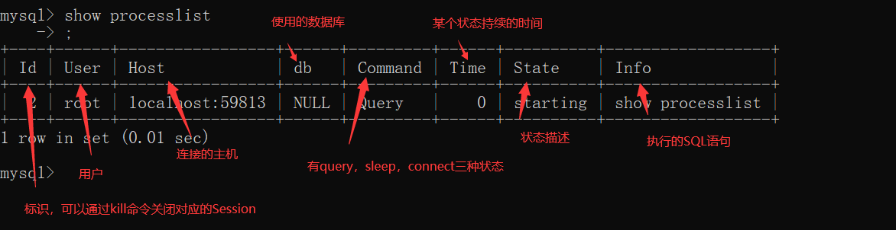

# 一、基础知识

## 1、为什么要使用数据库

**数据保存在内存**

优点： 存取速度快

缺点： 数据不能永久保存

**数据保存在文件**

优点： 数据永久保存

缺点：1）速度比内存操作慢，频繁的IO操作。2）查询数据不方便

**数据保存在数据库**

1）数据永久保存

2）使用SQL语句，查询方便效率高。

3）管理数据方便

## 2、什么是SQL

结构化查询语言(Structured Query Language)简称SQL，是一种数据库查询语言。

## 3、SQL语句主要分类

- 数据定义语言DDL（Data Ddefinition Language）CREATE，DROP，ALTER；
- 数据查询语言DQL（Data Query Language）SELECT；
- 数据操纵语言DML（Data Manipulation Language）INSERT，UPDATE，DELETE；
- 数据控制功能DCL（Data Control Language）GRANT，REVOKE，COMMIT，ROLLBACK。

## 4、什么是mysql

MySQL是一个关系型数据库管理系统属于 Oracle 旗下产品。MySQL 是最流行的关系型数据库管理系统之一，在 WEB 应用方面，MySQL是最好的 RDBMS (Relational Database Management System，关系数据库管理系统) 应用软件之一。在Java企业级开发中非常常用，因为 MySQL 是**开源免费**的，并且方便扩展。

## 5、关系查询

### 1）交叉连接

笛卡尔积；

### 2）内连接

等值连接：ON A.id=B.id；
不等值连接：ON A.id > B.id；
自连接：SELECT * FROM A T1 INNER JOIN A T2 ON T1.id=T2.pid。

### 3）外连接

左外连接：LEFT OUTER JOIN, 以左表为主，先查询出左表，按照ON后的关联条件匹配右表，没有匹配到的用NULL填充，可以简写成LEFT JOIN；
右外连接：RIGHT OUTER JOIN, 以右表为主，先查询出右表，按照ON后的关联条件匹配左表，没有匹配到的用NULL填充，可以简写成RIGHT JOIN。

### 4）联合查询

SELECT * FROM A UNION SELECT * FROM B UNION ...
把多个结果集集中在一起，UNION前的结果为基准，需要注意的是联合查询的列数要相等，相同的记录行会合并，如果使用UNION ALL，不会合并重复的记录行，效率 UNION ALL高于 UNION

### 5）全连接

MySQL不支持。连接，可以使用LEFT JOIN 和UNION和RIGHT JOIN联合使用。

> 有2张表，1张R、1张S，R表有ABC三列，S表有CD两列，表中各有三条记录。
>
> R表
>
> | A    | B    | C    |
> | ---- | ---- | ---- |
> | a1   | b1   | c1   |
> | a2   | b2   | c2   |
> | a3   | b3   | c3   |
>
> S表
>
> | C    | D    |
> | ---- | ---- |
> | c1   | d1   |
> | c2   | d2   |
> | c4   | d3   |
>
> 1. 交叉连接(笛卡尔积):
>
>    select r.`*`,s.`*` from r,s
>
>    | A    | B    | C    | C    | D    |
>    | ---- | ---- | ---- | ---- | ---- |
>    | a1   | b1   | c1   | c1   | d1   |
>    | a2   | b2   | c2   | c1   | d1   |
>    | a3   | b3   | c3   | c1   | d1   |
>    | a1   | b1   | c1   | c2   | d2   |
>    | a2   | b2   | c2   | c2   | d2   |
>    | a3   | b3   | c3   | c2   | d2   |
>    | a1   | b1   | c1   | c4   | d3   |
>    | a2   | b2   | c2   | c4   | d3   |
>    | a3   | b3   | c3   | c4   | d3   |
>
> 2. 内连接结果：
>
>    select r.`*`,s.`*` from r inner join s on r.c=s.c
>
>    | A    | B    | C    | C    | D    |
>    | ---- | ---- | ---- | ---- | ---- |
>    | a1   | b1   | c1   | c1   | d1   |
>    | a2   | b2   | c2   | c2   | d2   |
>
> 3. 左连接结果：
>
>    select r.`*`,s.`*` from r left join s on r.c=s.c
>
>    | A    | B    | C    | C    | D    |
>    | ---- | ---- | ---- | ---- | ---- |
>    | a1   | b1   | c1   | c1   | d1   |
>    | a2   | b2   | c2   | c2   | d2   |
>    | a3   | b3   | c3   |      |      |
>
> 4. 右连接结果：
>
>    select r.`*`,s.`*` from r right join s on r.c=s.c
>
>    | A    | B    | C    | C    | D    |
>    | ---- | ---- | ---- | ---- | ---- |
>    | a1   | b1   | c1   | c1   | d1   |
>    | a2   | b2   | c2   | c2   | d2   |
>    |      |      |      | c4   | d3   |
>
> 5. 全表连接的结果（MySql不支持，Oracle支持）：
>
>    select r.`*`,s.`*` from r full join s on r.c=s.c
>
>    | A    | B    | C    | C    | D    |
>    | ---- | ---- | ---- | ---- | ---- |
>    | a1   | b1   | c1   | c1   | d1   |
>    | a2   | b2   | c2   | c2   | d2   |
>    | a3   | b3   | c3   |      |      |
>    |      |      |      | c4   | d3   |

## 6、子查询

**1）含义：**
一条SQL语句的查询结果做为另一条查询语句的条件或查询结果。
**2）分类**：
子查询是单行单列的情况：结果集是一个值，父查询使用：=、 <、 > 等运算符；
子查询是多行单列的情况：结果集类似于一个数组，父查询使用：in 运算符；
子查询是多行多列的情况：结果集类似于一张虚拟表，不能用于where条件，用于select子句中做为子表。

## 7、常见面试题

### 1）in 和 exists 区别

IN
适合外部表数据大于子查询的表数据的业务场景；
先查询 in()子查询的数据(1次)，并且将数据放进内存里(不需要多次查询),然后外部查询的表再根据查询的结果进行查询过滤,最后返回结果。
EXIST
适合子查询中表数据大于外查询表中数据的业务场景
先执行外部查询语句，然后在执行子查询，子查询中它每次都会去执行数据库的查询，执行次数等于外查询的数据数量。

### 2）varchar与char的区别

定长与变长
char 表示定长，长度固定，varchar表示变长，即长度可变。char如果插入的长度小于定义长度时，则用空格填充；varchar小于定义长度时，还是按实际长度存储，插入多长就存多长。因为其长度固定，char的存取速度还是要比varchar要快得多，方便程序的存储与查找；但是char也为此付出的是空间的代价，因为其长度固定，所以会占据多余的空间，可谓是以空间换取时间效率。varchar则刚好相反，以时间换空间。
存储的容量不同
对 char 来说，最多能存放的字符个数 255，和编码无关。
而 varchar 呢，最多能存放 65532 个字符。varchar的最大有效长度由最大行大小和使用的字符集确定。整体最大长度是 65,532字节。
总之，结合性能角度（char更快）和节省磁盘空间角度（varchar更小），具体情况还需具体来设计数据库才是妥当的做法。

### 3）varchar(50)中50的涵义

最多存放50个字符，varchar(50)和(200)存储hello所占空间一样，但后者在排序时会消耗更多内存，因为order by col采用fixed_length计算col长度(memory引擎也一样)。在早期 MySQL 版本中， 50 代表字节数，现在代表字符数。

### 4）int(20)中20的涵义

是指显示字符的长度。20表示最大显示宽度为20，但仍占4字节存储，存储范围不变；
不影响内部存储，只是影响带 zerofill 定义的 int 时，前面补多少个 0，易于报表展示

### 5）count(字段)，count(主键id)，count(1)，count(*)的区别

**count(可空字段)**

扫描全表，读到server层，判断字段可空，拿出该字段所有值，判断每一个值是否为空，不为空则累加。

**count(非空字段)与count(主键 id)**

扫描全表，读到server层，判断字段不可空，按行累加。

**count(1)**

扫描全表，但不取值，server层收到的每一行都是1，判断不可能是null，按值累加。
注意：count(1)执行速度比count(主键 id)快的原因：从引擎返回 id 会涉及到解析数据行，以及拷贝字段值的操作。

**count(\*)**

MySQL 执行count(\*)在优化器做了专门优化。因为count(*)返回的行一定不是空。扫描全表，但是不取值，按行累加。

> 性能对比结论
> count(可空字段) < count(非空字段) = count(主键 id) < count(1) ≈ count(*)

# 二、数据类型

## 1、数值类型：

## 2、日期事件类型：

## 3、字符串类型：

# 三、存储引擎

## 1、MYISAM引擎

是MySql的ISAM扩展格式（强调快速读取操作）

适用条件：

- 筛选大量数据的表：MyISAM存储引擎再筛选大量数据时非常迅速；
- 一次性插入大量数据的表：MyISAM的并发插入特性允许同时选择和插入数据；

缺点：

- 不支持事务和行级锁，崩溃后无法安全恢复；
- 无法处理事务，有事务处理需求的表不适用；

## 2、Innodb引擎

Innodb引擎提供了对数据库ACID事务的支持。并且还提供了行级锁和外键的约束。它的设计的目标就是处理大数据容量的数据库系统。

优点

- 更新密集的表：适合处理多重并发的更新请求；
- 支持事务；

- 自动灾难恢复；
- 外键约束（mysql支持外键的引擎只有InnoDB）
- 支持自动增加列AUTO_INCREMENT属性；

缺点

与MYISAM引擎比，InnoDB写的处理效率差一些并且会占用更多的磁盘空间，以保留数据和索引。

> MYISAM引擎与Innodb引擎的区别：
>
> InnoDB索引是聚簇索引，MyISAM索引是非聚簇索引。
>
> InnoDB的主键索引的叶子节点存储着行数据，因此主键索引非常高效。
>
> MyISAM索引的叶子节点存储的是行数据地址，需要再寻址一次才能得到数据。
>
> MyISAM不支持外键，而只有InnoDB引擎支持外键。
>
> InnoDB支持事务，而MyISAM不支持。
>
> InnoDB可以设置自增列，而MyISAM没有这个功能。
>
> MyISAM由于保存了整个表记录的总数量，使用不带条件的count(*)速度非常快，而InnoDB并没有保存数据的总数量，计算总数量时比MyISAM慢。

## 3、Memory引擎

所有的数据都在内存中，数据的处理速度快，但是安全性不高。

适用条件：

- 目标数据较小，而且被频繁地访问；
- 数据时是临时的，而且要求必须立即使用；
- 存储在Memory表中的数据如果突然丢失，不会对应用服务产生实质的负面影响；

缺点

Memory表是表级锁，因此并发写入的性能较低，不支持BLOG或Text类型的列（varchar是一种长度可变的类型，但因为它在MySql内部当作长度固定不变的char类型），并且每行的长度是固定的，可能导致部分内存的浪费

# 四、索引

## 1、什么是索引

索引是一种数据结构。数据库索引，是数据库管理系统中一个排序的数据结构，以协助快速查询、更新数据库表中数据。

索引是一种特殊的文件(InnoDB数据表上的索引是表空间的一个组成部分)，它们包含着对数据表里所有记录的引用指针，

它是要占据物理空间的。

（更通俗的说，索引就相当于目录。为了方便查找书中的内容，通过对内容建立索引形成目录。）

## 2、索引有哪些优缺点

优点

可以大大加快数据的检索速度；
通过使用索引，可以在查询的过程中，使用优化隐藏器，提高系统的性能。

缺点

时间方面：创建索引和维护索引要耗费时间，具体地，当对表进行增删改时，索引也要动态维护，会降低增删改的执行效率；

空间方面：索引需要占用额外的磁盘空间。

## 3、索引有哪些类型

- 主键索引：数据列不允许重复，不允许为NULL，一个表只能有一个主键。
- 唯一索引：数据列不允许重复，允许为NULL值，一个表允许多个列创建唯一索引。
- 普通索引：基本的索引类型，没有唯一性的限制，允许为NULL值。
- 全文索引：是目前搜索引擎使用的一种关键技术。

## 4、索引的数据结构

B+树

Hash索引

## 5、什么是最左前缀原则？什么是最左匹配原则

顾名思义，就是最左优先，在创建多列索引时，要根据业务需求，where子句中使用最频繁的一列放在最左边。

最左前缀匹配原则，非常重要的原则，mysql会一直向右匹配直到遇到范围查询(>、<、between、like)就停止匹配，比如a = 1 and b = 2 and c > 3 and d = 4 如果建立(a,b,c,d)顺序的索引，d是用不到索引的，如果建立(a,b,d,c)的索引则都可以用到，a,b,d的顺序可以任意调整。

=和in可以乱序，比如a = 1 and b = 2 and c = 3 建立(a,b,c)索引可以任意顺序，mysql的查询优化器会帮你优化成索引可以识别的形式

## 6、B树和B+树的区别

在B树中，你可以将键和值存放在内部节点和叶子节点；但在B+树中，内部节点都是键，没有值，叶子节点同时存放键和值。

B+树的叶子节点有一条链相连，而B树的叶子节点各自独立。

## 7、mysql为什么没有使用二叉树

极端情况下可能出现“线性链表结构”，若寻找叶子节点时就相当于全表扫描了，性能急剧下降。

##  8、mysql为什么没有使用平衡树

1. 搜索效率不足。一般来说，在树结构中，数据所处的深度，决定了搜索时的IO次数（MySql中将每个节点大小设置为一页大小，一次IO读取一页 / 一个节点）。
2. 查询不不稳定。如果查询的数据落在根节点，只需要一次IO，如果是叶子节点或者是支节点，会需要多次IO才可以。
3. 存储的数据内容太少。没有很好利用操作系统和磁盘数据交换特性，也没有利用好磁盘IO的预读能力。因为操作系统和磁盘之间一次数据交换是以页为单位的，一页大小为 4K，即每次IO操作系统会将4K数据加载进内存。但是，在二叉树每个节点的结构只保存一个关键字，一个数据区，两个子节点的引用，并不能够填满4K的内容。幸幸苦苦做了一次的IO操作，却只加载了一个关键字。在树的高度很高，恰好又搜索的关键字位于叶子节点或者支节点的时候，取一个关键字要做很多次的IO。

## 9、mysql为什么使用B+树而不是B树

1. B树只适合随机检索，而B+树同时支持随机检索和顺序检索
   B树在提高了磁盘IO性能的同时并没有解决元素遍历的效率低下的问题。B+树的叶子节点使用指针顺序连接在一起，只要遍历叶子节点就可以实现整棵树的遍历。而且在数据库中基于范围的查询是非常频繁的，而B树不支持这样的操作。
2. B+树空间利用率更高，可减少I/O次数，磁盘读写代价更低。
   一般来说，索引本身也很大，不可能全部存储在内存中，因此索引往往以索引文件的形式存储的磁盘上。这样的话，索引查找过程中就要产生磁盘I/O消耗。B+树的内部结点并没有指向关键字具体信息的指针，只是作为索引使用，其内部结点比B树小，盘块能容纳的结点中关键字数量更多，一次性读入内存中可以查找的关键字也就越多，相对的，IO读写次数也就降低了。而IO读写次数是影响索引检索效率的最大因素。
3. B+树的查询效率更加稳定。
   B树搜索有可能会在非叶子结点结束，越靠近根节点的记录查找时间越短，只要找到关键字即可确定记录的存在，其性能等价于在关键字全集内做一次二分查找。而在B+树中，顺序检索比较明显，随机检索时，任何关键字的查找都必须走一条从根节点到叶节点的路，所有关键字的查找路径长度相同，导致每一个关键字的查询效率相当。

## 10、Hash索引和B+树索引的区别

1）底层原理：

hash索引的底层原理就是hash表，进行查找时，调用一次hash函数就可以获取相应的键值，之后进行回表查询获得实际数据。

B+树底层实现是多路平衡查找树。对于每一次的查询都是从根节点出发，查找到叶子节点方可以获得所查键值，然后根据查询判断是否需要回表查询数据。

2）hash索引进行等值查询更快(一般情况下)，但是却无法进行范围查询。

因为在hash索引中经过hash函数建立索引之后，索引的顺序与原顺序无法保持一致，不能支持范围查询。而B+树的的所有节点皆遵循(左节点小于父节点，右节点大于父节点，多叉树也类似)，天然支持范围。

3）hash索引不支持使用索引进行排序，原理同上。

4）hash索引不支持模糊查询以及多列索引的最左前缀匹配。原理也是因为hash函数的不可预测。

5）hash索引任何时候都避免不了回表查询数据，而B+树在符合某些条件(聚簇索引，覆盖索引等)的时候可以只通过索引完成查询。

6）hash索引虽然在等值查询上较快，但是不稳定。性能不可预测，当某个键值存在大量重复的时候，发生hash碰撞，此时效率可能极差。而B+树的查询效率比较稳定，对于所有的查询都是从根节点到叶子节点，且树的高度较低。

## 11、覆盖索引

1）含义：

需要查询的字段正好是索引的字段，那么直接根据该索引，就可以查到数据了， 而无需回表查询。

2）面试题：

为什么sql中要求尽量不要使用select *，而要写明具体要查询的字段。

其中一个原因就是在使用到覆盖索引的情况下，不需要进入到数据区，数据就能直接返回，提升了查询效率。在用不到覆盖索引的情况下，也尽可能的不要使用select *，如果行数据量特别多的情况下，可以减少数据的网络传输量。当然，这都视具体情况而定，通过select返回所有的字段，通用性会更强，一切有利必有弊。

## 12、创建索引的原则

1）列的离散型

离散型的计算公式：count(distinct column_name):count(*)，就是用去重后的列值个数比个数。值在 (0,1] 范围内。离散型越高，选择型越好。

2）最左匹配原则

对于索引中的关键字进行对比的时候，一定是从左往右以此对比，且不可跳过。

3）最少空间原则

当关键字占用的空间越小，则每个节点保存的关键字个数就越多，每次加载进内存的关键字个数就越多，检索效率就越高。创建索引的关键字要尽可能占用空间小。

4）联合索引

尽可能的考虑建立联合索引而不是单列索引。因为索引是需要占用磁盘空间的，可以简单理解为每个索引都对应着一颗 B+树。如果一个表的字段过多，索引过多，那么当这个表的数据达到一个体量后，索引占用的空间也是很多的，且修改索引时，耗费的时间也是较多的。如果是联合索引，多个字段在一个索引上，那么将会节约很大磁盘空间，且修改数据的操作效率也会提升。

> 联合索引列的选择原则
>
> 经常用的列优先（最左匹配原则）
>
> 离散度高的列优先（离散度高原则）
>
> 宽度小的列优先（最少空间原则）

# 五、事务

## 1、什么是数据库事务

事务是一个不可分割的数据库操作序列，也是数据库并发控制的基本单位，其执行的结果必须使数据库从一种一致性状态变到另一种一致性状态。事务是逻辑上的一组操作，要么都执行，要么都不执行。

## 2、事务的四大特性(ACID)

- 原子性： 事务是最小的执行单位，不允许分割。事务的原子性确保动作要么全部完成，要么完全不起作用；
- 一致性： 执行事务前后，数据保持一致，多个事务对同一个数据读取的结果是相同的；
- 隔离性： 并发访问数据库时，一个用户的事务不被其他事务所干扰，各并发事务之间数据库是独立的；
- 持久性： 一个事务被提交之后。它对数据库中数据的改变是持久的，即使数据库发生故障也不应该对其有任何影响。

## 3、什么是脏读？幻读？不可重复读？

### 1）脏读

含义

脏读就是指当一个事务正在访问数据，并且对数据进行了修改，而这种修改还没有提交到数据库中，这时，另外一个事务也访问这个数据，然后使用了这个数据。

举例

张三的工资为5000,事务A中把他的工资改为8000,但事务A尚未提交。
与此同时，事务B正在读取张三的工资，读取到张三的工资为8000。
随后，事务A发生异常，而回滚了事务。张三的工资又回滚为5000。
最后，事务B读取到的张三工资为8000的数据即为脏数据，事务B做了一次脏读。

### 2）不可重复读

含义

在一个事务的两次查询之中数据不一致，这可能是两次查询过程中间插入了一个事务更新的原有的数据。

举例

在事务A中，读取到张三的工资为5000，操作没有完成，事务还没提交。
与此同时，事务B把张三的工资改为8000，并提交了事务。
随后，在事务A中，再次读取张三的工资，此时工资变为8000。在一个事务中前后两次读取的结果并不一致，导致了不可重复读。

### 3）幻读

含义

是指当事务不是独立执行时发生的一种现象，例如第一个事务对一个表中的数据进行了修改，这种修改涉及到表中的全部数据行。同时，第二个事务也修改这个表中的数据，这种修改是向表中插入一行新数据。那么，以后就会发生操作第一个事务的用户发现表中还有没有修改的数据行，就好象发生了幻觉一样。

举例

目前工资为5000的员工有10人，事务A读取所有工资为5000的人数为10人。
此时，事务B插入一条工资也为5000的记录。
这时，事务A再次读取工资为5000的员工，记录为11人。此时产生了幻读。

## 4、什么是事务的隔离级别？

### 1）READ-UNCOMMITTED(读取未提交)

最低的隔离级别，允许读取尚未提交的数据变更，可能会导致脏读、幻读或不可重复读。

### 2）READ-COMMITTED(读取已提交)

允许读取并发事务已经提交的数据，可以阻止脏读，但是幻读或不可重复读仍有可能发生。

### 3）REPEATABLE-READ(可重复读)

对同一字段的多次读取结果都是一致的，除非数据是被本身事务自己所修改，可以阻止脏读和不可重复读，但幻读仍有可能发生。

### 4）SERIALIZABLE(可串行化)

最高的隔离级别，完全服从ACID的隔离级别。所有的事务依次逐个执行，这样事务之间就完全不可能产生干扰，也就是说，该级别可以防止脏读、不可重复读以及幻读。

# 六、锁

## 1、隔离级别与锁的关系

在Read Uncommitted级别下，读取数据不需要加共享锁，这样就不会跟被修改的数据上的排他锁冲突；

在Read Committed级别下，读操作需要加共享锁，但是在语句执行完以后释放共享锁；

在Repeatable Read级别下，读操作需要加共享锁，但是在事务提交之前并不释放共享锁，也就是必须等待事务执行完毕以后才释放共享锁。

SERIALIZABLE 是限制性最强的隔离级别，因为该级别锁定整个范围的键，并一直持有锁，直到事务完成。

## 2、按照锁的粒度分数据库锁有哪些

### 1）行级锁

含义

行级锁是Mysql中锁定粒度最细的一种锁，表示只针对当前操作的行进行加锁。行级锁能大大减少数据库操作的冲突。其加锁粒度最小，但加锁的开销也最大。行级锁分为共享锁 和 排他锁

特点

开销大，加锁慢；会出现死锁；锁定粒度最小，发生锁冲突的概率最低，并发度也最高。

### 2）表级锁

含义

表级锁是MySQL中锁定粒度最大的一种锁，表示对当前操作的整张表加锁，它实现简单，资源消耗较少，被大部分MySQL引擎支持。最常使用的MYISAM与INNODB都支持表级锁定。表级锁定分为表共享读锁（共享锁）与表独占写锁（排他锁）。

特点

开销小，加锁快；不会出现死锁；锁定粒度大，发出锁冲突的概率最高，并发度最低。

### 3）页级锁

含义

页级锁是MySQL中锁定粒度介于行级锁和表级锁中间的一种锁。表级锁速度快，但冲突多，行级冲突少，但速度慢。所以取了折衷的页级，一次锁定相邻的一组记录。

特点

开销和加锁时间界于表锁和行锁之间；会出现死锁；锁定粒度界于表锁和行锁之间，并发度一般

## 3、从锁的类别上分MySQL都有哪些锁

- 共享锁（读锁）：当用户要进行数据的读取时，对数据加上共享锁。共享锁可以同时加上多个。
- 排他锁（写锁）：当用户要进行数据的写入时，对数据加上排他锁只可以加一个，它和其他的排他锁、共享锁都互斥。

# 七、视图

## 1、什么是视图

本质上是一种虚拟表，在物理上是不存在的，其内容与真实的表相似，包含一系列带有名称的列和行数据。但是，视图并不在数据库中以储存的数据值形式存在。行和列数据来自定义视图的查询所引用基本表，并且在具体引用视图时动态生成。

## 2、使用视图的目的

提高复杂SQL语句的复用性和表操作的安全性

## 3、视图的特点

视图的建立和删除不影响基本表。

视图是由基本表(实表)产生的表(虚表)。

当视图来自多个基本表时，不允许添加和删除数据。

对视图内容的更新(添加，删除和修改)直接影响基本表。

视图的列可以来自不同的表，是表的抽象和在逻辑意义上建立的新关系。

## 4、使用场景

重用SQL语句；

使用表的组成部分而不是整个表；

更改数据格式和表示。视图可返回与底层表的表示和格式不同的数据。

保护数据。可以给用户授予表的特定部分的访问权限而不是整个表的访问权限；

简化复杂的SQL操作。在编写查询后，可以方便的重用它而不必知道它的基本查询细节。

## 5、优缺点

优点

- 查询简单化。视图能简化用户的操作
- 逻辑数据独立性。视图对重构数据库提供了一定程度的逻辑独立性
- 数据安全性。视图使用户能以多种角度看待同一数据，能够对机密数据提供安全保护

缺点

- 性能。数据库必须把视图的查询转化成对基本表的查询，如果这个视图是由一个复杂的多表查询所定义，那么，即使是视图的一个简单查询，数据库也把它变成一个复杂的结合体，需要花费一定的时间。
- 修改限制。当用户试图修改视图的某些行时，数据库必须把它转化为对基本表的某些行的修改。事实上，当从视图中插入或者删除时，情况也是这样。对于简单视图来说，这是很方便的，但是，对于比较复杂的视图，可能是不可修改的

##  6、游标

游标是系统为用户开设的一个数据缓冲区，存放SQL语句的执行结果，每个游标区都有一个名字。用户可以通过游标逐一获取记录并赋给主变量，交由主语言进一步处理。

# 八、存储过程

## 1、什么是存储过程

存储过程是一个预编译的SQL语句，优点是允许模块化的设计，就是说只需要创建一次，以后在该程序中就可以调用多次。如果某次操作需要执行多次SQL，使用存储过程比单纯SQL语句执行要快。

## 2、优缺点

1）优点

存储过程是预编译过的，执行效率高。

存储过程的代码直接存放于数据库中，通过存储过程名直接调用，减少网络通讯。

安全性高，执行存储过程需要有一定权限的用户。

存储过程可以重复使用，减少数据库开发人员的工作量。

2）缺点

调试麻烦，但是用 PL/SQL Developer 调试很方便！弥补这个缺点。

移植问题，数据库端代码当然是与数据库相关的。但是如果是做工程型项目，基本不存在移植问题。

重新编译问题，因为后端代码是运行前编译的，如果带有引用关系的对象发生改变时，受影响的存储过程、包将需要重新编译（不过也可以设置成运行时刻自动编译）。

如果在一个程序系统中大量的使用存储过程，到程序交付使用的时候随着用户需求的增加会导致数据结构的变化，接着就是系统的相关问题了，最后如果用户想维护该系统可以说是很难很难、而且代价是空前的，维护起来更麻烦。

如果在一个程序系统中大量的使用存储过程，到程序交付使用的时候随着用户需求的增加会导致数据结构的变化，接着就是系统的相关问题了，最后如果用户想维护该系统可以说是很难很难、而且代价是空前的，维护起来更麻烦。

# 九、触发器

## 1、什么是触发器

触发器是用户定义在关系表上的一类由事件驱动的特殊的存储过程。触发器是指一段代码，当触发某个事件时，自动执行这些代码。

## 2、使用场景

可以通过数据库中的相关表实现级联更改。
实时监控某张表中的某个字段的更改而需要做出相应的处理。

## 3、MySQL中都有哪些触发器？

Before Insert

After Insert

Before Update

After Update

Before Delete

After Delete

# 十、SQL优化

## 1、explain执行计划

## 2、SQL的生命周期

1、应用服务器与数据库服务器建立一个连接

2、数据库进程拿到请求sql

3、解析并生成执行计划，执行

4、读取数据到内存并进行逻辑处理

5、通过步骤一的连接，发送结果到客户端

6、关掉连接，释放资源

## 3、大表数据查询，怎么优化

1、优化数据库、sql语句，添加索引；

2、添加缓存，如redis、memcached等；

3、主从复制、读写分离；

4、分库分表——垂直拆分、水平拆分

## 4、超大分页如何处理

数据库层面,这也是我们主要集中关注的(虽然收效没那么大),类似于select * from table where age > 20 limit 1000000,10这种查询其实也是有可以优化的余地的. 这条语句需要load1000000数据然后基本上全部丢弃,只取10条当然比较慢. 当时我们可以修改为select * from table where id in (select id from table where age > 20 limit 1000000,10).这样虽然也load了一百万的数据,但是由于索引覆盖,要查询的所有字段都在索引中,所以速度会很快. 同时如果ID连续的好,我们还可以select * from table where id > 1000000 limit 10,效率也是不错的,优化的可能性有许多种,但是核心思想都一样,就是减少load的数据.
主要靠缓存,可预测性的提前查到内容,缓存至redis等k-V数据库中,直接返回即可.

## 5、慢查询日志

作用

用于记录执行时间超过某个临界值的SQL日志，用于快速定位慢查询，为我们的优化做参考。

开启慢查询日志

可以使用show variables like ‘slow_query_log’查看是否开启，如果状态值为OFF，可以使用set GLOBAL slow_query_log = on来开启，它会在datadir下产生一个【主机名】-slow.log的文件。
设置临界时间

查看：show VARIABLES like 'long_query_time'，单位秒

设置：set long_query_time=0.5

## 6、优化方向

首先分析语句，看看是否load了额外的数据，可能是查询了多余的行并且抛弃掉了，可能是加载了许多结果中并不需要的列，对语句进行分析以及重写。

分析语句的执行计划，然后获得其使用索引的情况，之后修改语句或者修改索引，使得语句可以尽可能的命中索引。
如果对语句的优化已经无法进行，可以考虑表中的数据量是否太大，如果是的话可以进行横向或者纵向的分表。

## 7、主键使用自增ID还是UUID？

因为在InnoDB存储引擎中，主键索引是作为聚簇索引存在的，也就是说，主键索引的B+树叶子节点上存储了主键索引以及全部的数据(按照顺序)，如果主键索引是自增ID，那么只需要不断向后排列即可，如果是UUID，由于到来的ID与原来的大小不确定，会造成非常多的数据插入，数据移动，然后导致产生很多的内存碎片，进而造成插入性能的下降。

## 8、具体优化策略

### 1）避免不走索引的场景

尽量避免在字段开头模糊查询；

尽量避免使用 or（具体看版本）;

尽量避免进行null值的判断（具体看版本）;

尽量避免在where条件中等号的左侧进行表达式、函数操作；

当数据量大时，避免使用where 1=1的条件；

查询条件不能用 <> 或者 !=，很可能会使索引失效；

避免where条件仅包含复合索引非前置列；

隐式类型转换造成不使用索引；

order by 条件要与where中条件一致，否则order by不会利用索引进行排序。

> 正确使用hint优化语句
>
> 注意点：索引不适合建在有大量重复数据的字段上
>
> 如性别字段。因为SQL优化器是根据表中数据量来进行查询优化的，如果索引列有大量重复数据，Mysql查询优化器推算发现不走索引的成本更低，很可能就放弃索引了。

### 2）SELECT语句其他优化

1. 避免出现select *；

不需要的列会增加数据传输时间和网络开销；

对于无用的大字段，如varchar，blob，text，会增加io操作；

失去MySQL优化器“覆盖索引”策略优化的可能性。

2. 多表关联查询时，小表在前，大表在后

在MySQL中，执行 from 后的表关联查询是从左往右执行的（Oracle相反），第一张表会涉及到全表扫描，所以将小表放在前面，先扫小表，扫描快效率较高，在扫描后面的大表，或许只扫描大表的前100行就符合返回条件并return了。

### 3）增删改DML语句优化

1. 使用类似`Insert into T values(1,2),(1,3),(1,4); `的方式来进行批量插入

减少SQL语句解析的操作，采用此种方式，只需要解析一次就能进行数据的插入操作；
在特定场景下可以减少对DB的连接次数；
SQL语句短，可以减少网络传输的IO。

2. 避免重复查询更新的数据

Update t1 set time=now () where col1=1 and @now: = now (); 
Select @now;
使用变量避免了再次访问数据表，特别是当t1表数据量较大时，会快很多。

### 4）查询条件优化

1. 用where字句替换HAVING字句

避免使用HAVING字句，因为HAVING只会在检索出所有记录之后才对结果集进行过滤，而where则是在聚合前刷选记录，如果能通过where字句限制记录的数目，那就能减少这方面的开销。HAVING中的条件一般用于聚合函数的过滤，除此之外，应该将条件写在where字句中。

2. 使用join来代替子查询。

连接(JOIN) 之所以更有效率一些，是因为 MySQL 不需要在内存中创建临时表来完成这个逻辑上的需要两个步骤的查询工作。

3. 使用UNION ALL替代UNION

除非确实要消除重复的行，否则建议使用union all。原因在于如果没有all这个关键词，MySQL会给临时表加上distinct选项，这会导致对整个临时表的数据做唯一性校验，这样做的消耗相当高。

4. 使用truncate代替delete

当删除全表中记录时，使用delete语句的操作会被记录到undo块中，删除记录也记录binlog，当确认需要删除全表时，会产生很大量的binlog并占用大量的undo数据块，此时既没有很好的效率也占用了大量的资源。
使用truncate替代，不会记录可恢复的信息，数据不能被恢复。也因此使用truncate操作有其极少的资源占用与极快的时间。另外，使用truncate可以回收表的水位，使自增字段值归零。

5. 使用合理的分页方式以提高分页效率

可以将`select * from table where age > 20 limit 1000000,10`查询语句更改为`select * from table where id in (select id from table where age > 20 limit 1000000,10)`，由于索引覆盖,要查询的所有字段都在索引中,所以速度会很快。

6. 正确使用EXIST和IN

EXIST

适合子查询中表数据大于外查询表中数据的业务场景
先执行外部查询语句，然后在执行子查询，子查询中它每次都会去执行数据库的查询，执行次数等于外查询的数据数量。

IN

适合外部表数据大于子查询的表数据的业务场景
先查询 in()子查询的数据(1次)，并且将数据放进内存里(不需要多次查询),然后外部查询的表再根据查询的结果进行查询过滤,最后返回结果。

### 5）建表优化

1. 建立索引时，优先考虑where、order by使用到的字段。
2. 尽量使用数字型字段（比如性别）。若只含数值信息的字段尽量不要设计为字符型，这会降低查询和连接的性能，并会增加存储开销。这是因为引擎在处理查询和连接时会 逐个比较字符串中每一个字符，而对于数字型而言只需要比较一次就够了。
3. 使用varchar代替char（除了像手机号、身份证号等）
   因为首先变长字段存储空间小，可以节省存储空间，其次对于查询来说，在一个相对较小的字段内搜索效率显然要高些。
4. 逻辑删除设计。删除只是一个标识，并没有从数据库表中真正删除，可以作为历史记录备查，而且操作速度快。

### 6）使用存储过程

因为存储过程时预编译的SQL语句，能够提高执行速度。

# 十一、数据优化

## 1、数据库结构优化

将字段很多的表分解成多个表
对于字段较多的表，如果有些字段的使用频率很低，可以将这些字段分离出来形成新表。
因为当一个表的数据量很大时，会由于使用频率低的字段的存在而变慢。
增加中间表
对于需要经常联合查询的表，可以建立中间表以提高查询效率。
增加冗余字段
表的规范化程度越高，表和表之间的关系越多，需要连接查询的情况也就越多，性能也就越差。

## 2、MySQL数据库cpu飙升到500%的话怎么处理

当 cpu 飙升到 500%时，先用操作系统命令 top 命令观察是不是 mysqld 占用导致的，如果不是，找出占用高的进程，并进行相关处理。
如果是 mysqld 造成的， show processlist，看看里面跑的 session 情况，是不是有消耗资源的 sql 在运行。找出消耗高的 sql，看看执行计划是否准确， index 是否缺失，或者实在是数据量太大造成。
一般来说，肯定要 kill 掉这些线程(同时观察 cpu 使用率是否下降)，等进行相应的调整(比如说加索引、改 sql、改内存参数)之后，再重新跑这些 SQL。
也有可能是每个 sql 消耗资源并不多，但是突然之间，有大量的 session 连进来导致 cpu 飙升，这种情况就需要跟应用一起来分析为何连接数会激增，再做出相应的调整，比如说限制连接数等。

## 3、大表优化方案

### 1）限定数据的范围

务必禁止不带任何限制数据范围条件的查询语句。比如：我们当用户在查询订单历史的时候，我们可以控制在一个月的范围内。

### 2）优化数据库、SQL语句，添加索引

### 3）主从复制，读写分离。

经典的数据库拆分方案，主库负责写，从库负责读；

### 4）缓存

使用redis、memcached等

### 5）分库分表

1. **垂直分区**

含义：把主键和一些列放在一个表（库），然后把主键和另外的列放在另一个表（库）中
适用场景：如果一个表中某些列常用，另外一些列不常用（比如商品的基本信息：价格，名称等和商品的详细信息如：出产地、使用功能等等）

分类

- 垂直分表
- 垂直分库

优点：可以使得行数据变小，在查询时减少读取的Block数，减少I/O次数。此外，垂直分区可以简化表的结构，易于维护。

缺点

- 有些分表的策略基于应用层的逻辑算法，一旦逻辑算法改变，整个分表逻辑都会改变，扩展性较差
- 对于应用层来说，逻辑算法增加开发成本
- 管理冗余列，查询所有数据需要join操作

2. **水平分区**

含义：水平拆分是指数据表行的拆分，表的行数超过200万行时，就会变慢，这时可以把一张的表的数据拆成多张表来存放。

适用场景：表中的数据本身就有独立性，例如表中分表记录各个地区的数据或者不同时期的数据，特别是有些数据常用，有些不常用。

注意：水平拆分可以支持非常大的数据量。需要注意的一点是:分表仅仅是解决了单一表数据过大的问题，但由于表的数据还是在同一台机器上，其实对于提升MySQL并发能力没有什么意义，所以 水平拆分最好分库 。

分类

- 水平分库
  水平分表

优点

 支持非常大的数据量存储，应用端改造也少

缺点

- 给应用增加复杂度，通常查询时需要多个表名，查询所有数据都需UNION操作
- 在许多数据库应用中，这种复杂度会超过它带来的优点，查询时会增加读一个索引层的磁盘次数

3. **数据库分片常用工具**

客户端代理：Sharding-JDBC

中间件代理：Mycat

## 4、主从复制