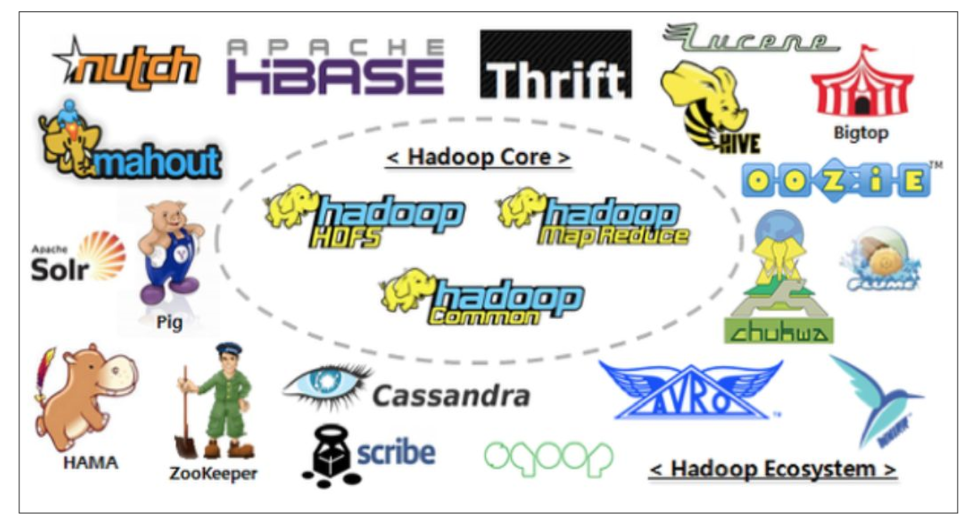

# 一、大数据

## 1、大数据概念

大数据（Big Data）：指无法在一定时间范围内用常规软件工具进行捕捉、管理和 处理的数据集合，是需要新处理模式才能具有更强的决策力、洞察发现力和流程优化 能力的海量、高增长率和多样化的信息资产。

大数据主要解决，海量数据的**采集**、**存储**和**分析计算**问题。

> 按顺序给出数据存储单位：
>
> bit、Byte、 KB、MB、GB、TB、PB、EB、ZB、YB、 BB、NB、DB。 
>
> 1Byte = 8bit 
>
> 1K = 1024Byte 
>
> 1MB = 1024K 
>
> 1G = 1024M 
>
> 1T = 1024G 
>
> 1P = 1024T

## 2、大数据特点

### 1）大量

截至目前，人类生产的所有印刷材料的数据量是200PB，而历史上全人类总共 说过的话的数据量大约是5EB。当前，典型个人计算机硬盘的容量为TB量级，而 一些大企业的数据量已经接近EB量级。

### 2）高速

这是大数据区分于传统数据挖掘的最显著特征。根据IDC的“数字宇宙”的报告，预计到2025年，全球数据使用量将达到163ZB。在如此海量的数据面前，处理数据的效率就是企业的生命。

### 3）多样

这种类型的多样性也让数据被分为结构化数据和非结构化数据。相对于以往便于存储的 以数据库/文本为主的结构化数据，非结构化数据越来越多，包括网络日志、音频、视频、图 片、地理位置信息等，这些多类型的数据对数据的处理能力提出了更高要求。

### 4）低价值密度

价值密度的高低与数据总量的大小成反比。如何快速对有价值数 据“提纯”成为目前大数据背景下待解决的难题。

## 3、大数据应用场景

- 抖音：推荐的都是你喜欢的视频；
- 电商站内广告推荐：给用户推荐可能喜欢的商品；
- 零售：分析用户消费习惯，为用户购买商品提供方便，从而提升商品销量
- ……

---

# 二、Hadoop概述

## 1、Hadoop是什么

- Hadoop是一个由Apache基金会所开发的分布式系统基础架构；
- 主要解决，海量数据的存储和海量数据的分析计算问题；
- 广义上来说，Hadoop通常是指一个更广泛的概念——Hadoop生态圈。

## 2、Hadoop三大发行版本

Hadoop三大发行版本：Apache、Cloudera、Hortonworks。

- Apache版本最原始（最基础）的版本，对于入门学习最好。2006
- Cloudera内部集成了很多大数据框架，对应产品CDH。2008
- Hortonworks文档较好，对应产品HDP。2011
- Hortonworks现在已经被Cloudera公司收购，推出新的品牌CDP。

## 3、Hadoop优势

1）高可靠性：Hadoop底层维护多个数据副本，所以即使Hadoop某个计算元 素或存储出现故障，也不会导致数据的丢失。

2）高拓展性：在集群间分配任务数据，可方便的扩展数以千计的节点。

3）高效性：在MapReduce的思想下，Hadoop是并行工作的，以加快任务处理速度。

4）高容错性：能够自动将失败的任务重新分配。

