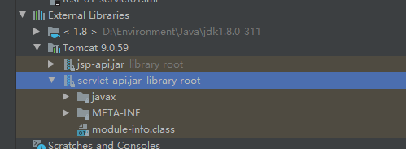
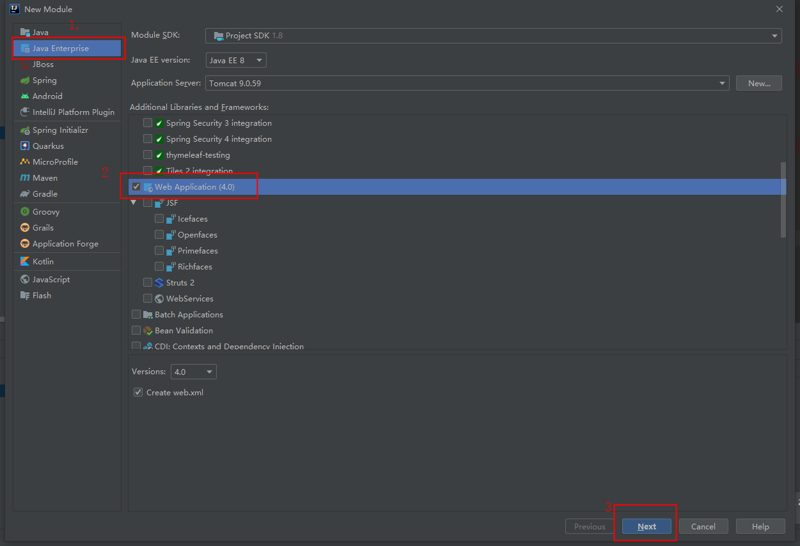
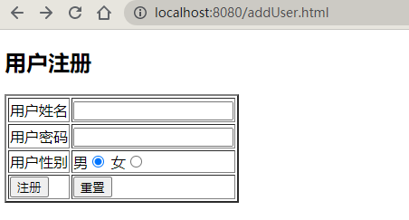
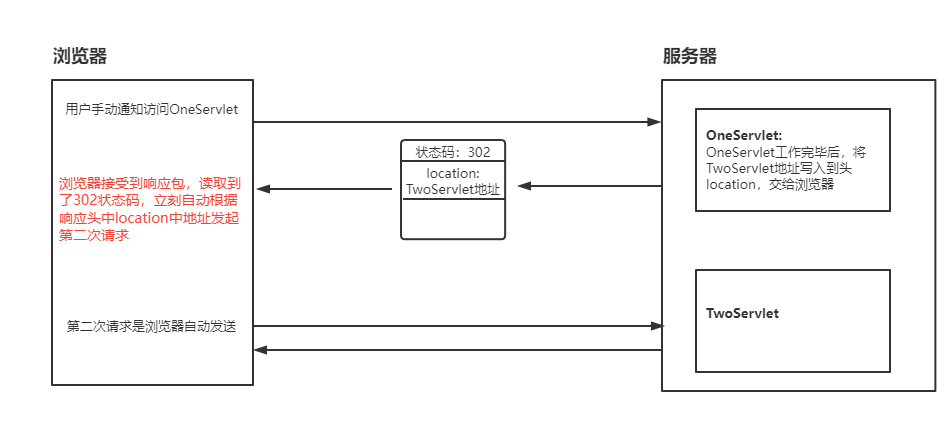
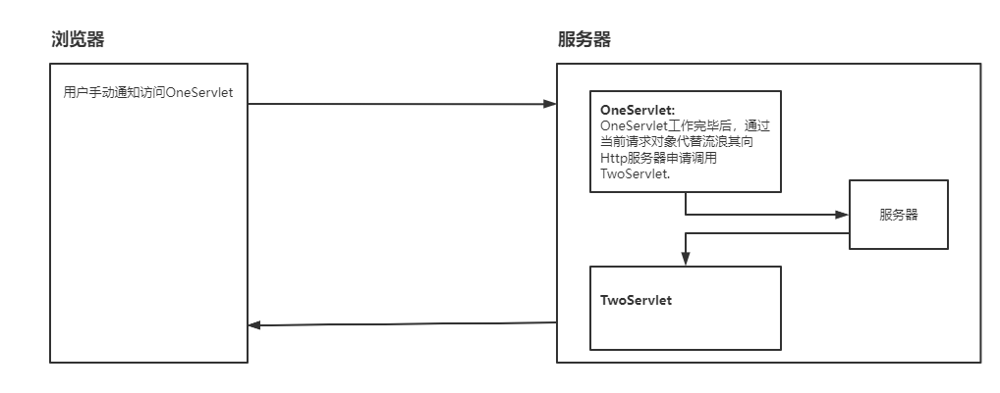

# 一、Servlet基础

## 1、Servlet规范介绍

1、Servlet规范来自于Java EE规范中的一种

2、作用：

1. 在Servlet规范中，指定【动态资源文件】（Servlet开发步骤）
2. 在Servlet规范中，指定Http服务器调用动态资源文件规则（Servlet资源映射关系）
3. 在Servlet规范中，指定Http服务器管理动态资源文件实例对象规则（Servlet生命周期）

## 2、Servlet接口实现类

1.Servlet接口来自于Servlet规范下一个接口，这个接口存在Http服务(Tomcat)器提供jar包

2.Tomcat服务器下lib文件有一个servlet-api.jar存放Servlet接口（javax.servlet.Servlet接口）



3.Servlet规范中任务，Http服务器能调用的【动态资源文件】必须是一个Servlet接口实现类

例如：

```java
class Student{
	//不是动态资源文件，Tomcat无权调用
}

class Teacher implements Servlet{
    //合法动态资源文件，Tomcat有权利调用
}
```

## 3、Servlet接口实现类开发步骤

1. 创建一个Java类继承与HttpServlet父类，使之成为一个Servlet接口实现类;

2. 重写HttpServlet父类两个方法：doGet或者doPost；

```java
public class OneServlet extends HttpServlet {

    @Override
    protected void doGet(HttpServletRequest req, HttpServletResponse resp) throws ServletException, IOException {
        System.out.println("doGet is run……");
    }

    @Override
    protected void doPost(HttpServletRequest req, HttpServletResponse resp) throws ServletException, IOException {
        System.out.println("doPost is run……");
    }
}
```

3. 将Servlet接口实现类信息【注册】到 Tomcat服务器（【网站】--->【web】--->【WEB-INF】---> web.xml）

```xml
<!--将Servlet接口实现类类路径地址交给Tomcat-->
<servlet>
    <servlet-name>OneServlet</servlet-name>                         <!--声明一个变量存储servlet接口实现类类路径-->
    <servlet-class>com.lin.controller.OneServlet</servlet-class>    <!--声明servlet接口实现类类路径-->
</servlet>

<!--为了降低用户访问Servlet接口实现类难度，需要设置简短请求别名-->
<servlet-mapping>
    <servlet-name>OneServlet</servlet-name>
    <url-pattern>/one</url-pattern>                                 <!--设置简短请求别名,别名在书写时必须以"/"为开头-->
</servlet-mapping>
```

4. 测试

## 4、Servlet的生命周期

1. 网站中所有的Servlet接口实现类的实例对象，只能由Http服务器负责创建。开发人员不能手动创建Servlet接口实现类的实例对象；

2. 在默认的情况下，Http服务器接收到对于当前Servlet接口实现类**第一次请求时**自动创建这个Servlet接口实现类的实例对象；

​      在手动配置情况下，要求Http服务器在启动时自动创建某个Servlet接口实现类的实例对象：

```xml
<servlet>
    <servlet-name>OneServlet</servlet-name> <!--声明一个变量存储servlet接口实现类类路径-->
    <servlet-class>com.lin.controller.OneServlet</servlet-class>
    <load-on-startup>1<load-on-startup><!--填写一个大于0的整数即可-->
</servlet>
```

3. 在Http服务器运行期间，一个Servlet接口实现类只能被创建出一个实例对象；
4. 在Http服务器关闭时刻，自动将网站中所有的Servlet对象进行销毁.。


# 二、请求与相应

## 1、HttpServletResponse接口

### 1）介绍

1. HttpServletResponse接口来自于Servlet规范中，在Tomcat中存在servlet-api.jar
2. HttpServletResponse接口实现类由Http服务器负责提供

3. HttpServletResponse接口负责将doGet/doPost方法执行结果写入到【响应体】交给浏览器

4. 开发人员习惯于将HttpServletResponse接口修饰的对象称为【响应对象】

### 2）主要功能

1. 将执行结果以二进制形式写入到【响应体】

2. 设置响应头中[content-type]属性值，从而控制浏览器使用对应编译器将响应体二进制数据编译为【文字，图片，视频，命令】

```java
public class OneServlet extends HttpServlet {
    @Override
    protected void doGet(HttpServletRequest req, HttpServletResponse resp) throws ServletException, IOException {
        System.out.println("doGet is run……");
        resp.setContentType("text/html;charset=utf-8");		//设置编码类型以及contentType
        resp.getWriter().println("<h1>你好!</h1>");
        resp.flushBuffer();
    }
}
```

效果：


3. 设置响应头中【location】属性，将一个请求地址赋值给location.从而控制浏览器向指定服务器发送请求

```java
public class OneServlet extends HttpServlet {

    @Override
    protected void doGet(HttpServletRequest req, HttpServletResponse resp) throws ServletException, IOException {
        String result = "http://www.baidu.com";
        resp.sendRedirect(result);
    }

}
```


## 2、HttpServletRequest接口

### 1）介绍:

1. HttpServletRequest接口来自于Servlet规范中，在Tomcat中存在servlet-api.jar

2. HttpServletRequest接口实现类由Http服务器负责提供

3. HttpServletRequest接口负责在doGet/doPost方法运行时读取Http请求协议包中信息

4. 开发人员习惯于将HttpServletRequest接口修饰的对象称为【请求对象】

### 2）作用:

1. 可以读取Http请求协议包中【请求行】信息

```java
public class OneServlet extends HttpServlet {

    @Override
    protected void doGet(HttpServletRequest req, HttpServletResponse resp) throws ServletException, IOException {
        String url = req.getRequestURL().toString();
        String method = req.getMethod();
        String uri = req.getRequestURI();
        resp.setContentType("text/html;charset=utf-8");
        resp.getWriter().print("url：" + url + "<br>method：" + method + "<br>uri：" + uri);
    }

}
```

效果：


2. 可以读取保存在Http请求协议包中【请求头】或则【请求体】中请求参数信息

```java
public class OneServlet extends HttpServlet {
	
    //获取请求头中的参数信息
    @Override
    protected void doGet(HttpServletRequest req, HttpServletResponse resp) throws ServletException, IOException {
        String username = req.getParameter("username");
        System.out.println(username);
    }

    //获取请求体中的参数信息
    @Override
    protected void doPost(HttpServletRequest req, HttpServletResponse resp) throws ServletException, IOException {
        req.setCharacterEncoding("utf-8");		//避免乱码
        String username = req.getParameter("username");
        System.out.println(username);
    }
}
```

3. 可以代替浏览器向Http服务器申请资源文件调用


## 3、请求对象和相应对象的生命周期

1.在Http服务器接收到浏览器发送的【Http请求协议包】之后，自动为当前的【Http请求协议包】生成一个【请求对象】和一个【响应对象】

2.在Http服务器调用doGet/doPost方法时，负责将【请求对象】和【响应对象】作为实参传递到方法，确保doGet/doPost正确执行

3.在Http服务器准备推送Http响应协议包之前，负责将本次请求关联的【请求对象】和【响应对象】销毁


# 三、Servlet开发实战

## 1、项目搭建

1. 创建项目




2. 导入mysql连接jar包


3. 创建数据库表

```sql
CREATE TABLE user(
	`id` int PRIMARY KEY auto_increment,
	`username` varchar(50),
	`password` varchar(50),
	`sex` char(1) 
)
```


## 2、代码编写

1. 编写SQL连接工具类

```java
import java.sql.*;

public class JDBCUtils {

    public static final String dbDriver = "com.mysql.jdbc.Driver";
    public static final String dbURL = "jdbc:mysql://localhost:3306/servlet?useUnicode=true&characterEncoding=UTF-8&useSSL=false";
    public static final String dbUsername = "root";
    public static final String dbPassword = "root";
    public static Connection conn = null;
    public static PreparedStatement pt = null;
    public static ResultSet rs = null;


    //创建数据库连接
    public static Connection getConntion() {
        try {
            Class.forName(dbDriver);
        } catch (ClassNotFoundException e) {
            // TODO Auto-generated catch block
            e.printStackTrace();
        }

        try {
            conn = DriverManager.getConnection(dbURL, dbUsername, dbPassword);
        } catch (SQLException e) {
            // TODO Auto-generated catch block
            e.printStackTrace();
        }
        return conn;

    }

    public static PreparedStatement getPreparedStatement(String sql) {
        try {
            if (conn == null) {
                conn = getConntion();
            }
            pt = conn.prepareStatement(sql);
        } catch (SQLException e) {
            e.printStackTrace();
        }
        return pt;
    }


    //关闭数据库连接
    public static void close(Connection conn, PreparedStatement pt, ResultSet rs) {
        if (rs != null) {
            try {
                rs.close();
            } catch (SQLException e) {
                // TODO Auto-generated catch block
                e.printStackTrace();
            }
        }
        if (pt != null) {
            try {
                pt.close();
            } catch (SQLException e) {
                // TODO Auto-generated catch block
                e.printStackTrace();
            }
        }
        if (conn != null) {
            try {
                conn.close();
            } catch (SQLException e) {
                // TODO Auto-generated catch block
                e.printStackTrace();
            }
        }

    }

    public static void close(Connection conn, PreparedStatement pt) {

        if (pt != null) {
            try {
                pt.close();
            } catch (SQLException e) {
                // TODO Auto-generated catch block
                e.printStackTrace();
            }
        }
        if (conn != null) {
            try {
                conn.close();
            } catch (SQLException e) {
                // TODO Auto-generated catch block
                e.printStackTrace();
            }
        }

    }

    public static void close(PreparedStatement pt) {
        if (pt != null) {
            try {
                pt.close();
            } catch (SQLException e) {
                // TODO Auto-generated catch block
                e.printStackTrace();
            }
        }
    }

}
```


2. 编写前端页面

```html
<!DOCTYPE html>
<html lang="en">
    <head>
        <meta charset="UTF-8">
        <title>Title</title>
    </head>
    <body>
        <form action="/user/addUser" method="post">
            <h2>用户注册</h2>
            <table border="2">
                <tr>
                    <td>用户姓名</td>
                    <td><input type="text" name="username"/></td>
                </tr>
                <tr>
                    <td>用户密码</td>
                    <td><input type="password" name="password"></td>
                </tr>
                <tr>
                    <td>用户性别</td>
                    <td>
                        男<input type="radio" name="sex" value="男">
                        女<input type="radio" name="sex" value="女">
                    </td>
                </tr>
                <tr>
                    <td><input type="submit" value="注册"></td>
                    <td><input type="reset"></td>
                </tr>
            </table>
        </form>
    </body>
</html>
```

效果图：



3. 编写实体类User

```java
public class User {

    private int id;

    private String username;

    private String password;

    private String sex;

    public User(int id, String username, String password, String sex) {
        this.id = id;
        this.username = username;
        this.password = password;
        this.sex = sex;
    }

   	//get、set方法略
}
```


4. 编写Dao层接口UserDao

```java
public class UserDao {

    public int addUser(User user) {
        String sql = "INSERT INTO user(username,password,sex) VALUES(?,?,?)";
        int res = 0;
        PreparedStatement preparedStatement = null;
        try {
            preparedStatement = JDBCUtils.getPreparedStatement(sql);
            preparedStatement.setString(1, user.getUsername());
            preparedStatement.setString(2, user.getPassword());
            preparedStatement.setString(3, user.getSex());
            res = preparedStatement.executeUpdate();
        } catch (SQLException e) {
            e.printStackTrace();
        } finally {
            JDBCUtils.close(preparedStatement);
        }
        return res;
    }

}
```


5. 编写Servlet接口AddUserController

```java
public class AddUserController extends HttpServlet {

    @Override
    protected void doPost(HttpServletRequest req, HttpServletResponse resp) throws ServletException, IOException {

        req.setCharacterEncoding("utf-8");
        String username = req.getParameter("username");
        String password = req.getParameter("password");
        String sex = req.getParameter("sex");

        User user = new User(0, username, password, sex);
        UserDao userDao = new UserDao();
        int res = userDao.addUser(user);

        resp.setContentType("text/html;charset=utf-8");

        if(res > 0){
            resp.getWriter().print("<h1>用户添加成功！</>");
        }else {
            resp.getWriter().print("<h1>用户添加失败！</>");
        }
    }
}
```


6. 创建AddUserController的映射关系

```xml
<servlet>
    <servlet-name>addUser</servlet-name>
    <servlet-class>com.lin.controller.AddUserController</servlet-class>
</servlet>

<servlet-mapping>
    <servlet-name>addUser</servlet-name>
    <url-pattern>/user/addUser</url-pattern>
</servlet-mapping>
```


## 3、测试

输入用户名、密码、性别后点击”注册“，页面提示”用户添加成功“。


# 四、Servlet之间的调用

## 1、前提条件

某些来自于浏览器发送请求，往往需要服务端中多个Servlet协同处理。但是浏览器一次只能访问一个Servlet，导致用户需要手动通过浏览器
发起多次请求才能得到服务。这样增加用户获得服务难度，导致用户放弃访问当前网站


## 2、调用规则

### 1）重定向



1. **工作原理：**用户第一次通过【手动方式】通知浏览器访问OneServlet。OneServlet工作完毕后，将TwoServlet地址写入到响应头`location`属性中，导致Tomcat将302状态码写入到状态行。在浏览器接收到响应包之后，会读取到302状态。此时浏览器自动根据响应头中location属性地址发起第二次请求，访问TwoServlet去完成请求中剩余任务

2. **实现命令：**

   `response.sendRedirect("请求地址")`（将地址写入到响应包中响应头中location属性）

3. **特征：**

   - 请求地址：既可以把当前网站内部的资源文件地址发送给浏览器 （/网站名/资源文件名）也可以把其他网站资源文件地址发送给浏览器(`http://ip地址:端口号/网站名/资源文件名`)。
   - 请求次数：浏览器至少发送两次请求，但是只有第一次请求是用户手动发送。后续请求都是浏览器自动发送的。
   - 请求方式：重定向解决方案中，通过地址栏通知浏览器发起下一次请求，因此通过重定向解决方案调用的资源文件接收的请求方式一定是【GET】。

4. **缺点：**重定向解决方案需要在浏览器与服务器之间进行多次往返，大量时间消耗在往返次数上，增加用户等待服务时间。

### 2）转发



1. **工作原理：**用户第一次通过手动方式要求浏览器访问OneServlet。OneServlet工作完毕后，通过当前的请求对象代替浏览器向Tomcat发送请求，申请调用TwoServlet。Tomcat在接收到这个请求之后，自动调用TwoServlet来完成剩余任务。
2. **实现命令：**

```java
//1.通过当前请求对象生成资源文件申请报告对象
RequestDispatcher dispatcher = request.getRequestDispatcher("/资源文件名");		//一定要以"/"为开头
//2.将报告对象发送给Tomcat
dispatcher.forward(request，response);
```

3. **优点：**
   - 无论本次请求涉及到多少个Servlet,用户只需要手动通过浏览器发送一次请求；
   - Servlet之间调用发生在服务端计算机上，节省服务端与浏览器之间往返次数增加处理服务速度

4. **特征：**
   - 请求次数： 在请求转发过程中，浏览器只发送一次请求；
   - 请求地址：只能向Tomcat服务器申请调用当前网站下资源文件地址request.getRequestDispathcher("/资源文件名")
   - 请求方式：在请求转发过程中，浏览器只发送一个了个Http请求协议包。参与本次请求的所有Servlet共享同一个请求协议包，因此
     这些Servlet接收的请求方式与浏览器发送的请求方式保持一致


# 五、Servlet间的数据共享

## 1、含义

一个Servlet工作完毕后，将产生的数据交给转发或重定向的Servlet进行处理。

## 2、共享方案

### 1）ServletContext接口

1. **介绍：**

   - 来自于Servlet规范中一个接口。在Tomcat中存在servlet-api.jar在Tomcat中负责提供这个接口实现类；
   - 如果两个Servlet来自于同一个网站。彼此之间通过网站的ServletContext实例对象实现数据共享；
   - 开发人员习惯于将ServletContext对象称为【全局作用域对象】。

2. **工作原理：**

   每一个网站都存在一个全局作用域对象。这个全局作用域对象【相当于】一个Map.在这个网站中OneServlet可以将一个数据存入到全局作用域对象，当前网站中其他Servlet此时都可以从全局作用域对象得到这个数据进行使用；

3. **生命周期：**

   - 在Http服务器启动过程中，自动为当前网站在内存中创建一个全局作用域对象；
   - 在Http服务器运行期间时，一个网站只有一个全局作用域对象；
   - 在Http服务器运行期间，全局作用域对象一直处于存活状态；
   - 在Http服务器准备关闭时，负责将当前网站中全局作用域对象进行销毁处理。

4. **代码实现：**

```java
// 存储数据
class OneServlet{
    public void doGet(HttpServletRequest request,HttpServletResponse response){		     
        //1.通过【请求对象】向Tomcat索要当前网站中【全局作用域对象】
        ServletContext application = request.getServletContext();
        //2.将数据添加到全局作用域对象作为【共享数据】
        application.setAttribute("key1",数据)
    }
}

//取出数据
class TwoServlet{
    public void doGet(HttpServletRequest request,HttpServletResponse response){   
        //1.通过【请求对象】向Tomcat索要当前网站中【全局作用域对象】
        ServletContext application = request.getServletContext();
        //2.从全局作用域对象得到指定关键字对应数据
        Object 数据 =  application.getAttribute("key1");
    }
}
```


### 2）Cookie类

1. **介绍：**

   - Cookie来自于Servlet规范中一个工具类，存在于Tomcat提供servlet-api.jar中；
   - 如果两个Servlet来自于同一个网站，并且为同一个浏览器/用户提供服务，此时借助于Cookie对象进行数据共享；
   - Cookie存放当前用户的私人数据，在共享数据过程中提高服务质量；

2. **原理：**

   1. 用户通过浏览器第一次向MyWeb网站发送请求申请OneServlet。OneServlet在运行期间创建一个Cookie存储与当前用户相关数据
      OneServlet工作完毕后，【将Cookie写入到响应头】交还给当前浏览器。浏览器收到响应响应包之后，将cookie存储在浏览器的缓存
      一段时间之后，用户通过【同一个浏览器】再次向【myWeb网站】发送请求申请TwoServlet时。【浏览器需要无条件的将myWeb网站之前推送过来的Cookie，写入到请求头】发送过去此时TwoServlet在运行时，就可以通过读取请求头中cookie中信息，得到OneServlet提供的共享数据；

3. **代码实现：**

   ```java
   class OneServlet{
       public void doGet(HttpServletRequest request,HttpServletResponse resp){
           //1.创建一个cookie对象，保存共享数据（当前用户数据）
           Cookie card = new Cookie("key1","abc");
           Cookie card1= new Cookie("key2","efg");
           ****cookie相当于一个map
               ****一个cookie中只能存放一个键值对
               ****这个键值对的key与value只能是String
               ****键值对中key不能是中文
               //2.【发卡】将cookie写入到响应头，交给浏览器
               resp.addCookie(card);
           resp.addCookie(card1)
       }
   }
   
   class TwoServlet{
       public void doGet(HttpServletRequest request,HttpServletResponse resp){    
           //1.调用请求对象从请求头得到浏览器返回的Cookie
           Cookie  cookieArray[] = request.getCookies();
           //2.循环遍历数据得到每一个cookie的key 与 value
           for(Cookie card:cookieArray){
               String key =   card.getName(); 		//读取key  "key1"
               String value = card.getValue();		//读取value "abc"
           }
       }
   }
   ```

   

4. **生命周期：**

   1. 在默认情况下，Cookie对象存放在浏览器的缓存中。因此只要浏览器关闭，Cookie对象就被销毁掉；

   2. 在手动设置情况下，可以要求浏览器将接收的Cookie存放在客户端计算机上硬盘上，同时需要指定Cookie在硬盘上存活时间。在存活时间范围内，关闭浏览器关闭客户端计算机，关闭服务器，都不会导致Cookie被销毁。在存活时间到达时，Cookie自动从硬盘上被删除。

      手动设置方式：`cookie.setMaxAge(60);`该cookie将在磁盘上存活一分钟。


### 3）HttpSession接口

1. **介绍：**
   - HttpSession接口来自于Servlet规范下一个接口。存在于Tomcat中servlet-api.jar其实现类由Http服务器提供。Tomcat提供实现类存在于servlet-api.jar；
   - 如果两个Servlet来自于同一个网站，并且为同一个浏览器/用户提供服务，此时借助于HttpSession对象进行数据共享；
   - 开发人员习惯于将HttpSession接口修饰对象称为【会话作用域对象】；
   - Http服务器通过cookie将用户与HttpSession进行关联；

> **HttpSession 与  Cookie 区别**
>
> 1）存储位置：Cookie：存放在客户端计算机（浏览器内存/硬盘）；HttpSession：存放在服务端计算机内存
>
> 2）数据类型：Cookie对象存储共享数据类型只能是String，HttpSession对象可以存储任意类型的共享数据Object；
>
> 3）数据数量：一个Cookie对象只能存储一个共享数据HttpSession使用map集合存储共享数据，所以可以存储任意数量共享数据；
>
> **getSession() 与getSession(false) 的区别：**
>
> 1）getSession()：如果当前用户在服务端已经拥有了自己的私人储物柜，要求tomcat将这个私人储物柜进行返回。如果当前用户在服务端尚未拥有自己的私人储物柜，要求tocmat为当前用户创建一个全新的私人储物柜；
>
> 2）getSession(false)：如果当前用户在服务端已经拥有了自己的私人储物柜，要求tomcat将这个私人储物柜进行返回。如果当前用户在服务端尚未拥有自己的私人储物柜，此时Tomcat返回null。

2. **代码实现：**

```java
class OneServlet{
    public void doGet(HttpServletRequest request,HttpServletResponse response){		 
        //1.调用请求对象向Tomcat索要当前用户在服务端的私人储物柜
        HttpSession session = request.getSession();
        //2.将数据添加到用户私人储物柜
        session.setAttribute("key1",共享数据)
    }
}

class TwoServlet{
    public void doGet(HttpServletRequest request,HttpServletResponse response){
        //1.调用请求对象向Tomcat索要当前用户在服务端的私人储物柜
        HttpSession session = request.getSession();
        //2.从会话作用域对象得到OneServlet提供的共享数据
        Object 共享数据 = session.getAttribute("key1");
    }
}
```


3. **HttpSession销毁时机：**

用户与HttpSession关联时使用的Cookie只能存放在浏览器缓存中。在浏览器关闭时，意味着用户与他的HttpSession关系被切断。由于Tomcat无法检测浏览器何时关闭，因此在浏览器关闭时并不会导致Tomcat将浏览器关联的HttpSession进行销毁。为了解决这个问题，Tomcat为每一个HttpSession对象设置【空闲时间】，这个空闲时间默认30分钟，如果当前HttpSession对象空闲时间达到30分钟，此时Tomcat认为用户已经放弃了自己的HttpSession，此时Tomcat就会销毁掉这个HttpSession。

手动设置【空闲时间】：

```xml
<!-- 在当前网站/web/WEB-INF/web.xml -->
<session-config>
    <session-timeout>5</session-timeout> <!--当前网站中每一个session最大空闲时间5分钟-->
</session-config>
```


### 4）HttpServletRequest接口

1. **介绍：**
   1. 在同一个网站中，如果两个Servlet之间通过【请求转发】方式进行调用，彼此之间共享同一个请求协议包。而一个请求协议包只对应一个请求对象因此servlet之间共享同一个请求对象，此时可以利用这个请求对象在两个Servlet之间实现数据共享；
   2. 在请求对象实现Servlet之间数据共享功能时，开发人员将请求对象称为【请求作用域对象】；
2. **代码实现：**

```java
class OneServlet{
    public void doGet(HttpServletRequest req,HttpServletResponse response){   
        //1.将数据添加到【请求作用域对象】中attribute属性
        req.setAttribute("key1",数据); //数据类型可以任意类型Object
        //2.向Tomcat申请调用TwoServlet
        req.getRequestDispatcher("/two").forward(req,response)
    }
}

class TwoServlet{
    public void doGet(HttpServletRequest req,HttpServletResponse response){                      
        //从当前请求对象得到OneServlet写入到共享数据
        Object 数据 = req.getAttribute("key1");
    }
}
```


# 六、Servlet规范扩展

## 1、监听器(Listener)

1. **介绍：**

   1. 一组来自于Servlet规范下接口，共有8个接口。在Tomcat存在servlet-api.jar包；
   2. 监听器接口需要由开发人员亲自实现，Http服务器提供jar包并没有对应的实现类；
   3. 监听器接口用于监控【作用域对象生命周期变化时刻】以及【作用域对象共享数据变化时刻】；

2. **作用域对象：**

   > 在Servlet规范中，认为在服务端内存中可以在某些条件下为两个Servlet之间提供数据共享方案的对象，被称为【作用域对象】；
   >
   > Servlet规范下作用域对象：
   >
   > 1. ServletContext：全局作用域对象
   > 2. HttpSession：会话作用域对象
   > 3. HttpServletRequest：请求作用域对象

3. **开发步骤：**

   1. 根据监听的实际情况，选择对应监听器接口进行实现
   2. 重写监听器接口声明【监听事件处理方法】
   3. 在web.xml文件将监听器接口实现类注册到Http服务器

   > 举例：
   >
   > **ServletContextListener接口：**
   >
   > 1）作用：通过这个接口合法的检测全局作用域对象被初始化时刻以及被销毁时刻；
   >
   > 2）监听事件处理方法：
   >
   > - public void contextInitlized()：在全局作用域对象被Http服务器初始化被调用
   > - public void contextDestory():   在全局作用域对象被Http服务器销毁时候触发调用    
   >
   > **ServletContextAttributeListener接口**
   >
   > 1）作用：通过这个接口合法的检测全局作用域对象共享数据变化时刻
   >
   >  2）监听事件处理方法：
   >
   > - public void contextAdd()：         在全局作用域对象添加共享数据
   > - public void contextReplaced()：在全局作用域对象更新共享数据
   > - public void contextRemove()：  在全局作用域对象删除共享数据

4. **实例**

创建监听器：

```java
public class OneListerner implements ServletContextAttributeListener {

    @Override
    public void attributeAdded(ServletContextAttributeEvent scae) {
        System.out.println("【新建】了全局作用域的共享数据");
    }

    @Override
    public void attributeRemoved(ServletContextAttributeEvent scae) {
        System.out.println("【删除】了全局作用域的共享数据");
    }

    @Override
    public void attributeReplaced(ServletContextAttributeEvent scae) {
        System.out.println("【修改】了全局作用域的共享数据");
    }
}
```

创建被监听类：

```java
public class OneServlet extends HttpServlet {

    @Override
    protected void doGet(HttpServletRequest req, HttpServletResponse resp) throws ServletException, IOException {
        ServletContext context = req.getServletContext();

        context.setAttribute("Key", "123");

        context.setAttribute("Key", "456");

        context.removeAttribute("Key");
    }

}
```

配置web.xml文件

```xml
<servlet>
    <servlet-name>OneServlet</servlet-name>
    <servlet-class>com.lin.controller.OneServlet</servlet-class>
</servlet>
<servlet-mapping>
    <servlet-name>OneServlet</servlet-name>
    <url-pattern>/one</url-pattern>
</servlet-mapping>

<listener>
    <listener-class>com.lin.listener.OneListerner</listener-class>
</listener>
```


## 2、拦截器(Filter)

1. **介绍：**
   - 来自于Servlet规范下接口，在Tomcat中存在于servlet-api.jar包；
   - Filter接口实现类由开发人员负责提供，Http服务器不负责提供；
   - Filter接口在Http服务器调用资源文件之前，对Http服务器进行拦截

2. **作用：**
   1. 拦截Http服务器，帮助Http服务器检测当前请求合法性；
   2. 拦截Http服务器，对当前请求进行增强操作

3. **开发步骤：**

创建资源类：

```java
public class OneServlet extends HttpServlet {

    protected void doGet(HttpServletRequest request, HttpServletResponse response) throws ServletException, IOException {
        response.getWriter().print("Hello,World!");
    }
}
```

创建一个Java类实现Filter接口并重写doFilter方法：

```java
public class OneFilter implements Filter {
    @Override
    public void doFilter(ServletRequest servletRequest, ServletResponse servletResponse, FilterChain filterChain) throws IOException, ServletException {
        String username = servletRequest.getParameter("username");
        if (!"root".equalsIgnoreCase(username)) {
            servletResponse.setContentType("text/html;charset=utf-8");
            servletResponse.getWriter().print("身份不合法！");
        } else {
            filterChain.doFilter(servletRequest, servletResponse);		//资源放行
        }
    }
}
```

配置web.xml文件

```xml
<servlet>
    <servlet-name>OneServlet</servlet-name>
    <servlet-class>com.lin.filter.OneServlet</servlet-class>
</servlet>
<servlet-mapping>
    <servlet-name>OneServlet</servlet-name>
    <url-pattern>/one</url-pattern>
</servlet-mapping>

<filter>
    <filter-name>OneFilter</filter-name>
    <filter-class>com.lin.filter.OneFilter</filter-class>
</filter>
<filter-mapping>
    <filter-name>OneFilter</filter-name>
    <url-pattern>/one</url-pattern>
</filter-mapping>
```

4. **拦截地址格式**

```xml
<!-- 1) 命令格式: -->
<filter-mapping>
    <filter-name>OneFilter</filter-name>
    <url-pattern>拦截地址</url-pattern>
</filter-mapping>
<!--  2) 命令作用：拦截地址通知Tomcat在调用何种资源文件之前需要调用OneFilter过滤进行拦截-->

<!-- 3）要求Tomcat在调用某一个具体文件之前，来调用OneFilter拦截 -->
<url-pattern>/img/mm.jpg</url-pattern>

<!-- 4）要求Tomcat在调用某一个文件夹下所有的资源文件之前，来调用OneFilter拦截 -->
<url-pattern>/img/*</url-pattern>

<!-- 5）要求Tomcat在调用任意文件夹下某种类型文件之前，来调用OneFilter拦截 -->
<url-pattern>*.jpg</url-pattern>

<!-- 6)要求Tomcat在调用网站中任意文件时，来调用OneFilter拦截 -->
<url-pattern>/*</url-pattern>
```

