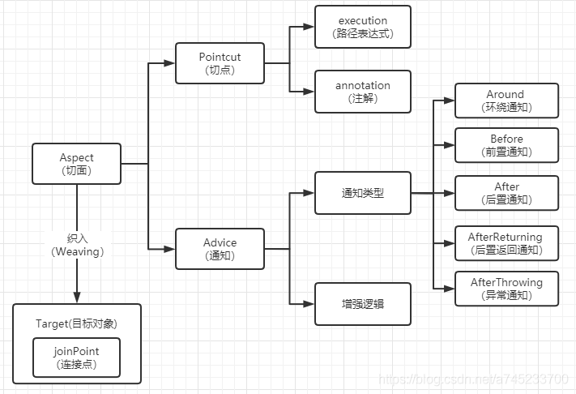
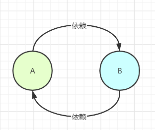
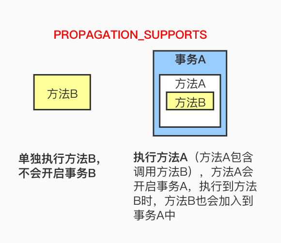
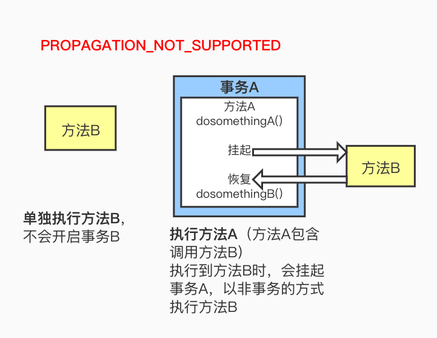
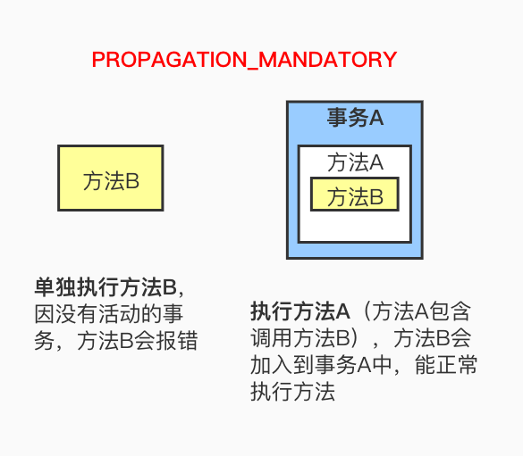

# 一、Spring概述： 

## 1、Spring是什么 

Spring是一个轻量级的IOC和AOP容器框架。是为Java应用程序提供基础性服务的一套框架，目的是用于简化企业应用程序的开发，它使得开发者只需要关心业务需求。

## 2、Spring包含了哪些模块组成 


1. **Spring Context：**提供框架式的Bean访问方式，以及企业级功能（JNDI、定时任务等）；
2. **Spring Core：**核心类库，所有功能都依赖于该类库，提供IOC和DI服务；
3. **Spring AOP：**AOP服务；
4. **Spring Web：**提供了基本的面向Web的综合特性，提供对常见框架如Struts2的支持，Spring能够管理这些框架，将Spring的资源注入给框架，也能在这些框架的前后插入拦截器；
5. **Spring MVC：**提供面向Web应用的Model-View-Controller，即MVC实现。
6. **Spring DAO：**对JDBC的抽象封装，简化了数据访问异常的处理，并能统一管理JDBC事务；
7. **Spring ORM：**对现有的ORM框架的支持；

## 3、Spring的优点 

1. 属于底侵入式设计，代码的污染度极低；
2. Spring的DI机制将对象之间的依赖关系交由框架处理，降低组件的耦合性；
3. Spring提供了AOP技术，支持将一些通用的事务，如安全、事务、日志、权限等进行集中式管理，从而提供更好的复用；
4. Spring对于主流的框架提供了支持。

## 4、Spring使用到了哪些设计模式 

1. 工厂模式：BeanFactory就是简单工厂模式的体现，用来创建对象的实例；
2. 单例模式：Bean默认为单例模式；
3. 代理模式：Spring的AOP功能用到了JDK的动态代理和CGLIB字节码生成技术；
4. 模板方法模式：用来解决代码重复的问题。比如. RestTemplate, JmsTemplate, JpaTemplate。
5. 观察者模式：定义对象键一种一对多的依赖关系，当一个对象的状态发生改变时，所有依赖于它的对象都会得到通知被制动更新，如Spring中listener的实现–ApplicationListener。

> 软件工程理论中的其他五大设计原则：
>
> **1.单一职责原则**：不存在多于一个的因素导致类的状态发生变更，即一个类只负责一项单一的职责。
>
> **2.里氏替换原则**：基类出现的地方都可以用其子类进行替换，而不会引起任何不适应的问题。
>
> **3.接口隔离原则**：客户端不应该依赖于其不需要的接口，类间的依赖关系应该建立在最小的接口之上。
>
> **4.迪米特法则**：一个对象对其他对象有最少的了解。
>
> **5.开闭原则**：
>
> 软件设计对于扩展是开放的，即模块的行为是可以扩展的。
>
> 软件设计对于修改是关闭的，即模块的行为是不可修改的。

# 二、Spring常见面试题 

## 1、谈谈你对Spring Ioc的理解 

（1）IOC就是控制反转，它不是一种技术，而是一种设计思想，指创建对象的控制权转移给Spring框架进行管理，并由Spring根据配置文件去创建实例和管理各个实例之间的依赖关系，对象与对象之间松散耦合，也利于功能的复用。DI依赖注入，和控制反转是同一个概念的不同角度的描述，即应用程序在运行时依赖IoC容器来动态注入对象需要的外部依赖。

（2）最直观的表达就是，以前创建对象的主动权和时机都是由自己把控的，IOC让对象的创建不用去new了，可以由spring自动生产，使用java的反射机制，根据配置文件在运行时动态的去创建对象以及管理对象，并调用对象的方法的。

（3）Spring的IOC有三种注入方式 ：构造器注入、setter方法注入、根据注解注入。

> **问题一：**
>
> 控制：由谁控制，控制了什么？
>
> 由IoC容器来控制，控制了对象。
>
> **问题二：**
>
> 反转：什么是反转，反转了哪些方面？
>
> 把对象依赖的过程颠倒，即开发人员不再控制其依赖对象，而是由容器来帮助开发人员创建依赖对象，对象只是被动地接受依赖对象，对象的控制权是容器；
>
> 开发人员需要依赖的对象被反转。

## 2、谈谈你对Spring AOP的理解 

OOP面向对象，允许开发者定义纵向的关系，但并不适用于定义横向的关系，会导致大量代码的重复，而不利于各个模块的重用。

AOP，一般称为面向切面，作为面向对象的一种补充，用于将那些与业务无关，但却对多个对象产生影响的公共行为和逻辑，抽取并封装为一个可重用的模块，这个模块被命名为“切面”（Aspect），减少系统中的重复代码，降低了模块间的耦合度，提高系统的可维护性。可用于权限认证、日志、事务处理。

AOP实现的关键在于代理模式，AOP代理主要分为静态代理和动态代理。静态代理的代表为AspectJ；动态代理则以Spring AOP为代表。

## 3、Spring AOP名词解释 

（1）连接点（Join point）：指程序运行过程中所执行的方法。在Spring AOP中，一个连接点总代表一个方法的执行。 

（2）切面（Aspect）：被抽取出来的公共模块，可以用来会横切多个对象。Aspect切面可以看成 Pointcut切点 和 Advice通知 的结合，一个切面可以由多个切点和通知组成。

> 在Spring AOP中，切面可以在类上使用 @AspectJ 注解来实现。

（3）切点（Pointcut）：切点用于定义 要对哪些Join point进行拦截。

> 切点分为execution方式和annotation方式。execution方式可以用路径表达式指定对哪些方法拦截，比如指定拦截add*、search*。annotation方式可以指定被哪些注解修饰的代码进行拦截。

（4）通知（Advice）：指要在连接点（Join Point）上执行的动作，即增强的逻辑，比如权限校验和、日志记录等。通知有各种类型，包括Around、Before、After、After returning、After throwing。

（5）目标对象（Target）：包含连接点的对象，也称作被通知（Advice）的对象。 由于Spring AOP是通过动态代理实现的，所以这个对象永远是一个代理对象。

（6）织入（Weaving）：通过动态代理，在目标对象（Target）的方法（即连接点Join point）中执行增强逻辑（Advice）的过程。

（7）引入（Introduction）：添加额外的方法或者字段到被通知的类。Spring允许引入新的接口（以及对应的实现）到任何被代理的对象。例如，你可以使用一个引入来使bean实现 IsModified 接口，以便简化缓存机制。



## 4、Spring通知有哪些类型 

1. 前置通知：在连接点（Join point）之前执行的通知。
2. 后置通知：当连接点退出的时候执行的通知（不论是正常返回还是异常退出）。 
3. 环绕通知：包围一个连接点的通知，这是最强大的一种通知类型。 环绕通知可以在方法调用前后完成自定义的行为。它也可以选择是否继续执行连接点或直接返回它们自己的返回值或抛出异常来结束执行。
4. 返回后通知：在连接点正常完成后执行的通知（如果连接点抛出异常，则不执行）
5. 抛出异常后通知：在方法抛出异常退出时执行的通知

## 5、Spring中的配置详解 

### 1）name和id之间的一些注意点

- 配置两个相同的Id或name都会报错；
- 如果既配置了 id ，也配置了 name ，则两个都生效。如果id和name都没有指定，则用类全名作为name，如`<bean class="com.stamen.BeanLifeCycleImpl">`,则你可以通过`getBean("com.stamen.BeanLifeCycleImpl")`返回该实例。
- 如果配置基本类的时候，注解和配置文件都使用的时候，注解和配置文件中 name 相同的时候， 则两个冲突，配置文件生效；如果配置基本类的时候，注解和配置文件都使用的时候，注解和配置文件中 name 不相同的时候， 则两个不冲突，都能够生效。

### 2）Spring中bean的作用域

- `singleton`：默认作用域，单例bean，每个容器中只有一个bean的实例。
- `prototype`：为每一个bean请求创建一个实例。
- `request`：为每一个request请求创建一个实例，在请求完成以后，bean会失效并被垃圾回收器回收。
- `session`：与request范围类似，同一个session会话共享一个实例，不同会话使用不同的实例。

### 3）spring三种对象的创建方式

1. 空参构造

   ```xml
   <bean name="hello" class="com.lin.HelloWorld">
   ```

2. 静态工厂构造

   ```xml
   <bean name="user" class="com.lin.UserFactory" factory-method="createUser"></bean>
   ```

3. 实例工厂构造

   ```xml
   <bean name="user2" factory-bean="userFactory" factory-method="createUser"></bean>
    
   <bean name="userFactory" class="com.lin.UserFactory"></bean>
   ```

   （需要配置两个bean，因为无法通过类名调用非静态方法）

### 4）基于xml的spring注入方式

1. set方法注入（值类型用value，引用类型用ref）

   ```xml
   <bean name="teacher" class="com.lin.Tearcher">
   	<property name="name" value="林老师"></property>
       <property name='className' value="软工2班"></property>
   </bean>
   
   <bean name="student" class="com.lin.Student">
   	<property name="name" value="小明"></property>
       <property name="grade" value="90"></property>
       <property name="tearcher" ref="teacher"></property>
   </bean>
   ```

2. 构造函数注入（必须用相应的构造函数）

   ```xml
   <bean class="com.lin.Teacher" name="teacher2">
           <constructor-arg name="name" value="老师2"></constructor-arg>
           <constructor-arg name="className" value="火箭2班"></constructor-arg>
   </bean>
   <bean class="com.lin.Student" name="student2">
           <constructor-arg name="name" value="学生2"></constructor-arg>
           <constructor-arg name="score" value="99"></constructor-arg>
           <constructor-arg name="teacher" ref="teacher2"></constructor-arg>
   </bean>
   ```

3. 静态工厂注入

   ```java
   public class StaticFactory {
       public static Teacher getTeacher() {
           return new Teacher("大明", "计算机3班");
       }
   }
   ```

   ```xml
   <bean class="com.lin.StaticFactory" id="staticFactory" factory-method="getTeacher"></bean>
   ```

4. 实例工厂注入

   ```java
   public class InstanceFactory {
       public Teacher getTeacher(){
           return new Teacher("大鹏","火箭x班");
       }
   }
   ```

   ```xml
   <!--    实例工厂的注入-->
   <bean class="com.lin.InstanceFactory" id="instanceFactory"></bean>
   <bean factory-bean="instanceFactory" factory-method="getTeacher" id="instanceteacher"></bean>
   ```

### 5）什么是自动装配？xml有哪些自动装配的方式？

（1）在Spring框架中，在配置文件中设定bean的依赖关系是一个很好的机制，Spring 容器能够自动装配相互合作的bean，这意味着容器不需要配置，能通过Bean工厂自动处理bean之间的协作。这意味着 Spring可以通过向Bean Factory中注入的方式自动搞定bean之间的依赖关系。自动装配可以设置在每个bean上，也可以设定在特定的bean上。

（2）xml配置中共有5种自动装配：

1. `no`：默认的方式是不进行自动装配，需手动设置属性来进行bean的装配；
2. `byName`：通过bean的名称进行自动装配，如果一个bean的 property 与另一bean 的name 相同，就进行自动装配；
3. `byType`：通过参数的数据类型进行自动装配；
4. `constructor`：利用构造函数进行装配，并且构造函数的参数通过byType进行装配；
5. `autodetect`：自动探测，如果有构造方法，通过 construct的方式自动装配，否则使用 byType的方式自动装配。

### 6）使用注解方式代替配置文件

1. 在applicationContext.xml中书写指定扫描注解及开启注解装配

   ```xml
   <!--  指定扫描com.lin包下所有类的注解 -->
   <context:component-scan bese-package="com.lin"></context:component-scan>
   
   <context:annotation-config/>
   ```

2. 在类上添加注解@Component即可

### 7）其它注解

- 指定对象的作用范围：@Scope(scopeName="prototype")；
- 值类型的注入：@Value("小明")；
- 引用类型的注入：@AutoWired和@Resource；

> **面试题：**
>
> (1) @Autowired默认是按照类型装配注入的，默认情况下它要求依赖对象必须存在（可以设置它required属性为false）。
>
> (2) @Resource默认是按照名称来装配注入的，只有当找不到与名称匹配的bean才会按照类型来装配注入。
>
> @AutoWired(required=false)   +  @Qualifier("user")   ==  @Resource(name="user")

- 在类上添加@ContextConfiguration("classpath:applicationContext.xml")  ，指定创建容器时使用哪个配置文件；
- 在方法上添加@PostConstruct，在对象创建后会执行该方法；
- 在方法上添加@PreDestroy，在对象销毁后会执行该方法。


## 6*、Spring如何解决循环依赖的问题 

### 1） 什么是循环依赖 

类与类之间的依赖关系形成了闭环，就会导致循环依赖问题的产生。

比如A类依赖了B类，B类依赖了C类，而最后C类又依赖了A类，这样就形成了循环依赖问题。



### 2） 循环依赖问题有哪些类型 

循环依赖问题在Spring中主要有三种情况：

1. 通过构造方法进行依赖注入时产生的循环依赖问题；
2. 通过setter方法进行依赖注入且是在多例（原型）模式下产生的循环依赖问题；
3. 通过setter方法进行依赖注入且是在单例模式下产生的循环依赖问题。

在Spring中，只有第（3）种方式的循环依赖问题被解决了，其他两种方式在遇到循环依赖问题时都会产生异常。其实也很好解释：

- 第（1）种构造方法注入的情况下，在new对象的时候就会堵塞住了，其实也就是”先有鸡还是先有蛋“的历史难题。

  > 很多博客上说，只能解决setter方法的循环依赖，这是错误的：
  >
  > 我们通过代码测试可以发现：
  >
  > | **依赖情况**           | **依赖注入方式**                                   | 循环依赖是否被解决 |
  > | ---------------------- | -------------------------------------------------- | ------------------ |
  > | AB相互依赖（循环依赖） | 均采用setter方法注入                               | 是                 |
  > | AB相互依赖（循环依赖） | 均采用构造器注入                                   | 否                 |
  > | AB相互依赖（循环依赖） | A中注入B的方式为setter方法，B中注入A的方式为构造器 | 是                 |
  > | AB相互依赖（循环依赖） | B中注入A的方式为setter方法，A中注入B的方式为构造器 | 否                 |

- 第（2）种setter方法（多例）的情况下，每一次getBean()时，都会产生一个新的Bean，如此反复下去就会有无穷无尽的Bean产生了，最终就会导致OOM问题的出现。

### 3）如何检测是否有循环依赖 

 可以 Bean在创建的时候给其打个标记，如果递归调用回来发现正在创建中的话--->即可说明循环依赖。

### 4）Spring是如何解决循环依赖的 

Spring通过三级缓存解决了循环依赖，其中一级缓存为单例池（singletonObjects）,二级缓存为早期曝光对象earlySingletonObjects，三级缓存为早期曝光对象工厂（singletonFactories）。当A、B两个类发生循环引用时，在A完成实例化后，就使用实例化后的对象去创建一个对象工厂，并添加到三级缓存中，如果A被AOP代理，那么通过这个工厂获取到的就是A代理后的对象，如果A没有被AOP代理，那么这个工厂获取到的就是A实例化的对象。当A进行属性注入时，会去创建B，同时B又依赖了A，所以创建B的同时又会去调用getBean(a)来获取需要的依赖，此时的getBean(a)会从缓存中获取，第一步，先获取到三级缓存中的工厂；第二步，调用对象工工厂的getObject方法来获取到对应的对象，得到这个对象后将其注入到B中。紧接着B会走完它的生命周期流程，包括初始化、后置处理器等。当B创建完后，会将B再注入到A中，此时A再完成它的整个生命周期。至此，循环依赖结束！

> **为什么要使用三级缓存呢？二级缓存能解决循环依赖吗？**
>
> 如果要使用二级缓存解决循环依赖，意味着所有Bean在实例化后就要完成AOP代理，这样违背了Spring设计的原则，Spring在设计之初就是通过AnnotationAwareAspectJAutoProxyCreator这个后置处理器来在Bean生命周期的最后一步来完成AOP代理，而不是在实例化后就立马进行AOP代理。

## 7、Spring容器的启动流程 

1. 初始化Spring容器，注册内置的BeanPostProcessor的BeanDefinition到容器中；

   > ① 实例化BeanFactory【DefaultListableBeanFactory】工厂，用于生成Bean对象；
   > ② 实例化BeanDefinitionReader注解配置读取器，用于对特定注解（如@Service、@Repository）的类进行读取转化成  BeanDefinition 对象，（BeanDefinition 是 Spring 中极其重要的一个概念，它存储了 bean 对象的所有特征信息，如是否单例，是否懒加载，factoryBeanName 等）；
   > ③ 实例化ClassPathBeanDefinitionScanner路径扫描器，用于对指定的包目录进行扫描查找 bean 对象

2. 将配置类的BeanDefinition注册到容器中；

3. 调用refresh()方法刷新容器：

   > ① prepareRefresh()刷新前的预处理：
   > ② obtainFreshBeanFactory()：获取在容器初始化时创建的BeanFactory：
   > ③ prepareBeanFactory(beanFactory)：BeanFactory的预处理工作，向容器中添加一些组件：
   > ④ postProcessBeanFactory(beanFactory)：子类重写该方法，可以实现在BeanFactory创建并预处理完成以后做进一步的设置
   > ⑤ invokeBeanFactoryPostProcessors(beanFactory)：在BeanFactory标准初始化之后执行BeanFactoryPostProcessor的方法，即BeanFactory的后置处理器：
   > ⑥ registerBeanPostProcessors(beanFactory)：向容器中注册Bean的后置处理器BeanPostProcessor，它的主要作用是干预Spring初始化bean的流程，从而完成代理、自动注入、循环依赖等功能
   > ⑦ initMessageSource()：初始化MessageSource组件，主要用于做国际化功能，消息绑定与消息解析：
   > ⑧ initApplicationEventMulticaster()：初始化事件派发器，在注册监听器时会用到：
   > ⑨ onRefresh()：留给子容器、子类重写这个方法，在容器刷新的时候可以自定义逻辑
   > ⑩ registerListeners()：注册监听器：将容器中所有的ApplicationListener注册到事件派发器中，并派发之前步骤产生的事件：
   > ⑪  finishBeanFactoryInitialization(beanFactory)：初始化所有剩下的单实例bean，核心方法是preInstantiateSingletons()，会调用getBean()方法创建对象；
   > ⑫ finishRefresh()：发布BeanFactory容器刷新完成事件。


## 8、Spring Bean的生命周期 

> **为什么Spring需要使用beanDefinition来创建Bean？**
>
> Spring是根据beanDefinition来创建bean的，为什么不直接使用对象的class对象来创建bean呢？这是因为class对象仅仅只能描述一个对象的创建，它不足以用来描述一个Spring bean，而对于是否为懒加载、是否是首要的、初始化方法是哪个、销毁方法是哪个，这个Spring中特有的属性在class对象中并没有，所有Spring就定义了beanDefinition来完成bean的创建。

简单来说，Spring Bean的生命周期只有四个阶段：

实例化 Instantiation --> 属性赋值 Populate --> 初始化 Initialization --> 销毁 Destruction

但具体来说，Spring Bean的生命周期包含下图的流程：


1. **实例化Bean：**

   对于BeanFactory容器，当客户向容器请求一个尚未初始化的bean时，或初始化bean的时候需要注入另一个尚未初始化的依赖时，容器就会调用createBean进行实例化。

   对于ApplicationContext容器，当容器启动结束后，通过获取BeanDefinition对象中的信息，实例化所有的bean。

2. **设置对象属性（依赖注入）：**

   实例化后的对象被封装在BeanWrapper对象中，紧接着，Spring根据BeanDefinition中的信息 以及 通过BeanWrapper提供的设置属性的接口完成属性设置与依赖注入。

3. **处理Aware接口：**

   Spring会检测该对象是否实现了xxxAware接口，通过Aware类型的接口，可以让我们拿到Spring容器的一些资源：

   ①如果这个Bean实现了BeanNameAware接口，会调用它实现的setBeanName(String beanId)方法，传入Bean的名字；
   ②如果这个Bean实现了BeanClassLoaderAware接口，调用setBeanClassLoader()方法，传入ClassLoader对象的实例。
   ②如果这个Bean实现了BeanFactoryAware接口，会调用它实现的setBeanFactory()方法，传递的是Spring工厂自身。
   ③如果这个Bean实现了ApplicationContextAware接口，会调用setApplicationContext(ApplicationContext)方法，传入Spring上下文；

4. **BeanPostProcessor前置处理：**

   如果想对Bean进行一些自定义的前置处理，那么可以让Bean实现了BeanPostProcessor接口，那将会调用postProcessBeforeInitialization(Object obj, String s)方法。

5. **InitializingBean：**

   如果Bean实现了InitializingBean接口，执行afeterPropertiesSet()方法。

6. **init-method：**

   如果Bean在Spring配置文件中配置了 init-method 属性，则会自动调用其配置的初始化方法。

7. **BeanPostProcessor后置处理：**

   如果这个Bean实现了BeanPostProcessor接口，将会调用postProcessAfterInitialization(Object obj, String s)方法；由于这个方法是在Bean初始化结束时调用的，所以可以被应用于内存或缓存技术；

   （以上几个步骤完成后，Bean就已经被正确创建了，之后就可以使用这个Bean了。）

8. **DisposableBean：**

   当Bean不再需要时，会经过清理阶段，如果Bean实现了DisposableBean这个接口，会调用其实现的destroy()方法；

9. **destroy-method：**

   最后，如果这个Bean的Spring配置中配置了destroy-method属性，会自动调用其配置的销毁方法。

## 9、BeanFactory 和 ApplicationContext的区别 

BeanFactory和ApplicationContext是Spring的两大核心接口，都可以当做Spring的容器。

（1）BeanFactory是Spring里面最底层的接口，是IoC的核心，定义了IoC的基本功能，包含了各种Bean的定义、加载、实例化，依赖注入和生命周期管理。ApplicationContext接口作为BeanFactory的子类，除了提供BeanFactory所具有的功能外，还提供了更完整的框架功能：

- 继承MessageSource，因此支持国际化。
- 资源文件访问，如URL和文件（ResourceLoader）。
- 载入多个（有继承关系）上下文（即同时加载多个配置文件） ，使得每一个上下文都专注于一个特定的层次，比如应用的web层。
- 提供在监听器中注册bean的事件。

（2）①BeanFactroy采用的是**延迟加载形式**来注入Bean的，只有在使用到某个Bean时(调用getBean())，才对该Bean进行加载实例化。这样，我们就不能提前发现一些存在的Spring的配置问题。如果Bean的某一个属性没有注入，BeanFacotry加载后，直至第一次使用调用getBean方法才会抛出异常。

 ②ApplicationContext，它是在容器启动时，**一次性创建了所有的Bean**。这样，在容器启动时，我们就可以发现Spring中存在的配置错误，这样有利于检查所依赖属性是否注入。 

③ApplicationContext启动后预载入所有的单实例Bean，所以在**运行的时候速度比较快**，因为它们已经创建好了。相对于BeanFactory，ApplicationContext 唯一的不足是占用内存空间，当应用程序配置Bean较多时，**程序启动较慢**。

（3）BeanFactory和ApplicationContext都支持BeanPostProcessor、BeanFactoryPostProcessor的使用，但两者之间的区别是：BeanFactory需要手动注册，而ApplicationContext则是自动注册。

（4）BeanFactory通常以编程的方式被创建，ApplicationContext还能以声明的方式创建，如使用ContextLoader。

> **ApplicationContext通常的实现是什么？**
>
> 1. FileSystemXmlApplicationContext ：
>
>    此容器从一个XML文件中加载beans的定义，XML Bean 配置文件的全路径名必须提供给它的构造函数。
>
> 2. ClassPathXmlApplicationContext：
>
>    此容器也从一个XML文件中加载beans的定义，这里，你需要正确设置classpath因为这个容器将在classpath里找bean配置。
>
> 3. WebXmlApplicationContext：
>
>    此容器加载一个XML文件，此文件定义了一个WEB应用的所有bean。

## 10、Spring框架中的Bean是线程安全的吗？如果不安全，如何处理？ 

Spring容器本身并没有提供Bean的线程安全策略，因此可以说Spring容器中的Bean本身不具备线程安全的特性，但是具体情况还是要结合Bean的作用域来讨论。

（1）对于prototype作用域的Bean，每次都创建一个新对象，也就是线程之间不存在Bean共享，因此不会有线程安全问题。

（2）对于singleton作用域的Bean，所有的线程都共享一个单例实例的Bean，因此是存在线程安全问题的。但是如果单例Bean是一个无状态Bean，也就是线程中的操作不会对Bean的成员执行查询以外的操作，那么这个单例Bean是线程安全的。比如Controller类、Service类和Dao等，这些Bean大多是无状态的，只关注于方法本身。

> 有状态Bean(Stateful Bean) ：就是有实例变量的对象，可以保存数据，是非线程安全的。
>
> 无状态Bean(Stateless Bean)：就是没有实例变量的对象，不能保存数据，是不变类，是线程安全的。

对于有状态的bean（比如Model和View），就需要自行保证线程安全，最浅显的解决办法就是将有状态的bean的作用域由“singleton”改为“prototype”。

也可以采用ThreadLocal解决线程安全问题，为每个线程提供一个独立的变量副本，不同线程只操作自己线程的副本变量。

## 11、Spring事务 

### 1）Spring事务的实现方式和实现原理 

Spring事务的本质其实就是数据库对事务的支持，没有数据库的事务支持，spring是无法提供事务功能的。Spring只提供统一事务管理接口，具体实现都是由各数据库自己实现，数据库事务的提交和回滚是通过binlog或者undo log实现的。Spring会在事务开始时，根据当前环境中设置的隔离级别，调整数据库隔离级别，由此保持一致。

### 2）Spring事务的种类 

spring支持编程式事务管理和声明式事务管理两种方式：

1. 编程式事务管理使用TransactionTemplate；
2. 声明式事务管理建立在AOP之上的。其本质是通过AOP功能，对方法前后进行拦截，将事务处理的功能编织到拦截的方法中，也就是在目标方法开始之前启动一个事务，在执行完目标方法之后根据执行情况提交或者回滚事务。

> 声明式事务最大的优点就是不需要在业务逻辑代码中掺杂事务管理的代码，只需在配置文件中做相关的事务规则声明或通过@Transactional注解的方式，便可以将事务规则应用到业务逻辑中，减少业务代码的污染。唯一不足地方是，最细粒度只能作用到方法级别，无法做到像编程式事务那样可以作用到代码块级别。

### 3）Spring事务传播机制 

spring事务的传播机制说的是，当多个事务同时存在的时候，spring如何处理这些事务的行为。事务传播机制实际上是使用简单的ThreadLocal实现的，所以，如果调用的方法是在新线程调用的，事务传播实际上是会失效的。

更通俗的来说：

事务传播行为是指一个事务方法A被另一个事务方法B调用时，这个事务A应该如何处理。事务A应该在事务B中运行还是另起一个事务，这个有事务A的传播行为决定。事务传播属性定义：`@Transactional(propagation = xxx)`，还需要导入依赖包：

```xml
<dependency>
    <groupId>org.springframework</groupId>
    <artifactId>spring-tx</artifactId>
    <version>5.3.9</version>
</dependency>
```


> ① PROPAGATION_REQUIRED：
>
> 支持当前事务，如果当前没有事务，就新建一个事务。这是Spring 默认的事务的传播。
>
> 
>
> ② PROPAGATION_REQUIRES_NEW：
>
> 新建事务，如果当前存在事务，把当前事务挂起。新建的事务将和被挂起的事务没有任何关系，是两个独立的事务，外层事务失败回滚之后， 不能回滚内层事务执行的结果，内层事务失败抛出异常，外层事务捕获， 也可以不处理回滚操作。 使用JtaTransactionManager作为事务管理器
>
> 
>
> ③ PROPAGATION_SUPPORTS：
>
> 支持当前事务，如果当前没有事务，就以非事务方式执行。
>
> 
>
> ④ PROPAGATION_NOT_SUPPORTED：
>
> 以非事务方式执行操作，如果当前存在事务，就把当前事务挂起。使用JtaTransactionManager作为事务管理器。
>
> 
>
> ⑤ PROPAGATION_NESTED：
>
> 如果一个活动的事务存在，则运行在一个嵌套的事务中。如果没有活动事务，则按REQUIRED属性执行。它使用了一个单独的事务，这个事务拥有多个可以回滚的保存点。内部事务的回滚不会对外部事务造成影响。它只对DataSourceTransactionManager事务管理器起效。
>
> 
>
> ⑥ PROPAGATION_MANDATORY：
>
> 如果当前存在事务，就加入该事务；如果当前不存在事务，就抛出异常。
>
> 
>
> ⑦ PROPAGATION_NEVER：
>
> 以非事务方式执行，如果当前存在事务，则抛出异常。

### 4）Spring事务的隔离级别 

> ① ISOLATION_DEFAULT：
>
> 这是个 PlatfromTransactionManager 默认的隔离级别，使用数据库默认的事务隔离级别。
>
> ② ISOLATION_READ_UNCOMMITTED：
>
> 读未提交，允许事务在执行过程中，读取其他事务未提交的数据。
>
> ③ ISOLATION_READ_COMMITTED：
>
> 读已提交，允许事务在执行过程中，读取其他事务已经提交的数据。
>
> ④ ISOLATION_REPEATABLE_READ：
>
> 可重复读，在同一个事务内，任意时刻的查询结果都是一致的。
>
> ⑤ ISOLATION_SERIALIZABLE：
>
> 所有事务逐个依次执行。

## 12、Spring框架中有哪些不同类型的事件？ 

Spring 提供了以下5种标准的事件：

（1）上下文更新事件（ContextRefreshedEvent）：在调用ConfigurableApplicationContext 接口中的refresh()方法时被触发。

（2）上下文开始事件（ContextStartedEvent）：当容器调用ConfigurableApplicationContext的Start()方法开始/重新开始容器时触发该事件。

（3）上下文停止事件（ContextStoppedEvent）：当容器调用ConfigurableApplicationContext的Stop()方法停止容器时触发该事件。

（4）上下文关闭事件（ContextClosedEvent）：当ApplicationContext被关闭时触发该事件。容器被关闭时，其管理的所有单例Bean都被销毁。

（5）请求处理事件（RequestHandledEvent）：在Web应用中，当一个http请求（request）结束触发该事件。

如果一个bean实现了ApplicationListener接口，当一个ApplicationEvent 被发布以后，bean会自动被通知。

## 13、AOP有哪些实现方式 

AOP实现的关键在于 代理模式，AOP代理主要分为静态代理和动态代理。静态代理的代表为AspectJ；动态代理则以Spring AOP为代表。

（1）AspectJ是静态代理的增强，所谓静态代理，就是AOP框架会在编译阶段生成AOP代理类，因此也称为编译时增强，他会在编译阶段将AspectJ(切面)织入到Java字节码中，运行的时候就是增强之后的AOP对象；

（2）Spring AOP使用的动态代理，所谓的动态代理就是说AOP框架不会去修改字节码，而是每次运行时在内存中临时为方法生成一个AOP对象，这个AOP对象包含了目标对象的全部方法，并且在特定的切点做了增强处理，并回调原对象的方法。

> Spring AOP中的动态代理主要有两种方式，JDK动态代理和CGLIB动态代理：
>
> - JDK动态代理只提供接口的代理，不支持类的代理。核心InvocationHandler接口和Proxy类，InvocationHandler 通过invoke()方法反射来调用目标类中的代码，动态地将横切逻辑和业务编织在一起；接着，Proxy利用 InvocationHandler动态创建一个符合某一接口的的实例, 生成目标类的代理对象。
> - 持类的代理。核心InvocationHandler接口和Proxy类，InvocationHandler 通过invoke()方法反射来调用目标类中的代码，动态地将横切逻辑和业务编织在一起；接着，Proxy利用 InvocationHandler动态创建一个符合某一接口的的实例, 生成目标类的代理对象。

静态代理与动态代理区别在于生成AOP代理对象的时机不同，相对来说AspectJ的静态代理方式具有更好的性能，但是AspectJ需要特定的编译器进行处理，而Spring AOP则无需特定的编译器处理。

> **JDK和CGLIB动态代理总结**
>
> - JDK动态代理只能对实现了接口的类生成代理，而不能针对类 ，使用的是 Java反射技术实现，生成类的过程比较高效；
> - CGLIB是针对类实现代理，主要是对指定的类生成一个子类，覆盖其中的方法 ，使用asm字节码框架实现，相关执行的过程比较高效，生成类的过程可以利用缓存弥补，因为是继承，所以该类或方法最好不要声明成final；
> - JDK代理是不需要第三方库支持，只需要JDK环境就可以进行代理，使用条件:实现InvocationHandler + 使用Proxy.newProxyInstance产生代理对象 + 被代理的对象必须要实现接口；
> - CGLib必须依赖于CGLib的类库，但是它需要类来实现任何接口代理的是指定的类生成一个子类，覆盖其中的方法，是一种继承。但是针对接口编程的环境下，推荐使用JDK的代理。


