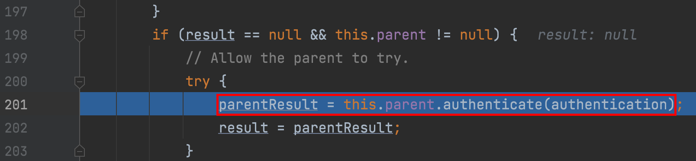
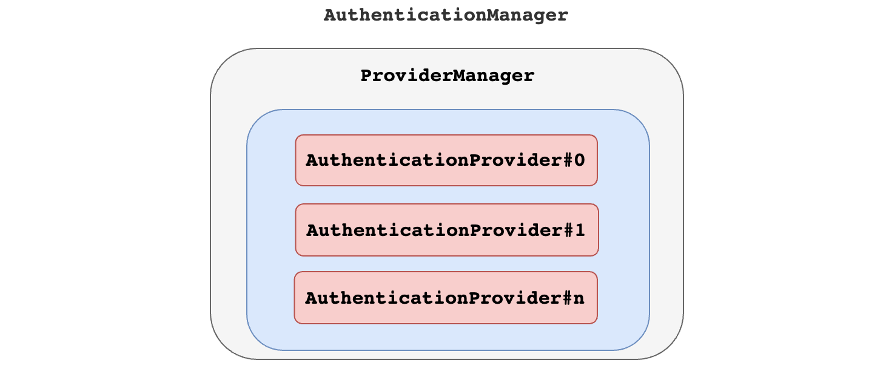

# 一、基本概念

## 1、权限管理

基本上涉及到用户参与的系统都要进行权限管理，权限管理属于系统安全的范畴，权限管理实现`对用户访问系统的控制`，按照`安全规则`或者`安全策略`控制用户`可以访问而且只能访问自己被授权的资源`。

权限管理包括用户**身份认证**和**授权**两部分，简称**认证授权**。对于需要访问控制的资源用户首先经过身份认证，认证通过后用户具有该资源的访问权限方可访问。

## 2、认证

**身份认证**，就是判断一个用户是否为合法用户的处理过程。最常用的简单身份认证方式是系统通过核对用户输入的用户名和口令，看其是否与系统中存储的该用户的用户名和口令一致，来判断用户身份是否正确。对于采用指纹等系统，则出示指纹；对于硬件Key等刷卡系统，则需要刷卡。

## 3、授权

**授权**，即访问控制，控制谁能访问哪些资源。主体进行身份认证后需要分配权限方可访问系统的资源，对于某些资源没有权限是无法访问的

## 4、解决方案

和其他领域不同，在 Java 企业级开发中，安全管理框架非常少，目前比较常见的就是：

- Shiro：Shiro 本身是一个老牌的安全管理框架，有着众多的优点，例如轻量、简单、易于集成、可以在JavaSE环境中使用等。不过，在微服务时代，Shiro 就显得力不从心了，在微服务面前和扩展方面，无法充分展示自己的优势。
- 开发者自定义：也有很多公司选择自定义权限，即自己开发权限管理。但是一个系统的安全，不仅仅是登录和权限控制这么简单，我们还要考虑种各样可能存在的网络政击以及防彻策略，从这个角度来说，开发者白己实现安全管理也并非是一件容易的事情，只有大公司才有足够的人力物力去支持这件事情。
- Spring Security：Spring Security，作为spring 家族的一员，在和 Spring 家族的其他成员如 Spring Boot Spring Clond等进行整合时，具有其他框架无可比拟的优势，同时对 OAuth2 有着良好的支持，再加上Spring Cloud对 Spring Security的不断加持（如推出 Spring Cloud Security )，让 Spring Securiy 不知不觉中成为微服务项目的首选安全管理方案。

---


# 二、Spring Security

## 1、定义

Spring Security是一个功能强大、可高度定制的身份验证和访问控制框架。它是保护基于Spring的应用程序的事实标准。

Spring Security是一个面向Java应用程序提供身份验证和安全性的框架。与所有Spring项目一样，Spring Security的真正威力在于它可以轻松地扩展以满足定制需求。

> Spring Security是一个功能强大、可高度定制的**身份验证**和**访问控制**的框架。或者说用来实现系统中权限管理的框架。

## 2、整体架构

在Spring Security的架构设计中，**认证**\<Authentication>和**授权**\<Authorization>是分开的，无论使用什么样的认证方式。都不会影响授权，这是两个独立的存在，这种独立带来的好处之一，就是可以非常方便地整合一些外部的解决方案。


### 1）认证Authentication

#### （1）AuthenticationManager

在Spring Security中认证是由`AuthenticationManager`接口来负责的，接口定义为：

```java
public interface AuthenticationManager { 
	Authentication authenticate(Authentication authentication) 
  														throws AuthenticationException;
}
```

- 返回 Authentication 表示认证成功
- 返回 AuthenticationException 异常，表示认证失败。

AuthenticationManager 主要实现类为 ProviderManager，在 ProviderManager 中管理了众多 AuthenticationProvider 实例。在一次完整的认证流程中，Spring Security 允许存在多个 AuthenticationProvider ，用来实现多种认证方式，这些 AuthenticationProvider 都是由 ProviderManager 进行统一管理的。


#### （2）Authentication

认证以及认证成功的信息主要是由 Authentication 的实现类进行保存的，其接口定义为：

```java
public interface Authentication extends Principal, Serializable {
	Collection<? extends GrantedAuthority> getAuthorities();//获取用户权限信息
	Object getCredentials();//获取用户凭证信息，一般指密码
	Object getDetails();//获取用户详细信息		
	Object getPrincipal();//获取用户身份信息，用户名、用户对象等
	boolean isAuthenticated();//用户是否认证成功
	void setAuthenticated(boolean isAuthenticated) throws IllegalArgumentException;
}
```

#### （3）SecurityContextHolder

SecurityContextHolder 用来获取登录之后用户信息。Spring Security 会将登录用户数据保存在 Session 中。但是，为了使用方便，Spring Security在此基础上还做了一些改进，其中最主要的一个变化就是线程绑定。当用户登录成功后，Spring Security 会将登录成功的用户信息保存到 SecurityContextHolder 中。SecurityContextHolder 中的数据保存默认是通过ThreadLocal 来实现的，使用 ThreadLocal 创建的变量只能被当前线程访问，不能被其他线程访问和修改，也就是用户数据和请求线程绑定在一起。当登录请求处理完毕后，Spring Security 会将 SecurityContextHolder 中的数据拿出来保存到 Session 中，同时将 SecurityContexHolder 中的数据清空。以后每当有请求到来时，Spring Security 就会先从 Session 中取出用户登录数据，保存到 SecurityContextHolder 中，方便在该请求的后续处理过程中使用，同时在请求结束时将 SecurityContextHolder 中的数据拿出来保存到 Session 中，然后将 Security SecurityContextHolder 中的数据清空。这一策略非常方便用户在 Controller、Service 层以及任何代码中获取当前登录用户数据。

### 2）授权Authorization

当完成认证后，接下米就是授权了。在 Spring Security 的授权体系中，有两个关键接口，

#### （1）AccessDecisionManager

AccessDecisionManager (访问决策管理器)，用来决定此次访问是否被允许。


#### （2）AccessDecisionVoter

AccessDecisionVoter (访问决定投票器)，投票器会检查用户是否具备应有的角色，进而投出赞成、反对或者弃权票。


AccesDecisionVoter 和 AccessDecisionManager 都有众多的实现类，在 AccessDecisionManager 中会挨个遍历 AccessDecisionVoter，进而决定是否允许用户访问，因而 AaccesDecisionVoter 和 AccessDecisionManager 两者的关系类似于 AuthenticationProvider 和 ProviderManager 的关系。

#### （3）ConfigAttribute

ConfigAttribute，用来保存授权时的角色信息。


在 Spring Security 中，用户请求一个资源(通常是一个接口或者一个 Java 方法)需要的角色会被封装成一个 ConfigAttribute 对象，在 ConfigAttribute 中只有一个 getAttribute方法，该方法返回一个 String 字符串，就是角色的名称。一般来说，角色名称都带有一个 `ROLE_` 前缀，投票器 AccessDecisionVoter 所做的事情，其实就是比较用户所具各的角色和请求某个资源所需的 ConfigAtuibute 之间的关系。

## 3、实现原理

[官网文档](https://docs.spring.io/spring-security/site/docs/5.5.4/reference/html5/#servlet-architecture)

开发者只需要引入一个依赖，就可以让 Spring Security 对应用进行保护。Spring Security 又是如何做到的呢？

在 Spring Security 中*认证、授权* 等功能都是基于**过滤器**完成的。


需要注意的是，默认过滤器并不是直接放在 Web 项目的原生过滤器链中，而是通过一个
FlterChainProxy 来统一管理。Spring Security 中的过滤器链通过 FilterChainProxy 嵌入到 Web项目的原生过滤器链中。FilterChainProxy  作为一个顶层的管理者，将统一管理 Security Filter。FilterChainProxy 本身是通过 Spring 框架提供的 DelegatingFilterProxy 整合到原生的过滤器链中。

### 1）Security Filters

那么在 Spring Security 中给我们提供那些过滤器? 默认情况下那些过滤器会被加载呢？

| 过滤器                                    | 过滤器作用                                               | 默认是否加载 |
| ----------------------------------------- | -------------------------------------------------------- | ------------ |
| ChannelProcessingFilter                   | 过滤请求协议 HTTP 、HTTPS                                | NO           |
| `WebAsyncManagerIntegrationFilter`        | 将 WebAsyncManger 与 SpringSecurity 上下文进行集成       | YES          |
| `SecurityContextPersistenceFilter`        | 在处理请求之前,将安全信息加载到 SecurityContextHolder 中 | YES          |
| `HeaderWriterFilter`                      | 处理头信息加入响应中                                     | YES          |
| CorsFilter                                | 处理跨域问题                                             | NO           |
| `CsrfFilter`                              | 处理 CSRF 攻击                                           | YES          |
| `LogoutFilter`                            | 处理注销登录                                             | YES          |
| OAuth2AuthorizationRequestRedirectFilter  | 处理 OAuth2 认证重定向                                   | NO           |
| Saml2WebSsoAuthenticationRequestFilter    | 处理 SAML 认证                                           | NO           |
| X509AuthenticationFilter                  | 处理 X509 认证                                           | NO           |
| AbstractPreAuthenticatedProcessingFilter  | 处理预认证问题                                           | NO           |
| CasAuthenticationFilter                   | 处理 CAS 单点登录                                        | NO           |
| OAuth2LoginAuthenticationFilter           | 处理 OAuth2 认证                                         | NO           |
| Saml2WebSsoAuthenticationFilter           | 处理 SAML 认证                                           | NO           |
| `UsernamePasswordAuthenticationFilter`    | 处理表单登录                                             | YES          |
| OpenIDAuthenticationFilter                | 处理 OpenID 认证                                         | NO           |
| `DefaultLoginPageGeneratingFilter`        | 配置默认登录页面                                         | YES          |
| `DefaultLogoutPageGeneratingFilter`       | 配置默认注销页面                                         | YES          |
| ConcurrentSessionFilter                   | 处理 Session 有效期                                      | NO           |
| DigestAuthenticationFilter                | 处理 HTTP 摘要认证                                       | NO           |
| BearerTokenAuthenticationFilter           | 处理 OAuth2 认证的 Access Token                          | NO           |
| `BasicAuthenticationFilter`               | 处理 HttpBasic 登录                                      | YES          |
| `RequestCacheAwareFilter`                 | 处理请求缓存                                             | YES          |
| `SecurityContextHolderAwareRequestFilter` | 包装原始请求                                             | YES          |
| JaasApiIntegrationFilter                  | 处理 JAAS 认证                                           | NO           |
| RememberMeAuthenticationFilter            | 处理 RememberMe 登录                                     | NO           |
| `AnonymousAuthenticationFilter`           | 配置匿名认证                                             | YES          |
| OAuth2AuthorizationCodeGrantFilter        | 处理OAuth2认证中授权码                                   | NO           |
| `SessionManagementFilter`                 | 处理 session 并发问题                                    | YES          |
| `ExceptionTranslationFilter`              | 处理认证/授权中的异常                                    | YES          |
| `FilterSecurityInterceptor`               | 处理授权相关                                             | YES          |
| SwitchUserFilter                          | 处理账户切换                                             | NO           |

可以看出，Spring Security 提供了 30 多个过滤器。默认情况下Spring Boot 在对 Spring Security 进入自动化配置时，会创建一个名为 SpringSecurityFilerChain 的过滤器，并注入到 Spring 容器中，这个过滤器将负责所有的安全管理，包括用户认证、授权、重定向到登录页面等。具体可以参考WebSecurityConfiguration的源码:

### 2）SpringBootWebSecurityConfiguration

这个类是 spring boot 自动配置类，通过这个源码得知，默认情况下对所有请求进行权限控制:

```java
@Configuration(proxyBeanMethods = false)
@ConditionalOnDefaultWebSecurity
@ConditionalOnWebApplication(type = Type.SERVLET)
class SpringBootWebSecurityConfiguration {
	@Bean
	@Order(SecurityProperties.BASIC_AUTH_ORDER)
	SecurityFilterChain defaultSecurityFilterChain(HttpSecurity http) 
    throws Exception {
			http.authorizeRequests().anyRequest()
      .authenticated().and().formLogin().and().httpBasic();
		return http.build();
	}
}
```

**这就是为什么在引入 Spring Security 中没有任何配置情况下，请求会被拦截的原因！**

通过上面对自动配置分析，我们也能看出默认生效条件为：

```java
class DefaultWebSecurityCondition extends AllNestedConditions {

	DefaultWebSecurityCondition() {
		super(ConfigurationPhase.REGISTER_BEAN);
	}

	@ConditionalOnClass({ SecurityFilterChain.class, HttpSecurity.class })
	static class Classes {

	}

	@ConditionalOnMissingBean({ WebSecurityConfigurerAdapter.class, SecurityFilterChain.class })
	static class Beans {

	}

}
```

- 条件一 classpath中存在 SecurityFilterChain.class, HttpSecurity.class（肯定有）
- 条件二 没有自定义 WebSecurityConfigurerAdapter.class, SecurityFilterChain.class

默认情况下，条件都是满足的。WebSecurityConfigurerAdapter 这个类极其重要，Spring Security 核心配置都在这个类中：


如果要对 Spring Security 进行自定义配置，就要自定义这个类实例，通过覆盖类中方法达到修改默认配置的目的。

### 3）流程分析


1. 请求 /hello 接口，在引入 spring security 之后会先经过一系列过滤器；
2. 在请求到达 FilterSecurityInterceptor时，发现请求并未认证。请求拦截下来，并抛出 AccessDeniedException 异常。
3. 抛出 AccessDeniedException 的异常会被 ExceptionTranslationFilter 捕获，这个 Filter 中会调用 LoginUrlAuthenticationEntryPoint#commence 方法给客户端返回 302，要求客户端进行重定向到 /login 页面。
4. 客户端发送 /login 请求。
5. /login 请求会再次被拦截器中 DefaultLoginPageGeneratingFilter 拦截到，并在拦截器中返回生成登录页面。

**就是通过这种方式，Spring Security 默认过滤器中生成了登录页面，并返回！**

### 4）默认用户生成

1. 查看 SpringBootWebSecurityConfiguration#defaultSecurityFilterChain 方法表单登录


2. 处理登录为 FormLoginConfigurer 类中 调用 UsernamePasswordAuthenticationFilter这个类实例


3. 查看类中 UsernamePasswordAuthenticationFilter#attempAuthentication 方法得知实际调用 AuthenticationManager 中 authenticate 方法


4. 调用 ProviderManager 类中方法 authenticate



5. 调用了 ProviderManager 实现类中 AbstractUserDetailsAuthenticationProvider类中方法


6. 最终调用实现类 DaoAuthenticationProvider 类中方法比较


### 5）UserDetailService

通过刚才源码分析也能得知 UserDetailService 是顶层父接口，接口中 loadUserByUserName 方法是用来在认证时进行用户名认证方法，默认实现使用是内存实现，如果想要修改数据库实现我们只需要自定义 UserDetailService 实现，最终返回 UserDetails 实例即可。

```java
public interface UserDetailsService {
	UserDetails loadUserByUsername(String username) throws UsernameNotFoundException;
}
```


### 6）UserDetailsServiceAutoConfiguration

梳理关键部分：

```java
@Configuration(proxyBeanMethods = false)
@ConditionalOnClass(AuthenticationManager.class)
@ConditionalOnBean(ObjectPostProcessor.class)
@ConditionalOnMissingBean(
		value = { AuthenticationManager.class, AuthenticationProvider.class, UserDetailsService.class,
				AuthenticationManagerResolver.class },
		type = { "org.springframework.security.oauth2.jwt.JwtDecoder",
				"org.springframework.security.oauth2.server.resource.introspection.OpaqueTokenIntrospector",
				"org.springframework.security.oauth2.client.registration.ClientRegistrationRepository" })
public class UserDetailsServiceAutoConfiguration {
  //....
  @Bean
	@Lazy
	public InMemoryUserDetailsManager inMemoryUserDetailsManager(SecurityProperties properties,
			ObjectProvider<PasswordEncoder> passwordEncoder) {
		SecurityProperties.User user = properties.getUser();
		List<String> roles = user.getRoles();
		return new InMemoryUserDetailsManager(
				User.withUsername(user.getName()).password(getOrDeducePassword(user, passwordEncoder.getIfAvailable()))
						.roles(StringUtils.toStringArray(roles)).build());
	}
  //...
}
```

**结论：**

1. 从自动配置源码中得知当 classpath 下存在 AuthenticationManager 类
2. 当前项目中，系统没有提供 AuthenticationManager.class、 AuthenticationProvider.class、UserDetailsService.class、
   	AuthenticationManagerResolver.class、实例

**默认情况下都会满足，此时Spring Security会提供一个 InMemoryUserDetailsManager 实例**


```java
@ConfigurationProperties(prefix = "spring.security")
public class SecurityProperties {
	private final User user = new User();
	public User getUser() {
		return this.user;
  }
  //....
	public static class User {
		private String name = "user";
		private String password = UUID.randomUUID().toString();
		private List<String> roles = new ArrayList<>();
		private boolean passwordGenerated = true;
		//get set ...
	}
}
```

**这就是默认生成 user 以及 uuid 密码过程! 另外看明白源码之后，就知道只要在配置文件中加入如下配置可以对内存中用户和密码进行覆盖。**

```properties
spring.security.user.name=root
spring.security.user.password=root
spring.security.user.roles=admin,users
```

### 7）总结

- AuthenticationManager、ProviderManger、以及 AuthenticationProvider 关系



- **WebSecurityConfigurerAdapter** 扩展 Spring Security 所有默认配置


- **UserDetailService** 用来修改默认认证的数据源信息


# 三、实战

