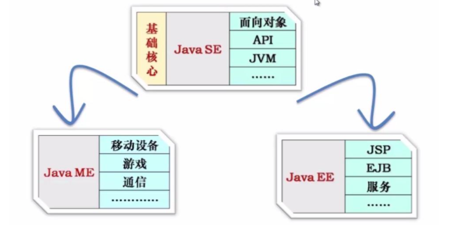
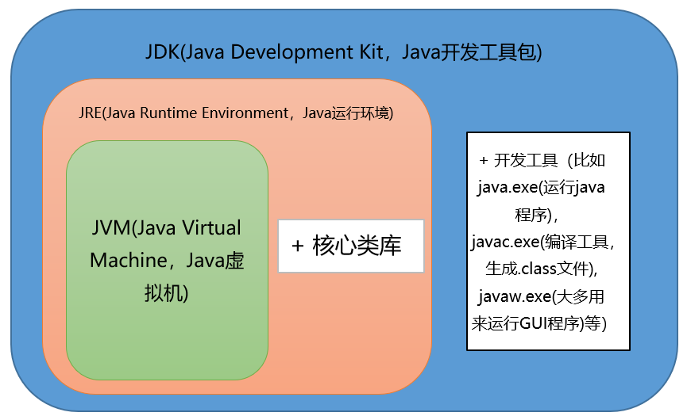
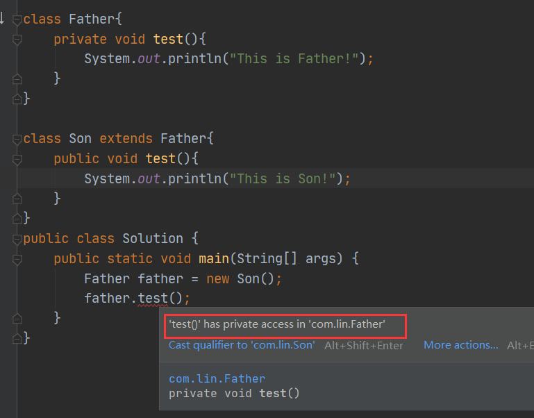
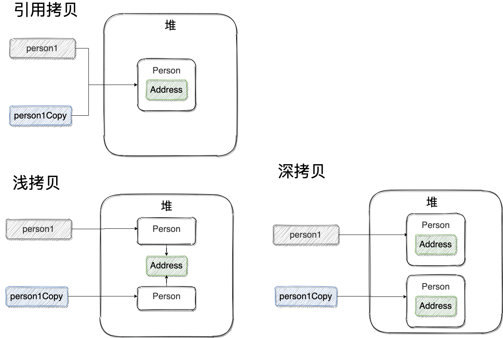
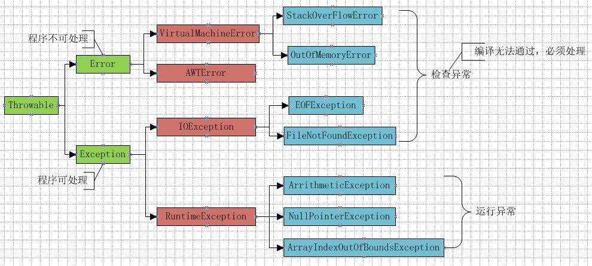
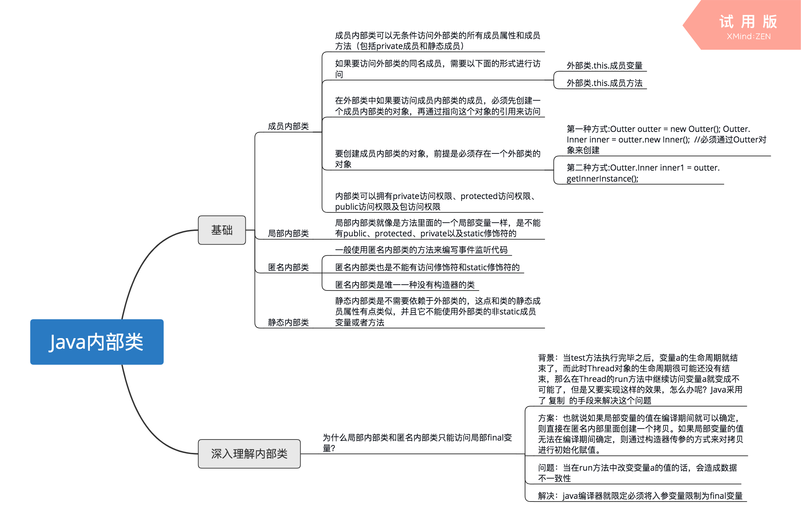
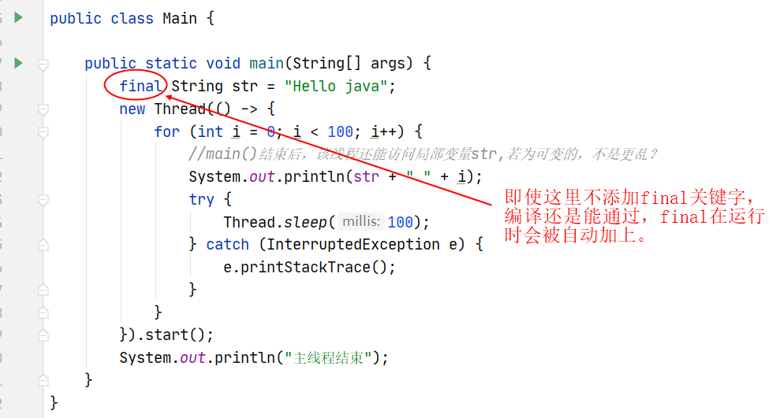

# Java基础

## 1、Java的3种开发方向



- JavaSE，标准版，主要用于开发和部署桌面、服务器以及嵌入设备和实时环境中的Java应用程序。例如，Java应用程序开发平台Eclipse。
- JavaEE，企业版，主要针对企业应用的开发。例如，电子商务网站、ERP系统。
- JavaME，微型版，主要针对消费类电子设备的。例如，蜂窝电话和可视电话、数字机顶盒、汽车导航系统等等。

## 2、Java语言有哪些特点

1. **简单易学；**

2. **面向对象（封装，继承，多态）；**

   面向对象是指以对象为基本粒度，其下包含属性和方法。对象的说明用属性表达，而通过使用方法来操作这个对象。

3. **平台无关性（ Java 虚拟机实现平台无关性）；**

   所谓的跨平台性，是指软件可以不受计算机硬件和操作系统的约束而在任意计算机环境下正常运行。

   （ Java自带的虚拟机很好地实现了跨平台性。 Java源程序代码经过编译后生成二进制的字节码是与平台无关的，但是可被Java虚拟机识别的一种机器码指令。 Java虚拟机提供了一个字节码到底层硬件平台及操作系统的屏障，使得Java语言具备跨平台性。）

4. **支持多线程；**

5. **可靠性；**

6. **安全性；**

   安全性可以分为四个层面，即语言级安全性、编译时安全性、运行时安全性、可执行代码安全性。

   语言级安全性指Java的数据结构是完整的对象，这些封装过的数据类型具有安全性。

   编译时要进行Java语言和语义的检查，保证每个变量对应一个相应的值，编译后生成Java类。

   运行时Java类需要类加载器载入www jxzxmr net，并经由字节码校验器校验之后才可以运行。

   Java类在网络上使用时，对它的权限进行了设置，保证了被访问用户的安全性。

7. **支持网络编程**并且很方便（ Java 语言诞生本身就是为简化网络编程设计的，因此 Java 语言不仅支持网络编程而且很方便）；

8. **编译与解释并存；**

## 3、JDK和JRE和JVM的区别

**1）JDK：**Java Development Kit的简称，java开发工具包，提供了java的开发环境和运行环境；

**2）JRE：**Java Runtime Environment的简称，java运行环境，为Java的运行提供了所需环境。

**3）JVM：**Java 虚拟机（JVM）是运行 Java 字节码的虚拟机。JVM 有针对不同系统的特定实现（Windows，Linux，macOS），目的是使用相同的字节码，它们都会给出相同的结果。



## 4、什么是字节码?采用字节码的好处是什么?

在 Java 中，JVM 可以理解的代码就叫做字节码（即扩展名为 `.class` 的文件），它不面向任何特定的处理器，只面向虚拟机。Java 语言通过字节码的方式，在一定程度上解决了传统解释型语言执行效率低的问题，同时又保留了解释型语言可移植的特点。所以， Java 程序运行时相对来说还是高效的（不过，和 C++，Rust，Go 等语言还是有一定差距的），而且，由于字节码并不针对一种特定的机器，因此，Java 程序无须重新编译便可在多种不同操作系统的计算机上运行。

**Java 程序从源代码到运行的过程如下图所示：**


我们需要格外注意的是 `.class->机器码` 这一步。在这一步 JVM 类加载器首先加载字节码文件，然后通过解释器逐行解释执行，这种方式的执行速度会相对比较慢。而且，有些方法和代码块是经常需要被调用的(也就是所谓的热点代码)，所以后面引进了 JIT（just-in-time compilation） 编译器，而 JIT 属于运行时编译。当 JIT 编译器完成第一次编译后，其会将字节码对应的机器码保存下来，下次可以直接使用。而我们知道，机器码的运行效率肯定是高于 Java 解释器的。这也解释了我们为什么经常会说 **Java 是编译与解释共存的语言** 。

## 5、为什么说 Java 语言“编译与解释并存”？

我们可以将高级编程语言按照程序的执行方式分为两种：

- **编译型** ：编译型语言 会通过编译器将源代码一次性翻译成可被该平台执行的机器码。一般情况下，编译语言的执行速度比较快，开发效率比较低。常见的编译性语言有 C、C++、Go、Rust 等等。
- **解释型** ：解释型语言会通过解释器一句一句的将代码解释（interpret）为机器代码后再执行。解释型语言开发效率比较快，执行速度比较慢。常见的解释性语言有 Python、JavaScript、PHP 等等。


Java 语言既具有编译型语言的特征，也具有解释型语言的特征。因为 Java 程序要经过先编译，后解释两个步骤，由 Java 编写的程序需要先经过编译步骤，生成字节码（`.class` 文件），这种字节码必须由 Java 解释器来解释执行。

## 6、Oracle JDK和Open JDK的区别

1. Oracle JDK版本将每三年发布一次，而OpenJDK版本每三个月发布一次；

2. OpenJDK 是一个参考模型并且是完全开源的，而Oracle JDK是OpenJDK的一个实现，并不是完全开源的；

3. Oracle JDK 比 OpenJDK 更稳定。OpenJDK和Oracle JDK的代码几乎相同，但Oracle JDK有更多的类和一些错误修复。因此，如果您想开发企业/商业软件，我建议您选择Oracle JDK，因为它经过了彻底的测试和稳定。某些情况下，有些人提到在使用OpenJDK 可能会遇到了许多应用程序崩溃的问题，但是，只需切换到Oracle JDK就可以解决问题；

4. 在响应性和JVM性能方面，Oracle JDK与OpenJDK相比提供了更好的性能；

5. Oracle JDK不会为即将发布的版本提供长期支持，用户每次都必须通过更新到最新版本获得支持来获取最新版本；

6. Oracle JDK根据二进制代码许可协议获得许可，而OpenJDK根据GPL v2许可获得许可。


## 7、Java和C++的区别

- 都是面向对象的语言，都支持封装、继承和多态；
- Java不提供指针来直接访问内存，程序内存更加安全；
- Java的类是单继承的，C++支持多重继承；虽然Java的类不可以多继承，但是接口可以多继承；
- Java有自动内存管理机制，不需要程序员手动释放无用内存。


## 8、面向对象和面向过程的区别

### 1） 面向过程

- 优点：性能比面向对象高，因为类调用时需要实例化，开销比较大，比较消耗资源;比如单片机、嵌入式开发、 Linux/Unix等一般采用面向过程开发，性能是最重要的因素；
- 缺点：没有面向对象易维护、易复用、易扩展。

### 2）面向对象

- 优点：易维护、易复用、易扩展，由于面向对象有封装、继承、多态性的特性，可以设计出低耦合的系统，使系统 更加灵活、更加易于维护；
- 缺点：性能比面向过程低。


## 9、面向对象的三大特征

### 1）封装

**概念**

封装就是把同一类事物的共性（包括属性和方法）归到同一类中，方便使用。

**优点**

1. 将变化隔离
2. 便于使用
3. 提高重用性
4. 提高安全性

 **缺点**

将变量等使用private修饰，或者封装进方法内，使其不能直接被访问，增加了访问步骤与难度！

### 2）继承

**概念**

多个类具有共同的属性（成员变量）与行为（成员方法）的时候，将这些共同的部分抽取出来定义到一个公共的类中，其他及各类可以与这个公共的类形成继承关系，从而在多个类中不需要重复定义公共部分!这个公共的类就是父类，也称为超类或者基类，其他的类就是子类。子类可以直接访问父类的非私有化成员变量，访问父类的私有化成员变量可以使用super.get()方法。

**优点**

1. 减少代码量，能很好的提高复用率。
2. 使类与类之间存在继承关系，是实现多态操作的前提。

**缺点**

继承使得多个类之间具有了子父类关系，当一个类存在多个子类的时候，如果父类发生变化，那么这些子类会跟着一同变化，造成类与类之间的“强耦合”关系！

### 3）多态

**概念**

多态（重载和覆盖）指的是对象的多种形态。

引用多态和方法多态。**继承是多态的实现基础**。

**多态的前提**

A.必须有子类和父类，具有继承或实现（继承）   

B.子类必须重写父类的方法（重写）   

C.父类的引用变量指向子类的对象（向上转型）

**多态的优点**

  A. 可替换性，多态对一存在的代码具有可替代性

  B. 可扩充性：增加的子类不影响已存在的类的特性的运行和操作

  C. 接口性：多态时超类通过方法签名想子类提供了一个公共的接口，由子类来完善或者覆盖它而实现的

  D. 灵活性：在应用中体现了灵活多样的操作，提高了使用的效率

  E. 简化性： 多态简化对应用软件的代码的编写和修改过程，尤其在处理大量的对象的运算和操作时，这个特点尤为突出和重要

**多态的缺点**

只能使用父类的引用访问父类的成员。


## 10、8种基本数据类型所占位数

| 数据类型 | 类型名称     | 所占位数                                         | 初始值 |
| -------- | ------------ | ------------------------------------------------ | ------ |
| byte     | 字节型       | 1字节                                            | 0      |
| char     | 字符型       | 2字节                                            | 空格   |
| short    | 短整型       | 2字节                                            | 0      |
| int      | 整型         | 4字节                                            | 0      |
| long     | 长整型       | 8字节                                            | 0L     |
| float    | 单精度浮点型 | 4字节                                            | 0.0f   |
| double   | 双精度浮点型 | 8字节                                            | 0.0d   |
| boolean  | 布尔型       | java未明确指出的大小<br>(可能1bit、1byte、4byte) | false  |


## 11、Java 中有哪些常见的关键字？

| 分类                 | 关键字   |            |          |              |            |           |        |
| -------------------- | -------- | ---------- | -------- | ------------ | ---------- | --------- | ------ |
| 访问控制             | private  | protected  | public   |              |            |           |        |
| 类，方法和变量修饰符 | abstract | class      | extends  | final        | implements | interface | native |
|                      | new      | static     | strictfp | synchronized | transient  | volatile  |        |
| 程序控制             | break    | continue   | return   | do           | while      | if        | else   |
|                      | for      | instanceof | switch   | case         | default    |           |        |
| 错误处理             | try      | catch      | throw    | throws       | finally    |           |        |
| 包相关               | import   | package    |          |              |            |           |        |
| 基本类型             | boolean  | byte       | char     | double       | float      | int       | long   |
|                      | short    | null       | true     | false        |            |           |        |
| 变量引用             | super    | this       | void     |              |            |           |        |
| 保留字               | goto     | const      |          |              |            |           |        |


## 12、continue、break 和 return 的区别是什么？

在循环结构中，当循环条件不满足或者循环次数达到要求时，循环会正常结束。但是，有时候可能需要在循环的过程中，当发生了某种条件之后 ，提前终止循环，这就需要用到下面几个关键词：

1. `continue` ：指跳出当前的这一次循环，继续下一次循环。
2. `break` ：指跳出整个循环体，继续执行循环下面的语句。

`return` 用于跳出所在方法，结束该方法的运行。return 一般有两种用法：

1. `return;` ：直接使用 return 结束方法执行，用于没有返回值函数的方法
2. `return value;` ：return 一个特定值，用于有返回值函数的方法


## 13、静态方法为什么不能调用非静态成员?

这个需要结合 JVM 的相关知识，主要原因如下：

1. 静态方法是属于类的，在类加载的时候就会分配内存，可以通过类名直接访问。而非静态成员属于实例对象，只有在对象实例化之后才存在，需要通过类的实例对象去访问。
2. 在类的非静态成员不存在的时候静态成员就已经存在了，此时调用在内存中还不存在的非静态成员，属于非法操作。


## 14、重载（Overload）和重写（Override）的区别。

方法的重载和重写都是实现多态的方式，区别在于前者实现的是编译时的多态性，而后者实现的是运行时的多态性。

重载：发生在同一个类中，方法名相同参数列表不同（参数类型不同、个数不同、顺序不同），与方法返回值和访问修饰符无关，即重载的方法不能根据返回类型进行区分；

重写：发生在父子类中，方法名、参数列表必须相同，返回值小于等于父类，抛出的异常小于等于父类，访问修饰符大于等于父类（里氏代换原则）；如果父类方法访问修饰符为private则子类中就不是重写。




## 15、泛型

> [泛型知识点深入学习](/notes/java/泛型深入学习)

### 1）Java 泛型了解么？什么是类型擦除？

**Java 泛型（generics）** 是 JDK 5 中引入的一个新特性, 泛型提供了**编译时类型安全检测机制**，该机制允许程序员在编译时检测到非法的类型。泛型的本质是参数化类型，也就是说所操作的数据类型被指定为一个参数。

Java 的泛型是伪泛型，这是因为 Java 在运行期间，所有的泛型信息都会被擦掉，这也就是通常所说类型擦除 。

泛型一般有三种使用方式: 泛型类、泛型接口、泛型方法。

### 2）介绍一下常用的通配符？

- ？ 表示不确定的 Java 类型
- T (type) 表示具体的一个 Java 类型
- K V (key value) 分别代表 Java 键值中的 Key Value
- E (element) 代表 Element

### 3）你的项目中哪里用到了泛型？

- 可用于定义通用返回结果 `CommonResult<T>` 通过参数 `T` 可根据具体的返回类型动态指定结果的数据类型
- 定义 `Excel` 处理类 `ExcelUtil<T>` 用于动态指定 `Excel` 导出的数据类型
- 用于构建集合工具类。参考 `Collections` 中的 `sort`, `binarySearch` 方法
- ......

## 16、== 和 equals() 的区别

**`==`** 对于基本类型和引用类型的作用效果是不同的：

- 对于基本数据类型来说，`==` 比较的是值。
- 对于引用数据类型来说，`==` 比较的是对象的内存地址。

> 因为 Java 只有值传递，所以，对于 == 来说，不管是比较基本数据类型，还是引用数据类型的变量，其本质比较的都是值，只是引用类型变量存的值是对象的地址。

**`equals()`** 作用不能用于判断基本数据类型的变量，只能用来判断两个对象是否相等。`equals()`方法存在于`Object`类中，而`Object`类是所有类的直接或间接父类。

`Object` 类 `equals()` 方法：

```java
public boolean equals(Object obj) {
     return (this == obj);
}Copy to clipboardErrorCopied
```

`equals()` 方法存在两种使用情况：

- **类没有覆盖 `equals()`方法** ：通过`equals()`比较该类的两个对象时，等价于通过“==”比较这两个对象，使用的默认是 `Object`类`equals()`方法。
- **类覆盖了 `equals()`方法** ：一般我们都覆盖 `equals()`方法来比较两个对象中的属性是否相等；若它们的属性相等，则返回 true(即，认为这两个对象相等)。


## 17、为什么重写 equals() 时必须重写 hashCode() 方法？

重写hashCode()和equals()方法；

重写hashCode()是因为需要计算存储数据的存储位置，需要注意不要试图从散列码计算中排除掉一个对象的关键部分来提高性能，这样虽然能更快但可能会导致更多的Hash碰撞；

重写equals()方法，需要遵守自反性、对称性、传递性、一致性以及对于任何非null的引用值x，x.equals(null)必须返回false的这几个特性，目的是为了保证key在哈希表中的唯一性。

> 详解
>
> 当你使用Object类作为map的key时，如果你不从写hashcode方法，那么他会继承父类，对整个类进行hashcode计算，如果碰到两个对象中的属性都是一样的，实际生活场景我们希望比较的是它的内容是否相同，而不是它存储的地址是否相同，并且两个不同对象的地址也不可能相同，而要比较他们是否相同，得先让他们放到同一个map中的bucket位置。重写hashcode方法后，如果我们不重写它的equals方法，那么当发生两个相同对象（指的是属性相同，但是两个不同对象）hash碰撞时（此时两个对象的hashcode相同），当使用equals方法判断时，还是会去比较两个key的地址是否相同，如果不重写equals方法，map将以链表（或二叉树）的形式将这两个对象存储在一个bucker的位置。

[笔试题：重写了hashcode方法和equals方法，竟然能存放两个相同的对象！！！](/notes/java/笔试题)

## 18、为什么HashMap中String、Integer这样的包装类适合作为Key

- String、Integer等包装类的特性能够保证Hash值的不可更改性和计算准确性，能够有效的减少Hash碰撞的几率；
- 都是final类型，即不可变性，保证key的不可更改性，不会存在获取hash值不同的情况；
- 内部已重写了equals()、hashCode()等方法，遵守了HashMap内部的规范，不容易出现Hash值计算错误的情况。


## 19、为什么String是不可变类

简单的来说：`String` 类中使用 `final` 关键字修饰字符数组来保存字符串，~~所以`String` 对象是不可变的。~~

```java
public final class String implements java.io.Serializable, Comparable<String>, CharSequence {
    private final char value[];
    //...
}
```

**这个说法是错误的。**

我们知道被 `final` 关键字修饰的类不能被继承，修饰的方法不能被重写，修饰的变量是基本数据类型则值不能改变，修饰的变量是引用类型则不能再指向其他对象。因此，`final` 关键字修饰的数组保存字符串并不是 `String` 不可变的根本原因，因为这个数组保存的字符串是可变的（`final` 修饰引用类型变量的情况）。

`String` 真正不可变有下面几点原因：

1. 保存字符串的数组被 `final` 修饰且为私有的，并且`String` 类没有提供/暴露修改这个字符串的方法。
2. `String` 类被 `final` 修饰导致其不能被继承，进而避免了子类破坏 `String` 不可变。


## 20、自动装箱与拆箱

### 1）什么是自动拆装箱？

- **装箱**：将基本类型用它们对应的引用类型包装起来；
- **拆箱**：将包装类型转换为基本数据类型；

### 2）它的原理是什么？

```java
Integer i = 10;  //装箱
int n = i;   //拆箱
```

上面这两行代码对应的字节码为：

```shell
L1

    LINENUMBER 8 L1

    ALOAD 0

    BIPUSH 10

    INVOKESTATIC java/lang/Integer.valueOf (I)Ljava/lang/Integer;

    PUTFIELD AutoBoxTest.i : Ljava/lang/Integer;

   L2

    LINENUMBER 9 L2

    ALOAD 0

    ALOAD 0

    GETFIELD AutoBoxTest.i : Ljava/lang/Integer;

    INVOKEVIRTUAL java/lang/Integer.intValue ()I

    PUTFIELD AutoBoxTest.n : I

    RETURN
```

从字节码中，我们发现装箱其实就是调用了 包装类的`valueOf()`方法，拆箱其实就是调用了 `xxxValue()`方法。

因此，

- `Integer i = 10` 等价于 `Integer i = Integer.valueOf(10)`
- `int n = i` 等价于 `int n = i.intValue()`;

注意：**如果频繁拆装箱的话，也会严重影响系统的性能。我们应该尽量避免不必要的拆装箱操作。**

```java
private static long sum() {
    // 应该使用 long 而不是 Long
    Long sum = 0L;
    for (long i = 0; i <= Integer.MAX_VALUE; i++)
        sum += i;
    return sum;
}
```


## 21、Integer和int的区别？在什么时候用Integer和什么时候用int

int是java提供的8种原始数据类型之一。

Java为每个原始类型提供了封装类，Integer是java为int提供的封装类。

int的默认值为0，而Integer的默认值为null。Integer可以区分出未赋值和值为0的区别，int则无法表达出未赋值的情况，例如，要想表达出没有参加考试和考试成绩为0的区别，则只能使用Integer。


## 22、成员变量与局部变量的区别

1. 从语法形式上看，成员变量是属于类的，而局部变量是在代码块或方法中定义的变量或是方法的参数；成员变量可以被 `public`,`private`,`static` 等修饰符所修饰，而局部变量不能被访问控制修饰符及 `static` 所修饰；但是，成员变量和局部变量都能被 `final` 所修饰。
2. 从变量在内存中的存储方式来看,如果成员变量是使用 `static` 修饰的，那么这个成员变量是属于类的，如果没有使用 `static` 修饰，这个成员变量是属于实例的。而对象存在于堆内存，局部变量则存在于栈内存。
3. 从变量在内存中的生存时间上看，成员变量是对象的一部分，它随着对象的创建而存在，而局部变量随着方法的调用而自动消失。
4. 从变量是否有默认值来看，成员变量如果没有被赋初，则会自动以类型的默认值而赋值（一种情况例外:被 `final` 修饰的成员变量也必须显式地赋值），而局部变量则不会自动赋值。


## 23、深拷贝和浅拷贝区别？

关于深拷贝和浅拷贝区别，我这里先给结论：

- **浅拷贝**：浅拷贝会在堆上创建一个新的对象（区别于引用拷贝的一点），不过，如果原对象内部的属性是引用类型的话，浅拷贝会直接复制内部对象的引用地址，也就是说拷贝对象和原对象共用同一个内部对象。
- **深拷贝** ：深拷贝会完全复制整个对象，包括这个对象所包含的内部对象。

下面我们来看一个具体的案例：

**浅拷贝**

浅拷贝的示例代码如下，我们这里实现了 `Cloneable` 接口，并重写了 `clone()` 方法。

`clone()` 方法的实现很简单，直接调用的是父类 `Object` 的 `clone()` 方法。

```java
public class Address implements Cloneable{
    private final String name;
    // 省略构造函数、Getter&Setter方法
    @Override
    public Address clone() {
        try {
            return (Address) super.clone();
        } catch (CloneNotSupportedException e) {
            throw new AssertionError();
        }
    }
}

public class Person implements Cloneable {
    private Address address;
    // 省略构造函数、Getter&Setter方法
    @Override
    public Person clone() {
        try {
            Person person = (Person) super.clone();
            return person;
        } catch (CloneNotSupportedException e) {
            throw new AssertionError();
        }
    }
}
```

测试

```java
Person person1 = new Person(new Address("武汉"));
Person person1Copy = person1.clone();
// true
System.out.println(person1.getAddress() == person1Copy.getAddress());
```

从输出结构就可以看出， `person1` 的克隆对象和 `person1` 使用的仍然是同一个 `Address` 对象。

**深拷贝**

这里我们简单对 `Person` 类的 `clone()` 方法进行修改，连带着要把 `Person` 对象内部的 `Address` 对象一起复制。

```java
@Override
public Person clone() {
    try {
        Person person = (Person) super.clone();
        person.setAddress(person.getAddress().clone());
        return person;
    } catch (CloneNotSupportedException e) {
        throw new AssertionError();
    }
}Copy to clipboardErrorCopied
```

测试 ：

```java
Person person1 = new Person(new Address("武汉"));
Person person1Copy = person1.clone();
// false
System.out.println(person1.getAddress() == person1Copy.getAddress());Copy to clipboardErrorCopied
```

从输出结构就可以看出，虽然 `person1` 的克隆对象和 `person1` 包含的 `Address` 对象已经是不同的了。


## 24、什么是引用拷贝？

简单来说，引用拷贝就是两个不同的引用指向同一个对象。




## 25、异常

### 1）Java异常架构




### 2）受检异常与非受检异常

Java 的所有异常可以分为受检异常（checked exception）和非受检异常（unchecked exception）。

**1）受检异常**

编译器要求必须处理的异常。正确的程序在运行过程中，经常容易出现的、符合预期的异常情况。一旦发生此类异常，就必须采用某种方式进行处理。除 RuntimeException 及其子类外，其他的 Exception 异常都属于受检异常。编译器会检查此类异常，也就是说当编译器检查到应用中的某处可能会此类异常时，将会提示你处理本异常——要么使用try-catch捕获，要么使用方法签名中用 throws 关键字抛出，否则编译不通过。

**2）非受检异常**

编译器不会进行检查并且不要求必须处理的异常，也就说当程序中出现此类异常时，即使我们没有try-catch捕获它，也没有使用throws抛出该异常，编译也会正常通过。该类异常包括运行时异常**（RuntimeException极其子类）和错误（Error）。**


### 3）异常关键字

**• try** – 用于监听。将要被监听的代码(可能抛出异常的代码)放在try语句块之内，当try语句块内发生异常时，异常就被抛出。

**• catch** – 用于捕获异常。catch用来捕获try语句块中发生的异常。

**• finally** – finally语句块总是会被执行。它主要用于回收在try块里打开的物力资源(如数据库连接、网络连接和磁盘文件)。只有finally块，执行完成之后，才会回来执行try或者catch块中的return或者throw语句，如果finally中使用了return或者throw等终止方法的语句，则就不会跳回执行，直接停止。

**• throw** – 用于抛出异常。

**• throws** – 用在方法签名中，用于声明该方法可能抛出的异常。


### 4）Error 和 Exception 区别是什么

- Error 类型的错误通常为虚拟机相关错误，如系统崩溃，内存不足，堆栈溢出等，编译器不会对这类错误进行检测，JAVA 应用程序也不应对这类错误进行捕获，一旦这类错误发生，通常应用程序会被终止，仅靠应用程序本身无法恢复；

- Exception 类的错误是可以在应用程序中进行捕获并处理的，通常遇到这种错误，应对其进行处理，使应用程序可以继续正常运行。


### 5）使用 try-with-resources 来代替try-catch-finally

1. **适用范围（资源的定义）：** 任何实现 `java.lang.AutoCloseable`或者 `java.io.Closeable` 的对象
2. **关闭资源和 finally 块的执行顺序：** 在 `try-with-resources` 语句中，任何 catch 或 finally 块在声明的资源关闭后运行

> 《Effecitve Java》中明确指出：
>
> 面对必须要关闭的资源，我们总是应该优先使用 `try-with-resources` 而不是`try-finally`。随之产生的代码更简短，更清晰，产生的异常对我们也更有用。`try-with-resources`语句让我们更容易编写必须要关闭的资源的代码，若采用`try-finally`则几乎做不到这点。

Java 中类似于`InputStream`、`OutputStream` 、`Scanner` 、`PrintWriter`等的资源都需要我们调用`close()`方法来手动关闭，一般情况下我们都是通过`try-catch-finally`语句来实现这个需求，如下：

```java
//读取文本文件的内容
Scanner scanner = null;
try {
    scanner = new Scanner(new File("D://read.txt"));
    while (scanner.hasNext()) {
        System.out.println(scanner.nextLine());
    }
} catch (FileNotFoundException e) {
    e.printStackTrace();
} finally {
    if (scanner != null) {
        scanner.close();
    }
}Copy to clipboardErrorCopied
```

使用 Java 7 之后的 `try-with-resources` 语句改造上面的代码:

```java
try (Scanner scanner = new Scanner(new File("test.txt"))) {
    while (scanner.hasNext()) {
        System.out.println(scanner.nextLine());
    }
} catch (FileNotFoundException fnfe) {
    fnfe.printStackTrace();
}Copy to clipboardErrorCopied
```

当然多个资源需要关闭的时候，使用 `try-with-resources` 实现起来也非常简单，如果你还是用`try-catch-finally`可能会带来很多问题。

通过使用**分号分隔**，可以在`try-with-resources`块中声明多个资源。

```java
try (BufferedInputStream bin = new BufferedInputStream(new FileInputStream(new File("test.txt")));
     BufferedOutputStream bout = new BufferedOutputStream(new FileOutputStream(new File("out.txt")))) {
    int b;
    while ((b = bin.read()) != -1) {
        bout.write(b);
    }
}
catch (IOException e) {
    e.printStackTrace();
}
```


## 26、I/O流

### 1）什么是序列化？什么是反序列化？

如果我们需要持久化 Java 对象比如将 Java 对象保存在文件中，或者在网络传输 Java 对象，这些场景都需要用到序列化。

简单来说：

- **序列化**： 将数据结构或对象转换成二进制字节流的过程
- **反序列化**：将在序列化过程中所生成的二进制字节流转换成数据结构或者对象的过程

序列化的主要目的是通过网络传输对象或者说是将对象存储到文件系统、数据库、内存中。

### 2）Java 序列化中如果有些字段不想进行序列化，怎么办？

对于不想进行序列化的变量，使用 `transient` 关键字修饰。

`transient` 关键字的作用是：阻止实例中那些用此关键字修饰的的变量序列化；当对象被反序列化时，被 `transient` 修饰的变量值不会被持久化和恢复。

> 关于 `transient` 还有几点注意：
>
> - `transient` 只能修饰变量，不能修饰类和方法。
> - `transient` 修饰的变量，在反序列化后变量值将会被置成类型的默认值。例如，如果是修饰 `int` 类型，那么反序列后结果就是 `0`。
> - `static` 变量因为不属于任何对象(Object)，所以无论有没有 `transient` 关键字修饰，均不会被序列化。

### 3）获取用键盘输入常用的两种方法

方法 1：通过 `Scanner`

```java
Scanner input = new Scanner(System.in);
String s  = input.nextLine();
input.close();Copy to clipboardErrorCopied
```

方法 2：通过 `BufferedReader`

```java
BufferedReader input = new BufferedReader(new InputStreamReader(System.in));
String s = input.readLine();
```

### 4）Java 中 IO 流分为几种?

- 按照流的流向分，可以分为输入流和输出流；
- 按照操作单元划分，可以划分为字节流和字符流；
- 按照流的角色划分为节点流和处理流。

Java IO 流共涉及 40 多个类，这些类看上去很杂乱，但实际上很有规则，而且彼此之间存在非常紧密的联系， Java IO 流的 40 多个类都是从如下 4 个抽象类基类中派生出来的。

- InputStream/Reader: 所有的输入流的基类，前者是字节输入流，后者是字符输入流。
- OutputStream/Writer: 所有输出流的基类，前者是字节输出流，后者是字符输出流。

按操作方式分类结构图：


按操作对象分类结构图：


### 5）既然有了字节流,为什么还要有字符流？

（问题本质：不管是文件读写还是网络发送接收，信息的最小存储单元都是字节，那为什么 I/O 流操作要分为字节流操作和字符流操作呢？）

字符流是由 Java 虚拟机将字节转换得到的，问题就出在这个过程还算是非常耗时，并且，如果我们不知道编码类型就很容易出现乱码问题。所以， I/O 流就干脆提供了一个直接操作字符的接口，方便我们平时对字符进行流操作。如果音频文件、图片等媒体文件用字节流比较好，如果涉及到字符的话使用字符流比较好。

## 27、内部类



局部内部类和匿名内部类只能访问局部final变量：



