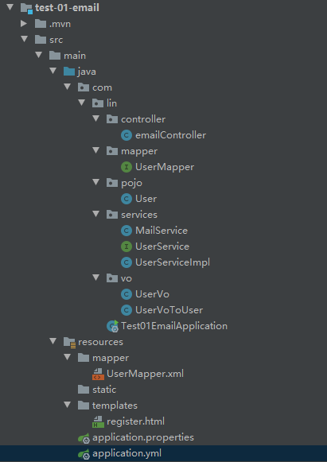
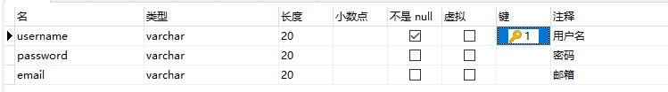
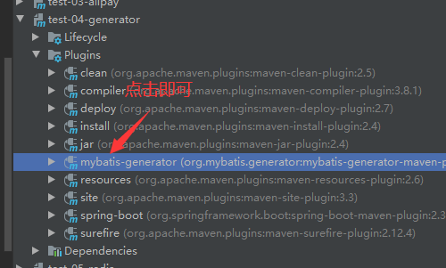
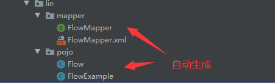

# 一、使用邮箱发送验证码

**项目结构**



## 1、创建表user




## 2、导入依赖

```xml
<dependency>
     <groupId>org.springframework.boot</groupId>
     <artifactId>spring-boot-starter-mail</artifactId>
</dependency>
```


## 3、配置yml文件

```yaml
mybatis:
  type-aliases-package: com.lin.pojo
  mapper-locations: classpath:/mapper/*.xml
server:
  port: 8080

spring:
  datasource:
    username: root
    password: 123456
    url: jdbc:mysql://8.140.22.199:3306/test?useSSL=false&useUnicode=true&characterEncoding=utf8&serverTimezone=GMT%2B8
    driver-class-name: com.mysql.cj.jdbc.Driver
    type: com.alibaba.druid.pool.DruidDataSource
  thymeleaf:
    cache: false
  #邮箱配置
  mail:
    host: smtp.qq.com
    username: ********@qq.com
    password: krlntvulffspfifd    #发送短信后它给你的授权码
    default-encoding: utf-8
    #在阿里云服务器上端口25需申请才能打开，将处理发送邮箱端口改为”465“
    port: 465
    properties:
      mail:
        smtp:
          auth: true
          starttls:
            enable: true
            required: true
          socketFactory:
            port:port: 465
            class: javax.net.ssl.SSLSocketFactory
            fallback: false

```


## 4、编写pojo层

User.class

```java
@Data
@AllArgsConstructor
@NoArgsConstructor
public class User {
    private String username;
    private String password;
    private String email;
}

```


## 5、编写vo层

UserVo.class

```java
@Data
@NoArgsConstructor
@AllArgsConstructor
public class UserVo {
    private String username;
    private String password;
    private String email;
    private String code;//验证码
}
```

UserVoToUser.class

```java
public class UserVoToUser {

    public static User toUser(UserVo userVo){
        User user = new User();
        user.setUsername(userVo.getUsername());
        user.setPassword(userVo.getPassword());
        user.setEmail(userVo.getEmail());
        return user;
    }

}
```


## 6、编写mapper层

UserMapper.class

```java
@Repository
@Mapper
public interface UserMapper {

    //查询所有用户
    List<User> queryAll();

    //插入一个用户
    void insertUser(User user);

}
```

UserMapper.xml

```xml
<?xml version="1.0" encoding="UTF-8" ?>
<!DOCTYPE mapper
        PUBLIC "-//mybatis.org//DTD Config 3.0//EN"
        "http://mybatis.org/dtd/mybatis-3-mapper.dtd">

<mapper namespace="com.lin.mapper.UserMapper">

    <select id="queryAll" resultType="user">
        SELECT * FROM test.user
    </select>

    <insert id="insertUser" parameterType="user">
        INSERT INTO test.user(username,password,email) VALUES (#{username},#{password},#{email})
    </insert>

</mapper>
```


## 7、编写services层

UserService.class

```java
public interface UserService {
    //查询所有用户
    List<User> queryAll();

    //插入一个用户
    void insertUser(User user);
}
```

UserServiceImpl.class

```java
@Service
public class UserServiceImpl implements UserService{

    @Autowired
    private UserMapper userMapper;

    @Override
    public List<User> queryAll() {
        return userMapper.queryAll();
    }

    @Override
    public void insertUser(User user) {
        userMapper.insertUser(user);
    }
}
```


## 8、定制邮件服务MailService

```java
package com.lin.services;

import com.lin.mapper.UserMapper;
import com.lin.pojo.User;
import com.lin.vo.UserVo;
import com.lin.vo.UserVoToUser;
import org.springframework.beans.factory.annotation.Autowired;
import org.springframework.beans.factory.annotation.Value;
import org.springframework.mail.javamail.JavaMailSender;
import org.springframework.mail.javamail.MimeMessageHelper;
import org.springframework.stereotype.Service;

import javax.mail.internet.MimeMessage;
import javax.servlet.http.HttpSession;
import java.util.Random;

@Service
public class MailService {

    @Autowired
    private JavaMailSender mailSender;

    @Autowired
    private UserMapper userMapper;

    @Value("1351503414@qq.com")
    private String from; //邮件发送人

    //发送验证码
    public boolean sendMail(String email, HttpSession httpSession) {
        try {
            MimeMessage mimeMessage = mailSender.createMimeMessage();
            MimeMessageHelper helper = new MimeMessageHelper(mimeMessage, true);
            //生成随机数
            String code = randomCode();
            helper.setSubject("验证码邮件");//主题
            helper.setText("<strong>尊敬的用户：您好！</strong><br>您正在进行<span style=\"color: red\">" +
                    "注册账号</span>操作，请在验证码输入框中输入：<span style=\"color:#f60;font-size: 24px\">" + code +
                    "</span>，以完成操作。" +
                    "<p style=\"color:#747474;\">\n" +
                    "注意：此操作可能会修改您的密码、登录邮箱或绑定手机。如非本人操作，请忽略此邮件\n" +
                    "<br>（工作人员不会向你索取此验证码，请勿泄漏！)\n" +
                    "</p>\n" +
                    "————————————————\n", true);
            helper.setTo(email);
            helper.setFrom(from);
            mailSender.send(mimeMessage);//发送
            httpSession.setMaxInactiveInterval(60);//设置60s过期
            httpSession.setAttribute("email",email);
            httpSession.setAttribute("code",code);

            return true;
        } catch (Exception e) {
            e.printStackTrace();
            return false;
        }
    }

    //检验验证码
    public boolean registered(UserVo userVo, HttpSession httpSession){
        String email = (String)httpSession.getAttribute("email");
        String code = (String)httpSession.getAttribute("code");

        //获取表单填入的验证码
        String inputcode = userVo.getCode();
        //获取表单填入的邮箱
        String inputemail = userVo.getEmail();

        if(!inputemail.equals(email)){
            System.out.println(email);
            System.out.println(inputemail);
            return false;
        }else if(!code.equals(inputcode)){
            System.out.println("验证码错误！");
            return false;
        }
        User user = UserVoToUser.toUser(userVo);
        userMapper.insertUser(user);
        return true;
    }

    public String randomCode() {
        StringBuilder str = new StringBuilder();
        Random random = new Random();
        for (int i = 0; i < 6; i++) {
            str.append(random.nextInt(10));
        }
        return str.toString();
    }

}

```


## 9、编写contoller层

emailController.class

```java
@Controller
public class emailController {

    @Autowired
    private MailService mailService;

    @RequestMapping("/login")
    public String login(){
        return "register";
    }

    //注册账户
    @ResponseBody
    @RequestMapping("/addUser")
    public boolean addUser(UserVo userVo, HttpSession session){
        return mailService.registered(userVo,session);
    }

    //发送验证码
    @ResponseBody
    @RequestMapping("/sendMail")
    public boolean sendMail(String email,HttpSession session){
        mailService.sendMail(email,session);
        return true;
    }
}
```


## 10、注册页

```html
<!DOCTYPE html>
<html lang="en">
<head>
    <meta charset="UTF-8">
    <title>Title</title>
    <script src="https://cdn.bootcdn.net/ajax/libs/jquery/3.6.0/jquery.js"></script>
</head>
<body>
<div>
    <form action="/addUser" method="post">
    <span>
        账号：<input type="text" name="username"><br>
    </span>
        <span>
        密码：<input type="password" name="password"><br>
    </span>
        <span>
        邮箱：<input type="email" name="email" id="email"><br>
    </span>
        <span>
        验证码：<input type="text" name="code"><br>
    </span>
        <button type="button" id="getCode">获取验证码</button>
        <button type="submit">提交</button>
        <button type="reset">重置</button>
    </form>
</div>
</body>
<script>
    $('#getCode').click(function () {
        $.post("/sendMail",
            {
                email: $('#email').val()
            },
            function(data){
                console.log(data)
            }
        );
        var time = 60;
        $(this).attr("disabled", true);
        var timer = setInterval(function() {
            if (time == 0) {
                clearInterval(timer);
                $("#getCode").attr("disabled", false);
                $("#getCode").val("获取验证码");
                $("#getCode").removeClass("on");
            } else {
                $('#getCode').val(time + "秒");
                time--;
            }
        }, 1000);
    });
</script>

</html>
```


# 二、使用mybatis-generator工具

## 1、导入依赖

```xml
<dependency>
    <groupId>org.mybatis.generator</groupId>
    <artifactId>mybatis-generator-core</artifactId>
    <version>1.3.5</version>
</dependency>
```


## 2、导入插件

```xml
<!--引入mybatis生成器-->
<plugin>
    <groupId>org.springframework.boot</groupId>
    <artifactId>spring-boot-maven-plugin</artifactId>
</plugin>
<!--引入mybatis生成器-->
<plugin>
    <groupId>org.mybatis.generator</groupId>
    <artifactId>mybatis-generator-maven-plugin</artifactId>
    <version>1.3.5</version>
    <dependencies>
        <dependency>
            <groupId>mysql</groupId>
            <artifactId>mysql-connector-java</artifactId>
            <version>8.0.22</version>
        </dependency>
    </dependencies>
</plugin>
```


## 3、在resource文件下新建generatorConfig.xml

```xml
<?xml version="1.0" encoding="UTF-8"?>
<!DOCTYPE generatorConfiguration
        PUBLIC "-//mybatis.org//DTD MyBatis Generator Configuration 1.0//EN"
        "http://mybatis.org/dtd/mybatis-generator-config_1_0.dtd">

<generatorConfiguration>
    <!--mysql 连接数据库jar 这里选择自己本地位置 这里的版本必须与pom.xml中的mysql-connector-java对应上 -->
    <classPathEntry location="C:\Users\Lin\.m2\repository\mysql\mysql-connector-java\8.0.22\mysql-connector-java-8.0.22.jar" />
    <context id="testTables" targetRuntime="MyBatis3">
        <commentGenerator>
            <!-- 是否去除自动生成的注释 true：是 ： false:否 -->
            <property name="suppressAllComments" value="true" />
        </commentGenerator>
        <!--数据库连接的信息：驱动类、连接地址、用户名、密码 -->
        <jdbcConnection driverClass="com.mysql.cj.jdbc.Driver"
                        connectionURL="jdbc:mysql://39.97.179.241:3306/test?useSSL=false" userId="root"
                        password="123456">
        </jdbcConnection>
        <!-- 默认false，把JDBC DECIMAL 和 NUMERIC 类型解析为 Integer，为 true时把JDBC DECIMAL 和
           NUMERIC 类型解析为java.math.BigDecimal -->
        <javaTypeResolver>
            <property name="forceBigDecimals" value="false" />
        </javaTypeResolver>

        <!-- targetProject:生成PO类的位置 -->
        <javaModelGenerator targetPackage="com.lin.pojo"
                            targetProject="src/main/java">
            <!-- enableSubPackages:是否让schema作为包的后缀 -->
            <property name="enableSubPackages" value="false" />
            <!-- 从数据库返回的值被清理前后的空格 -->
            <property name="trimStrings" value="true" />
        </javaModelGenerator>
        <!-- targetProject:mapper映射文件生成的位置
           如果maven工程只是单独的一个工程，targetProject="src/main/java"
           若果maven工程是分模块的工程，targetProject="所属模块的名称"，例如：
           targetProject="ecps-manager-mapper"，下同-->
        <sqlMapGenerator targetPackage="com.lin.mapper"
                         targetProject="src/main/java">
            <!-- enableSubPackages:是否让schema作为包的后缀 -->
            <property name="enableSubPackages" value="false" />
        </sqlMapGenerator>
        <!-- targetPackage：mapper接口生成的位置 -->
        <javaClientGenerator type="XMLMAPPER"
                             targetPackage="com.lin.mapper"
                             targetProject="src/main/java">
            <!-- enableSubPackages:是否让schema作为包的后缀 -->
            <property name="enableSubPackages" value="false" />
        </javaClientGenerator>
        <!-- 指定数据库表 -->
        <table schema="flow" tableName="flow"></table>
<!--        <table schema="" tableName="success_killed"></table>-->
    </context>
</generatorConfiguration>
```


## 4、编写application.properties文件

```properties
spring.datasource.username=root
spring.datasource.password=123456
spring.datasource.url=jdbc:mysql://39.97.179.241:3306/test?useSSL=false&useUnicode=true&characterEncoding=utf8
spring.datasource.driver-class-name=com.mysql.cj.jdbc.Driver
spring.datasource.type=com.alibaba.druid.pool.DruidDataSource
mybatis.type-aliases-package=com.lin.pojo
```


## 5、使用插件




## 6、效果




## 7、注意

此时FlowMapper文件在mapper包下（不在resource文件夹下），而properties文件无法自定扫描包下目录，可在pom.xml中的build下导入以下文件：

```xml
<resources>
    <resource>
        <directory>src/main/java</directory>
        <includes>
            <include>**/*.properties</include>
            <include>**/*.xml</include>
        </includes>
        <filtering>false</filtering>
    </resource>
    <resource>
        <directory>src/main/resources</directory>
        <includes>
            <include>**/*.properties</include>
            <include>**/*.xml</include>
        </includes>
        <filtering>false</filtering>
    </resource>
</resources>
```


# 三、使用Redis做数据库缓存

## 1、添加依赖

```xml
<!--集成redis-->
<dependency>
    <groupId>org.springframework.boot</groupId>
    <artifactId>spring-boot-starter-redis</artifactId>
    <version>1.4.1.RELEASE</version>
</dependency>
<dependency>
    <groupId>com.alibaba</groupId>
    <artifactId>fastjson</artifactId>
    <version>1.2.3</version>
</dependency>
<dependency>
    <groupId>com.fasterxml.jackson.core</groupId>
    <artifactId>jackson-databind</artifactId>
</dependency>

```

## 2、编写application.properties

```properties
# Redis数据库索引（默认为0）
spring.redis.database=0
# Redis服务器地址
spring.redis.host=39.97.179.241
# Redis服务器连接端口
spring.redis.port=6371
# Redis服务器连接密码（默认为空）
spring.redis.password=123456
## 连接超时时间（毫秒）
spring.redis.timeout=30000
#连接池最大连接数（使用负值表示没有限制）
spring.redis.pool.max-active=8
#连接池中的最小空闲连接
spring.redis.pool.min-idle=0
#连接池中的最大空闲连接
spring.redis.pool.max-idle=8


spring.datasource.username=root
spring.datasource.password=123456
spring.datasource.url=jdbc:mysql://39.97.179.241:3306/test?useSSL=false&useUnicode=true&characterEncoding=utf8
spring.datasource.driver-class-name=com.mysql.cj.jdbc.Driver
spring.datasource.type=com.alibaba.druid.pool.DruidDataSource
mybatis.type-aliases-package=com.lin.pojo
```


## 3、编写工具类

RedisUtil.class

```java
import org.springframework.beans.factory.annotation.Autowired;
import org.springframework.data.redis.core.*;
import org.springframework.stereotype.Service;

import java.io.Serializable;
import java.util.List;
import java.util.Set;
import java.util.concurrent.TimeUnit;

@Service
public class RedisUtils {
    @Autowired
    private RedisTemplate redisTemplate;
    /**
     * 写入缓存
     * @param key
     * @param value
     * @return
     */
    public boolean set(final String key, Object value) {
        boolean result = false;
        try {
            ValueOperations<Serializable, Object> operations = redisTemplate.opsForValue();
            operations.set(key, value);
            result = true;
        } catch (Exception e) {
            e.printStackTrace();
        }
        return result;
    }
    /**
     * 写入缓存设置时效时间
     * @param key
     * @param value
     * @return
     */
    public boolean set(final String key, Object value, Long expireTime , TimeUnit timeUnit) {
        boolean result = false;
        try {
            ValueOperations<Serializable, Object> operations = redisTemplate.opsForValue();
            operations.set(key, value);
            redisTemplate.expire(key, expireTime, timeUnit);
            result = true;
        } catch (Exception e) {
            e.printStackTrace();
        }
        return result;
    }
    /**
     * 批量删除对应的value
     * @param keys
     */
    public void remove(final String... keys) {
        for (String key : keys) {
            remove(key);
        }
    }
    /**
     * 批量删除key
     * @param pattern
     */
    public void removePattern(final String pattern) {
        Set<Serializable> keys = redisTemplate.keys(pattern);
        if (keys.size() > 0){
            redisTemplate.delete(keys);
        }
    }
    /**
     * 删除对应的value
     * @param key
     */
    public void remove(final String key) {
        if (exists(key)) {
            redisTemplate.delete(key);
        }
    }
    /**
     * 判断缓存中是否有对应的value
     * @param key
     * @return
     */
    public boolean exists(final String key) {
        return redisTemplate.hasKey(key);
    }
    /**
     * 读取缓存
     * @param key
     * @return
     */
    public Object get(final String key) {
        Object result = null;
        ValueOperations<Serializable, Object> operations = redisTemplate.opsForValue();
        result = operations.get(key);
        return result;
    }
    /**
     * 哈希 添加
     * @param key
     * @param hashKey
     * @param value
     */
    public void hmSet(String key, Object hashKey, Object value){
        HashOperations<String, Object, Object> hash = redisTemplate.opsForHash();
        hash.put(key,hashKey,value);
    }
    /**
     * 哈希获取数据
     * @param key
     * @param hashKey
     * @return
     */
    public Object hmGet(String key, Object hashKey){
        HashOperations<String, Object, Object>  hash = redisTemplate.opsForHash();
        return hash.get(key,hashKey);
    }
    /**
     * 列表添加
     * @param k
     * @param v
     */
    public void lPush(String k,Object v){
        ListOperations<String, Object> list = redisTemplate.opsForList();
        list.rightPush(k,v);
    }
    /**
     * 列表获取
     * @param k
     * @param l
     * @param l1
     * @return
     */
    public List<Object> lRange(String k, long l, long l1){
        ListOperations<String, Object> list = redisTemplate.opsForList();
        return list.range(k,l,l1);
    }
    /**
     * 集合添加
     * @param key
     * @param value
     */
    public void add(String key,Object value){
        SetOperations<String, Object> set = redisTemplate.opsForSet();
        set.add(key,value);
    }
    /**
     * 集合获取
     * @param key
     * @return
     */
    public Set<Object> setMembers(String key){
        SetOperations<String, Object> set = redisTemplate.opsForSet();
        return set.members(key);
    }
    /**
     * 有序集合添加
     * @param key
     * @param value
     * @param scoure
     */
    public void zAdd(String key,Object value,double scoure){
        ZSetOperations<String, Object> zset = redisTemplate.opsForZSet();
        zset.add(key,value,scoure);
    }
    /**
     * 有序集合获取
     * @param key
     * @param scoure
     * @param scoure1
     * @return
     */
    public Set<Object> rangeByScore(String key,double scoure,double scoure1){
        ZSetOperations<String, Object> zset = redisTemplate.opsForZSet();
        return zset.rangeByScore(key, scoure, scoure1);
    }
}
```

RedisConfig.class

```java
import java.lang.reflect.Method;
import org.springframework.beans.factory.annotation.Value;
import org.springframework.cache.annotation.EnableCaching;
import org.springframework.cache.interceptor.KeyGenerator;
import org.springframework.context.annotation.Bean;
import org.springframework.context.annotation.Configuration;
import org.springframework.data.redis.connection.RedisConnectionFactory;
import org.springframework.data.redis.connection.jedis.JedisConnectionFactory;
import org.springframework.data.redis.core.RedisTemplate;
import org.springframework.data.redis.core.StringRedisTemplate;
import org.springframework.data.redis.serializer.Jackson2JsonRedisSerializer;
import com.fasterxml.jackson.annotation.PropertyAccessor;
import com.fasterxml.jackson.annotation.JsonAutoDetect;
import com.fasterxml.jackson.databind.ObjectMapper;

@Configuration
@EnableCaching
public class RedisConfig {
    @Value("${spring.redis.host}")
    private String host;
    @Value("${spring.redis.port}")
    private int port;
    @Value("${spring.redis.timeout}")
    private int timeout;
    @Value("${spring.redis.password}")
    private String password;
    @Value("${spring.redis.pool.max-active}")
    private int maxActive;
    @Value("${spring.redis.pool.max-idle}")
    private int maxIdle;
    @Value("${spring.redis.pool.min-idle}")
    private int minIdle;

    @Bean
    public KeyGenerator wiselyKeyGenerator(){
        return new KeyGenerator() {
            @Override
            public Object generate(Object target, Method method, Object... params) {
                StringBuilder sb = new StringBuilder();
                sb.append(target.getClass().getName());
                sb.append(method.getName());
                for (Object obj : params) {
                    sb.append(obj.toString());
                }
                return sb.toString();
            }
        };
    }

    @Bean
    public JedisConnectionFactory redisConnectionFactory() {
        JedisConnectionFactory factory = new JedisConnectionFactory();
        factory.setHostName(host);
        factory.setPort(port);
        factory.setTimeout(timeout); //设置连接超时时间
        factory.setPassword(password);
        factory.getPoolConfig().setMaxIdle(maxIdle);
        factory.getPoolConfig().setMinIdle(minIdle);
        factory.getPoolConfig().setMaxTotal(maxActive);
        return factory;
    }

    @Bean
    public RedisTemplate<String, String> redisTemplate(RedisConnectionFactory factory) {
        StringRedisTemplate template = new StringRedisTemplate(factory);
        setSerializer(template); //设置序列化工具，这样ReportBean不需要实现Serializable接口
        template.afterPropertiesSet();
        return template;
    }

    private void setSerializer(StringRedisTemplate template) {
        Jackson2JsonRedisSerializer jackson2JsonRedisSerializer = new Jackson2JsonRedisSerializer(Object.class);
        ObjectMapper om = new ObjectMapper();
        om.setVisibility(PropertyAccessor.ALL, JsonAutoDetect.Visibility.ANY);
        om.enableDefaultTyping(ObjectMapper.DefaultTyping.NON_FINAL);
        jackson2JsonRedisSerializer.setObjectMapper(om);
        template.setValueSerializer(jackson2JsonRedisSerializer);
    }

}
```


## 4、编写pojo层

Flow.class

```java
@Data
public class Flow {
    private String id;

    private String flowNum;

    private String orderNum;

    private String productId;

    private String paidAmount;

    private Integer paidMethod;

    private Integer buyCounts;

    private Date createTime;
    
}
```


## 5、编写mapper层

FlowMapper.class

```java
@Mapper
@Component
public interface FlowMapper {
    long countByExample(FlowExample example);

    int deleteByExample(FlowExample example);

    int deleteByPrimaryKey(String id);

    int insert(Flow record);

    int insertSelective(Flow record);

    List<Flow> selectByExample(FlowExample example);

    Flow selectByPrimaryKey(String id);

    int updateByExampleSelective(@Param("record") Flow record, @Param("example") FlowExample example);

    int updateByExample(@Param("record") Flow record, @Param("example") FlowExample example);

    int updateByPrimaryKeySelective(Flow record);

    int updateByPrimaryKey(Flow record);
}
```

FlowMappper.xml文件（略）


## 6、编写service层

FlowService.class

```java
public interface FlowService {

    long countByExample(FlowExample example);

    int deleteByExample(FlowExample example);

    int deleteByPrimaryKey(String id);

    int insert(Flow record);

    int insertSelective(Flow record);

    List<Flow> selectByExample(FlowExample example);

    Flow selectByPrimaryKey(String id);

    int updateByExampleSelective(@Param("record") Flow record, @Param("example") FlowExample example);

    int updateByExample(@Param("record") Flow record, @Param("example") FlowExample example);

    int updateByPrimaryKeySelective(Flow record);

    int updateByPrimaryKey(Flow record);

}
```

FlowServiceImpl.class

```java
@Service
public class FlowServiceImpl implements FlowService{

    @Autowired
    private FlowMapper flowMapper;

    @Override
    public long countByExample(FlowExample example) {
        return flowMapper.countByExample(example);
    }

    @Override
    public int deleteByExample(FlowExample example) {
        return flowMapper.deleteByExample(example);
    }

    @Override
    public int deleteByPrimaryKey(String id) {
        return flowMapper.deleteByPrimaryKey(id);
    }

    @Override
    public int insert(Flow record) {
        return flowMapper.insert(record);
    }

    @Override
    public int insertSelective(Flow record) {
        return flowMapper.insertSelective(record);
    }

    @Override
    public List<Flow> selectByExample(FlowExample example) {
        return flowMapper.selectByExample(example);
    }

    @Override
    public Flow selectByPrimaryKey(String id) {
        return flowMapper.selectByPrimaryKey(id);
    }

    @Override
    public int updateByExampleSelective(Flow record, FlowExample example) {
        return flowMapper.updateByExampleSelective(record,example);
    }

    @Override
    public int updateByExample(Flow record, FlowExample example) {
        return flowMapper.updateByExample(record,example);
    }

    @Override
    public int updateByPrimaryKeySelective(Flow record) {
        return flowMapper.updateByPrimaryKeySelective(record);
    }

    @Override
    public int updateByPrimaryKey(Flow record) {
        return flowMapper.updateByPrimaryKey(record);
    }
}
```


## 7、编写Controller层

RedisController

```java
@RestController
public class RedisController {
    public static final Logger log = LoggerFactory.getLogger(RedisController.class);

    @Autowired
    private FlowService flowService;

    @Autowired
    private RedisUtils redisUtils;

    @RequestMapping("/selectByPrimaryKey")
    public String selectByPrimaryKey(String id) {
        //查询缓存中是否存在
        boolean hasKey = redisUtils.exists(id);
        String str = "";
        if (hasKey) {
            //获取缓存
            Object object = redisUtils.get(id);
            log.info("从缓存获取的数据" + object);
            str = object.toString();
        } else {
            //从数据库中获取信息
            log.info("从数据库中获取数据");
            str = flowService.selectByPrimaryKey(id).toString();
            //数据插入缓存（set中的参数含义：key值，user对象，缓存存在时间10（long类型），时间单位）
            redisUtils.set(id, str, 10L, TimeUnit.MINUTES);
            log.info("数据插入缓存" + str);
        }
        return str;
    }


    public static void main(String[] args){
        HttpHeaders httpHeaders = new HttpHeaders();
        httpHeaders.setContentType(MediaType.APPLICATION_JSON);

        RestTemplate restTemplate = new RestTemplate();
        HttpEntity<String > entity = new HttpEntity<>("a",httpHeaders);
        ResponseEntity responseEntity = restTemplate.postForEntity("http://localhost:8080/selectByPrimaryKey?id=1",entity,String.class);
        System.out.println(responseEntity.getBody());
    }

}
```


# 四、支付宝支付功能


# 五、EasyExcel实现文件导入导出

> **为什么不使用POI？**
>
> 因为EasyExcel是对POI做的一个升级，POI相对于笨重，EasyExcel去除了一些POI比较繁琐的东西，所以EasyExcel比较轻量级，所以本文采用EasyExcel。(EasyExcel是阿里巴巴的产品，POI是Apache基金会的开源产品)

## 1、导入依赖

```xml
<dependency>
    <groupId>com.alibaba</groupId>
    <artifactId>easyexcel</artifactId>
    <version>2.1.6</version>
</dependency>
<dependency>
    <groupId>com.alibaba</groupId>
    <artifactId>druid</artifactId>
    <version>1.2.7</version>
</dependency>
<dependency>
    <groupId>org.mybatis.spring.boot</groupId>
    <artifactId>mybatis-spring-boot-starter</artifactId>
    <version>2.2.0</version>
</dependency>
<dependency>
    <groupId>mysql</groupId>
    <artifactId>mysql-connector-java</artifactId>
    <version>5.1.38</version>
</dependency>
```

## 2、实体类

```java
@Data
@NoArgsConstructor
@AllArgsConstructor
public class Employee {

    @ExcelIgnore
    private String noid;

    @ColumnWidth(20)
    @ExcelProperty("员工姓名")
    private String emp_name;

    @ColumnWidth(20)
    @ExcelProperty("员工年龄")
    private Integer emp_age;

    @ExcelIgnore
    private Integer emp_sex;

    //冗余字段
    @ColumnWidth(20)
    @ExcelProperty("员工性别")
    private String str_emp_sex;

    @ColumnWidth(20)
    @ExcelProperty("员工工资")
    private Double emp_salary;

    @ColumnWidth(20)
    @ExcelProperty("员工住址")
    private String emp_address;

    @ColumnWidth(20)
    @ExcelProperty("员工岗位")
    private String emp_position;

    //分页相关，当前页与每页的数据条数
    @ExcelIgnore
    private Integer pageNum;
    @ExcelIgnore
    private Integer pageSize;
}
```

## 3、导出文件

### 1）EmployeeService类

```java
public class EmployeeService{
    public void exportEmployeeExcel(HttpServletResponse response,String url) throws IOException {
        List<Employee> kspwStudentSeatList = list();	//list()获取输出的数据源
        try {
            ExcelWriterBuilder workBook = EasyExcel.write(url, Employee.class);
            // sheet方法参数： 工作表的顺序号（从0开始）或者工作表的名字
            workBook.sheet("员工信息").doWrite(kspwStudentSeatList);
            downloadTempalate(response);
            System.out.println("写入完成！");
        } catch (Exception e) {
            e.printStackTrace();
        }
    }

    /**
     * 下载文件
     * @param response
     * @throws IOException
     */
    public static void downloadTempalate(HttpServletResponse response,String url) throws IOException {
        // 告诉浏览器用什么软件可以打开此文件
        response.setHeader("content-Type", "application/vnd.ms-excel");
        // 下载文件的默认名称
        response.setHeader("Content-Disposition", "attachment;filename=" + URLEncoder.encode("员工信息.xlsx", "utf-8"));
        //4. 创建输入、输出流
        FileInputStream input = new FileInputStream(url);
        ServletOutputStream sos = response.getOutputStream();

        //IO流获取文件的字节流，然后再响应给浏览器
        byte[] arr = new byte[1024];
        int res = 0;
        while((res = input.read(arr)) > 0){
            //将读取的内容输出到输出流中
            sos.write(arr, 0, res);
        }

        input.close();
        sos.close();
    }
}
```

### 2）EmployeeController类

```java
@RestController
public class EmployeeController{
	@GetMapping("/export_employee_excel")
    public void exportEmployeeExcel(HttpServletResponse response,String url) {
        try {
            employeeService.exportEmployeeExcel(response,url);
        } catch (IOException e) {
            e.printStackTrace();
        }
    }
}
```

## 4、导入文件

### 1）核心监听器类

```java
import com.alibaba.excel.context.AnalysisContext;
import com.alibaba.excel.event.AnalysisEventListener;
import com.wanshi.spring.entity.Employee;

import java.util.ArrayList;
import java.util.List;

public class EmployeeReadListener extends AnalysisEventListener<Employee> {
    //员工集合
    private static List<Employee> employeeList = new ArrayList<>();

    // 每读一样，会调用该invoke方法一次
    @Override
    public void invoke(Employee employee, AnalysisContext context) {
        employeeList.add(employee);
        System.out.println("解析到一条数据：" + employee);
    }

    // 全部读完之后，会调用该方法
    @Override
    public void doAfterAllAnalysed(AnalysisContext context) {
        System.out.println("全部解析完成");
    }

    /**
     * 返回读取到的员工集合
     * @return
     */
    public static List<Employee> getStudentList() {
        return employeeList;
    }
}
```

### 2）EmployeeService类

```java
/**
     * 获取用户选择的文件并将文件存入指定位置再将数据存入数据库
     * @param emp_excel
     * @return
     */
public Integer importExcel(MultipartFile file) throws Exception{
    try {
        ExcelReaderBuilder workBook = EasyExcel.read
            (file.getInputStream(), Employee.class, new EmployeeReadListener());

        // 封装工作表
        ExcelReaderSheetBuilder sheet1 = workBook.sheet();
        // 读取
        sheet1.doRead();

        List<Employee> studentList = EmployeeReadListener.getStudentList();
        for (Employee employee : studentList) {
            employee.setNoid(PbSecretUtils.uuid());
            if ("男".equals(employee.getStr_emp_sex())) {
                employee.setEmp_sex(1);
            } else {
                employee.setEmp_sex(2);
            }
            employeeMapper.insert(employee);
        }
    } catch (IOException e) {
        e.printStackTrace();
    }
    return 0;
}
```

### 3）EmployeeController类

```java
@PostMapping("/import_employee_excel")
public String importEmployeeExcel(MultipartFile emp_excel) throws Exception {
    employeeService.importExcel(emp_excel);
    return "redirect:/employee/list";
}
```

### 4）前端页面

```html
<!DOCTYPE html>
<html lang="en" xmlns:th="https://www.thymeleaf.org" >
<head>
    <meta charset="UTF-8">
    <title>Title</title>
</head>
<body>
    <form id="uploadForm" method="post" th:action="@{/import_employee_excel}" enctype = "multipart/form-data">
        <input type="file" name="file" id="file">
        <input type="submit" value="submit">
    </form>
</body>
</html>
```

# 六、使用JDBC连接数据库

## 1、导入 mysql-connector-java-8.0.20数据库驱动程序；

## 2、配置连接

```java
import java.sql.*;

public class JDBC {
    public static void main(String[] args) {
        //加载JDBC驱动程序
        String driver="com.mysql.cj.jdbc.Driver";//数据库驱动类所对应的字符串
        try {
            Class.forName(driver);//加载MySQL数据库驱动
        }catch(java.lang.ClassNotFoundException e) {//如果找不到这个类，执行下面的异常处理
            System.out.println("驱动程序配置未配置成功!!!");
        }
        
        //提供JDBC连接的URL
        String URL="jdbc:mysql://localhost:3306/school?serverTimezone=UTC&useUnicode=true&characterEncoding=utf-8";
        //URL语法格式如下
        //jdbc:mysql:是固定的写法，后面跟主机名localhost，3306是默认的MySQL端口号
        //serverTimezone=UTC是指定时区时间为世界统一时间
        //useUnicode=true是指是否使用Unicode字符集，赋值为true
        //characterEncoding=utf-8是指定字符编码格式为UTF8

        //创建数据库的连接
        Connection conn=null;
        //Connection接口代表Java程序和数据库的连接对象，只有获得该连接对象后，才能访问数据库，并操作数据表
        try {
            conn = DriverManager.getConnection(URL,"root","123123");//建立和数据库的连接，并返回表示连接的Connection对象
            System.out.println("数据库连接成功!!!");
        }catch(Exception e) {//未连接成功，执行下面的异常处理
            System.out.println("数据库连接失败!!!");
        }
    }
}
```

## 3、创建一个Statement

要执行SQL语句，必须获得java.sql.Statement实例，Statement实例分为以下3 种类型：

- 执行静态SQL语句。通常通过Statement实例实现。
- 执行动态SQL语句。通常通过PreparedStatement实例实现。
- 执行数据库存储过程。通常通过CallableStatement实例实现。

```java
public static Statement getStmt(Connection conn){
   Statement stmt = null;
   try {
        stmt = conn.createStatement();
   } catch (SQLException e) {
        e.printStackTrace();
   }
   return stmt;
}
```

## 4、执行SQL语句

```java
public static ResultSet executeQuery(Statement stmt,String sql){
     ResultSet rs = null;
     try {
        rs = stmt.executeQuery(sql);
    } catch (SQLException e) {
        e.printStackTrace();
    }
    return rs;
}
```

## 5、处理结果

两种情况： 

- 执行更新返回的是本次操作影响到的记录数。
-  执行查询返回的结果是一个ResultSet对象。

ResultSet包含符合SQL语句中条件的所有行，并且它通过一套get方法提供了对这些行中数据的访问。使用结果集（ResultSet）对象的访问方法获取数据，代码如下：

```java
while(rs.next()){             
    String name = rs.getString("name") ;        
    String pass = rs.getString(1) ; // 此方法比较高效         
}
```

## 6、关闭JDBC对象

操作完成以后要把所有使用的JDBC对象全都关闭，以释放JDBC资源，关闭顺序和声明顺序相反：

- 关闭记录集
- 关闭声明 
- 关闭连接对象

```java
//关闭结果集
public static void closeRs(ResultSet rs){
       try {
            if(rs != null ){
                 rs.close();
                 rs = null;
               }
        } catch (SQLException e) {
            e.printStackTrace();
        }
}
//关闭执行方法
public static void closeStmt(Statement stmt){
       try {
            if(stmt != null ){
                 stmt.close();
                 stmt = null;
               }
        } catch (SQLException e) {
            e.printStackTrace();
        }
       
   }
//关闭连接
public static void closeConn(Connection conn){
    try {
        if(conn != null ){
             conn.close();
             conn = null;
           }
    } catch (SQLException e) {
        e.printStackTrace();
    }
}
```

