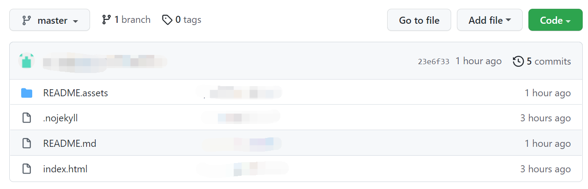
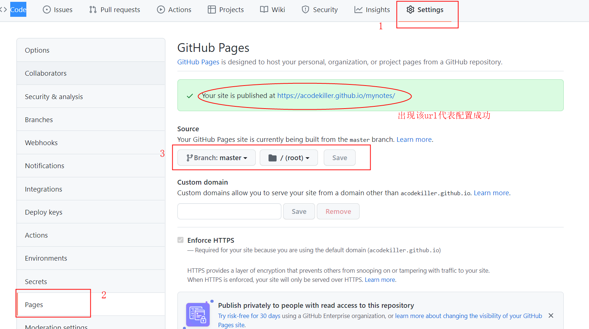

# <font color = red>一、本网站是如何搭建的？</font>

1、下载 NodeJs，安装教程：[NodeJs](https://www.cnblogs.com/liuqiyun/p/8133904.html )

2、在cmd命令下执行

```shell
npm install -g docsify-cli	# 安装Docsify
docsify -v 					# 查看版本

### 在指定目录下创建文件夹
docsify init				# 进行初始化
run docsify serve			# 启动服务
```
[docsify官网](https://docsify.js.org/#/zh-cn/)


3、在浏览器地址栏下输入`localhost:3000`即可访问

4、在本地文件git到github中



5、设置




---